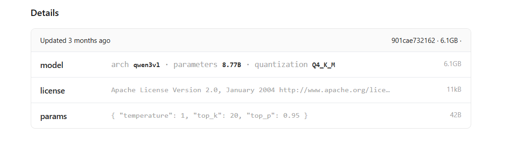

## LLM的基础信息


### arch

**arch** = architecture（模型架构）
```bash
arch: qwen3vl
```
意思是：
- 这是 Qwen 第 3 代
- vl = Vision-Language
- 👉 多模态模型（同时支持文字 + 图片/视觉)

### parameters

**parameters**: 8.77B
```bash
8.77B = 8.77 Billion = 87.7 亿参数
```

**参数是什么？**
- 本质就是模型里的 权重（weights）
- 决定了模型的：
  - 理解能力
  - 表达能力
  - 推理深度

| 参数量  | 大概能力             |
| ---- | ---------------- |
| 1–3B | 轻量级，适合嵌入式 / 边缘   |
| 7–9B | **主流可用，性价比最高** ⭐ |
| 13B  | 明显更强，但资源需求高      |
| 70B+ | 企业级 / 服务器级       |

### quantization

**quantization**: `Q4_K_M`
**什么是 Quantization（量化）**
简单说：
> 用 **更少的** bit 存储权重
换取 **更小体积** + **更快推理**
**体积越大**，推理的**准确度越高**
体积小，快推理，低准确度
体积大，慢推理，高准确度

| 指标        | Q4_K_M | Q5_K_M       |
| --------- | ------ | ------------ |
| 推理速度      | 更快     | 稍慢           |
| 显存 / 内存   | 更省     | 稍高           |
| 能否在 CPU 跑 | ✅ 更稳   | ✅ 也可以（但要求更高） |
| 适合 GPU 显存 | 低显存最好  | 中等显存也够       |


**K 是什么意思**
```
K = K-Quant (分块量化)
```

含义是：
- 权重被分成很多小 block
- 每个 block 有自己独立的 scale
- 比早期 Q4 更精确
👉 优点：
- 精度明显好于老式 Q4
- 推理更稳定

**M 是什么意思（关键）**
```
M = Mixed / Optimized for matrix multiplication
```

## LLM 评测合集

| Benchmark          | 核心能力      |
| ------------------ | --------- |
| ArenaHard     | 聊天 & 思考像不像聪明人 |
| AIME          | 会不会真正推理       |
| LiveCodeBench | 代码能不能一次跑      |
| CodeForces    | 程序竞赛水平        |
| Aider         | 能不能帮你改真实项目    |
| LiveBench     | 日常用顺不顺        |
| BFCL          | 能不能当 Agent    |
| MultiIF       | 多语言会不会降智      |
| LCB v6             | 写得出能跑的代码  |
| HLE                | 像不像靠谱同事   |
| SWE-bench Verified | 修真实项目 Bug |
| τ²-Bench           | 长任务不跑偏    |
| BrowseComp         | 查资料 + 综合  |

每个品牌的LLM都会有不同的评测项目，以上提供一个概念，便于筛选LLM时，该基于哪一项做出选择。

**给你一个使用导向总结**
- 写代码 / 工程师 → LiveCodeBench + CodeForces + Aider
- 推理 / 数学 / AI 能力感 → AIME + ArenaHard
- Agent / Tool / 自动化 → BFCL
- 国际化产品 → MultiIF

## Thinking & Non-Thinking LLM

thinking vs non-thinking 的差别，不是“会不会思考”，而是是否把中间推理过程显式展开并参与生成

### Thinking model
什么是 thinking model？

也常被叫作：
- reasoning model
- chain-of-thought model
- deliberative model

**核心特征**
模型在回答前，会先生成一段“内部推理过程”，再基于这个推理过程生成最终答案。
```
<thinking>
Step 1 …
Step 2 …
Conclusion …
</thinking>

Final answer: …
```

**thinking model 在“多干什么”？**

它多做了三件事：
- 拆问题
- 逐步推理
- 在中间不断自我校正

这对以下任务帮助巨大：
- 数学 / 逻辑
- 复杂代码
- Agent 决策
- 长任务规划

thinking 不一定更“好用”, thinking 有副作用：
- 输出啰嗦
- 速度慢
- 有时会“想太多”

### Non-Thinking Model
什么是 non-thinking model？
也叫：
- direct answer
- fast / chat model

**核心特征**

不显式展开推理过程，直接从输入 → 输出答案。

**non-thinking 在“少做什么”？**
它通常：
- 不展开长推理链
- 不反复自检
- 更像「条件反射」

但优点是：
⚡ 快
💰 便宜
🧠 占用更少算力

## AI 学习路线

```
应用层      →  Agent / RAG / AI 自动化 / AI 工作流 (n8n)
工程层      →  MLOps / 部署 / 推理优化
模型层      →  LLM / Transformer / Diffusion
算法层      →  Machine Learning / Deep Learning
数学基础层  →  线代 / 概率 / 微积分
```

先确定你想成为哪种 AI 从业者。

AI 大概分三种方向：
**① 应用开发型（最快上手 💡）**
适合：有后端/前端经验的人

- API 调用（OpenAI、Claude 等）
- RAG
- Agent
- 向量数据库
- LangChain / LlamaIndex
- 工作流工具（n8n）

👉 目标：做 AI 产品 / 企业 AI 系统
👉 数学要求：几乎不需要

② 模型训练型（偏算法 🧠）

适合：想做 AI 算法工程师

学什么：
- 机器学习
- 深度学习
- PyTorch
- Transformer
- 优化算法
- 数学
👉 目标：训练模型、调模型
👉 数学要求：中高

**③ AI 工程基础设施型（偏工程 ⚙️）**
适合：DevOps / 后端
学什么：
- MLOps
- Kubernetes
- GPU 调度
- 推理优化
- 模型部署
👉 目标：做 AI 平台架构
👉 数学要求：低