- [Deployment with AWS](#deployment-with-aws)
  - [Create EC2 Instance and Set Elastic IP Address](#create-ec2-instance-and-set-elastic-ip-address)
  - [AWS -Automatic Load Balancer(ALB)](#aws--automatic-load-balanceralb)
    - [多个网点问题](#多个网点问题)
    - [额外：目标群组设置(optional)](#额外目标群组设置optional)
  - [SSL](#ssl)
    - [AWS Certificate Manager + Route 53 + CloudFront](#aws-certificate-manager--route-53--cloudfront)
  - [Nodejs + Nginx + Let Encrypt + AWS](#nodejs--nginx--let-encrypt--aws)
  - [AWS + Github + CI/CD Pipeline Deployment](#aws--github--cicd-pipeline-deployment)
- [VPC](#vpc)
  - [了解IP子网](#了解ip子网)
  - [了解一下Internet Gateway](#了解一下internet-gateway)
  - [了解一下NAT Gateway](#了解一下nat-gateway)
  - [简单的实践](#简单的实践)
    - [第一部分：配置VPC和相关网络设定](#第一部分配置vpc和相关网络设定)
    - [第二部分：Testing with EC2 Instance](#第二部分testing-with-ec2-instance)
  - [加强VPC的安全性](#加强vpc的安全性)
    - [Security Group and Network ACLs](#security-group-and-network-acls)
      - [实例1：在SG中设置SG](#实例1在sg中设置sg)
      - [实例2：ACL顺序规则](#实例2acl顺序规则)
  - [VPC Peering](#vpc-peering)
    - [Peer Connection(PC) Practice](#peer-connectionpc-practice)
  - [VPC Endpoint](#vpc-endpoint)
    - [VPC Gateway Endpoints](#vpc-gateway-endpoints)
  - [AWS Client VPN](#aws-client-vpn)
    - [Demo Client VPN with Client VPN Network Interface](#demo-client-vpn-with-client-vpn-network-interface)


# Deployment with AWS

## Create EC2 Instance and Set Elastic IP Address
1. 启动一个EC2 instance
2. 下载sshkey如果没有的话
3. EC2启动成功后，打开terminal(linux 系统，如果你是window用powershell，则使用aws内部的terminal)
4. 在terminal界面上传你的ssh key文件（xxx.pem)
5. 允许xxx.pem读写权限
```
chmod 400 xxx.pem
```
6. 使用ec2-user用户以及ssh文件登入EC2
```bash
ssh ec2-user@instance_ip -i xxx.pem
```
7.在网络与安全（Network & Security)类下选择弹性IP（Elastic IPs）
8. 创建Elastic IP。（左上角分别Elastic IP按钮)
9. 选择创建的IP，然后在Actions下找到`关联弹性IP地址`
10. 最后选择需要被assign的EC2 instance即可。
>切记，Elastic IP非免费服务，因此如果只是为测试，记得将其`取消关联`并释放(release)：删除。

## AWS -Automatic Load Balancer(ALB)
参考：https://www.youtube.com/watch?v=vxBVZYydKGU
**Setting Up ALB**
1. Need create a target group
2. Create the load balancer
3. Configure the listener to define how the ALB should route the incoming requests

**Requirement Prepare**
- Create three instances
- These instances will host our application and handle incomming traffic

**实施**
1. 创建镜像Amazon Linux的EC2 instance，在实例（instance）数量中设置`3`.
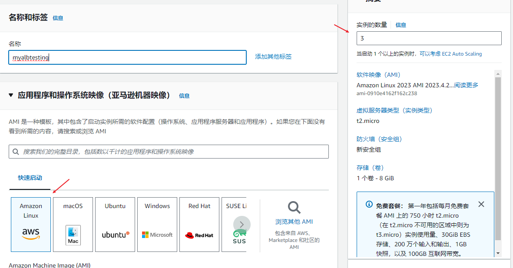
2. 在Advanced details（高息详细信息）类的用户数据textbox中输入以下初始指令：
```bash
#!/bin/bash
yum update -y
yum install -y httpd
systemctl start httpd
systemctl enable httpd
echo "<h1>Hello From $(hostname -f)</h1>" > /var/www/html/index.html
```
3. 其他基础部分填充好后，点击启动instance。
4. 修改instances之间的名称以提高分辨度。
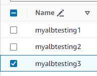
5. 在浏览器上测试任一instance是否能顺利打开页面，如果不能可检查以下可能：
    * 确认安全组是否有加入80端口的协议
    * 确认url是http而非https，如http://10.10.10.201. ec2 instance的连接默认是https，因此需要手动更改
6. 在Load Balance类（负载平衡）下点击负载均衡器并点击创建load balance
7. 负载均衡有四个种类，这里我们选Application Load Balancer
8. vpc 三个区域全选
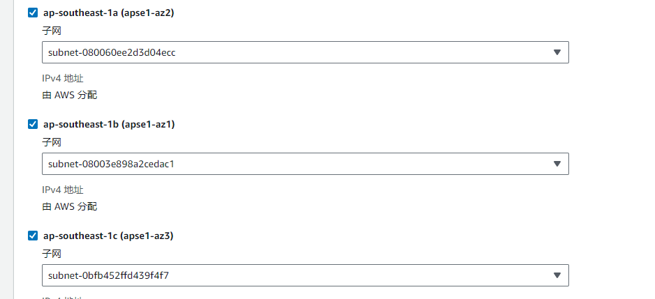
9. 在Listerner的80端口选择一个目标组，如果没有则点击创建目标组
10. 创建目标组中有几个需要注意：
    - 目标类型为实例（instance）
11. 完成创建lb后，需要等待lb在后台配置
12. 完成配置后，复制LB的DNS名称在浏览器浏览

### 多个网点问题
lb设置好了后，现在能够浏览的网点变成4个了。三个instances分别一个站点，而lb则是另一个站点。
站点太多并不是好事，因此我们需要将所有的站点集中到lb的站点，并且disabled掉其他三个instance的站点。
要实现这一点，首选我们需要两个security group。
一个for三个instance
另一个for lb

**创建LB的security group**
只需要开一个http协议的规则。
假设我们将lb的security group 名为`lbsg`
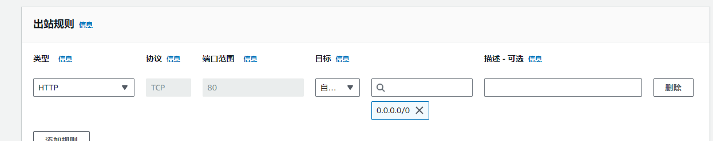
创建后，将lb的security group切换为`lbsg`

**修改instances的security group**
- 将http协议对上`lsbg`的组，表面http协议仅对lb 站点开放。
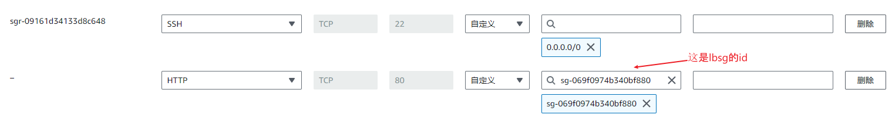


### 额外：目标群组设置(optional)
- 可到Target Group编辑assign给lb的tg的属性
- 在这里你可以更改一些东西，例如Stickerness粘性。该属性对于保存用户的state很有帮助，不至于因为lb轮询的关系使建立的数据状态如session data丧失。
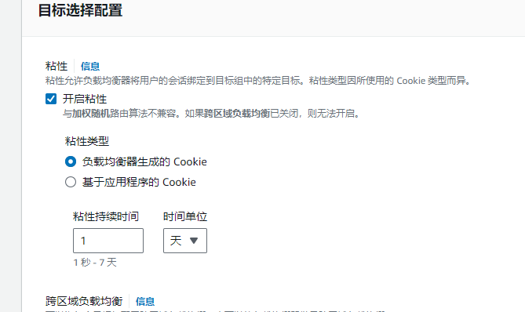
- 其他属性跳过...

## SSL
### AWS Certificate Manager + Route 53 + CloudFront
参考:https://www.youtube.com/watch?v=YVbwVet8aI4
> This tutorial require you already has a hosting server.

1. Request a certificate on **AWS Certificate Manager**. Approval Process may take few days.
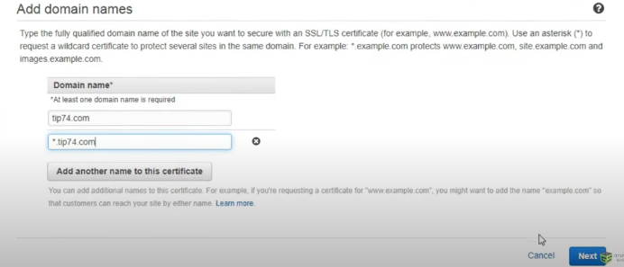
1. Recommend Vaidate By **Email**
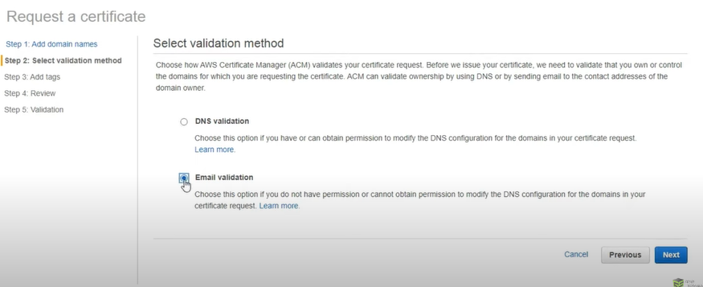
1. Go to `CloudFront`
2. Create New Distribution
    - Enter hosting server(ec2) **original domain name(Public IPv4 DNS)**, always start with `ec2-ip.ap-sou....`
    - Original ID is required: Domain name you have buy, like test883.com
    - For SSL Certificate Part, select `Custom SSL Certificate` and choose the certificate have been request and approve on `AWS Certificate Manager`.
    - On the Alternate Domain Names(CNames) field, can put:
      - www.test883.com
      - test883.com
3. Move to Route 53, found the domain name you have use for SSL.
4. Remove A type with hostserver ip value record
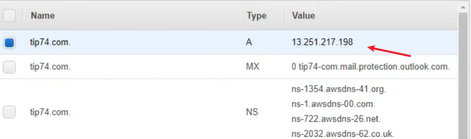
1. Add New Record For you domain name
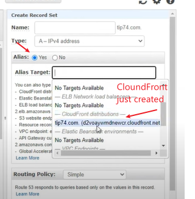
1. Now you can access with Https, but user may access through http also. So need to add policy to redirect http to https
2. Go back to `CloundFront` and move to Behaviors tab. Found the created cloundfront and click edit.
3.  Select `Redirect HTTP to HTTPS` policy and click save.
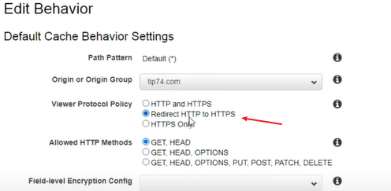

## Nodejs + Nginx + Let Encrypt + AWS
参考：https://www.youtube.com/watch?v=ofBFl4M4BFk
参考：https://gist.github.com/piyushgarg-dev/8b14c87c8ff4d626ecbc747b6b9fc57f
**Node.js Deployment**

> Steps to deploy a Node.js app to DigitalOcean using PM2, NGINX as a reverse proxy and an SSL from LetsEncrypt

**1. Create Free AWS Account**
Create free AWS Account at https://aws.amazon.com/

**2. Create and Lauch an EC2 instance and SSH into machine**
I would be creating a t2.medium ubuntu machine for this demo.

**3. Prepare an domain name**
- Route 53 and any DNS provider to get a domain name
- Add A type and set EC2 instance IP

**4. Install Node and NPM**
```
sudp apt-get update
curl -sL https://deb.nodesource.com/setup_18.x | sudo -E bash -
sudp apt-get update
sudo apt install nodejs

node --version
```bash

**5. Clone your project from Github**
```
git clone https://github.com/piyushgargdev-01/short-url-nodejs
cd projectname
npm i
```

**6. Install dependencies and test app**

```bash
sudo npm i pm2 -g
pm2 start index.js
>Remember enable port on security group of instance, exp, enable 8001

# Other pm2 commands
pm2 show app
pm2 status
pm2 restart app
pm2 stop app
pm2 logs (Show log stream)
pm2 flush (Clear logs)

# To make sure app starts when reboot
pm2 startup ubuntu
```

**7. Setup Firewall(option)**
```bash
sudo ufw enable
sudo ufw status
sudo ufw allow ssh (Port 22)
sudo ufw allow http (Port 80)
sudo ufw allow https (Port 443)
```

**8. Install NGINX and configure**
```bash
sudo apt install nginx

sudo nano /etc/nginx/sites-available/default
```
Add the following to the location part of the server block
```
    server_name yourdomain.com www.yourdomain.com;

    location / {
        proxy_pass http://localhost:8001; #whatever port your app runs on
        proxy_http_version 1.1;
        proxy_set_header Upgrade $http_upgrade;
        proxy_set_header Connection 'upgrade';
        proxy_set_header Host $host;
        proxy_cache_bypass $http_upgrade;
    }
```
```
# Check NGINX config
sudo nginx -t

# Restart NGINX
sudo nginx -s reload
```

**9. Add SSL with LetsEncrypt**
```bash
sudo add-apt-repository ppa:certbot/certbot
sudo apt-get update
sudo apt-get install python3-certbot-nginx
sudo certbot --nginx -d yourdomain.com -d www.yourdomain.com

# Only valid for 90 days, test the renewal process with
certbot renew --dry-run
```


## AWS + Github + CI/CD Pipeline Deployment
**参考**
Youtube：https://www.youtube.com/watch?v=cgWXQqL-ZU8
Github：https://github.com/kalyansaxena/nodejs-restapi-ec2

> Assuming you have your Node.js project on **Github**
> CI/CD Pipeline Deployment only suit for development.
> Because instanst change to production for each push may miss out some error which can causing issue on client side.

1. EC2: Create New Instance with `Ubuntu OS`
2. Be note enable `HTTP` secutiry group Inbould rule for testing instances.
3. Go To your git project. Create `New self-hosted runner` under project settings
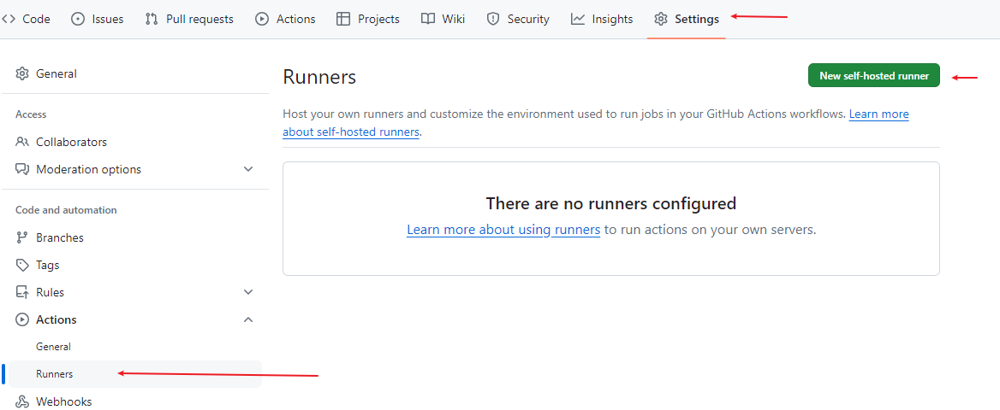
4. Choose `Linux` as Runner Image as our instance is `Ubuntu`
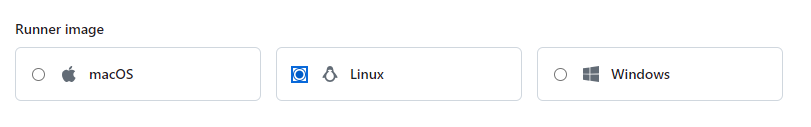
5. In the same page, you will see `Download`, `Configure` and `Using your self-hosted runner`. These are guide to setup git pipeline in instances.
6. Copy and execute `Download` section commands（may different/outdate)
```bash
mkdir actions-runner && cd actions-runner  # change folder name base project real name
# Download the latest runner package
curl -o actions-runner-linux-x64-2.315.0.tar.gz -L https://github.com/actions/runner/releases/download/v2.315.0/actions-runner-linux-x64-2.315.0.tar.gz
# Optional: Validate the hash
echo "6362646b67613c6981db76f4d25e68e463a9af2cc8d16e31bfeabe39153606a0  actions-runner-linux-x64-2.315.0.tar.gz" | shasum -a 256 -c
# Extract the installer
tar xzf ./actions-runner-linux-x64-2.315.0.tar.gz
```
7. Copy and execute `Configure` section commands
```bash
# Create the runner and start the configuration experience
./config.sh --url https://github.com/tenPro4/next-learning23 --token AM65R3YNSCBYXGJH5Z2S7QTGCVX52
```
8. Once configuration is executed, you will ask for something. Just press `Enter` for default options.
>这里可以在git确认刚创建的Runner处于`Offline`状态

9. 接着安装目录下的 `svc.sh`
```bash
ls # 确保svc.sh脚本在
sudo ./svc.sh install
sudo ./svc.sh start #启动action runner
```
>这里可以在git确认刚创建的Runner处于`Idle`状态
10. 创建Repo Secret
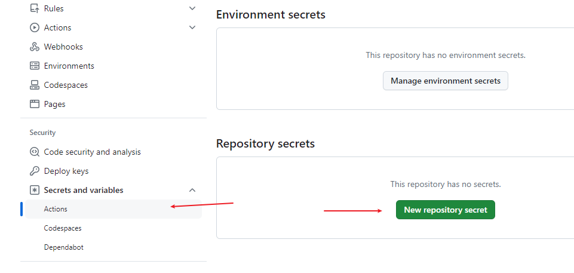
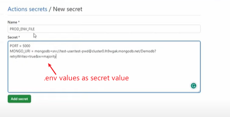
11. Go to `Action` tab. And choose `Node.js` under `Continuous intergration`. After that, it will generate node.js.yml file under git project `gitProjectName/.github/workflows/node.js.yml`
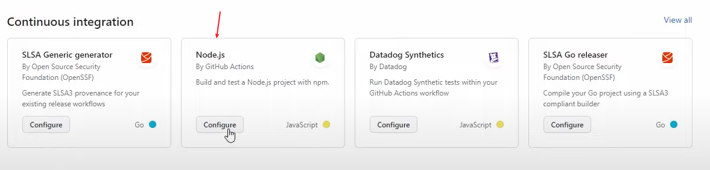
12. 修改部分node.js.yml后，确认commit changes。
**node.js.yml**
```yml
name: Node.js CI/CD

on:     #在什么条件下发生自动化更新
  push: #表明，main branch如果接收到任何push信号，则进行自动更新
    branches: [ "main" ]
  # pull:   #这个可以注释掉，一般不用
    # branches: [ "main" ]

jobs:
  build:
    runs-on: self-hosted    #原本是ubuntu-latest，不过我们用自己的instance，所有这里需要换
    strategy:
      matrix:
        # node-version: [14.x,16.x,18.x]    多个版本表明会在每个版本上创建一个作业（job）,因此为减轻负担只需指定一个版本即可。
        node-version: [18.x]

    steps:
    - uses: actions/checkout@v3
    - name: Use Node.js ${{ matrix.node-version }}
      uses: actions/setup-node@v3
      with:
        node-version: ${{ matrix.node-version }}
        cache: 'npm'
    - run: npm ci
    # - run: npm run build --if-present
    #- run: npm test    optional
    - run: | # | 符号表明执行多个指令。这里会创建.env，而它的值则会从步骤10的secret value植入。
        touch .env
        echo "${{ secrets.PROD_ENV_FILE }}" > .env
```
>**npm ci** 会在安装依赖包之前删除 node_modules 目录，并直接从 package-lock.json 或 npm-shrinkwrap.json 文件中安装依赖，而不会检查 package.json 文件。
13. 回到`Action` tab,会在那里发现一个正在加载运行的`workflow`。
14. workflow 100%加载完成后，回到ubuntu instance
```bash
cd action_runner_folder_name/_work/repoName/repoName
ll or ls -la    #check whether .env file is there
cat .env    #确认.env内容
```
15. Install nodejs and nginx and pm2 on server instance
```bash
sudo apt update
curl -fsSL https://deb.nodesource.com/setup_lts.x | sudo -E bash - &&\
sudo apt-get install -y nodejs
sudo apt-get install -y nginx
sudo npm i -g pm2
```
> Nodesource Ref: https://github.com/nodesource/distributions
16. Config nginx settings
```bash
cd /etc/nginx/sites-available
ls  #found default file
sudo nano default
```
**nginx default**
```nginx
location /api {
	rewrite ^\/api\/(.*)$ /api/$1 break;
	proxy_pass  http://localhost:5000;
	proxy_set_header Host $host;
	proxy_set_header X-Real-IP $remote_addr;
	proxy_set_header X-Forwarded-For $proxy_add_x_forwarded_for;
}
```
17. Restart nginx
```bash
sudo systemctl restart nginx
```
18. Start node application with pm2
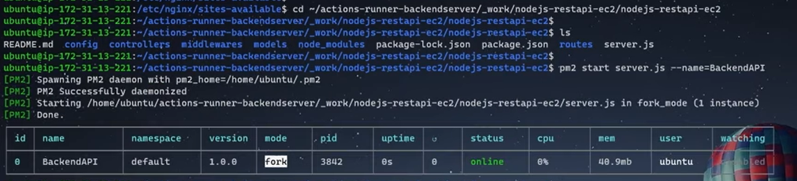

19. Back to git workflow, update node.js.yml to enable workflow restart with pm2 command
```yml
name: Node.js CI/CD

on:     
  push:
    branches: [ "main" ]

jobs:
  build:
    runs-on: self-hosted
    strategy:
      matrix:
        node-version: [18.x]
    steps:
    - uses: actions/checkout@v3
    - name: Use Node.js ${{ matrix.node-version }}
      uses: actions/setup-node@v3
      with:
        node-version: ${{ matrix.node-version }}
        cache: 'npm'
    - run: npm ci
    - run: |
        touch .env
        echo "${{ secrets.PROD_ENV_FILE }}" > .env
    - run: pm2 restart BackendAPI   #here
```

# VPC
**参考**
- https://digitalcloud.training/aws-vpc-deep-dive-download
- 长度教学： https://www.youtube.com/watch?v=g2JOHLHh4rI
- 简短版教学：https://www.youtube.com/watch?v=43tIX7901Gs

## 了解IP子网
在创建 VPC（Virtual Private Cloud）时，需要设置子网的 IP CIDR 块。通常情况下，公有子网（`Public Subnet`）和私有子网（`Private Subnet`）的 IP 地址范围都应该是 VPC 的 IP CIDR 块的子集，而且公有子网的子网长度通常会比私有子网的子网长度要大。

这是因为公有子网中的实例通常需要直接与 Internet 通信，因此需要具有公网 IP 地址，而私有子网中的实例通常不直接与 Internet 通信，所以不需要具有公网 IP 地址。设置公有子网的子网长度比私有子网要大，可以确保公有子网中的 IP 地址范围包含私有子网中的 IP 地址范围，同时可以确保公有子网中的 IP 地址范围不会与 Internet 中的其他 IP 地址冲突。

**Example**

> **IP CIDR Block（子网掩码）**: 255.255.0.0 (16 bits)
> 10.0.^ .^
> **^** 表示任意子网范围
>
>**Public Subnet**: 255.255.255.0 (**24 bits**)
>10.0.1.^
>
>**Private Subnet**: 255.255.255.0 (**24 bits**)
>10.0.2.^

**以上例子有几个点：**
- 注意，所有子网范围都在**10.0**.xx.xx
- Public 和Private的子网范围之所以更大是为了避免两者之间的冲突，并且保佑公有子网的IP范围，也就是**10.0**.x.x.
- 避免Public和Private冲突可在子网中设置，如上述例子使用:10.0.**1**.^（Public） 和 10.0.**2**.^ （Private）

**子网的作用**
- 检测要访问的目标IP，是否是同一个网段，例如，**10.0**.1.x 和 **10.0**.2.x 就是同一个网段。不过，不能直接这样判断它们是否是同一个网段，需要看它们的子网掩码，也就是`255.255.0.0(16 bit)`。 如果两者的掩码不同，则表示不是同一个网段。
- 而访问不同的网段目标，需要用另一种通信方式，也就是之后会解释的**Internet Gateway**
- 

## 了解一下Internet Gateway
影片参考：https://www.bilibili.com/video/BV1Xe4y1c7iX?p=2&vd_source=2aa31c018851cc46ecaf20a21deff33d
一个请求通常会附上两个IP。
一个来自发送者，一个是接收者。
如果这个请求来自同样的局域网的话，该请求将会直接在该局域的网络内直接传输
例如：10.1.1.2能直接传输到10.1.1.3
然而，**非局域网和局域网的请求的输送方式是不同的。**
非局域网，也就是来自外面网络的请求需要一个**中间人**才能进行转发，也就是Internet Gateway。
例如：10.1.1.2无法直接传输数据包给10.1.2.1 （这里假定掩码为24 bits）

## 了解一下NAT Gateway
NAT Gateway（Network Address Translation Gateway）是一种托管的网络服务，用于`在私有子网和 Internet 之间进行通信`。它允许私有子网中的实例通过 NAT（Network Address Translation）机制访问 Internet，同时隐藏了这些实例的真实 IP 地址。

NAT Gateway通常用于以下场景：
- 允许私有子网中的实例访问 Internet，例如下载软件更新、访问公共资源等。
- 保护私有子网中的实例，隐藏它们的真实 IP 地址，从而增加了安全性。

## 简单的实践

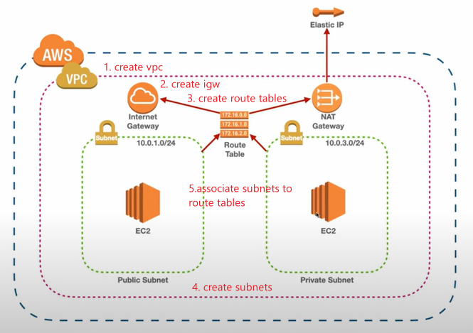

### 第一部分：配置VPC和相关网络设定
1. 去到AWS VPC, 然后创建一个vpc。
>Name: firstvpn
>IPv4 CIDR Block: 10.0.0.0/16
2. 然后在该VPC的action中选择`Edit VPC Setting`。在该页面中，允许 DNS Hostname(options).
3. 回到主页面左侧列单，选择并进入`Internet Gateways`.创建一个IG.名称是**firstGW**。创建好后，在`Action`中选择附上VPC选项：**firstvpc**
4. 回到VPC dashboard，在左侧列表中选择`Subnets`。点击创建Subnet。
5. 选择刚创建的VPN，然后分别创建两个public和private的子网（subnet）
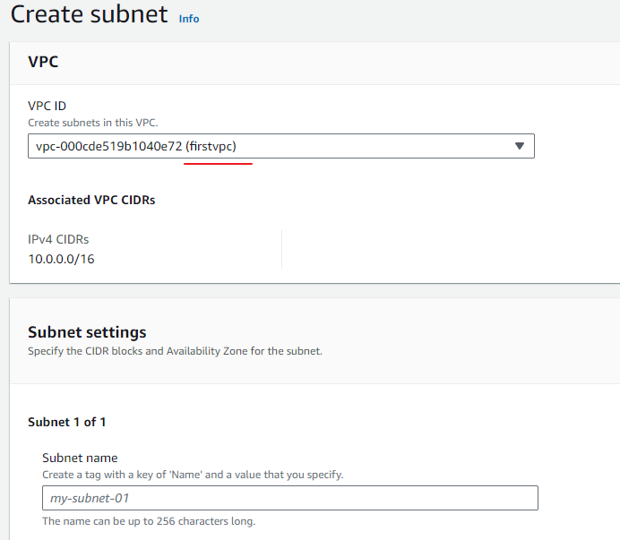
**Subnet To Be Created**
```
Name: Public-1A
Availability Zone: us-east-1a
IPv4 subnet CIDR Block: 10.0.1.0/24

Name: Public-1B
Availability Zone: us-east-1b
IPv4 subnet CIDR Block: 10.0.2.0/24

Name: Private-1A
Availability Zone: us-east-1a
IPv4 subnet CIDR Block: 10.0.3.0/24

Name: Private-1B
Availability Zone: us-east-1b
IPv4 subnet CIDR Block: 10.0.4.0/24
```
>**注意**
>在创建阶段可选择**VPC and more**的选项instead of just **VPC only**
>该选项能直接同时配置1-4的步骤
6. 以上四个子网创建完成后，点击修改（各个）两个创建的public 子网以允许自动配置ip的功能`Enable auto-assign public IPv4 address`.
7. 再次回到vpc dashboard，点击进入Routes Tables页面。点击创建两个Route Table，分别对应public(`MAIN`)以及private(`private-rt`)子网。
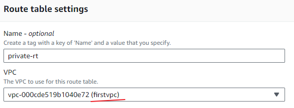
8. 在创建好的route table下的`Subnet Association` tab下，点击`Edit subnet association`.选择**关联**对应类型的子网。如果是`MAIN`则关联Public 1A和Public 1B子网，相应的，关联Private 1A 和Private 1B到`private-rt`之下。
9. `MAIN` route table虽然被设置为公开网区，但还不能上网。因此我们需要给它安上之前创建的Internet Gateway以便能够连接外网。可以在`Routes`的tab下修改并增加**firstGW**的route
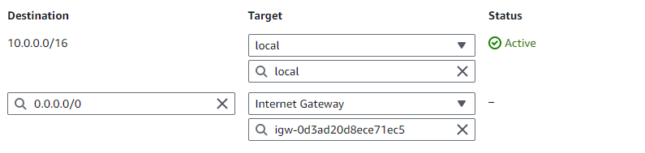
>10.0.0.0/16 -> taget说明任何局域网的对象将是local
>0.0.0.0/0 -> target说明任何非局域网需要通过设置的IGW（firstGW)
10.  在左侧列单中选择并进入NAT Gateway.创建Nat Gateway.名称：**firstnat**.
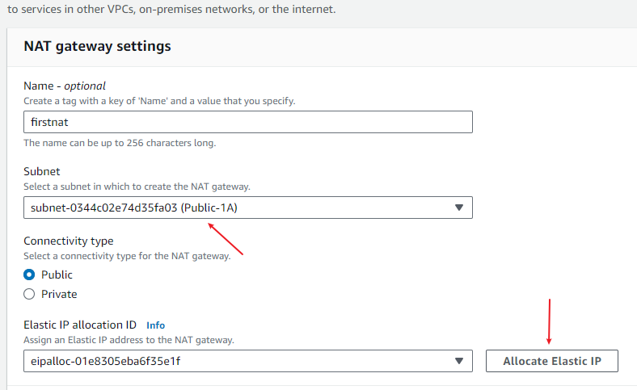
>VPN 的目的就是不让外网能够直接访问我们的私人网，唯有指定的公网才能。
>而NAT的目的在于给指定的公网与私人网之间搭一个网桥，以便让公网能够连接私人网。

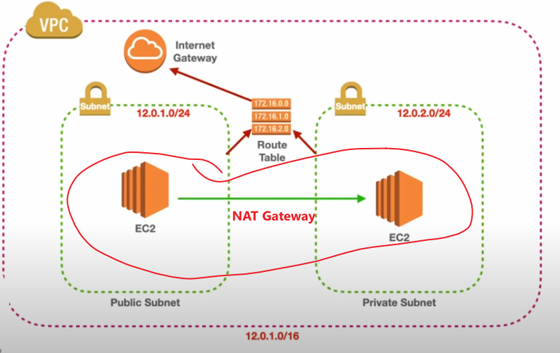
11. 回到`Route Table`页面，选择`private-rt`并在`Routes`tab下修改并增加NAT Gateway的路由
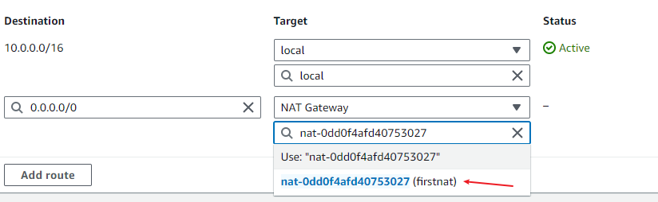
12. 最后进入Security Group Portal然后创建新的SG（之后测试EC2时会用到）。配置如下：
- 名称：public-web
- Description: 随意
- vpc:firstvpc
13. 在Inbound部分中加入以下规则。（该规则开发所有流量，**很危险**，后面教程会修改该部分）
- Type:All Traffic-IPv4
- Source: Anywhere

### 第二部分：Testing with EC2 Instance
1. We will use cli to create ec2 instance (Delay execute, excute only at third step).
```shell
aws ec2 run-instances --image-id <value> --instance-type <value> --security-group-ids <value> --subnet-id <value> --key-name <value> --user-data <value>
```
- image-id: ami_id, we be using amazon linux image. ami id can found on EC2 portal during create new instance. id **might be vary** by time, so better reference on latest id instead direct copy from this tutorial
- instance-type: use `t2.micro` if just for testing.
- security-group-ids: Found back the sg id(public-web) have been create on last part.
- subnet-id : set `Public-1A` subnet id
- key-name: Access `Key Pairs` page(At EC2 Portal) on left menu, just select one of it. In this case, the selected key pair name will be `mykey`. If you dont have any key, just create one.
- user-data: The initiate script executed when the instances is launched. Normally the scripts will take more than one lines, so on this case we will save our script in a file and upload it to AWS. And then, we just put the AWS file path for user-data option.

**user-data script**
```bash
#!/bin/bash
yum update -y
yum install -y httpd
systemctl start httpd
systemctl enable httpd
INTERFACE=$(curl -s http://169.254.169.254/latest/meta-data/network/interfaces/macs/)
SUBNETID=$(curl -s http://169.254.169.254/latest/meta-data/network/interfaces/macs/${INTERFACE}/subnet-id)
echo '<center><h1>This instance is in the subnet wih ID: SUBNETID </h1></center>' > /var/www/html/index.txt

#作用是将文本文件/var/www/html/index.txt中的字符串SUBNETID替换为变量$SUBNETID的值
sed "s/SUBNETID/$SUBNETID/" /var/www/html/index.txt > /var/www/html/index.html
```
2. Save above script as **ud-subtest1.txt** and upload it to AWS CLI.
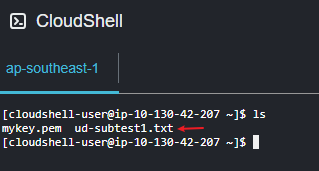
3. Update CLI command with respective values and execute
```shell
aws ec2 run-instances --image-id ami-0fd77db8c27ba5cc5 --instance-type t2.micro --security-group-ids sg-06f0ac8feeb984b58 --subnet-id subnet-0344c02e74d35fa03 --key-name mykey --user-data file://ud-subtest1.txt
```
4. After command executed, you might found cli stuck like below. It not stuck, just scroll down will Page Down Button or Space to read all message. Press `Q` exit message state.
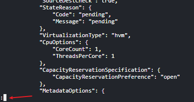
5. Go to EC2 dashboard, give created instance a recoginizable name like `Public 1A`
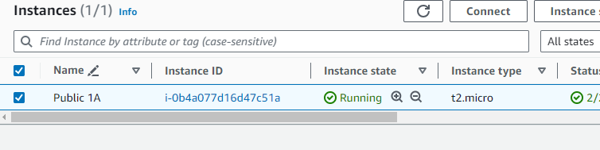
6. Repeat 1-5 steps for `Public 1B` and `Private 1B`(Private 1A no needed for now). Only things need to change is change subnet id on cli command.
In the end, we will have 3 EC2 instances
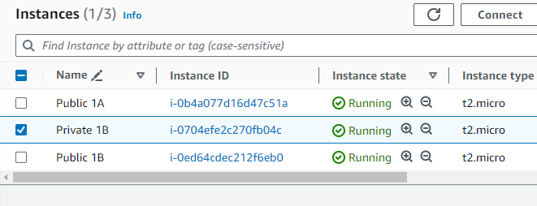
> Not recommend using cli as it have possibility of wrong setup
> Example, private instance dont need enable auto IPv4 assign, however if using cli, it might enable by default.

**测试**
Access Public 1A instance and try to **ping** `Public 1B` and `Private 1A`(using Private IP not Public IP) to prove public instance and private instance both accessing from the point of `Pubic 1A`.
>**Note**
>If not able ping any instance, can try to add **ICMP** protocol to Security Group

## 加强VPC的安全性

### Security Group and Network ACLs

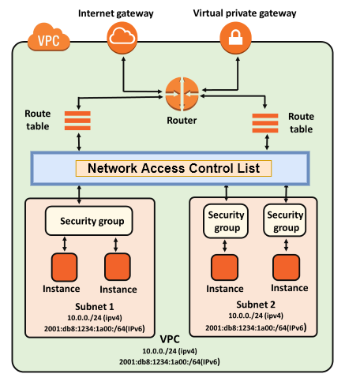

**Security Group**
- Security Group 是一种虚拟防火墙，用于控制 EC2 实例的入站和出站流量。每个 EC2 实例必须关联一个或多个安全组。
- 安全组是基于实例级别的，可以控制特定实例的流量。它们是状态感知的，意味着如果您允许流量进入实例，它也会自动允许流量返回（反之亦然）。
- 可以为每个安全组定义允许的入站和出站流量规则，规则基于协议类型（如TCP、UDP、ICMP）、端口范围和来源/目标 IP 地址。

**Network ACL**
- Network ACL 是一种网络层防火墙，用于控制子网级别的流量。每个子网必须关联一个 Network ACL。
- Network ACL 是有序的规则列表，按顺序评估流量，而不是像安全组一样根据状- 态进行评估。这意味着在规则允许之前，所有规则都必须匹配。
- 可以为每个 Network ACL 定义允许或拒绝特定协议和端口范围的流量，以及特定 IP 地址的流量。

**Difference Between SG And Network ACLs**
- 安全组是在实例级别操作的，而 Network ACL 是在子网级别操作的。
- 安全组是有状态的，而 Network ACL 是无状态的，它基于规则列表按顺序评估流量。

**图示SG和Network ACLs的差别**
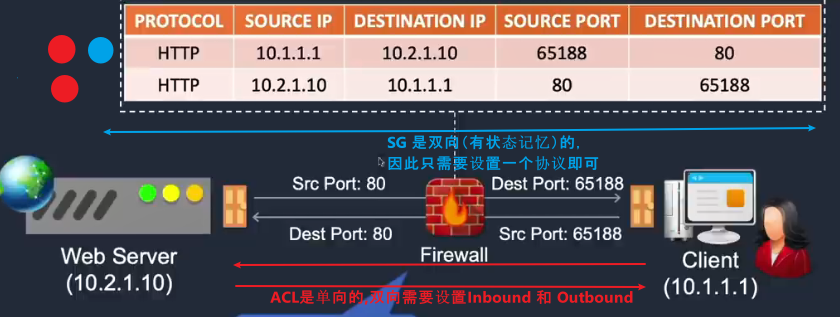

#### 实例1：在SG中设置SG
1.创建一个新的SG名为`private-web`,然后将之前`public-web`作为`ICMP` 协议的来源进行设置。
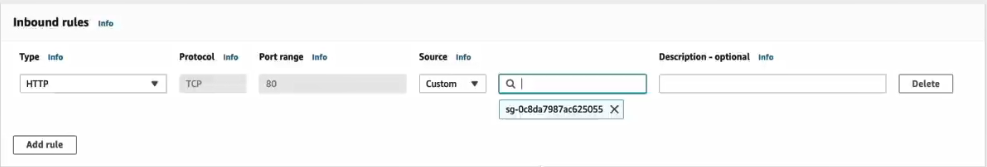
>上图的HTTP协议无视掉
2. 然后将`Private 1B` instance 的Security Group 切换成`private-web`.

>**解释**
>该规则表明允许任何具有`public-web` SG的instance都能够访问 `ICMP` 协议。
>**Expected Outcome**：在`Public 1A` instance中能够ping `Private 1B`并得到回应。


#### 实例2：ACL顺序规则
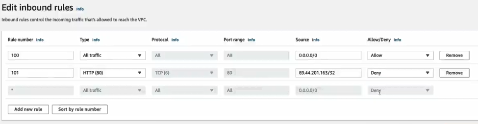
上图显示两个规则:
- 100 : 允许任何流量访问
- 101 ：不允许89.44.201.163的ip访问

**问题**：89.44.201.163到底能不能访问？
**答案**：不能
**解释**：因为100 规则的优先权比101 规则更大。
**解决方案**：调高禁止规则的优先权，如图下
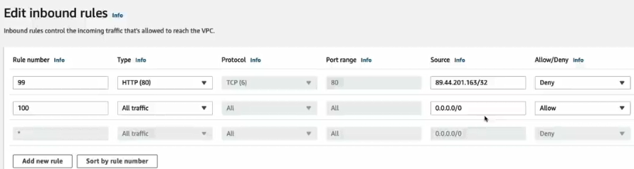

## VPC Peering


VPC Peering是一种 AWS 服务，允许您连接两个不同的虚拟私有云（VPC），使它们之间可以直接通信，就好像它们在同一个网络中一样。以下是关于VPC Peering的一些关键点：

1. **直接连接**：VPC Peering允许两个VPC之间直接通信，而无需通过公共Internet。
2. **私有连接**：通信通过AWS内部网络进行，因此数据保持在AWS网络内部，不经过公共Internet。
3. **非转发**：VPC Peering不是一种网关或路由，它只是在两个VPC之间创建了一个直接的网络连接。它不会转发流量，也不会更改源或目标IP地址。
4. **非对称连接**：VPC Peering连接是非对称的，这意味着两个VPC之间必须分别创建Peering连接。如果VPC A与VPC B进行了Peering连接，并不意味着VPC B也能直接与VPC A通信，除非在VPC B中也创建了相应的Peering连接。
5. **允许跨账户连接**：VPC Peering允许您在不同的AWS账户之间建立VPC之间的连接，只要双方账户都同意建立Peering连接。
6. **不同区域之间的连接**：VPC Peering可以跨越不同AWS区域建立连接，但是跨区域VPC Peering有一些限制，例如需要在两个VPC的CIDR范围中没有重叠部分。

### Peer Connection(PC) Practice
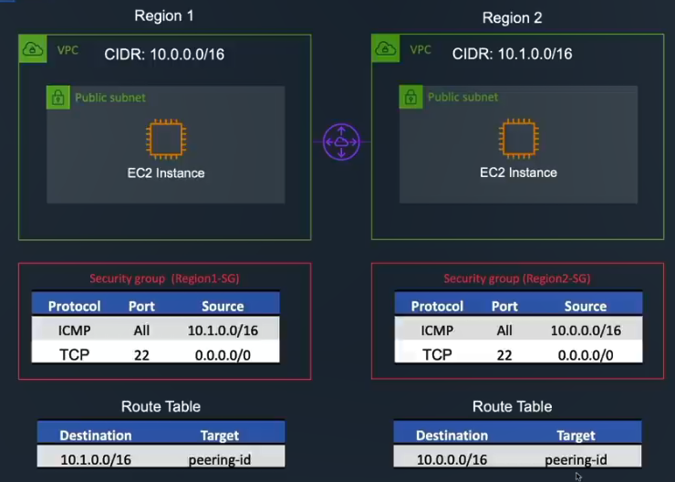
**Expected Output**: VPCs are able access each other `internally`(No Network).

To start the practice for VPC Peering, we need to create two vpc.
The first VPC will be the local, just use back the VPC have created.
The second will be the VPC created on different AWS Account or different region(same region allow) to maximize the testing purpose.

**Clean First VPC(If you have remain)**
- Remove NAT
- Remove Elastic IP
- Remove NAT From Route Table

**Create Second VPC**
1. Create VPC with different IP CIDR and region to first VPC, example:
- IP CIDR: 10.1.0.0/16
- Region: Tokyo
2. Create Subnet For VPC
   - Name:mysub-public-t1a
   - IPv4: 10.1.2.0/24
3. Create Route Table For VPC with subnet associated.
4. Create EC2 instance with aforemention VPC
5. Attach Security Group to EC2 instance with following protocol:
   - SSH:22
   - ALL ICMP: For ping testing
   - Set Source For Both protocol to `first` VPC IP:10.0.0.0/16
6. Copy VPC Id and its owner id and EC2 private ip to bring them for next steps.


**First VPC Update**
1. Update Security Group
   - SSH:22
   - ALL ICMP: For ping testing
   - Set Source For Both protocol to `second` VPC IP:10.1.0.0/16
> During testing, facing issue on ssh remote because of **source**
> Change it to 0.0.0.0/0
> And create new SG for second vpc source
> Then add this SG to EC2. Remember, not replace but add to security group list of EC2.

**Peer Connection Setup**
1. Access `Peer Connection` on the menu at VPC portal. Create Peer Connection.
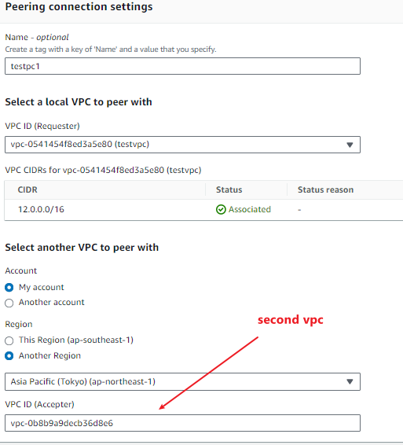
2. Peer Connection need approval on the accepter VPC side, so switch to `Tokyo` region and move to `Peer Connection` to accept the pending approve request.
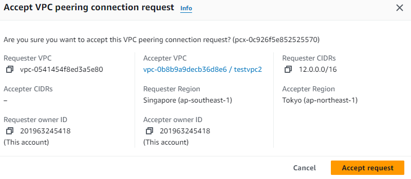
3. Go to `Route Table` Portal(both vpcs), and add peer connection have been created. Be remember the destination of route would be other target vpc, example, first vpc(10.0.0.0/16) should set second vpc(10.1.0.0/16) ip.

**Testing on EC2**
Access EC2 instance with first VPC, and try to ping second VPC EC2 instance.


## VPC Endpoint
VPC Endpoint是AWS提供的一种服务，用于在VPC（Virtual Private Cloud）中访问AWS服务或者AWS Marketplace的服务，而无需经过Internet网关或NAT设备。VPC Endpoint使得您可以直接在VPC中访问AWS服务，提高了安全性和网络性能，并且减少了数据传输的成本。

在AWS中，有两种类型的VPC Endpoint：VPC Gateway Endpoint和VPC Interface Endpoint。

**VPC Gateway Endpoint：**
- VPC Gateway Endpoint是一种用于连接VPC到支持S3和DynamoDB的AWS服务的终点。通过VPC Gateway Endpoint，您的VPC可以直接访问S3存储桶和DynamoDB表，而无需通过Internet网关或NAT设备。
- VPC Gateway Endpoint基于路由表配置，您只需在VPC的路由表中添加相应的路由规则即可实现访问控制。
目前，VPC Gateway Endpoint支持连接到S3存储桶和DynamoDB表，使得您可以通过私有网络连接而不需要通过Internet访问这些服务。

**VPC Interface Endpoint：**
- VPC Interface Endpoint允许您的VPC中的实例与支持的AWS服务或AWS Marketplace服务进行私有网络连接，而无需通过Internet网关。VPC Interface Endpoint通过在VPC的子网中部署弹性网络接口（ENI）来实现，这些接口与特定服务的终点连接。因此，VPC Interface Endpoint也被称为“Gateway Load Balancer Endpoint”或“Gateway Endpoint”。VPC Interface Endpoint基于网络ACL和安全组进行访问控制。
- VPC Interface Endpoint可用于连接多种AWS服务，例如Amazon EC2、Amazon SNS、Amazon SQS等，以及AWS Marketplace的部分服务。您可以通过在VPC中创建VPC Interface Endpoint并将其与相应的服务终点关联，来实现私有网络连接。


### VPC Gateway Endpoints
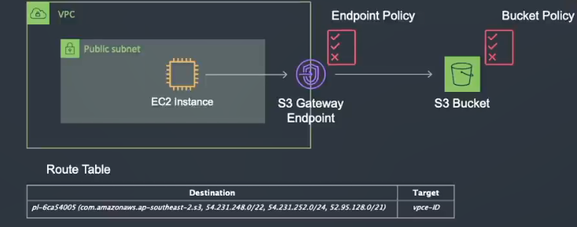

1. Access `Endpoint` page under VPC portal.Create New Endpoint with following options
   - select S3 service(type Gateway)
   - VPC: firstvpc
   - Route Table: Main firstvpc route table
   - Policy: Remain Original
2. Move to `Route Table` page and check on fistvpc main route table whether got adding new endpoint under `Routes` tab. 
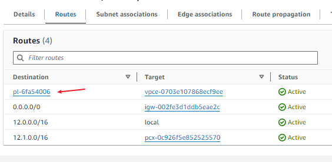
3. Create New **Role** under IAM portal with following option:
   - Type: AWS Service
   - Use case: EC2
   - Permissions: AmazonS3FullAccess
   - RoleName: AmazonS3FullAccess
4. Update `Public 1A` EC2 instance IAM role to `AmazonS3FullAccess` with action `Security->Modify-IAM Role`
5. Create New S3 bucket with following options:
- Bucket Name: bk-vpc-gw-test1
- Other remain default options
6. Upload few images to bucker just created for later testing.
7. Now connect to `Public 1A` EC2 instance to check whether can connect S3 bucket with command:
```shell
aws s3 ls
# might found aws command no found
# install awscli: sudo apt install awscli #version 1.22.34-1
aws s3 ls s3://bucket_name
```
8. Clarify the instance access s3 is through VPC endpoint without go through internet.
9. Go back `Endpoint` portal, change endpoint policy on `Policy` tab, then just switch `Effect` property from `Allow` to `Deny`. This change will deny anything which try access to endpoint.
10. Repeat command on step 7, there should have error message of `AccessDenied`
11. Switch back Endpoint Policy Effect to `Allow` again after tested.
12. Now we have done on `Endpoint` policy, let move to `S3 Bucket Policy`.
13. Access the S3 bucker have been created, then update the policy under `Permissions` tab with following statement:
```json
{
  "Version": "2012-10-17",
  "Id": "Policy1415115909152",
  "Statement": [
    {
      "Sid": "Access-to-specific-VPCE-only",
      "Principal": "*",
      "Action": "s3:*",
      "Effect": "Deny",
      "Resource": ["arn:aws:s3:::YOUR-BUCKET-NAME",
                   "arn:aws:s3:::YOUR-BUCKET-NAME/*"],
      "Condition": {
        "StringNotEquals": {
          "aws:sourceVpce": "YOUR-VPC-Endpoint-ID"
        }
      }
    }
  ]
}
```
>This policy will block every traffic if the vpc endpoint isn't the specific endpoint id
14. After save the change, repeat step 7 to test whether able to access s3 services.

## AWS Client VPN
Reference： https://www.youtube.com/watch?v=grwmzPT5JY4

AWS Client VPN 是一种托管的服务，可让您安全地连接到 AWS 云中的资源，而无需在本地网络中设置专用连接。它允许您通过 TLS (传输层安全性) 协议连接到一个或多个 VPC（虚拟私有云）中的资源，以便您可以安全地访问这些资源。AWS Client VPN 提供了对 AWS 中的私有网络资源的加密访问，使您可以在 Internet 上进行安全的远程访问，就好像您直接连接到了私有网络一样。

AWS Client VPN 的作用主要包括：

- **远程访问** AWS 资源：允许远程用户通过互联网访问 AWS 中的 VPC 中的资源，而无需在本地网络中设置专用连接。
- **加密通信**：所有数据传输都经过 TLS 加密，确保数据在传输过程中的安全性和隐私保护。
- **身份验证和访问控制**：可以使用 AWS IAM (Identity and Access Management) 来控制用户对 AWS 资源的访问权限，确保只有授权的用户能够连接到 VPN，并访问相应的资源。
- **跨平台支持**：AWS Client VPN 支持多种操作系统，包括 Windows、macOS、Linux 和移动设备平台（如 iOS 和 Android），使您可以在各种设备上安全地连接到 AWS 资源。
- **集成网络管理**：可以与 AWS 的其他网络服务（如 VPC、Direct Connect 等）进行集成管理，通过 AWS 控制台或 API 进行配置和监控。

### Demo Client VPN with Client VPN Network Interface
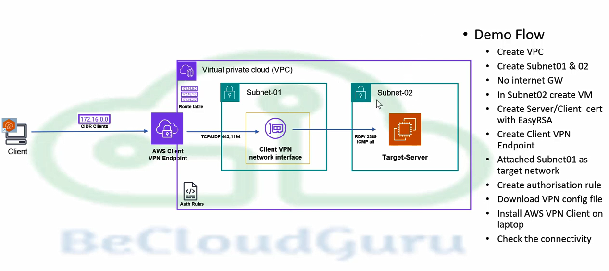

Expected Output: Stimulate how the client side are able to connect EC2 instance which dont compromise with Internet Gateway and Public IP.

1. Create VPC
- Name: vpc-client-t1
- IPv4: 10.1.0.0/16
2. Create two subnet
>**Subnet 1**
>Name:subnet01
>Ipv4: 10.1.2.0/24

>**Subnet 2**
>Ipv4: 10.1.3.0/24
>Name:subnet02
3. Create Window-base EC2 instance with subnet02.
>Make sure security group contain **rdp** and **ICMP** rules
>No assign public ip
4. We need generate certificate by using [easyrsa](https://github.com/OpenVPN/easy-rsa/releases). Download the latest release and extract to your local.
5. Generate related certificates files with easyrsa
```shell
# access extract folder
cd EasyRSA-3.1.7
# start program
.\EasyRSA-Start.bat
# initial pki tool
./easyrsa init-pki

# generate ca cert
./easyrsa build-ca nopass
# will ask you common name, key in server

# create server cert and server key
./easyrsa build-server-full server nopass

# create client cert and client key
./easyrsa build-client-full client1.domain.tld nopass

exit
```
6. The certificates will all put under pki folder of EasyRSA-3.1.7 folder.Remember the path, will use these certs later. (total 5 files)
7. Go to `AWS Certificate Manager(ACM)` portal, and click `Import certificate` on sidebar.
8. Copy paste the responding file to the fields:
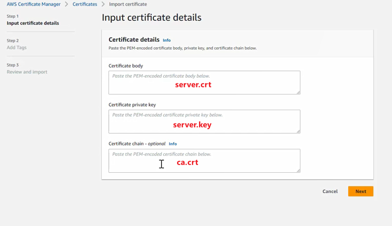
9. Set a tag for cert
   - Name: Server Cert
10. Repeat the same steps for upload client certificate.
11. Create client VPN Endpoint under VPC portal
- Name & Descript: client-vpc-test1
- Client IPv4 CIDR: 192.168.0.0/16
- Server Cert ARN: Server Cert just created
- Authentication Options: Use mutual authentication
- Client Cert ARN: Client Cert just created
- Enable split-tunnel
- VPC ID: VPC in first step
- Security Group: SG which enable TCP/UDP port. If dont have just create a new one.
- Session Timeout hours: 8(depend)
- Enable client login banner: Just give any message
> The CIDR range much be better 12-22
1.  After that, associate vpc and **subnet01**(not a subnet assign to ec2) to the client vpn endpoint through  `Target network associations`.
2.  Next, add new authorization rule under `Authorization rules` of client vpc endpoint
    - Destination network: 10.1.0.0/16 （vpc ip)
3.  Download client configuration for client vpc endpoint just done setup. Open downloaded client configuration file and add two tag: `cert` and `key`
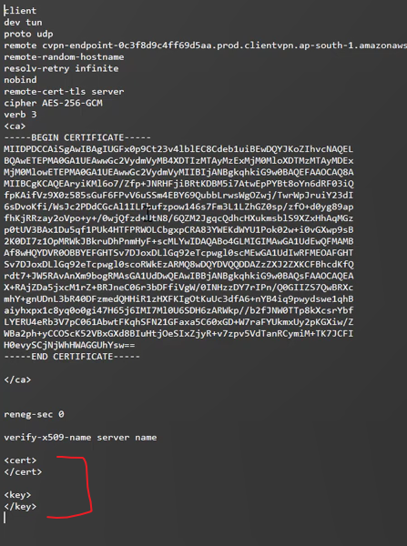
1.  Copy `client.domain.tld.crt` create by easyrsa and paste inside `cert` tag, and copy `client.key` inside `key` tag. Save the changes.
2.  All setup have done on aws, let down (VPN tool)[https://aws.amazon.com/vpn/client-vpn-download/] for testing. Download VPN base on instance OS, for our case, download and install VPN for Windows.
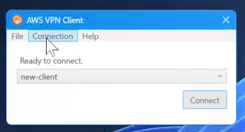
1.  Add new connection profile on AWS VPN Client:
- File -> Manage Profiles -> Add Profile
- Give any profile name
- Upload configuration file(step 14)
1.  If success message(banner message on step 11) is pop out, which mean you are able to remote the instance on you local.
2.  Open `Remote Desktop Connection` and access EC2 instance by private ip.