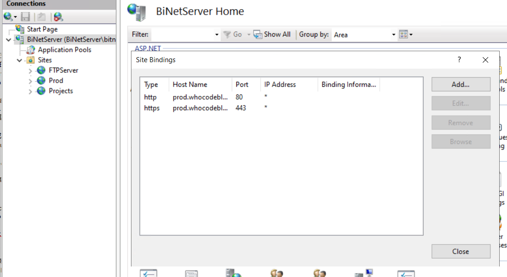
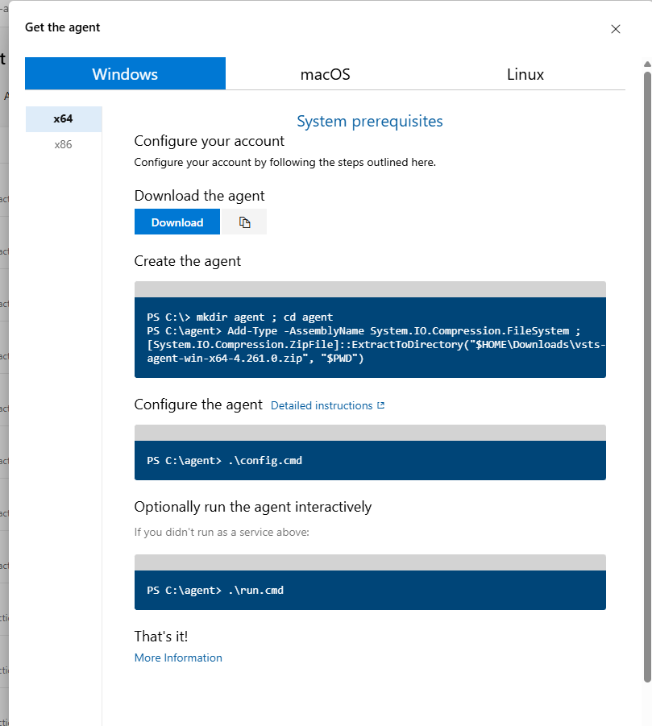

- [Azure DevOps 从零搭建实战（模拟初创公司环境）](#azure-devops-从零搭建实战模拟初创公司环境)
  - [宗旨](#宗旨)
  - [事前准备](#事前准备)
  - [Domain Name](#domain-name)
  - [注册 Organization Email（公司邮箱）](#注册-organization-email公司邮箱)
  - [Azure \& Azure DevOps 账号注册](#azure--azure-devops-账号注册)
    - [Azure 试用说明](#azure-试用说明)
  - [Azure VM 配置](#azure-vm-配置)
    - [创建虚拟机](#创建虚拟机)
  - [配置虚拟机（一）：Static Public IP](#配置虚拟机一static-public-ip)
    - [操作步骤](#操作步骤)
  - [配置虚拟机 2 - 自定义域名](#配置虚拟机-2---自定义域名)
  - [配置虚拟机 3 - IIS](#配置虚拟机-3---iis)
  - [新增登录用户](#新增登录用户)
    - [其他：账号封锁策略](#其他账号封锁策略)
  - [Azure Devops 基础概念](#azure-devops-基础概念)
    - [配置Self-Host Agent](#配置self-host-agent)
      - [配置步骤](#配置步骤)
  - [测试CICD](#测试cicd)
  - [本次测试体验](#本次测试体验)
  - [总结](#总结)


# Azure DevOps 从零搭建实战（模拟初创公司环境）

## 宗旨

本文记录一次**从零开始搭建 Azure DevOps 开发与 CI/CD 环境**的完整实践，用以模拟一家 IT 初创公司在 Azure 生态下，从无到有所需投入的**配置成本、技术复杂度与实际体验**。

这是一个**教学与实验性质**的练习，因此刻意控制范围：

- ❌ 不涉及复杂的员工账号体系  
- ❌ 不引入 Entra ID（Azure AD）深度管理  
- ❌ 不展开服务器级别的高级运维  

核心目标聚焦在以下几个方面：

- 熟悉 Azure DevOps 的整体使用逻辑  
- 从零配置 Azure VM 作为基础设施  
- 绑定自定义域名与公司邮箱  
- 自建 **Self-Hosted Agent**  
- 实现基础但完整的 CI/CD 流程  

## 事前准备

在开始前，需要准备以下资源：

- 一个 **域名（Domain Name）**
- 一个基于该域名的 **公司邮箱**
- 一个 **Azure Account**
- 一个 **Azure DevOps Account**

## Domain Name

域名可以在任意域名供应商处购买。

本文示例使用的是 **Hostinger**，价格会随域名后缀有所不同。如果只是测试或学习用途：

- 随意选择即可  
- 推荐使用 `.com`，兼容性与通用性最好  

不同供应商之间的价格差异不大，不需要在此阶段投入过多时间。

## 注册 Organization Email（公司邮箱）

此步骤依赖你已拥有域名。

你需要选择一个 Email Provider，常见的有：

- Gmail
- Outlook
- ProtonMail
- Zoho Email（提供 Free Tier）

各家在**域名验证流程**上略有不同，但整体并不复杂，按照官方指引完成即可。

如果只是学习或测试用途，**Zoho Email 的 Free Tier 已足够使用**，但功能性有限，不适合生产环境。

## Azure & Azure DevOps 账号注册

按照 Azure 官方流程注册即可。

建议使用你刚创建的**公司邮箱**进行注册，而不是 Gmail / Outlook。  
这样在模拟「公司级 IT 架构」时更贴近真实场景。

### Azure 试用说明

- 新账号提供 **30 天、200 USD 试用额度**
- 部分服务提供 **12 个月 Free Tier**
- 并非所有服务免费，使用前务必确认定价

## Azure VM 配置

### 创建虚拟机

1. 登录 **Azure Portal**
2. 创建一个 `Resource Group`  
   - 示例：`AzureDevopsPractice`  
   - 目的：集中管理资源，便于整体销毁与成本控制

3. 创建 Virtual Machine：
   - **Resource Group**：`AzureDevopsPractice`
   - **Image**：Windows Server（版本不必太旧）
   - **Size**：推荐 `B2s`
     - `B1s` 虽免费但性能过低
   - **Network**：开启
     - RDP (3389)
     - HTTP (80)
     - HTTPS (443)
   - 其余选项保持默认

4. 创建完成后，保存管理员账号与密码
5. 使用 Remote Desktop 登录 VM
6. 在浏览器访问 VM 的 **Public IP**，确认 HTTP 可访问

## 配置虚拟机（一）：Static Public IP

默认情况下，VM 的 Public IP 会在重启后变更，这会影响：

- 域名绑定
- CI/CD 部署目标

因此需要将其改为 **Static IP**。

### 操作步骤

1. 打开你的 VM
    - 进入 Azure Portal
    - 左边栏选择 **Virtual Machines**

2. 点击你的虚拟机名称
    - 在左侧菜单中点击
    - **Networking（网络）** → 找到 “Network interface” 一栏，点进去。

3. 在 Network Interface 页面里，找到：
**IP configurations**（IP 配置）
点进去后你会看到一条配置（通常叫 `ipconfig1`）

4. 点击 `ipconfig1` 打开它。
里面会显示：
    - Private IP address (usually static)
    - **Public IP address** → 有一个蓝色链接（点进去）

5. 点击进去后进入 Public IP 地址资源页。
这时候你会看到：

```makefile
Assignment: Dynamic
```

👉 改成：
```vbnet
Assignment: Static
```

## 配置虚拟机 2 - 自定义域名

在 Public IP 固定后，即可配置域名解析。

**Entra ID 配置**
1. Entra ID → Custom domain names → Add custom domain
2. 新增你的域名（如 whocodeblog.com）
3. 根据提示，在域名供应商处添加 TXT 记录完成验证

示例：
| Type | Host name           | Value         |
| ---- | ------------------- | ------------- |
| TXT  | @ 或 whocodeblog.com | MS=ms12345678 |

4.  将该域名设为默认

5. 为后续 IIS 使用，提前配置子域名：

| Type | Name           | IPv4 address         | Proxy Status | TTL |
| ---- | ------------------- | ------------- | ------ | --------- |
| A  | test | VM Public IP | Proxied | Auto |
| A  | prod | VM Public IP | Proxied | Auto |

## 配置虚拟机 3 - IIS

1. 在 VM 中安装 IIS
2. 打开 IIS Manager → Server Certificates
3. 创建两个自签名证书：
 

至此，基础 Web 环境配置完成。

## 新增登录用户

目前未能成功通过 Entra ID 添加 RDP 用户，因此采用本地用户方案。

**方法一：使用Azure Portal**
1. 选择VM
2. Operations -> Run Command ->  RunPowerShellScript
```powershell
$username = "wchoo"
$password = ConvertTo-SecureString "YourSecurePassword123!@#" -AsPlainText -Force

New-LocalUser -Name $username -Password $password -FullName "Hoo Weng Chin" -Description "Local account for Azure AD user"
Add-LocalGroupMember -Group "Administrators" -Member $username

# 允许 RDP
Add-LocalGroupMember -Group "Remote Desktop Users" -Member $username
```

**方法二：VM 内部手动创建**
通过远程桌面登录 VM 后创建本地用户。

### 其他：账号封锁策略

管理员账号曾多次因策略被锁定，以下为临时解决方案，不建议生产环境使用：

```powershell
# 查看当前锁定策略
net accounts

# 暂时移除锁定机制
net accounts /lockoutthreshold:0

# 设置锁定5次失败后锁30分钟
net accounts /lockoutthreshold:5 /lockoutduration:30 /lockoutwindow:30
```

## Azure Devops 基础概念

- 一个 Organization 可包含多个 Project
- 一个 Project：
  - 只有一个 Repo
  - 可以有多个 Pipeline

本实践目标：
- 自建 Self-Hosted Agent
- 从零搭建 Pipeline
- 使用私有 Package Feed

### 配置Self-Host Agent

**为什么需要自建 Agent？**

Pipeline 本质上是执行脚本的程序，需要：
- CPU
- RAM
- Storage

默认使用 Microsoft Hosted Agent：
- 有额度限制
- 需要申请
- 有使用期限

相比之下，将 Agent 部署在自己的 VM 上：
- 可控
- 成本明确
- 学习价值更高

#### 配置步骤
1. 右下角 -> Organization Settings -> Agent Pool(Pipeline)

2. 点击`Add Pool`
`Pool Type`选择 `Self-Hosted`。
名字和详细随意。
不过名字之后会被使用，因此尽量简单干净，如`bitnet-window-agent`

1. 点击创建的`pool` -> 点击 `New Agend`
这里会弹出在各个不同`OS`配置`代理`的指南和步骤，这里我们跟着`windows`的指南。


1. 先下载弹出窗口的文件（zip），然后将其拖拉到虚拟器的`C:/Downloads`路径下。

2. 打开`powershell`，跟着指南提供的指令依序输入即可。
注意如果你的`zip`文档放在别的路径，需要在指令里做对应的修正

1. 执行`.\config.cmd`时，你需要提供资讯在`Azure devops`和虚拟器之间建立连接。


**第1问： Enter Server Url**
答：这里提供你的devops url，例如https://dev.azure.com/binet25/

**第2问：Enter Authentication Type(press enter for PAT)**
答： 直接Enter

**第3问：Enter Personal Access Token**

输入之前，你需要先创建一个`token`。
 
打开你的devops url，然后在左上角找到`User Settings`的icon -> **Personal access tokens** -> New Token -> 你需要提供以下输入来创建token
`Name`: 随意
`Organization`: binet
`Expiration`：随意
`Scopes`: Full Access

创建成功后，会生成一段独特的文字（token）。复制，小心保存在一个地方，这段token没有再浏览的可能。

最后，粘帖这个`token`作为第3问的答复

**第4问：Enter Agent Pool(press enter for default)**
答：输入刚刚创建的pool: `bitnet-window-agent`

**第5问：Enter Agent Name**
答：随意。你也可以直接按`Enter`

**第6问：Enter work folder(pree enter for _work)**
答：这是储存artifacts或者pipeline执行留下缓存的路径。这里你可以随意，或者直接`Enter`

**第7问：Enter run agent as service? (Y/N)**
答：是否每次虚拟机开机时，自动启动`代理`。这里看你个人倾向，我选`N`（如果要跑的话，需要手动执行`.\run.cmd`）

**第8问：Enter configure autologon and run agent on startup?（Y/N）**
答：跟上个问题类似。我选`N`。

7. 最后，执行 `.\run.cmd`来启动`代理`（在cmd执行，不要直接双击）。关掉也很简单，直接关闭执行cmd的窗口即可。

8. 回到`Azure Devops`中的`Agent Pool`。选择你的agent pool，然后看看代理是否`online`的状态。

完成以上对答，就可以通过 `run.cmd`来启用你的代理。建议使用 **cmd /powershell 窗口**，而非双击启动。

## 测试CICD

所有必要的配置以完成，接下来就是验证这些配置是否生效了。

**Pipelines -> Github (选择你的git) -> git 登录页面 (如果是第一次使用的话) -> 选择一个Repo**

可以先从一个简单的`pipeline`开始。

```yaml
trigger:
- main
- develop

pool:
  name: 'binet-window-agent' # 你的代理名称

stages:
  - stage: Test
    jobs:
      - job: TestJob
        steps:
          - script: echo "cicd is triggering successfully"
            displayName: 'Print Success Message'
```

保存以上的pipeline 配置后，可以随意在你指定的项目内做一些微改，如新增一行注释，然后推送到任意 `main` 或 `develop`的分支。

## 本次测试体验

每个项目的CICD多少有不同的需求，我这里分享的仅仅只是个人使用后的心得，以下是在自己的pipeline中引入的步骤和工具：

1. Unit Testing

在项目中创建你的unit testing的项目，然后在 Build之后的步骤执行测试，从而实现自动化测试，并有效阻止包含失败逻辑被发布的情况。

2. 自动化打包和发布

检测包的版本，如果版号不存在`feeds`中，则自动发布该包。

3. 自动化部署

根据分支的不同，将打包成功的`artifacts`部署到web server上去。

4. 自动化重写环境变量

可搭配使用 `variables`来重写环境变量，例如说数据库的地址

细节可参考我个人测试使用的[pipeline](utl).

有些步骤可能需要配置一些东西才能使用。例如自动化打包，你需要先创建一个 `artifacts feed`，然后在权限设置上允许你的代理执行自动化添加的能力。

诸如如此，细说的话，篇幅将会超出原本的预期。况且，我执行的配置对我可能有用，但可能对你没用，因此这要视情况而定。

## 总结
这是一次非常有价值的实践。

从零搭建 CI/CD 生态，逐步看到系统成型，本身就是一种工程成就感。

唯一的遗憾是：
**Azure 很好用，但确实不便宜。**

30 天试用结束后，大部分服务将开始计费，因此本次实验止步于此。

但这并不妨碍它成为一次完整、真实、且极具参考价值的体验。