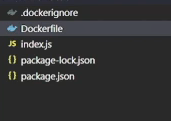
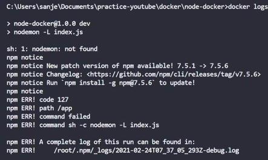
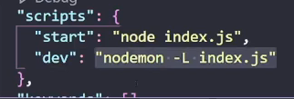
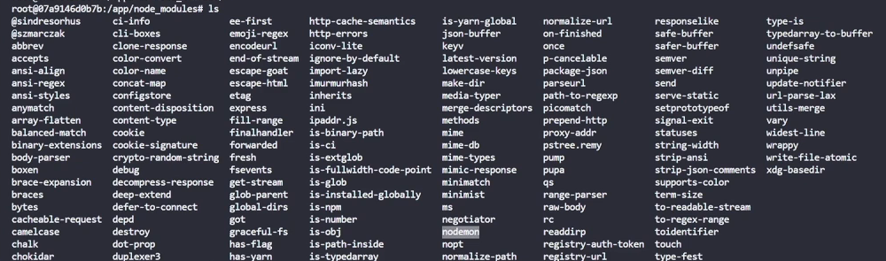
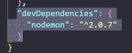
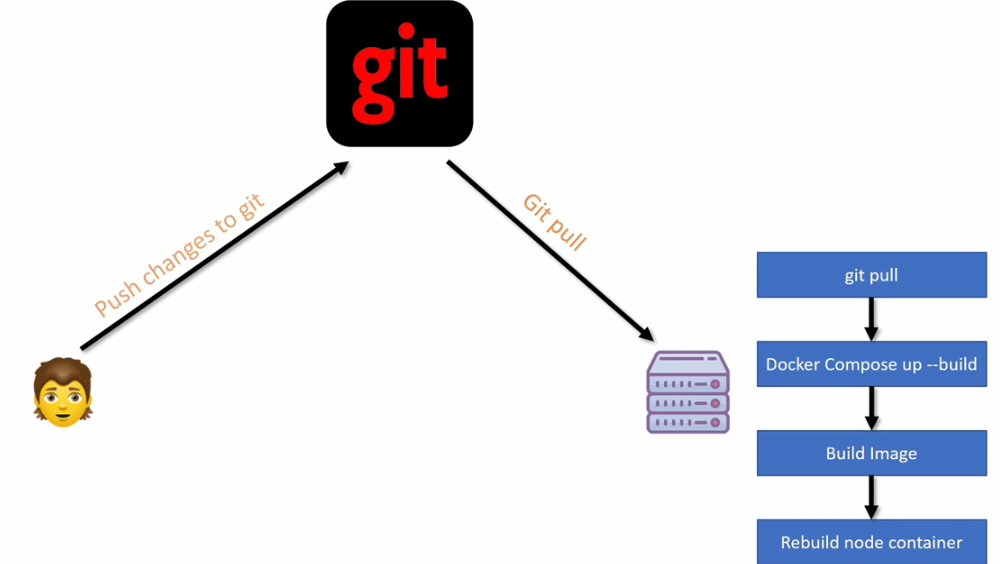
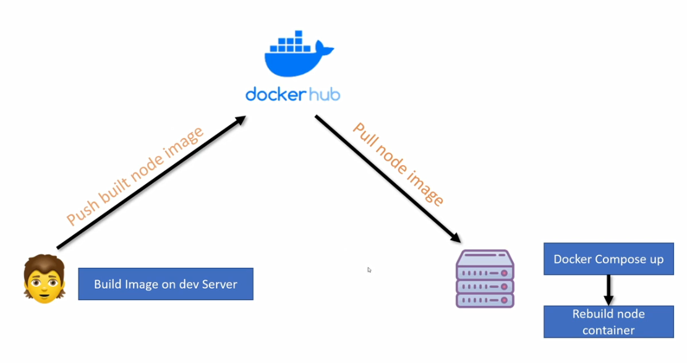
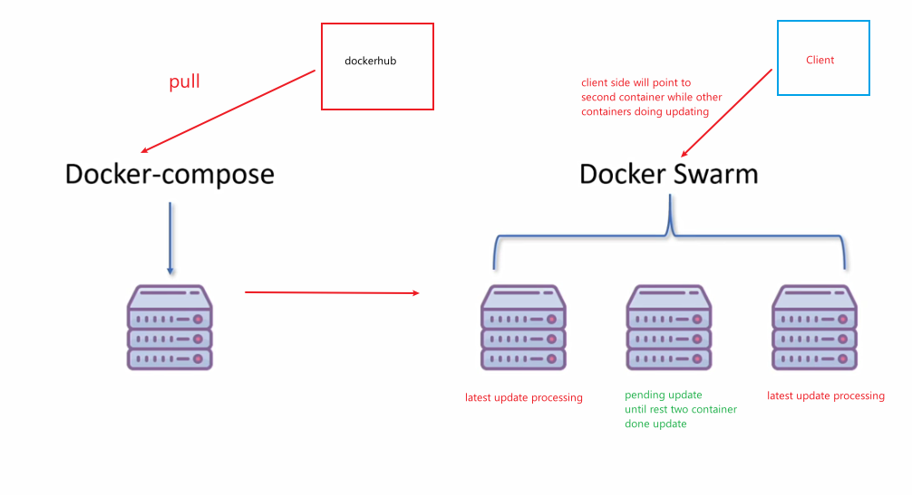
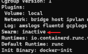
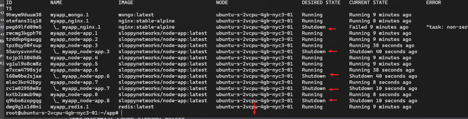

- [References](#references)
- [Dockerfile](#dockerfile)
  - [Use .dockerignore](#use-dockerignore)
  - [Ignore Specific Volumn Binding](#ignore-specific-volumn-binding)
  - [使用Environment](#使用environment)
    - [方案1](#方案1)
    - [方案2](#方案2)
- [Docker-compose](#docker-compose)
  - [Docker-compose基本用法](#docker-compose基本用法)
  - [Docker-Compose 为不同开发环境设置](#docker-compose-为不同开发环境设置)
  - [Docker-Compose Production 的依赖问题](#docker-compose-production-的依赖问题)
  - [多个services在docker-compose](#多个services在docker-compose)
- [使用Nginx](#使用nginx)
- [重建镜像的一些小知识](#重建镜像的一些小知识)
  - [减少重建的时间](#减少重建的时间)
  - [什么时候要git push](#什么时候要git-push)
- [采用CI/CD Pipeline 自动化发布过程的一致性](#采用cicd-pipeline-自动化发布过程的一致性)
  - [部分1：提前配置](#部分1提前配置)
  - [部分2 实时监控以实现自动化更新](#部分2-实时监控以实现自动化更新)
- [解决生产环境的Downtime问题](#解决生产环境的downtime问题)
  - [实施docker swarm](#实施docker-swarm)
    - [实验步骤](#实验步骤)


## References
[Youtube](https://www.youtube.com/watch?v=9zUHg7xjIqQ&t=2s&pp=ygUTbGVhcm4gZG9ja2VyIGRldm9wcw%3D%3D)
[Github](https://github.com/Sanjeev-Thiyagarajan/node-docker)

## Dockerfile
### Use .dockerignore
```
node_modules
Dockerfile
.dockerignore
.git
.gitignore
docker-compose*

```

### Ignore Specific Volumn Binding
特定情况下会需要无视一个特定目录的绑定。例如，为了实时变更开发环境到docker container上，我们将整个开发文档做了一个volumn的绑定。
问题是出在，本地开发的目录下并没有node_modules(特殊原因)，而即使dockerfile内有执行npm install，但因为绑定整个当地文档的关系，因此container内的node_modules也会跟着消失。
- Dockerfile
```dockerfile
FROM node:15
WORKDIR /app
COPY package.json .
RUN npm install
COPY . ./
EXPOSE 3000
CMD ["npm","run","dev"]
```
- 开发文档（node app-无node_modules)



**绑定全部文档的情况下**

```sh
docker run 
-v %cd%:/app 
-d --name node-app node-app-image
```
使用以上指令的情况下则运行失败因为node_modules被sync binding而消失
```
docker logs node-app
```


**绑定全部文档并且无视绑定node_modules**
```powershell
docker run 
-v %cd%:/app 
-v /app/node_modules 
-d --name node-app node-app-image
```
准确来说，它并不是无视绑定，而是override本地的node_modules

**volumn权限**
可在volumn后添加`ro`或`rw`标识。
```powershell
docker run 
-v %cd%:/app:ro 
-v /app/node_modules 
-d --name node-app node-app-image
```
以上将无法在/app路径下建立或修改任何文档


### 使用Environment
善用ENV的好处在于，可在使用指令时替换ENV的值
#### 方案1
dockerfile 添加Port Environment
```dockerfile
FROM node:15
WORKDIR /app
COPY package.json .
RUN npm install
COPY . ./
ENV PORT 3000
EXPOSE $PORT
CMD ["npm","run","dev"]
```
指令:
```powershell
docker run
-v %cd%:/app:ro -v /app/node_modules 
--env PORT=4000
-p 3010:4000
-d --name node-app node-app-image
```

#### 方案2
在开发文档下创建一个.env文件
```
PORT=4000
```
指令:
```powershell
docker run
-v %cd%:/app:ro -v /app/node_modules 
--env-file ./.env
-p 3010:4000
-d --name node-app node-app-image
```

## Docker-compose
### Docker-compose基本用法
1. Dockfile
```dockerfile
FROM node:15
WORKDIR /app
COPY package.json .
RUN npm install
COPY . ./
ENV PORT 3000
EXPOSE $PORT
CMD ["npm","run","dev"]
```
2. 创建docker-compose.yml文件
```yml
version: "3"
services:
    node-app:
        build: .
        volumes:
            - ./:/app
            - /app/node_modules
        environment:
            - PORT=3000
        #env_file:
        #   - ./.env
```
3. docker-compose 指令
```powershell
docker-compose up -d --build
```

### Docker-Compose 为不同开发环境设置
假设我们有两个环境：开发环境和生产环境
创建三个docker-compose 文件，分别是：
 - docker-compose.yml //主要compose，有些配置是通用dev和prod环境，这些配置可在这里设置。
 - docker-compose.dev.yml
 - docker-compose.prod.yml

**package.json**
内有两个scripts分别对应开发和生产环境


**docker-compose.yml**
```yml
version: "3"
services:
    node-app:
        build: .
        environment:
            - PORT=3000
        #env_file:
        #   - ./.env
```
**docker-compose.dev.yml**
```yml
version: "3"
services:
    node-app:
        volumes:
            - ./:/app
            - /app/node_modules
        environment:
            - NODE_ENV=development
        command: npm run dev
```
**docker-compose.prod.yml**
```yml
version: "3"
services:
    node-app:
        environment:
            - NODE_ENV=production
        command: node index.js
```

**指令**
```sh
docker-compose 
-f docker-compose.yml 
-f docker-compose.[dev|prod].yml
up -d --build
``` 
此指令会以docker-compose.yml的配置为基础，并执行either docker-compose.dev.yml 或docker-compose.prod.yml的配置。

### Docker-Compose Production 的依赖问题
1. 假设跑了生产docker-compose的指令：
```sh
docker-compose 
-f docker-compose.yml 
-f docker-compose.prod.yml
up -d --build
```
2. 在运行的container上执行bash 模式
```sh
docker exec -it node-docker_node-app_1 bash
//进入后
cd node_modules
ls
```
3. 会发现node_modules下有nodemon. 



此所以是问题是因为nodemon只是对开发环境有用的工具，但对生产环境却是不必要的。


而不必要的包会使container变得沉重。

4. 解决方案是在dockerfile中的npm install中标记只安装生产包
```dockerfile
FROM node:15
WORKDIR /app
COPY package.json .
RUN npm install --only=production
...
CMD ["npm","run","dev"]
```
5. 可是以上方案会导致每次切换环境时，需要手动更改，因此可以使用if else做检查.

**Dockerfile**
```dockerfile
FROM node:15
WORKDIR /app
COPY package.json .

ARG NODE_ENV //这需要在docker-compose文件中配置
RUN if [ "$NODE_ENV" = "development" ]; \
        then npm install; \
        else npm install --only=production; \
        fi
...
CMD ["npm","run","dev"]
```
**docker-compose.dev.yml**
```yml
version: "3"
services:
    node-app:
        build:
            context: .
            args:
                NODE_ENV: development
        volumes:
            - ./:/app
            - /app/node_modules
        environment:
            - NODE_ENV=development
        command: npm run dev
```
**docker-compose.prod.yml**
```yml
version: "3"
services:
    node-app:
        build:
            context: .
            args:
                - NODE_ENV:production
        environment:
            - NODE_ENV=production
        command: node index.js
```

### 多个services在docker-compose
**docker-compose.yml**
```yml
version: "3"
services:
    node-app:
        build: .
        environment:
            - PORT=3000
        depends_on: #指定node_app依赖mongo，这表明node_app会在mongo 服务之后启动
            - mongo
    
    mongo:
        image: mongo #可加:版本。从远程库下载（如果本地没有）
        environment: #建议看官网，变量可能发生变化
            - MONGO_INITDB_ROOT_USERNAME=yhtest
            - MONGO_INITDB_ROOT_PASSWORD=mongo123
        volumes:
            - mongo-db:/data/db

volumes:
    mongo-db:
```
**docker-compose.dev.yml**
```yml
version: "3"
services:
    node-app:
        build:
            context: .
            args:
                NODE_ENV: development
        volumes:
            - ./:/app
            - /app/node_modules
        environment:
            - NODE_ENV=development
            - MONGO_USER=yhtest
            - MONGO_PASSWORD=mongo123
        command: npm run dev
    
    mongo:
        environment:
            - MONGO_INITDB_ROOT_USERNAME=yhtest
            - MONGO_INITDB_ROOT_PASSWORD=mongo123

volumes:
    mongo-db:
```

## 使用Nginx
1. 创建一个nginx.conf文件
```
server {
    listen 80;

    location /api {
        proxy_set_header X-Real-IP $remote_addr;
        proxy_set_header X-Forwarded-For $proxy_add_x_forwarded_for;

        proxy_set_header Host $http_host;
        proxy_set_header X-NginX-Proxy true;
        proxy_pass http://node-app:3000;
        proxy_redirect off;
    }
}
```
2. 加nginx服务
**docker-compose.yml**
```yml
version: "3"
services:
    nginx:
        image: nginx:stable-alpine
        ports:
            - "3000:80"
        volumes:
            - ./nginx.conf:/etc/nginx/conf.d.default.conf:ro

    node-app:
        build: .
        environment:
            - PORT=3000
        depends_on:
            - mongo
    
    mongo:
        image: mongo
        environment:
            - MONGO_INITDB_ROOT_USERNAME=yhtest
            - MONGO_INITDB_ROOT_PASSWORD=mongo123
        volumes:
            - mongo-db:/data/db #建议看官网，路径可能变化

volumes:
    mongo-db:
```
**docker-compose.dev.yml**
```yml
version: "3"
services:
  nginx:
    ports:
      - "3000:80"
  node-app:
    build:
      context: .
      args:
        NODE_ENV: development
    volumes:
      - ./:/app
      - /app/node_modules
    environment:
      - NODE_ENV=development
      - MONGO_USER=sanjeev
      - MONGO_PASSWORD=mongo123

    command: npm run dev
  mongo:
    environment:
      - MONGO_INITDB_ROOT_USERNAME=yhtest
      - MONGO_INITDB_ROOT_PASSWORD=mongo123
```

**docker-compose.prod.yml**
```yml
version: "3"
services:
    nginx:
        image: nginx:stable-alpine
        ports:
            - "80:80"

    node-app:
        build:
            context: .
            args:
                - NODE_ENV:production
        environment:
            - NODE_ENV=production
        command: node index.js
```

**实验nginx是否生效**
可使用以下指令让docker模拟多台服务器
```sh
docker-compose
-f docker-compose.yml -f docker-compose.dev.yml
-up -d
--scale node-app=2
```
接着可开启两个instance的terminal，接着使用docker实时追踪的指令监控服务器的记录
```sh
docker logs node-docker_node-app-[1|2] -f
```
可给服务器发出多个请求做测试，观测均衡是否发生。

## 重建镜像的一些小知识

### 减少重建的时间
就拿之前的docker-compose为例，内含两个服务:node-app和mongo
假设node-app做了一些更改，我们需要使用重建指令
```bash
docker-compose
-f docker-compose.yml
-f docker-compose.prod.yml
up -d --build node-app
```
不过以上指令其实也很重建mongo镜像，即使指令后面我们指定仅重建`node-app`镜像。
这是因为node-app是depends on mongo
正确的指令是让node-app无视依赖再进行重建
```bash
docker-compose
-f docker-compose.yml
-f docker-compose.prod.yml
up -d --build --no-deps node-app
```

### 什么时候要git push
**git push**
1. 当我们没有将镜像push 到dockerhub
2. 当docker-compose或dockerfile发生变更
3. 当我们能直接从dockerhub pull镜像获取更改后，无需再push除docker相关的文件到git上

## 采用CI/CD Pipeline 自动化发布过程的一致性

传统的方法基本需要在每一个步骤手动进行对生产环境系统的任何变更。
每当代码变更，我们就需要手动重复这些步骤，这对于开发投入无疑是很巨大的。
**例如Git+Docker**

**例如Dockerhub**
少了git的步骤，但仍旧需要手动执行更新


### 部分1：提前配置

1. 开始前要有两个前提条件：
    - 一台‘真’服务器
    - 将开发文档发布到git
    - 注册一个docker账号（后面需要将镜像发布到个人的远程库）
2. 修改docker-compose.prod.yml,将环境变量的值从系统读取instead of hard code
```yml
version: "3"
services:
  nginx:
    ports:
      - "80:80"
  node-app:
    build:
      context: .
      args:
        NODE_ENV: production

    environment: #变更这里
      - NODE_ENV=production
      - MONGO_USER=${MONGO_USER}
      - MONGO_PASSWORD=${MONGO_PASSWORD}
    command: node index.js
  mongo:
    environment:
      - MONGO_INITDB_ROOT_USERNAME=${MONGO_INITDB_ROOT_USERNAME}
      - MONGO_INITDB_ROOT_PASSWORD=${MONGO_INITDB_ROOT_PASSWORD}
```
3. 在服务器上设置必要的环境变量（这里假设使用的是ubuntu linux）
```bash
export MONGO_USER=yhtest
export MONGO_PASSWORD=mongo123
...
```
4. 检查设置变量的值是否正确
```bash
printenv
```
5. 然而主动一个一个输入环境变量到系统有几个问题：
    - 需要reboot才能生效
    - 一个一个输入很没效率

6. 最好的办法是在服务器上创建一个.env文件（在root路径下）
```
MONGO_USER=yhtest
MONGO_PASSWORD=mongo123
...
```
7. 然后同样在root路径下发现.profile并在最后的新一行中打入：
```bash
set -o allexport; source /root/.env; set +o allexport
```
或者直接使用插入指令
```bash
echo set -o allexport; source /root/.env; set +o allexport >> .profile
```
8. 需要关掉当前的instance（terminal）才能生效。重启后可检查是否生效
```bash
printenv
```
9. 接着在服务器上install docker 和docker-compose
    - 可参考[该链接](https://get.docker.com/).一键安装的guide。
    - 主要是在服务器上执行以下指令：
      - `curl -fsSL https://get.docker.com -o install-docker.sh`
      - sh install-docker.sh
      - 测试docker是否正确install
      - 到官网参考install [docker-compose](https://docs.docker.com/compose/install/linux/)的步骤
10. 在服务器上install git（如果没有）
11. 将开发文档发布到git，并在服务器上git clone
12. 使用安装好的docker运行文档确认是否正确运行。
13. 在docker私人远程库上创建一个repo（push步骤和git相似）
14. 然后tag你想要的镜像
```sh
docker image tag target_image username/repo_image_tag:version
docker push username/repo_image_tag:version
```
15. Push 之后，你可以将docker-compose.yml做一些变更:
```yml
version: "3"
services:
    nginx:
        image: nginx:stable-alpine
        ports:
            - "3000:80"
        volumes:
            - ./nginx.conf:/etc/nginx/conf.d.default.conf:ro

    node-app:
        build: .
        image: username/repo_image_tag #这里
        environment:
            - PORT=3000
        depends_on:
            - mongo
    
    mongo:
        image: mongo
        environment:
            - MONGO_INITDB_ROOT_USERNAME=yhtest
            - MONGO_INITDB_ROOT_PASSWORD=mongo123
        volumes:
            - mongo-db:/data/db #建议看官网，路径可能变化

volumes:
    mongo-db:
```

16.  更新images并push到dockerhub。假设我们做了一下变更，可用`build` tag重建进行。注意是`build`而不是`--build`.
另一点需要注意的是，想要push的镜像需要在docker-compose file 内tag user/repo_tag，可看步骤15。
```sh
docker-compose
-f docker-compose.yml
-f docker-compose.prod.yml
build
[specific_service]
```
17. push更改到dockerhub
```
docker-compose
-f docker-compose.yml
-f docker-compose.prod.yml
push
[specific_service]
```
18. 之后可在服务器上执行docker的pull
```bash
docker-compose
-f docker-compose.yml
-f docker-compose.prod.yml
pull
[specific_service]
```

### 部分2 实时监控以实现自动化更新
1. 需要使用`watchtower`来实现，可[参考官网](https://github.com/containrrr/watchtower).
2. 首先我们需要安装并在系统上执行watchtower的镜像。建议参考官网，一些变量名称和volume路径可能发生变化。
```bash
docker run -d #直接run就行，本地没有会自动东远库获取
--name watchtower
-e WATCHTOWER_TRACE=true
-e WATCHTOWER_DEBUG=true
-e WATCHTOWER_POLL_INTERVAL=50 #每50秒进行检测指定的docker container是否有更新记录
-v /var/run/docker.sock:/var/run/docker.sock
containrrr/watchtower [需要监控的docker container .. ..]
```
3. 主要注意事项：
    - 如果是private 镜像的话，你需要在生产服务器上进行登录`docker login`
    - public image的话则没有因为权限而无法自动化pull的问题

## 解决生产环境的Downtime问题
生产环境中需要考虑downtime的问题。
每一次更新，我们的镜像一定会有一段时间处于downtime的状态来执行更新。
kebernetes（k8s)是其中一种解决法案
不过本章节会使用其他方案：docker swarm


需要注意的是，这里的docker swarm最多只是一种生产环境多线应对方案的场景，也就是说一台服务器上模拟出三台服务器。
不过本质上依旧只是一台服务器，当主机应故障而下线，那么虚拟的服务器也将失去作用。
因此这教程只能视为一个模拟实验concept的教材。

### 实施docker swarm
docker 内部就已经build in swarm的功能
可用`docker info`确认swarm的功能是否开启。

如果没开启，使用以下指令初始化docker swarm
```bash
docker swarm init --advertise-addr ip_addr
```
初始化好了之后，打开docker-compose.prod.yml进行一下修改：
```yml
version: "3"
services:
  nginx:
    ports:
      - "80:80"
  node-app:
    deploy: #加deploy配置
      replicas: 8 #增加8个instance
      restart_policy:
        condition: any
      update_config:
        parallelism: 2 #每次更新instance的个数
        delay: 15s
    build:
      context: .
      args:
        NODE_ENV: production

    environment:
      - NODE_ENV=production
      - MONGO_USER=${MONGO_USER}
      - MONGO_PASSWORD=${MONGO_PASSWORD}
    command: node index.js
  mongo:
    environment:
      - MONGO_INITDB_ROOT_USERNAME=${MONGO_INITDB_ROOT_USERNAME}
      - MONGO_INITDB_ROOT_PASSWORD=${MONGO_INITDB_ROOT_PASSWORD}
```

#### 实验步骤
1. 以上配置完成后，记得将更改push到git上
2. 在主机上git pull
3. 如果docker containers还在运行，使其下线并删除
```bash
docker-compose
-f docker-compose.yml
-f docker-compose.prod.yml
down
```
4. 使用`docker stack` instead of `docker-compose`
```bash
docker stack deploy
-c docker-compose.yml
-c docker-compose.prod.yml
myapp
```
5. 检测swarm（nodes）以及stack的情况
```
docker node ls
docker stack ls
```
6. 进一步检测stack内包含的服务
```bash
docker stack services myapp
or
docker service ls
or
docker stack ps myapp
```
7. 在开发档上做一些更改并push到dockerhub
8. 重新在主机上deploy
```bash
docker stack deploy
-c docker-compose.yml
-c docker-compose.prod.yml
myapp
```
9. 执行监测 `docker stack ps myapp`

能够发现一些process处于shutdown状态，而一些处于运行状态
shutdown状态的线程处于更新状态，当完成更新将会变成运行状态
而running状态的线程要么已完成更新，要么等待下一批的更新处理而转入shutdown状态
>**注意**
>使用这种办法只能尽可能减少downtime的发生，而并不是完全杜绝downtime