- [Shortcuts](#shortcuts)
- [Tips](#tips)
  - [Flash Fill](#flash-fill)
  - [Save file as template](#save-file-as-template)
  - [Recover Unsave File](#recover-unsave-file)
  - [Keying Word without move to next row](#keying-word-without-move-to-next-row)
  - [Common Use Function](#common-use-function)
  - [Duplicate Formula](#duplicate-formula)
  - [Show all formula on cells](#show-all-formula-on-cells)
  - [Make cell as absolute reference](#make-cell-as-absolute-reference)
  - [Create Custom List](#create-custom-list)
  - [Names Range](#names-range)
  - [Auto Adjust table(cell) width and hight](#auto-adjust-tablecell-width-and-hight)
  - [Wrap text](#wrap-text)
  - [Data Validation (Dropdown List)](#data-validation-dropdown-list)
  - [Protect Sheet](#protect-sheet)
  - [Hyperlink](#hyperlink)
  - [Excel Table](#excel-table)
  - [Exit functional typing with CTRL+SHIFT+ENTER](#exit-functional-typing-with-ctrlshiftenter)
- [Logical Statement](#logical-statement)
  - [IF](#if)
  - [AND](#and)
  - [OR](#or)
  - [Nested IFs](#nested-ifs)
  - [IFS](#ifs)
  - [COUNTIF(S) and SUMIF(S) and AVERAGEIF(S)](#countifs-and-sumifs-and-averageifs)
- [IFERROR and IFNA](#iferror-and-ifna)
- [VLOOKUP](#vlookup)
  - [Basic Example](#basic-example)
  - [Cross between two tables](#cross-between-two-tables)
  - [VLOOKUP Horizontal - HLOOKUP](#vlookup-horizontal---hlookup)
  - [VLOOKUP Limitation](#vlookup-limitation)
- [INDEX \& MATCH](#index--match)
  - [INDEX](#index)
  - [MATCH](#match)
  - [Combine Use INDEX \& MATCH](#combine-use-index--match)
- [XLOOKUP and XMATCH](#xlookup-and-xmatch)
  - [Basic XLOOKUP](#basic-xlookup)
  - [XMATCH](#xmatch)
  - [Combine use INDEX \& XMATCH](#combine-use-index--xmatch)
- [Date Function](#date-function)
  - [Basic Date Functions](#basic-date-functions)
- [Two ways lookup](#two-ways-lookup)
  - [Use INDEX \& MATCH Example](#use-index--match-example)
- [Use XLOOKUP](#use-xlookup)
- [SWITCH which can replace XLOOKUP in some case](#switch-which-can-replace-xlookup-in-some-case)
- [LARGE \& SMALL](#large--small)
  - [LARGE \& MAX](#large--max)
  - [SMALL \& MIN](#small--min)
- [Ranking Data](#ranking-data)
  - [RANK.EQ](#rankeq)
  - [RANK.EQ Issue](#rankeq-issue)
- [ROUND](#round)


## Shortcuts

| Keys                                                       | Detail                        |
| ---------------------------------------------------------- | ----------------------------- |
| CTRL + W                                                   | Close File                    |
| CTRL + N                                                   | Create New File               |
| CTRL + F1                                                  | Expand or Collapse Toolbar    |
| CTRL + O                                                   | Open File                     |
| CTRL + [⬅️ or ➡️]                                            | Move to end column            |
| CTRL + SHIFT + [Direction Key]                             | Select all base direction key |
| CTRL + A                                                   | Select All                    |
| F1                                                         | Access Excel Help <br> (Quite helpful as it have provide guide on most operation)        |
| SHIFT + F11                                                | Create New Worksheet          |
| CTRL + 1                                                   | Formal Cells                  |
| CTRL + SHIFT + **+**                                       |      Insert new column/row                         |
|CTRL + -                                                            | Delete selected column/row                              |
| CTRL + K                                                      |     Create hyperlink                          |
| CTRL + T                                                           |  Convert general table to Excel Table                             |
| F4                                                           |    Make absolute argurment                           |
|  F3                                                          |       Prompt define name selection for function argurment                        |
|                                                            |                               |
|                                                            |                               |
|                                                            |                               |
|                                                            |                               |
|                                                            |                               |
|                                                            |                               |


## Tips

### Flash Fill
Flash fill will make the auto fill intelligence very quickly. You can perform this action on:
Data tab -> Data Tools Group -> Flash Fill
or shortcut key CTRL + E
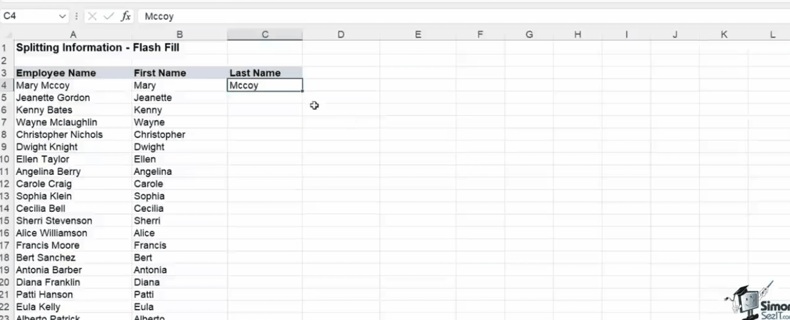

### Save file as template
1. Go to Save As in Excel Template(.xltx) format
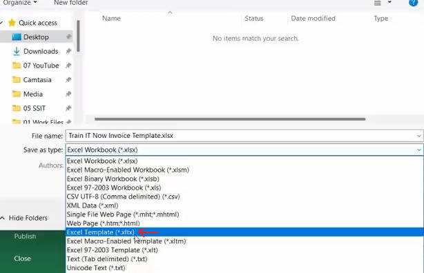
2. You can find you template in **New** tab.

> Save in template make you easy access template for new project without save excel file to keep it in somewhere

### Recover Unsave File
If you pc happen to be collapse because of accident and no time saving the latest progress of excel work, you can use this method.

File tab -> Info tab -> Manage Workbook
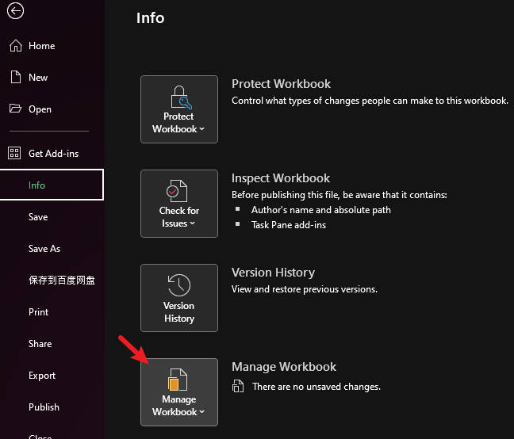

### Keying Word without move to next row
Press CTRL + ENTER when finish typing in cell. This would remain cursor on that cell without move to next row.

### Common Use Function
SUM
COUNT : Only Count Number Cell
COUNTA : Count the cell which no empty
AVERAGE
MIN
MAX

### Duplicate Formula

CTRL + D

**DEMO:**
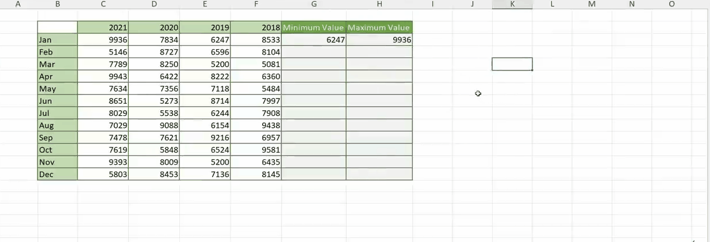

### Show all formula on cells

Check formula if got error:

Formulas tab -> Formula Auditing Section -> Show Formulas
Select error cell -> Formulas tab -> Formula Auditing Section -> Evalueate Formula -> Show Calculate Steps

### Make cell as absolute reference

Example1: if we want make A1 cell as absolute reference, then it will be $A$1.

Example2: =SUM(C1*$A$1)

You can either use shortcut key **F4** to make cell as absolute ref.

### Create Custom List
Ref Timestamp Begining Series 3:00:00

Files Tab -> Options tab -> Advanced tab -> General section -> Edit Custom List -> NEW LIST

### Names Range
Give a definition name to the range of cells. Names Ranges make formula calculation easy.

Example, assign A1 to A12 as 'Prices'

Then you can simply sum this ranges cell by using the name range:
=SUM(Prices) (same as SUM(A1:A12))

> Press F3 to pop out the existing name range for formula function params.

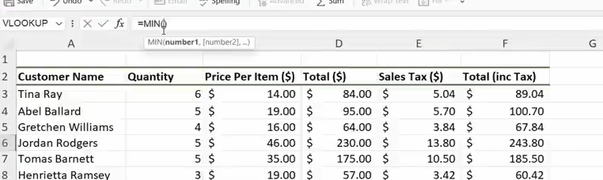

To create name range
1. Select the range of cells
2. Formulas tab -> Defines Names group -> Define Name / Add on **Name Manager** / Create From Selections

### Auto Adjust table(cell) width and hight

Home tab -> Cells Groups -> Format -> Auto Fix Height/Width

### Wrap text

Wrap text mean display long text in fix width.

Home -> Aligment group -> Wrap Text

### Data Validation (Dropdown List)

Data tab -> Data Validations

### Protect Sheet

1. Select the cells you want to protect by CTRL + 1(FORMAT CELL) -> Protection tab -> enable check **Locked**(default checked)
2. Then go to Review tab -> Protect Sheet/Workbook -> Config auth settings


### Hyperlink

Insert tab -> Link Group -> Link
or
CTRL + K

### Excel Table

Move cursor to general table and press **CTRL + T** to convert it to Excel Table

Click any cell of Excel Table, then **Table Design** tab will become visible. You can assign/update table name on this tab.

Let say we have an excel table with the name **Apps_List**

You can select specific table column range data like:
=SUM(APP_LIST[prices])

### Exit functional typing with CTRL+SHIFT+ENTER

In order to make function work correctly, press CTRL + SHIFT + ENTER to exit

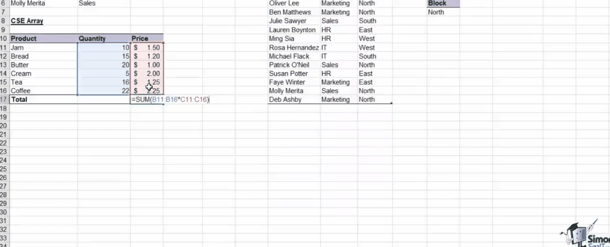

## Logical Statement

### IF

**Sample:**
=IF(*logic*,*[value_if_true]*,*[value_if_false]*)

**Example:**
=IF(1>2,"Correct","Wrong")

The output will be **Wrong**


### AND

**Sample:**
=AND(logic1,logic2,[...logic*])

The output fix in **TRUE** or **FALSE**

Can combine use of **IF** with **AND** to custom the output:
=IF(AND(...*logic*),"Custom message for true state","Custom message for true state")

### OR

**Sample:**
=OR(logic1,logic2,[...logic*])

### Nested IFs

Nested IFs mean set IF statement inside IF statement.

**Sample:**
=IF(logic,[if true],IF(logic,[if true],[if false]))

### IFS

IFS is same like Nested IFs, but this will make more efficient.

**Sample:**
IFS(*logic1*,[*value_if_true*],*logic2*,[*value_if_true2*],...)

### COUNTIF(S) and SUMIF(S) and AVERAGEIF(S)

**1.COUNTIF Sample:**
= COUNTIF(range,criteria)

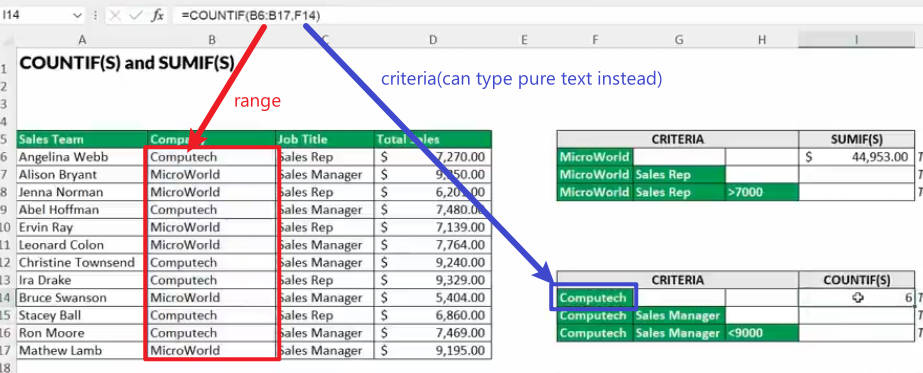

**2 COUNTIF(S) Sample:**
=COUNTIFS(criteria_range1,criteria1,[criteria_range2,criteria2,...])


**3 SUMIF Sample:**
Ref timestamp: Intermediate 1:05:00
= SUMIF(range,criteria,[sum_range])

Sum the specific criteria's total
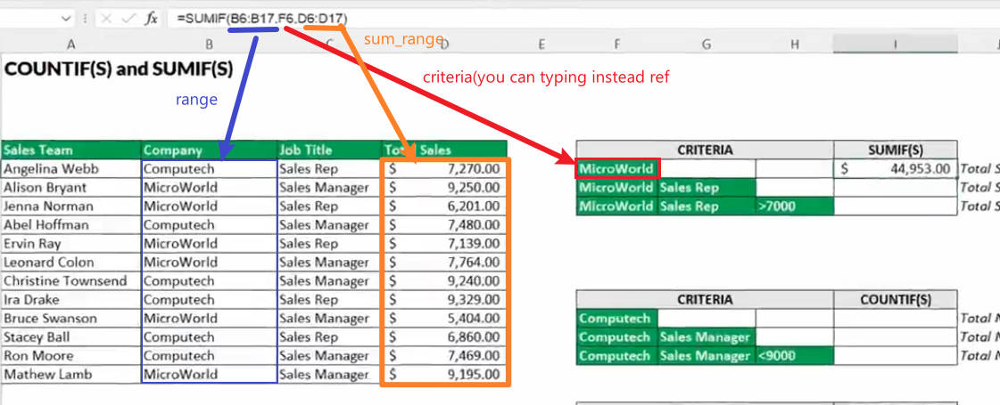

**4 SUMIF(S) Sample:**
=SUMIFS(sum_range,criteria_range1,criteria1,criteria_range2,criteria2,...)
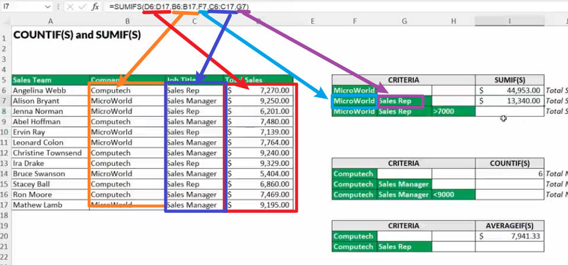


**5 AVERAGEIF Sample:**
=AVERAGEIF(range,criteria,[average_range])

**6 AVERAGEIFS Sample:**
=AVERAGEIFS(average_range,criteria_range1,criteria1,criteria_range2,criteria2,...)

There are more IFS like MINIFS,MAXIFS...

> criteria not just mean text only
> it can be any statement like > 7000

## IFERROR and IFNA


When we doing function calculation, sometime will get error or null value like above screenshot.

To handle this issue, we can use IFERROR and IFNA function

**IFERROR Sample:**
Use to handle all general error which also include null error
=IFERROR(value,value_if_error)

**IFNA Sample:**
Use to handle empty or null value.
=IFNA(value,value_if_na)

## VLOOKUP

**VLOOKUP Sample:**
=VLOOKUP(lookup_value,table_array,col_index_number,[range_lookup])

### Basic Example
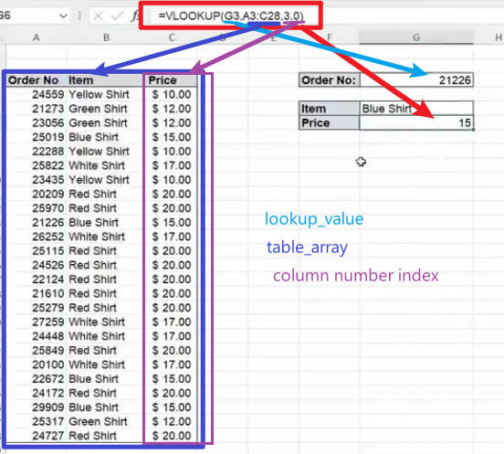

The last argurment in above figure mean:
**0 | FALSE**: Exact match
**1 | TRUE**: Approximate match

### Cross between two tables
**Ref:** Intermediate, 01:38:00

Let say we have two sheet on our workbook.
There a table and we give it a define name as 'Parts_Catalogue'.

Now, we can read table data which in another worksheet with VLOOPUP

**Example:**
=VLOOKUP(lookup_value,Parts_Catalogue,column_index,FALSE)

### VLOOKUP Horizontal - HLOOKUP

Similar to VLookup, just lookup in horizontal way instead.

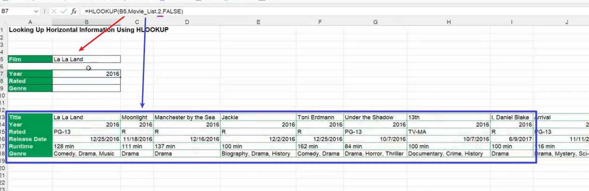

### VLOOKUP Limitation

| Title  | Name  | Id |
|---|---|---|
|  1 | 2  | 3  |
|  3 |  2 | 5  |

Lets say i want lookup a name by specific Id, so the vlookup function will suppose look like:
=VLOOKUP(id_no,table_name,3,0)

**This wont work!**

Because VLOOKUP always start on left to right. Id is in the right side of Name Column, so it cant return Name correctly.

## INDEX & MATCH

INDEX & MATCH use together will solve VLOOKUP limitation.

### INDEX

**INDEX Sample:**
=INDEX(array,row_number)

>array will be the range to return value

### MATCH

**MATCH Sample:**
=MATCH(lookup_value,lookup_array,[match_type])

> match_type options:
> **1**: Less Than
> **0**: Exact match
> **-1**: Greater than

### Combine Use INDEX & MATCH

**SAMPLE:**
=INDEX(array,MATCH(lookup_value,lookup_array,0))

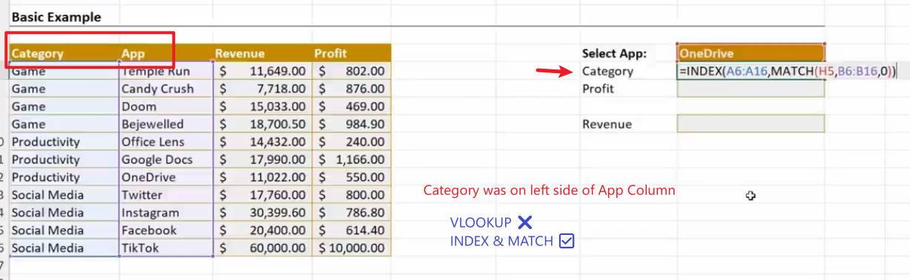

## XLOOKUP and XMATCH

### Basic XLOOKUP
**XLOOKUP SAMPLE:**
=XLOOKUP(lookup_value,lookup_array,return_array,[if_not_found],[match_mode],[search_mode])

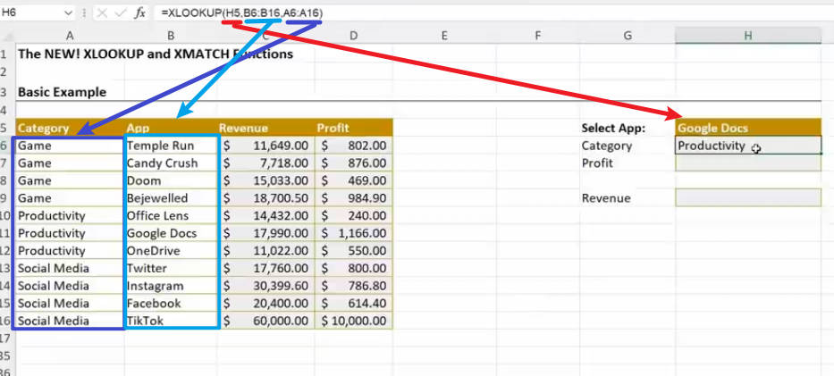

### XMATCH

**SAMPLE:**
=XMATCH(lookup_value,lookup_array,[match_type],[search_mode])

### Combine use INDEX & XMATCH

**SAMPLE:**
=INDEX(return_array,XMATCH(lookup_value,lookup_array,[match_type],[search_mode]))


## Date Function

### Basic Date Functions

**TODAY()** : DATE ONLY
or using shortcut key
CTRL + ;

**NOW()**  : DATE & TIME

> be note add "=" in front of function like =NOW()

**Get current time(only) by using shortcut key:**
CTRL + SHIFT + ;

**DAY(serial_number)**
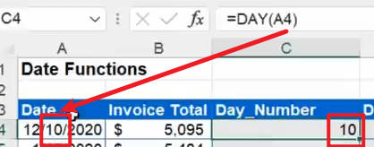

**Exact Day Name from date by using TEXT() function**
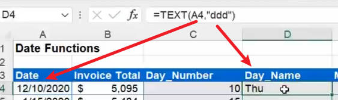
You can exact month(text name) in same way

**MONTH(serial_number)**
Refer DAY()

**YEAR(serial_number)**
Refer DAY()

**WEEKDAY(serial_number,[return_type])**
return type detail
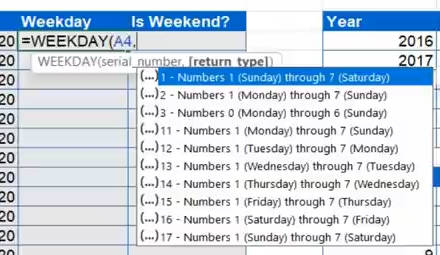

**TIME(hour,minute,second)**

**WORKDAY(start_date,days,[holidays])**
Get date after 5 working day(which mean no include weekend & holidays)
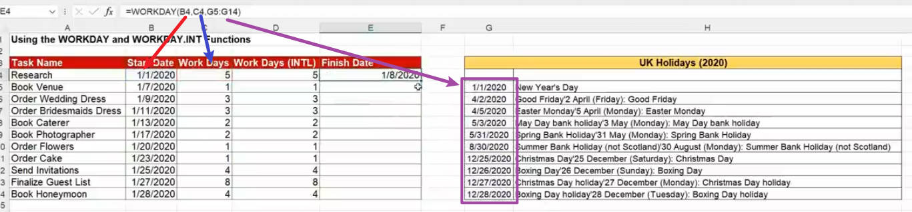

**WORKDAY.INTL(start_date,days,[weekend],[holidays])**
Get international date

**NETWORKDAYS(start_date,end_date,[holidays])**
Get durations(days) between two date which exclude holidays.

**EOMONTH(start_date,month)**
Stand by End of Month
month: Plus month, example if start_date is 23/10/2024 and month is 1, then the output will be 31/11/2024


## Two ways lookup

### Use INDEX & MATCH Example
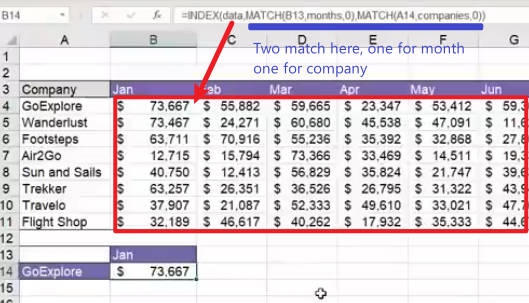

## Use XLOOKUP
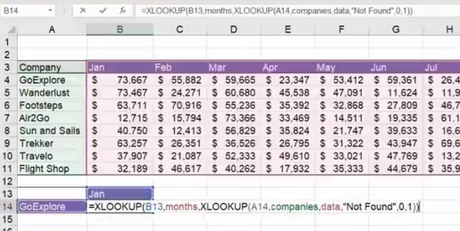


## SWITCH which can replace XLOOKUP in some case

**SAMPLE:**
SWITCH(expression(lookup_value),value1,result1,value2,result2,...)

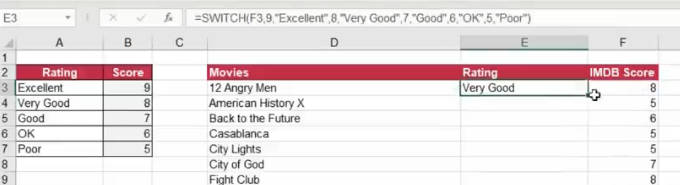

Kind like switch case in programming:
```c
switch any_value:
  case 9:
    return "Excellent"
    break;
  case 8:
    return "Very Good"
    break;
  ...
```

## LARGE & SMALL

### LARGE & MAX
**MAX()** only return the largest values from the range of data.

But what if we want to get second large?

In this case, we can use LARGE() function.

**SAMPLE:**
LARGE(values,max_index)

For example, if **max_index** is:
1: largest value
2: second large
3: third large
...

### SMALL & MIN
Similar to LARGE & MAX case, **SMALL** function are able to return second large and so on values.

**SAMPLE:**
SMALL(values,min_index)

## Ranking Data

### RANK.EQ

**SAMPLE:**
RANK.EQ(number,ref,[order])

**Example:**
=RANK.EQ(B4,B:B(all column))

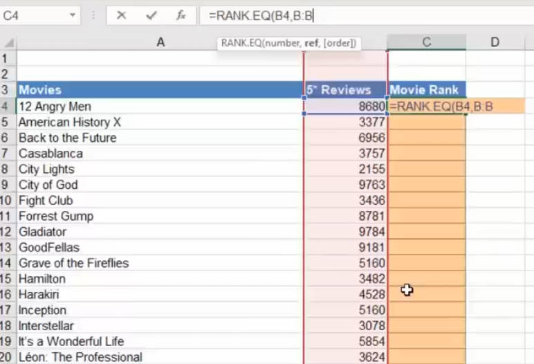
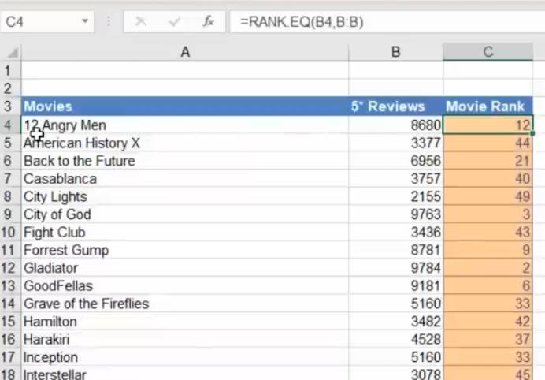

### RANK.EQ Issue
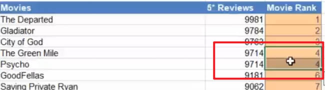

## ROUND

**SAMPLE:**
ROUND(number,digit_number)