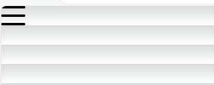
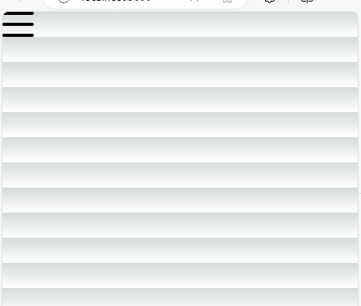
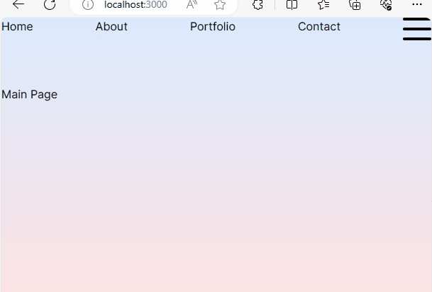
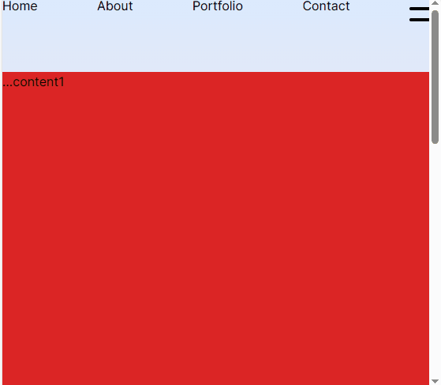
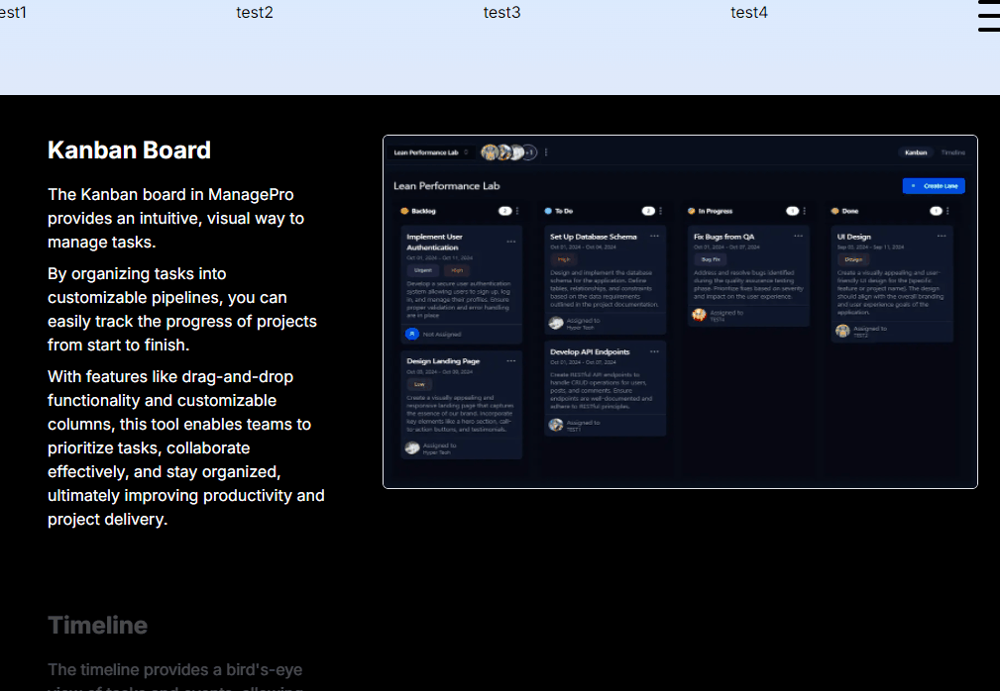
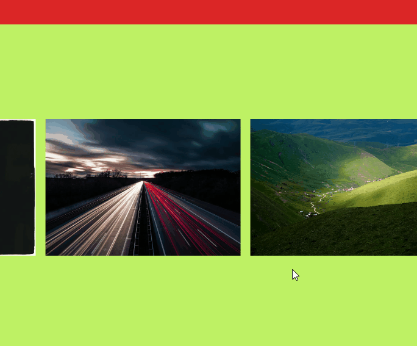
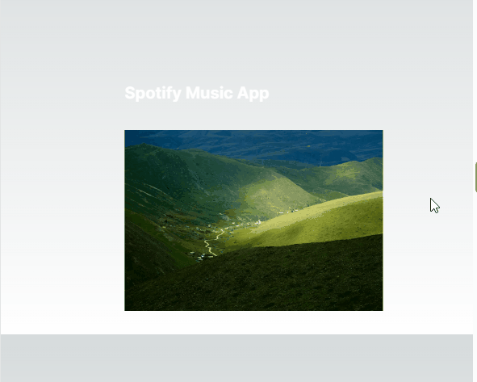
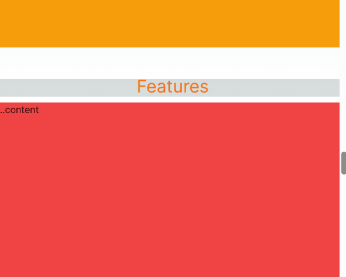
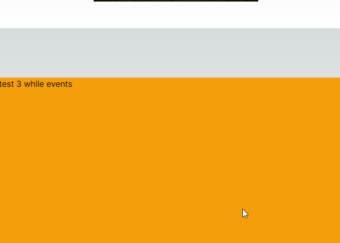

- [Dynamic Navbar Icon](#dynamic-navbar-icon)
- [StaggerChilder：Child叠加效果](#staggerchilderchild叠加效果)
- [Page Transition 1](#page-transition-1)
- [useInView 事件](#useinview-事件)
- [高级的in view效果 - useMotionValueEvent](#高级的in-view效果---usemotionvalueevent)
- [useScroll and useTransform 事件](#usescroll-and-usetransform-事件)
  - [Case 1: Scroll X-axis](#case-1-scroll-x-axis)
  - [Case 2: Scroll opacity](#case-2-scroll-opacity)
- [细解variants](#细解variants)
  - [普通用法](#普通用法)
    - [Case 1: 根据情况切换移动模式](#case-1-根据情况切换移动模式)
    - [Case 2: If else switch](#case-2-if-else-switch)
  - [Inherit variants type for child elements](#inherit-variants-type-for-child-elements)
- [whileInView \& whileHover \& whileTap](#whileinview--whilehover--whiletap)
- [Reverse Progress Bar](#reverse-progress-bar)
- [Transitions](#transitions)
- [Viewport](#viewport)
- [Typing Animation](#typing-animation)


# Dynamic Navbar Icon



```tsx
const [open, setOpen] = useState(false);

 const topVariants = {
    closed: {
      rotate: 0,
    },
    opened: {
      rotate: 45,
      backgroundColor: "rgb(255,255,255)",
    },
  };

  const centerVariants = {
    closed: {
      opacity: 1,
    },
    opened: {
      opacity: 0,
    },
  };

  const bottomVariants = {
    closed: {
      rotate: 0,
    },
    opened: {
      rotate: -45,
      backgroundColor: "rgb(255,255,255)",
    },
  };

  return (
    <button
          className="w-10 h-8 flex flex-col justify-between z-50 relative"
          onClick={() => setOpen((prev) => !prev)}
        >
          <motion.div
            variants={topVariants}
            animate={open ? "opened" : "closed"}
            className="w-10 h-1 bg-black rounded origin-left"
          ></motion.div>
          <motion.div
            variants={centerVariants}
            animate={open ? "opened" : "closed"}
            className="w-10 h-1 bg-black rounded"
          ></motion.div>
          <motion.div
            variants={bottomVariants}
            animate={open ? "opened" : "closed"}
            className="w-10 h-1 bg-black rounded origin-left"
          ></motion.div>
    </button>
  )
```

**解释**
Navbar icon由三个`motion.div`组成，并且各自assign一个`variant`:topVariants,centerVariants,bottomVariants。

变化的原理在于，当`open`状态值变为`true`时，topVariants的部份将会有一个`45`度的旋转，而centerVariant的部分则会隐藏(opacity:0),最后的bottomVariant则是有一个`负45`度的旋转，最后效果就会变成从Navbar icon变成 **X** 的符号。

**注意**：需要给`motion.div` assign 一个`origin-left`的className，否则最后会变成 **>** 符号。

# StaggerChilder：Child叠加效果



```tsx
const listVariants = {
    closed: {
      x: "100vw",
    },
    opened: {
      x: 0,
      transition: {
        when: "beforeChildren", //表示parent先行行动，child需要等parent
        staggerChildren: 0.2,
      },
    },
  };

  const listItemVariants = {
    closed: {
      x: -10,
      opacity: 0,
    },
    opened: {
      x: 0,
      opacity: 1,
    },
  };

  return (
    {open && (
        <motion.div
        variants={listVariants}  //<-- parent
        initial="closed"
        animate="opened"
        className="absolute top-0 left-0 w-screen h-screen bg-black text-white flex flex-col items-center justify-center gap-8 text-4xl z-40"
        >
            {links.map((link) => (
                <motion.div
                variants={listItemVariants} // <-- child
                className=""
                key={link.title}
                >
                <Link href={link.url}>{link.title}</Link>
                </motion.div>
            ))}
        </motion.div>
    )}
  )
```

**解释**
parent部分（listVariants）的初始状态是`closed`，其**x位置是**100vh，而`animate`中的`opened`配置的**x位置是0**，意味着他会从右边移动到原本的位置。

其中`transition`的配置表明，它会比它的child elements前行动，因此可以从动态图看出，它会先显示夜幕，然后依次显示child 列表。

此外，`transition`配置中的`staggerChildren`会自动给其所有的child elements配置一个**移动时长**，不过也可以在listItemVariants配置`duration`选项实现同一种效果:
```tsx
const listItemVariants = {
  closed: {
    x: -10,
    opacity: 0,
  },
  opened: {
    x: 0,
    opacity: 1,
    transition: {
      duration: 0.2,
    },
  },
};
```

# Page Transition 1



**transitionProvider.tsx**
```tsx
const TransitionProvider = ({ children }:{children:React.ReactNode}) => {
const pathName = usePathname();

 return(
    <AnimatePresence mode="wait">
        <div
            key={pathName}
            className="w-screen h-screen bg-gradient-to-b from-blue-100 to-red-100"
        >
            <motion.div
            className="h-screen w-screen fixed bg-black rounded-b-[100px] z-40"
            animate={{ height: "0vh" }}
            exit={{ height: "140vh" }}
            transition={{ duration: 2, ease: "easeOut" }}
            />

            <motion.div
            className="fixed m-auto top-0 bottom-0 left-0 right-0 text-white text-8xl cursor-default z-50 w-fit h-fit"
            initial={{ opacity: 1 }}
            animate={{ opacity: 0 }}
            exit={{ opacity: 0 }}
            transition={{ duration: 2, ease: "easeOut" }}
            >
                {pathName.substring(1)}
            </motion.div>

            <motion.div
            className="h-screen w-screen fixed bg-red-600 rounded-t-[100px] bottom-0 z-30"
            initial={{ height: "140vh" }}
            animate={{ height: "0vh", transition: { delay: 2,duration:2 } }}
            />

            <div className="h-24">
                <Navbar />
            </div>
            <div className="h-[calc(100vh-6rem)]">{children}</div>
        </div>
    </AnimatePresence>
 )
};
```

**layout.tsx**
```tsx
<body className={inter.className}>
    <TransitionProvider>{children}</TransitionProvider>
</body>
```

**_anypage.tsx**
```tsx
// use client required for animatePresence
"use client";

import { motion } from "framer-motion";

export default function _anypage() {
  return (
    <motion.div
      className="h-full"
      initial={{ y: "-200vh" }}
      animate={{ y: "0%" }}
      transition={{ duration: 4 }}
    >
    Page Name here
    </motion.div>
  );
}
```


**理解**
共计四个动作，三个由AnimatePresence触发，另一个由进入页面时本身页面触发的另一个动作。
`transitionProvider`包含的`AnimatePresence`组件会在页面切换时触发。
触发的效果动作有三个：
- 从上到下拉出一个黑幕(exit),然后再从下到上收缩（animate）
- 在中间位置显出当前网址的页面，然后淡出
- 最后显示往下拉的效果

最后的动作有页面本身触发。
帷幕往下拉是AnimatePresence的最后的动作，与此同时，将页面elements wrapping在一个motion.div下，然后实现从上往下移动的效果，最后形成了页面元素随着帷幕往下移动的效果。


# useInView 事件



```tsx
const testRef = useRef<HTMLDivElement>(null);
const isRefInView = useInView(testRef, { margin: "-100px"});

return (
    <div>
        <div className="h-screen w-screen flex bg-red-600">
            ...content1
        </div>
        <div className="h-80 w-screen flex bg-lime-300">
            ...content2
        </div>
      
        <div className="flex" ref={testRef}>
            <motion.div
            initial={{x:"-300px",opacity:0}}
            animate={isRefInView ? {x:0,opacity:1} : {}}
            transition={{duration:2,ease:"easeIn",repeat:0}}
            >
            <div className="rounded p-2 bg-black text-white">
                smooth element
            </div>
            </motion.div>
        </div>

        <div className="h-96 w-screen flex bg-amber-500">
        ...content3
      </div>
    </div>
)
```

# 高级的in view效果 - useMotionValueEvent


```tsx
  const content = [1,2,3,4,5,6]
  const [activeCard, setActiveCard] = React.useState(0);
  const ref = useRef<any>(null);
  const { scrollYProgress } = useScroll({
    target: ref,
    offset: ["start start", "end start"],
  });
  const cardLength = content.length;

  useMotionValueEvent(scrollYProgress, "change", (latest) => {
    const cardsBreakpoints = content.map((_, index) => index / cardLength);
    const closestBreakpointIndex = cardsBreakpoints.reduce(
      (acc, breakpoint, index) => {
        const distance = Math.abs(latest - breakpoint);
        if (distance < Math.abs(latest - cardsBreakpoints[acc])) {
          return index;
        }
        return acc;
      },
      0
    );
    setActiveCard(closestBreakpointIndex);
  });
```

**解释**
- 它跟上个useInView不一样的点在于，它提供一个能够追踪Y的**变数(activeCard)**。
- 使用这种追踪性的变数使我们能够控制的范围变得更加灵活

# useScroll and useTransform 事件

## Case 1: Scroll X-axis


```tsx
const ref = useRef<HTMLDivElement>(null);
const { scrollYProgress } = useScroll({ target: ref });
const x = useTransform(scrollYProgress, [0, 1], ["0%", "-80%"]);

  return (
    <motion.div
      className="h-full"
      initial={{ y: "-200vh" }}
      animate={{ y: "0%" }}
      transition={{ duration: 4 }}
    >
      <div className="h-[600vh] relative" ref={ref}>
          <div className="w-screen h-[calc(100vh-6rem)] flex items-center justify-center text-8xl text-center">
            Slide Display
          </div>
          <div className="sticky top-0 flex h-screen gap-4 items-center overflow-hidden">
            <motion.div style={{ x }} className="flex">
              <div className="h-screen w-screen flex items-center justify-center bg-gradient-to-r from-purple-300 to-red-300" />
              {items.map((item) => (
                <div
                  className={`h-screen w-screen flex items-center justify-center`}
                  key={item.id}
                >
                  <div className="flex flex-col gap-8 text-white">
                    <h1 className="text-xl font-bold md:text-4xl lg:text-6xl xl:text-8xl">
                      {item.title}
                    </h1>
                    <div className="relative w-80 h-56 md:w-96 md:h-64 lg:w-[500px] lg:h-[350px] xl:w-[600px] xl:h-[420px]">
                      <Image src={item.img} alt="" fill />
                    </div>
                  </div>
                </div>
              ))}
            </motion.div>
          </div>
        </div>
        <div className="h-96 w-screen flex bg-amber-500">
          ...content
        </div>
    </motion.div>
  );
```

**解释**
这段代码使用 `useTransform` 函数，它来自 `framer-motion` 库。这个函数用于将一个输入范围映射到一个输出范围，这里的输入范围是 `scrollYProgress`，范围是 `[0, 1]`，表示滚动条的位置从顶部到底部的范围，输出范围是 `["0%", "-80%"]`，表示被转换后的值。这意味着当滚动条在顶部时，x 的值为 `"0%"`，当滚动条在底部时，x 的值为 `"-80%"`。

通常情况下，这种技术被用来在滚动时控制元素的动画。在这个例子中，x 可能会被用来控制元素的水平偏移。当滚动条在顶部时，x 的值为 "0%"，元素不偏移；当滚动条在底部时，x 的值为 "-80%"，元素水平偏移 -80% 的距离。

**注意**：负数代表从左到右，正数则相反。

## Case 2: Scroll opacity


``` tsx
const TextWrapper = ({ children }: { children: React.ReactNode }) => {
  const text = useRef<HTMLDivElement>(null);

  const { scrollYProgress } = useScroll({
    target: text,
    offset: ["start end", "end start"],
  });

  const opacity = useTransform(scrollYProgress, [1, 0.8, 0], [1, 1, 0]);
  const x = useTransform(scrollYProgress, [1, 0.4, 0], [0, 0, -1000]);

  return (
    <div ref={text}>
      <motion.h1 className="text-2xl space-y-8 font-extrabold" style={{ opacity, x }}>{children}</motion.h1>
    </div>
  );
};

const AnyPage = () =>{
  return (
     {[0, 1, 2, 3, 4, 5, 6].map((x) => (
        <TextWrapper>
            Lorem ipsum dolor, sit amet consectetur adipisicing
        </TextWrapper>
      ))}
  )
}
```

**解释**
- **"start end", "end start"**：动画会在元素完全进入视口并完全离开视口时进行。
- 这里使用useScroll和useTransform来做显示和移动的效果
- scrollYProgress 在 [1, 0.8, 0] 的区间内，**opacity** 在 [1, 1, 0] 之间变化,说明进入视角时透明度会是1（显示），离开视角时则是0（变透明）
- scrollYProgress 在 [1, 0.4, 0] 的区间内，**x** 从 0 变为 -1000。这说明在视角内时它的位置是0（原本的位置），离开视角时则会往左边移动（隐藏起来）


# 细解variants

## 普通用法

### Case 1: 根据情况切换移动模式
```tsx
  const variants = {
    type1: {
      opacity:0 
    },
    type2: {
      opacity:1
      transition:{
        duration:2
      }
    },
  };

  return (
    <motion.div
      variants={variants}
      initial="type1"
      whileInView="type2"
      //animate="type2"
    ></motion.div>
  )
```

### Case 2: If else switch
```tsx
  const [trigger, setTrigger] = useState(false);

  return (
  <motion.div
      variants={variants}
      initial="type1"
      animate={trigger ? "type1":"type2"}
    ></motion.div>
  )
```

## Inherit variants type for child elements
```tsx
  const [trigger, setTrigger] = useState(false);

  const childVariants1 = {
    type1: {
      opacity:0 
    },
    type2: {
      opacity:1
      transition:{
        duration:2
      }
    },
  };

   const childVariants2 = {
    type1: {
      x:-1000 
    },
    type2: {
      x:0
      transition:{
        duration:2
      }
    },
  };

  const grandChildVariants = {
    type1:{},
    type2:{}
  }

  return (
  <motion.div
      animate={trigger ? "type1":"type2"}
      //initial="type1
      //whileInView="type2"
    >

      <motion.div variants={childVariants1}>
        child1
      </motion.div>
      <motion.div variants={childVariants2}>
        child2
        <motion.div variants={grandChildVariants}>
          grandchild
        </motion.div>
      </motion.div>

    </motion.div>
  )
```

**注意**：所有variants的类型需要对应**父元素**指定的类型。当**父元素**类型变化，会**联动其子辈**有着同样类型的动作。


# whileInView & whileHover & whileTap


```tsx
<motion.h1
    className="cursor-pointer"
    initial={{ opacity: 0 }}
    whileInView={{ opacity: 1 }}
    transition={{ duration: 3 }}
    whileHover={{scale:1.1,color:"red",x:10,y:30}}
    whileTap={{scale:0.85,color:"blue"}}>test 3 while events
</motion.h1>
```

# Reverse Progress Bar

```tsx
  const progressRef = useRef<HTMLDivElement>(null);

  const { scrollYProgress: progressScroll } = useScroll({
    target: progressRef,
    offset: ["end end", "start start"],   //take note here, it make progress bar play in reverse
  });

  const scaleX = useSpring(progressScroll, {
    stiffness: 100,
    damping: 30,
  });

  return (
    <div className="relative" ref={progressRef}>
        <div className="sticky top-0 left-0 pt-12 text-center text-orange-500 text-3xl">
          <h1>Features</h1>
          <motion.div
            style={{ scaleX }}
            className="h-[10px] bg-white"
          ></motion.div>
        </div>
        <div className="h-96 w-screen flex bg-red-500">...content</div>
        <div className="h-96 w-screen flex bg-gray-400">...content</div>
        <div className="h-96 w-screen flex bg-lime-300">...content</div>
      </div>
  )
```

# Transitions
Transition can accept props that define which type of animation to use a `Tween`, `Spring` or `Inertia`

```tsx
<motion.div
  animate={{ x: 100 }}
  transition={{ type: "spring", stiffness: 100 }}
/>

transition={{
  ease: "linear",
  duration: 2,
  x: { duration: 1 }
}}
```

> **stiffness（刚度）和** **damping**（阻尼）是影响`弹簧(spring)`动画行为的两个重要参数：
> **Stiffness（刚度）：** 它控制着动画的速度和形状。刚度越高，动画的弹簧效果就越明显，动画速度越快。较高的刚度值会使动画更快地接近目标状态。
> **Damping（阻尼）：** 它控制着动画的振荡和过渡的持续时间。阻尼越高，动画的振荡就越小，过渡到目标状态的时间也越长。较高的阻尼值会减缓动画的速度，并减少动画的振荡

# Viewport

```tsx
 <motion.div
        variants={staggerContainer}
        initial="hidden"
        whileInView="show"
        viewport={{ once: false, amount: 0.25 }}
      >
```

The `viewport` property in this code snippet is used to specify the behavior of the animation in relation to the `viewport` (the visible portion of the web page in the browser).

**once**: This property determines whether the animation should only occur once when it comes into the `viewport` (**true**) or if it should occur each time it comes into view (**false**). In this case, it is set to false, which means the animation will occur every time it comes into view.
**amount**: This property specifies the percentage of the `viewport` that should be visible for the animation to trigger. In this case, amount is set to **0.25**, meaning that when at least **25%** of the motion element is visible in the `viewport`, the animation will start.

# Typing Animation



```tsx
  const textContainer = {
    hidden: {
      opacity: 0,
    },
    show: (i = 1) => ({
      opacity: 1,
      transition: { staggerChildren: 0.1, delayChildren: i * 0.1 },
    }),
  };

  const textVariant2 = {
    hidden: {
      opacity: 0,
      y: 20,
    },
    show: {
      opacity: 1,
      y: 0,
      transition: {
        type: 'tween',
        ease: 'easeIn',
      },
    },
  };

  return (
     <motion.p
            variants={textContainer}
            initial="hidden"
            whileInView="show"
            className={`font-normal text-[14px] text-secondary-white`}
          >
        {Array.from("content typing here...").map((letter, index) => (
          <motion.span variants={textVariant2} key={index}>
            {letter === " " ? "\u00A0" : letter}
          </motion.span>
        ))}
      </motion.p>
  )
```

**解释**
在 show 变体中，定义了以下动画效果：

**opacity**: 1: 将子元素的不透明度设置为 1，从隐藏变为显示。

**transition**: { staggerChildren: 0.1, delayChildren: i * 0.1 }: 这里使用了 transition 属性来定义子元素动画的过渡效果。`staggerChildren`: 0.1 表示子元素之间的动画延迟时间为 0.1 秒，`delayChildren`: i * 0.1 表示每个子元素动画开始的延迟时间，延迟时间会随着子元素的顺序而增加，即第一个子元素延迟 `0.1` 秒，第二个子元素延迟 `0.2` 秒，以此类推。
这样设置后，子元素会一个接一个地显示，并且它们之间会有一定的延迟时间，以创建出错落的动画效果。