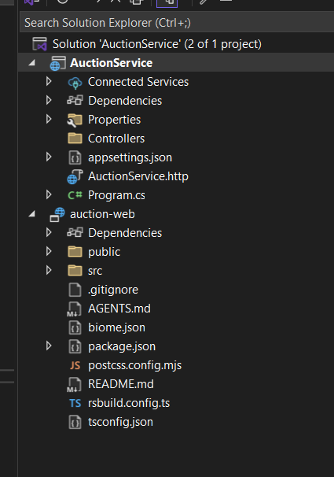

## Add React application into the .sln



1. Create the .esproj file in auction-web folder
Create a new file named auction-web.esproj in your auction-web folder with this content:

```xml
<Project Sdk="Microsoft.VisualStudio.JavaScript.Sdk/1.0.2752196">
  <PropertyGroup>
    <StartupCommand>npm run dev</StartupCommand>
    <JavaScriptTestRoot>src\</JavaScriptTestRoot>
    <JavaScriptTestFramework>Vitest</JavaScriptTestFramework>
    <!-- Allows the build (or compile) script located on package.json to run on Build -->
    <ShouldRunBuildScript>false</ShouldRunBuildScript>
    <!-- Folder where production build objects will be placed -->
    <BuildOutputFolder>$(MSBuildProjectDirectory)\dist</BuildOutputFolder>
  </PropertyGroup>
</Project>
```

2. Add to solution using .NET CLI
```
dotnet sln auctionservice.sln add auction-web/auction-web.esproj
```

3. Alternative: Add through Visual Studio
- In Solution Explorer, right-click the solution
- Go to Add → Existing Project...
- Navigate to auction-web folder and select auction-web.esproj
- Click Open