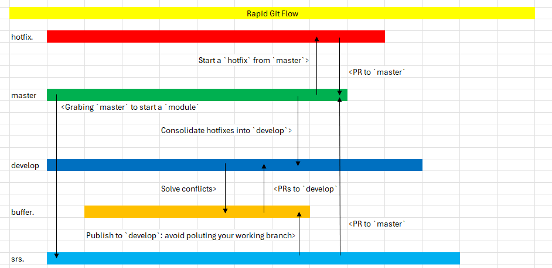

# 关于2025年对于GIT的感悟

在以往的公司里，GIT的使用是很粗暴直接的，开发团队往往在`master` branch里直来直去，完全不会考虑commit上去的代码质量是否达标。

我当前的公司，代码方面则更看重。我花了一点时间整理了最近常使用的GIT指令。

## Git stash
```shell
git stash
git stash list
git stash pop
git stash apply
git stash drop
```

这是一个临时的**储藏区**，将你当前正在修改或进行中的代码，放去储藏区，让你的工作环境变`干净`。使用这个指令通常都会有以下的场景：
- 需要从远端pull最新的commit，放去储藏区可以避免冲突的发生
- 或者事发突然你需要切换到其他分支做其他事情，却又不想把半成品的代码commit上去，储藏区会是这情景的方案之一
- 你也能将这个储藏区当做一个收藏`template`的区域，例如测试用的伪代码，你不希望伪代码commit，但是每次当地开发时则需要它们。比起每次重复复制剪贴，直接从储藏区抓取会更有效率。

## Git rebase
这个指令会把你指定的分支作为`基底`改到另一个分支上。

例如我正在开发新的需求，因此我基于`master`的分支创建了`function1`的分支。然后，我在`function1`这个分支发布了十几条的commits，后来发现，`master`分支有新的commit，而当前`function1`并不含新的commits。

这时你有两个选项，要么使用`merge`,要么就是使用`rebase`。

这里我们专注`rebase`。使用`rebase`的好处
- 你的提交历史会非常干净直观，你的提交将会在`master`branch的提交之上排列，没有一大堆分叉混乱的合并。

**用法**
```bash
git checkout function1
git rebase origin/master
git push -f origin function # 推送到远端

# 这里假设你提交了很多东西
git add .
git commit -m "example"
git push origin function

# 在这个时间段，master branch有了新的提交
git stash # 你可以stash，也可以先提交
git rebase origin/master
git stash pop
git add .
git commit -m "example2"
git push -f origin function1
```

**重点**
git rebase最好不要在多人协作的分支使用。还有，对于提交记录过多的分支来说，rebase会很慢。。。它会在基底上一个一个重复提交你原本的提交。

## Git reset

Reset这个词当初让我很忌惮使用这个指令，害怕弄错什么把我的东西全部给抹掉了。

不过真的使用后，发现并没有很吓人，当然如果误用的话，还是会把你的提交记录抹掉就是。 <_<

下面说说我个人的使用史：

发生背景为3个分支，分别是 `feature1`, `develop`和 `buffer/feature1`

`buffer/feature1`是`feature1`和`develop`的中间区，主要是避免`feature1`会因为`develop`分支的提交而被污染。

作为中间区的`buffer/feature1`只有一个作用 —— 经常性抓取`feature1` 和 `develop` 分支的最新提交确保它在两者之间保持同步。

通常，我们会使用merge的方式来抓取提交，可是这样做，提交历史将会变得混乱不堪。

```bash
git checkout buffer/feature1
git rebase origin/develop

# 假设这里 feature1 和 develop有新的提交记录
git merge origin feature1 ❌
git merge origin develop ❌
```

如果每次都有新的提交，然后每一次都需要merge的话，你将会疲于做合并的动作，提高错误的发生概率。

```bash
git checkout buffer/feature1
git rebase origin/develop

# 假设这里 feature1 和 develop有新的提交记录
git reset --hard feature1 # 将基点设置为feature1的提交记录
git rebase origin/develop
git push -f origin buffer/feature1
```

**重点：**
git reset最好也不要在多人协作的分支上使用。

## Git Cherry Pick
如果两个分支中，一个分支有新的提交，另一个则没有，这种情况下使用`git reset`+`git rebase`让我考虑是否能通过一个指令来实现抓取的动作。

后来我知道了`cherry-pick`这个东西。它的作用也很简单，抓取`特定`的提交记录到你要的分支里。

```bash
git cherry-pick <commit-id>
```

通过使用`cherry-pick`,对于一些小更新来说，直接一个指令抓取对我来说会更方便。

`cherry-pick`还有一个值得一提的用法。


`buffer/feature1`作为中间区，它不该用来用来做任何提交的。不过有一次，我不小心把`buffer/feature1`误认为`feature1`的分支而做了提交。

这情况，`cherry-pick`就可以解决这个问题

```bash
git checkout feature1
git cherry-pick <commit-id> # from buffer/feature1
```

## 流程总结

```sh
git fetch origin

git checkout feature1

git rebase origin/master

git rebase --continue # 如果出现冲突时，先处理冲突部分，然后再执行这个指令继续处理rebase的process。每次冲突出现，就要执行这个指令

git push -f origin feature1
# or
git push origin feature1 --force-with-lease

# 如果master有新的提交
git rebase origin/master
git push -f origin feature1
```

## Extra 1: Git Merge
`develop`的分支是一个由`buffer`多分支组成的分支。

也就是说，它的更新频率非常高，经常会有新的`PR`合并。

这时候我们在推`PR`时(在buffer 分支)，我们需要先抓取`develop`分支的提交融入进来，同时还要将`srs.新功能`分支的最新提交加入进来。

对于这种一个分支涉及多个分支的情况，这里更推荐使用`merge`而不是`rebase`。

例子：
```sh
git fetch origin

git checkout develop

git pull origin develop

git checkout srs.ubpi

git pull origin srs.ubpi

git checkout buffer/srs.ubpi

# 这里可以用reset --hard srs.ubpi回到干净的基底(推荐)
# 或者
# 使用 merge ： git merge srs.ubpi

git merge srs.ubpi

git merge develop
# resolve conflicts in files
git add .
git commit
git push origin buffer/srs.ubpi
```

## Extra 2: Git Config

```sh
git log --all --decorate --oneline --graph
```

我经常会使用上面的指令来获取更改历史，唯一的问题就是——太长了。

而git的config指令是能够将你的指令设置在一个`alias`中，从而缩短指令。

例如，你可以将上述的指令设置到`adog`的**alias**中
```sh
git config --global alias.adog "log --all --decorate --oneline --graph"
```

然后只需要执行以下指令就能实现同样的效果:
```sh
git adog
```