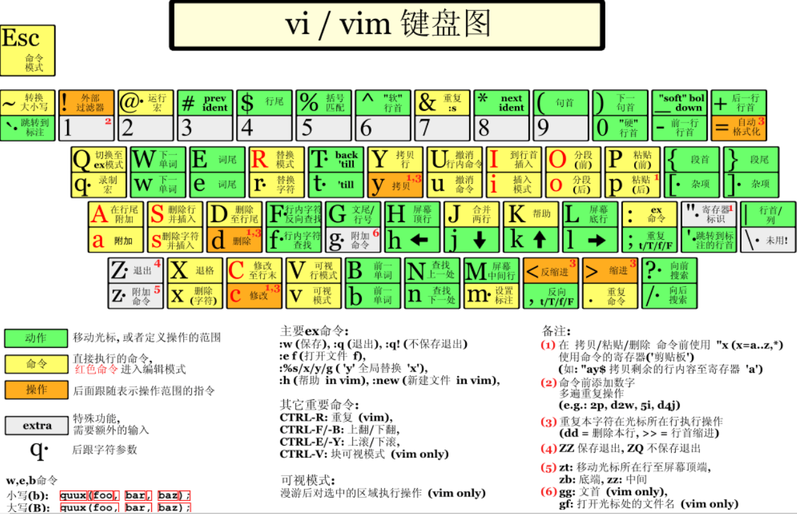
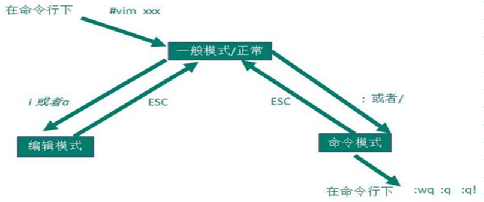

[Reference Link](https://blog.csdn.net/da_ge_de_nv_ren/article/details/128391575)

- [🧾目录结构](#目录结构)
- [🧾VI/VIM](#vivim)
  - [一般模式](#一般模式)
  - [编辑模式](#编辑模式)
  - [命令模式](#命令模式)
- [🌐网络配置](#网络配置)
  - [常用命令](#常用命令)
    - [📚 ifconfig](#-ifconfig)
    - [📚ping](#ping)
  - [修改静态IP](#修改静态ip)
  - [修改主机名](#修改主机名)
  - [远程登录](#远程登录)
- [💻系统管理](#系统管理)
  - [常用命令](#常用命令-1)
    - [📚 service命令 (CentOS6)](#-service命令-centos6)
    - [📚 systemctl命令](#-systemctl命令)
    - [📚setup命令](#setup命令)
    - [📚chkconfig命令](#chkconfig命令)
    - [📚firewall-cmd命令](#firewall-cmd命令)
- [运行级别](#运行级别)
- [防火墙开闭](#防火墙开闭)
- [关机重启命令](#关机重启命令)
  - [📚shutdown命令](#shutdown命令)
  - [📚sync命令](#sync命令)
  - [📚halt命令](#halt命令)
  - [📚poweroff命令](#poweroff命令)
  - [📚reboot命令](#reboot命令)
- [💼常用命令](#常用命令-2)
  - [\> 输出重定向和 \>\> 追加](#-输出重定向和--追加)
  - [帮助常用命令](#帮助常用命令)
    - [📚man命令](#man命令)
    - [📚help命令](#help命令)
    - [📚type命令](#type命令)
    - [📚clear命令](#clear命令)
    - [📚reset命令](#reset命令)
    - [📚tset命令](#tset命令)
  - [文件常用命令](#文件常用命令)
    - [📚pwd命令](#pwd命令)
    - [📚cd命令](#cd命令)
    - [📚ls命令](#ls命令)
    - [📚mkdir命令](#mkdir命令)
    - [📚rmdir命令](#rmdir命令)
    - [📚rm命令](#rm命令)
    - [📚cp命令](#cp命令)
    - [📚mv命令](#mv命令)
    - [📚cat命令](#cat命令)
    - [📚more命令](#more命令)
    - [📚less命令](#less命令)
    - [📚echo命令](#echo命令)
    - [📚head命令](#head命令)
    - [📚tail命令](#tail命令)
    - [📚ln命令](#ln命令)
    - [📚history命令](#history命令)
  - [时间日期常用命令](#时间日期常用命令)
    - [📚date命令](#date命令)
    - [📚cal命令](#cal命令)
  - [用户管理常用命令](#用户管理常用命令)
    - [📚useradd命令](#useradd命令)
    - [📚passwd命令](#passwd命令)
    - [📚su命令](#su命令)
    - [📚who命令](#who命令)
    - [📚userdel命令](#userdel命令)
    - [📚sudo命令](#sudo命令)
    - [📚usermod命令](#usermod命令)
  - [用户组管理常用命令](#用户组管理常用命令)
    - [📚groupadd命令](#groupadd命令)
    - [📚groupdel命令](#groupdel命令)
    - [📚groupmod命令](#groupmod命令)
  - [文件基本属性](#文件基本属性)
  - [文件权限常用命令](#文件权限常用命令)
    - [📚chmod命令](#chmod命令)
    - [📚chown命令](#chown命令)
    - [📚chgrp命令](#chgrp命令)
  - [搜索文件常用命令](#搜索文件常用命令)
    - [📚find命令](#find命令)
    - [📚updatedb命令](#updatedb命令)
    - [📚locate命令](#locate命令)
    - [📚which命令](#which命令)
    - [📚whereis命令](#whereis命令)
    - [📚grep命令](#grep命令)
  - [解压缩常用命令](#解压缩常用命令)
    - [📚gzip命令](#gzip命令)
    - [📚gunzip命令](#gunzip命令)
    - [📚zip命令](#zip命令)
    - [📚unzip命令](#unzip命令)
    - [📚tar命令](#tar命令)
  - [磁盘和分区常用命令](#磁盘和分区常用命令)
    - [📚tree命令](#tree命令)
    - [📚du命令](#du命令)
    - [📚free命令](#free命令)
    - [📚lsblk](#lsblk)
    - [📚mount命令](#mount命令)
    - [📚umount命令](#umount命令)
    - [📚fdisk命令](#fdisk命令)
    - [📚cfdisk命令](#cfdisk命令)
    - [📚mkfs命令](#mkfs命令)
  - [进程管理常用命令](#进程管理常用命令)
    - [📚ps命令](#ps命令)
    - [📚kill命令](#kill命令)
    - [📚pstree命令](#pstree命令)
    - [📚top命令](#top命令)
    - [📚netstat命令](#netstat命令)
  - [定时常用命令](#定时常用命令)
    - [📚crontab命令](#crontab命令)
  - [软件包管理](#软件包管理)
    - [📚rpm命令](#rpm命令)
    - [📚yum命令](#yum命令)
  - [🌐 SHELL编程](#-shell编程)
    - [编写shell脚本](#编写shell脚本)
    - [脚本的常用执行方式](#脚本的常用执行方式)
    - [变量](#变量)
    - [Shell 注释](#shell-注释)
    - [shell字符串](#shell字符串)
    - [传递参数](#传递参数)
    - [Shell 数组](#shell-数组)
    - [运算符](#运算符)
    - [echo命令](#echo命令-1)
    - [read 命令](#read-命令)
    - [printf 命令](#printf-命令)
    - [test 命令](#test-命令)
    - [IF判断](#if判断)
    - [for 循环](#for-循环)
    - [until 循环](#until-循环)
    - [case 语句](#case-语句)
    - [break 和 continue](#break-和-continue)
    - [函数](#函数)
      - [basename](#basename)
      - [dirname](#dirname)
      - [自定义函数](#自定义函数)
    - [输入/输出重定向](#输入输出重定向)
    - [简单正则使用](#简单正则使用)
    - [文本处理](#文本处理)
      - [cut 命令](#cut-命令)
      - [文件包含](#文件包含)
      - [sed 命令](#sed-命令)
      - [awk命令](#awk命令)


# 🧾目录结构

- 👉/bin： Binary的缩写。存放系统命令，普通用户和 root 都可以执行。放在 /bin 下的命令在单用户模式下也可以执行。
 - 👉/boot： 这里存放的是启动 Linux 时使用的一些核心文件，包括一些连接文件以及镜像文件。
 - 👉/dev： Device的缩写。该目录下存放的是 Linux 的外部设备，在 Linux 中访问设备的方式和访问文件的方式是相同的。
 - 👉/etc： Etcetera的缩写。这个目录用来存放所有的系统管理所需要的配置文件和子目录。
 - 👉/home： 用户的主目录，在 Linux 中，每个用户都有一个自己的目录，一般该目录名是以用户的账号命名的。
 - 👉/lib： Library的缩写。这个目录里存放着系统最基本的动态连接共享库，其作用类似于 Windows 里的 DLL 文件。几乎所有的应用程序都需要用到这些共享库。
 - 👉/lib64： 64位相关的库会放在这。
 - 👉/media： linux 系统会自动识别一些设备，例如U盘、光驱等等，当识别后，Linux 会把识别的设备挂载到这个目录下。
 - 👉/mnt： 系统提供该目录是为了让用户临时挂载别的文件系统的，我们可以将光驱挂载在 /mnt/ 上，然后进入该目录就可以查看光驱里的内容了。
 - 👉/opt： optional的缩写。这是给主机额外安装软件所摆放的目录。
 - 👉/proc： Processes的缩写。/proc 是一种伪文件系统（也即虚拟文件系统），存储的是当前内核运行状态的一系列特殊文件，这个目录是一个虚拟的目录，它是系统内存的映射，我们可以通过直接访问这个目录来获取系统信息。这个目录的内容不在硬盘上而是在内存里
 - 👉/root： 该目录为系统管理员，也称作超级权限者的用户主目录。
 - 👉/run： 运行目录
 - 👉/sbin： s 就是 Super User 的意思，是 Superuser Binaries (超级用户的二进制文件) 的缩写，这里存放的是系统管理员使用的系统管理程序。
 - 👉/srv： 该目录存放一些服务启动之后需要提取的数据。
 - 👉/sys： 虚拟文件系统。和 /proc/ 目录相似，该目录中的数据都保存在内存中，主要保存与内核相关的信息
 - 👉/tmp： temporary的缩写这个目录是用来存放一些临时文件的。
 - 👉/usr： unix system resources缩写。用于存储系统软件资源。
 - 👉/var： 用于存储动态数据，例如缓存、日志文件、软件运行过程中产生的文件等

# 🧾VI/VIM
VI是Unix操作系统和类Unix操作系统中最通用的文本编辑器。
VIM编辑器是从VI发展出来的一个性能更强大的文本编辑器。可以主动的以字体颜色辨别语法的正确性，方便程序设计。VIM 与VI编辑器完全兼容。

 基本上 vi/vim 共分为三种模式，分别是一般模式，编辑模式和命令模式。
 
 
 ## 一般模式
 刚刚启动 vi/vim，便进入了一般模式(默认模式)。此状态下敲击键盘动作会被Vim识别为命令，而非输入字符。在此模式可以复制黏贴，删除等操作。若想要编辑文本，进入一般模式，按下i，切换到编辑模式。

 | 按键      | 说明                                                  |
 | --------- | ----------------------------------------------------- |
 | x         | 向后删除一个字符，相当于 del                          |
 | X         | 向前删除一个字符，相当于 backspace                    |
 | nx        | n 为数字，连续向后删除 n 个字符                       |
 | dd        | 删除游标所在的那一整行(常用)                          |
 | ndd       | n 为数字。删除光标所在的向下 n 行                     |
 | d1G       | 删除光标所在到第一行的所有数据                        |
 | dG        | 删除光标所在到最后一行的所有数据                      |
 | d$        | 删除游标所在处，到该行的最后一个字符                  |
 | d0        | 删除游标所在处，到该行的最前面一个字符                |
 | yy        | 复制游标所在的那一行(常用)                            |
 | nyy       | n 为数字。复制光标所在的向下 n 行                     |
 | y1G       | 复制游标所在行到第一行的所有数据                      |
 | yG        | 复制游标所在行到最后一行的所有数据                    |
 | y0        | 复制光标所在的那个字符到该行行首的所有数据            |
 | y$        | 复制光标所在的那个字符到该行行尾的所有数据            |
 | p         | 将已复制的数据在光标下一行贴上                        |
 | P         | 将已复制的数据在光标上一行贴上                        |
 | J         | 将光标所在行与下一行的数据结合成同一行                |
 | c         | 重复删除多个数据，例：向下删除 10 行：10cj            |
 | u         | 复原前一个动作                                        |
 | Ctrl+r    | 重做上一个动作                                        |
 | +         | 光标移动到非空格符的下一行                            |
 | -         | 光标移动到非空格符的上一行                            |
 | n<space>  | n 表示数字，光标会向右移动这一行的 n 个字符           |
 | 0 或 Home | 移动到这一行的最前面字符处                            |
 | $ 或 End  | 移动到这一行的最后面字符处                            |
 | H         | 光标移动到这个屏幕的最上方那一行的第一个字符          |
 | M         | 光标移动到这个屏幕的中央那一行的第一个字符            |
 | L         | 光标移动到这个屏幕的最下方那一行的第一个字符          |
 | G         | 移动到这个档案的最后一行                              |
 | nG        | n 为数字。移动到这个档案的第 n 行                     |
 | gg        | 移动到这个档案的第一行                                |
 | n<Enter>  | n 为数字。光标向下移动 n 行                           |
 | /n        | n 为要搜索的内容。向光标之下寻找一个名称为 n 的字符串 |
 | ?n        | 向光标之上寻找一个字符串名称为 n 的字符串             |
 | n         | 重复前一个搜寻的动作                                  |
 | N         | 与 n 相反，反向进行前一个搜寻动作                     |
 | h 或 ←    | 光标向左移动一个字符                                  |
 | j 或 ↓    | 光标向下移动一个字符                                  |
 | k 或 ↑    | 光标向上移动一个字符                                  |
 | l 或 →    | 光标向右移动一个字符                                  |
 | Ctrl+ f   | 屏幕向下移动一页，相当于 Page Down 按键               |
 | Ctrl + b  | 屏幕向上移动一页，相当于 Page Up 按键                 |
 | Ctrl+ d   | 屏幕向下移动半页                                      |
 | Ctrl + u  | 屏幕向上移动半页                                      |

## 编辑模式
在一般模式之中，只要按下 i, o, a 等字符就可以进入输入模式。在编辑模式当中，左下角状态栏中会出现 –INSERT- 的字样，那就是可以输入任意字符的提示。这个时候，键盘上除了 Esc 这个按键之外，其他的按键都可以视作为一般的输入按钮。

<table><thead><tr><th>按键</th><th>说明</th></tr></thead><tbody><tr><td>i, I</td><td>i 为从目前光标所在处输入， I 在目前所在行的第一个非空格符处开始输入</td></tr><tr><td>a, A</td><td>a 为从目前光标所在的下一个字符处开始输入， A 为从光标所在行的最后一个字符处开始输入</td></tr><tr><td>o, O</td><td>o 为在目前光标所在的下一行处输入新的一行； O 为在目前光标所在的上一行处输入新的一行</td></tr><tr><td>r, R</td><td>r 只会取代光标所在的那一个字符一次；R会一直取代光标所在的文字，直到按下 ESC 为止</td></tr></tbody></table>

## 命令模式
在一般模式之中，只要按下 ：或 / 就可以进入命令模式。

<table><thead><tr><th>按键</th><th>说明</th></tr></thead><tbody><tr><td>:w</td><td>保存</td></tr><tr><td>:w!</td><td>若文件属性为只读时，强制写入该档案。不过，能不能写入， 还跟你对该档案的档案权限有关</td></tr><tr><td>:q</td><td>退出</td></tr><tr><td>:q!</td><td>强制退出</td></tr><tr><td>:wq</td><td>保存并退出</td></tr><tr><td>ZZ</td><td>效果等同于保存并退出</td></tr><tr><td>ZQ</td><td>效果等同于 :q!</td></tr><tr><td>:w [filename]</td><td>将编辑的数据储存成另一个文件</td></tr><tr><td>:r [filename]</td><td>在编辑的数据中，读入另一个文件的数据。将filename这个档案内容加到游标所在行后面</td></tr><tr><td>:n1,n2 w [filename]</td><td>将 n1 到 n2 的内容储存成 filename 这个档案</td></tr><tr><td>:! command</td><td>暂时离开 vi 到指令行模式下执行 command 的显示结果！例：:! ls /home 即可在 vi 当中察看 /home 底下以 ls 输出的档案信息</td></tr><tr><td>:set nu</td><td>显示行号</td></tr><tr><td>:set nonu</td><td>取消行号</td></tr><tr><td>:noh</td><td>取消高亮显示</td></tr><tr><td>: s/old/new</td><td>替换当前匹配到的第一个 old 为 new</td></tr><tr><td>: s/old/new/g</td><td>替换当前匹配到所有的 old 为 new</td></tr><tr><td>:%s/old/new</td><td>替换文档中每一行匹配到的第一个 old 为 new</td></tr><tr><td>:%s/old/new/g</td><td>替换文档中匹配到所有的 old 为 new</td></tr></tbody></table>

# 🌐网络配置
VMware安装完成后会在宿主机上生成两块虚拟网卡，这两块网卡与虚拟机管理的两个虚拟交换机相连。

VMware管理了3个特殊的虚拟交换机：VMnet0（用于桥接模式），VMnet8（用于NAT模式），VMnet1（用于仅主机模式）。

VMware提供了3种网络工作模式：Bridged(桥接模式)，NAT（网络地址转换模式），Host-Only（仅主机模式）。

**🌐桥接模式：**
📎 虚拟机直接连接外部物理网络的模式，主机起到了网桥的作用。这种模式下，虚拟机可以直接访问外部网络，并且对外部网络是可见的。
👉将宿主机的网卡通过虚拟网桥与VMware管理的虚拟交换机VMnet0相连，所有网络连接设置为桥接模式的虚拟机都会连接到虚拟交换机VMnet0上。
👉这样所有的虚拟机与宿主机以及与宿主机在同一个局域网下的主机之间都是可以相互访问的。
👉在桥接模式下，虚拟机IP地址需要与宿主机在同一个网段，如果需要联网，则虚拟机的网关和DNS也需要与宿主机被桥接的网卡一致。

 📍 虚拟网桥会转发宿主机网卡接收到的广播和组播信息，以及目标为虚拟交换机网段的单播。所以，与虚拟交换机机连接的虚拟网卡，如: eth0、ens33等能接收到路由器发出的DHCP信息及路由更新。
📍桥接模式是通过虚拟网桥将主机上的网卡与虚拟交换机VMnet0连接在一起，虚拟机上的虚拟网卡都连接在虚拟交换机VMnet0上，在桥接模式下，虚拟机IP必须与宿主机的IP在同一网段且子网掩码、网关与DNS也要与宿主机网卡的一致。
📍桥接模式的虚拟机会占用宿主机所在局域网内的IP地址资源。如果宿主机所在局域网中做了IP地址管理，比如IP地址需要公司网络部门审批通过后才能使用，那么虚拟机的IP地址也会受此管理规则的约束。

**🌐NAT模式：**
📎虚拟机和主机构建一个专用网络，并通过虚拟网络地址转换(NAT)设备对IP进行转换。虚拟机通过共享主机IP可以访问外部网络，但外部网络无法访问虚拟机。
👉如果你的网络ip资源紧缺，但又希望虚拟机能够联网，NAT模式是最好的选择。
👉NAT模式借助虚拟NAT设备和虚拟DHCP服务器，使得虚拟机可以联网


 📍使用NAT模式，就是让虚拟机借助NAT（网络地址转换功能），通过宿主机所在的网络来访问互联网。
📍在虚拟机连接Vmnet8虚拟交换机时，虚拟机会将虚拟NAT设备及虚拟DHCP服务器连接到Vmnet8虚拟交换机上。依靠虚拟的NAT设备及虚拟的DHCP设备，如果你的宿主机已经联网了，那么你的虚拟机也就可以联网。
📍同时宿主机上的虚拟网卡VMwareNetwork Adapter VMnet8也会连接到Vmnet8虚拟交换机上，用于宿主机和虚拟机的通信。如果禁用掉宿主机上的虚拟网卡VMwareNetwork Adapter VMnet8，虚拟机仍然是可以上网的，只是宿主无法再访问VMnet8网段下的虚拟机了，但是虚拟机仍然可以访问宿主机。
📍由于NAT服务协议对外部网络隐蔽内部网络，因此虚拟机可以通过NAT服务器访问宿主机所在局域网内的其他真实主机，但这些真实主机且不能反过来访问虚拟机。

**🌐仅主机模式**
📎虚拟机只与主机共享一个专用网络，与外部网络无法通信。

👉仅主机模式就是NAT模式去掉了虚拟NAT设备，使虚拟机无法与公网进行通信，而宿主机使用虚拟网卡VMware Network Adapter VMnet1连接VMnet1虚拟交换机来与虚拟机进行通信。
👉仅主机模式将虚拟机与公网隔开，使虚拟机成为一个独立的系统，只能与宿主机相互通讯。

 📍仅主机模式通过宿主机的虚拟网卡VMwareNetwork Adapter VMnet1来连接虚拟交换机VMnet1，来达到宿主机与虚拟机通信的目的，但是虚拟机不能主动与宿主机通信，是单向连通的。
📍如果想要在仅主机模式下联网，可以将能联网的主机网卡共享给VMware Network Adapter VMnet1，这样就可以实现虚拟机联网。


## 常用命令

### 📚 ifconfig
📔 用于显示或设置网络设备。可设置网络设备的状态，或是显示目前的设置

📃启动关闭指定网卡
```bash
ifconfig eth0 down
ifconfig eth0 up
```

📃为网卡配置和删除IPv6地址
```bash
ifconfig eth0 add 33ffe:3240:800:1005::2/ 64 # 为网卡设置IPv6地址
ifconfig eth0 del 33ffe:3240:800:1005::2/ 64 # 为网卡删除IPv6地址
```

📃用ifconfig修改MAC地址
```bash
ifconfig eth0 down
ifconfig eth0 hw ether 00:AA:BB:CC:DD:EE  # 修改MAC地址
ifconfig eth0 up
ifconfig eth1 hw ether 00:AA:BB:CC:DD:EE # 关闭网卡并修改MAC地址 
ifconfig eth1 up
```

📃配置IP地址
```bash
ifconfig eth0 192.168.xx.xx

ifconfig eth0 192.168.xx.xx netmask 255.255.255.0

ifconfig eth0 192.168.xx.xx netmask 255.255.255.0 broadcast 192.168.xx.xx
```

### 📚ping
📔 命令用于检测主机。执行 ping 指令会使用 ICMP 传输协议，发出要求回应的信息，若远端主机的网络功能没有问题，就会回应该信息，因而得知该主机运作正常。

## 修改静态IP
```bash
//用Vim进入ifcfg- ens33配置文件，将动态改成静态
vim  /etc/sysconfig/network-scripts/ifcfg- ens33
```


```bash
service network restart
```

**❓可能会遇到的问题：**
❗ 物理机能ping通虚拟机，但是虚拟机ping不通物理机，一般都是因为物理机的防火墙问题,把防火墙关闭就行
❗虚拟机能Ping通物理机，但是虚拟机Ping不通外网，一般都是因为DNS的设置有问题
❗虚拟机Ping www.baidu.com显示域名未知等信息，一般查看GATEWAY和DNS设置是否正确
❗如果以上全部设置完还是不行，需要关闭NetworkManager服务

```bash
systemctl stop NetworkManager
systemctl dusable NetworkManager
```
❗如果检查发现 systemctl status network有问题需要检查ifcfg-ens33

## 修改主机名
```bash
hostname #check hostname

vim /etc/hostname   #hostname config file, if any change make need restart for effective

hostname set-hostname
```

**在hosts文件中添加**
```bash
vim /etc/hostname 
```

 找到电脑目录 C:\Windows\System32\drivers\etc下的hosts文件将192.168.111.100 hhh 添加进去
 打开DOS窗口输入 **Ping hhh**
  测试是否可以Ping通

## 远程登录
Dos窗口登录


 通常在工作过程中，公司中使用的真实服务器或者是云服务器，都不允许除运维人员之外的员工直接接触，因此就需要通过远程登录的方式来操作。目前，比较主流的有Xshell, SSH Secure Shell, SecureCRT,FinalShell。

# 💻系统管理
计算机中，一个正在执行的程序或命令，被叫做“进程”，启动一次之后一直存在、常驻内存的进程，一般被称作“服务”。

## 常用命令

### 📚 service命令 (CentOS6)
📔用来控制系统服务的实用工具，它以启动、停止、重新启动和关闭系统服务，还可以显示所有系统服务的当前状态。

📝 service 服务名 start | stop | restart | status
<table><thead><tr><th>语法</th><th>说明</th></tr></thead><tbody><tr><td>–status-all</td><td>显示所服务的状态</td></tr><tr><td>-h</td><td>显示帮助信息</td></tr></tbody></table>
📃显示所有服务的状态：

```bash
service --status-all
```

### 📚 systemctl命令
📔systemctl命令来自于英文词组”system control“的缩写，其功能是用于管理系统服务。从RHEL/CentOS7版本之后初始化进程服务init被替代成了systemd服务，systemd初始化进程服务的管理是通过systemctl命令完成的，从功能上涵盖了之前service、chkconfig、init、setup等多条命令的大部分功能。
🔦 查看服务的方法：`/usr/lib/systemd/system`

📝 systemctl start | stop | restart | status 服务名
<table><thead><tr><th>参数</th><th>说明</th></tr></thead><tbody><tr><td>start</td><td>启动服务</td></tr><tr><td>stop</td><td>停止服务</td></tr><tr><td>restart</td><td>重启服务</td></tr><tr><td>enable</td><td>使某服务开机自启</td></tr><tr><td>disable</td><td>关闭某服务开机自启</td></tr><tr><td>status</td><td>查看服务状态</td></tr><tr><td>list -units --type=service</td><td>列举所有已启动服务</td></tr></tbody></table>

📃参考实例
```bash
# 启动指定的服务
systemctl start sshd

# 停止指定的服务
systemctl stop sshd

# 重启指定的服务
systemctl restart sshd

# 查看指定服务的运行状态
systemctl status sshd

# 将指定的服务加入到开机启动项中
systemctl enable sshd

# 将指定的服务从开机启动项中取消
systemctl disable sshd

# 显示系统中所有已启动的服务列表信息
systemctl list-units --type
```

### 📚setup命令
📔setup命令是一个基于文本界面的系统管理工具，集成了用户认证管理、防火墙管理、网络管理和系统服务管理。
📃进入setup管理界面
```bash
setup
```

### 📚chkconfig命令
📔用于检查，设置系统的各种服务。这是Red Hat公司遵循GPL规则所开发的程序，它可查询操作系统在每一个执行等级中会执行哪些系统服务，其中包括各类常驻服务。

```bash
 chkconfig [--add][--del][--list][系统服务] 或 chkconfig [--level <等级代号>][系统服务][on/off/reset]
```
<table><thead><tr><th>参数</th><th>说明</th></tr></thead><tbody><tr><td>–add</td><td>增加所指定的系统服务，让 chkconfig 指令得以管理它，并同时在系统启动的叙述文件内增加相关数据。</td></tr><tr><td>–del</td><td>删除所指定的系统服务，不再由 chkconfig 指令管理，并同时在系统启动的叙述文件内删除相关数据。</td></tr><tr><td>–level&lt;等级代号&gt;</td><td>指定读系统服务要在哪一个执行等级中开启或关闭。</td></tr></tbody></table>

🔖chkconfig 没有参数运行时，显示用法。如果在服务名后面指定了on，off或者reset，那么chkconfig 会改变指定服务的启动信息。on和off分别指服务被启动和停止，reset指重置服务的启动信息，无论有问题的初始化脚本指定了什么。on和off开关，系统默认只对运行级2，3，4，5有效，但是reset可以对所有运行级有效。
🔖level选项可以指定要查看的运行级而不一定是当前运行级。对于每个运行级，只能有一个启动脚本或者停止脚本。当切换运行级时，init不会重新启动已经启动的服务，也不会再次去停止已经停止的服务。

📃参考实例
```bash
📃查看当前防火墙状态
chkconfig --list # 列出所有的系统服务

chkconfig --add httpd # 将httpd添加为受chkconfi管理的服务：

chkconfig --del httpd # 删除httpd服务

chkconfig --level 35 httpd off # 在级别3和5上设定服务为“on”，开机自动启动也是配置这个

# 为了确认你的配置被正确的修改了，我们可以列出服务运行级别，如下所示：
# chkconfig -- list httpd
httpd 0:off 1:off 3:on 4:off 5:on 6:off
```

### 📚firewall-cmd命令
📔用于防火墙策略管理，是firewalld服务的配置工具。使用firewall-cmd命令修改的防火墙策略会立即生效，但重启后失效，因此推荐要加上permanent参数。
<table><thead><tr><th>参数</th><th>说明</th></tr></thead><tbody><tr><td>–state</td><td>显示当前服务运行状态</td></tr><tr><td>–zone=public --list-ports</td><td>查看所有打开运行的端口</td></tr><tr><td>–permanent</td><td>策略写入到永久生效表中</td></tr><tr><td>–reload</td><td>不重启立即加载</td></tr><tr><td>–list-all-zones</td><td>查看区域信息情况</td></tr><tr><td>–panic-on</td><td>拒绝所有包</td></tr><tr><td>–panic-off</td><td>取消拒绝状态</td></tr><tr><td>–query-panic</td><td>查看是否拒绝</td></tr></tbody></table>

📃查看当前防火墙状态
```bash
firewall-cmd --state
```
📃查看防火墙当前放行端口号列表
```bash
firewall-cmd --zone=public --list-ports
```
📃重新加载防火墙策略，立即生效
```bash
firewall-cmd --reload
```
📃查看当前防火墙默认使用区域名称
```bash
firewall-cmd --get-default-zone
```

📃参考实例
```bash
# 开放某个端口，如8080端口
firewall-cmd --zone=public --add-port=8080/tcp --permanent

# 查看某个端口的访问权限，如8080
firewall-cmd --zone=public --query-port=8080/tcp

# 关闭某个端口的防火墙，如8080端口
firewall-cmd --zone=public --remove-port=8080/tcp --permanent

# 放通某个端口段
firewall-cmd --zone=public --add-port=1000-2000/tcp

# 放通某个IP访问，默认允许
firewall-cmd --permanent --add-rich-rule='rule family=ipv4 source address=192.168.1.169 accept'

# 禁止某个IP访问
firewall-cmd --permanent --add-rich-rule='rule family=ipv4 source address=10.0.0.42 drop'

# 放通某个IP访问某个端口
firewall-cmd --permanent --add-rich-rule='rule family=ipv4 source address=192.168.1.169 port protocol=tcp port=6379 accept'

# 移除以上规则
firewall-cmd --permanent --remove-rich-rule='rule family=ipv4 source address=192.168.1.169 port protocol=tcp port=6379 accept'
```

# 运行级别
❄️Linux系统有7种运行级别(runlevel)：`常用的级别是3和5`

- 运行级别0： 系统停机状态，系统默认运行级别不能设为0，否则不能正常启动。
- 运行级别1： 单用户工作状态，root权限，用于系统维护，禁止远程登陆。
- 运行级别2： 多用户状态(没有NFS：网络文件系统)，不支持网络。
- 运行级别3： 完全的多用户状态(有NFS：网络文件系统)，登陆后进入控制台命令行模式。
- 运行级别4： 系统未使用，保留。
- 运行级别5： X11控制台，登陆后进入图形GUI模式。
- 运行级别6： 系统正常关闭并重启，默认运行级别不能设为6，否则不能正常启动。

**CentOS7 的运行级别简化为：**
**multi-user.target**  等价于原运行级别3，多用户有网，无图形界面）
**graphical.target**  等价于原运行级别5，多用户有网，有图形界面

📃查看当前运行级别
```bash
systemctl get-default
```
📝修改当前运行级别
```bash
systemctl set-default xxx.target
```

# 防火墙开闭
CentOS 7版本后防火墙默认使用的是firewalld

📃参考实例
```bash
# 查状态
systemctl status firewalld.service

# 停止防火墙
systemctl stop firewalld.service

# 启动防火墙
systemctl start firewalld.service

# 开启启用
systemctl enable firewalld.service
```

# 关机重启命令
在linux领域内大多用在服务器上，很少遇到关机的操作。毕竟服务器上跑一个服务是不会停止的，除非特殊情况下，不得已才会关机。

## 📚shutdown命令
📔可以用来进行关机程序，并且在关机以前传送讯息给所有使用者正在执行的程序，shutdown 也可以用来重开机。shutdown命令作用同于poweroff命令。
<table><thead><tr><th>参数</th><th>说明</th></tr></thead><tbody><tr><td>-f</td><td>重新启动时不执行fsck</td></tr><tr><td>-F</td><td>重新启动时执行fsck</td></tr><tr><td>-h</td><td>将系统关机</td></tr><tr><td>-c</td><td>取消关机任务</td></tr><tr><td>-k</td><td>发送信息给所有用户</td></tr><tr><td>-n</td><td>不调用init程序进行关机</td></tr><tr><td>-r</td><td>将系统重启</td></tr><tr><td>-t</td><td>送出警告信息和删除信息之间要延迟多少秒</td></tr></tbody></table>

📃参考实例
```bash
# 立即关机
shutdown -h now

# 指定 10 分钟后关机
shutdown -h 10

# 立即重新启动计算机
shutdown -r now

# 设定当前的服务器指定时间自动关机，格式为”小时:分钟“：
shutdown -h 21:00

# 设定当前的服务器5分钟后关机，同时发送警告信息给所有已登录的用户：
shutdown +5 "System will shutdown after 5 mins"

# 取消当前服务器上已有的关机任务：
shutdown -c
```

## 📚sync命令
📔用于数据同步,sync命令是在关闭Linux系统时使用的。
🔖sync命令用于强制被改变的内容立刻写入磁盘，更新信息速度非常快， 在Linux/Unix系统中，在文件或数据处理过程中一般先放到内存缓冲区中，等到适当的时候再写入磁盘，以提高系统的运行效率。
🔖sync命令则可用来强制将内存缓冲区中的数据立即写入磁盘中。用户通常不需执行sync命令，系统会自动执行update或bdflush操作，将缓冲区的数据写入磁盘。只有在update或bdflush无法执行或用户需要非正常关机时，才需手动执行sync命令。
<table><thead><tr><th>参数</th><th>说明</th></tr></thead><tbody><tr><td>–help</td><td>显示命定详细帮助信息</td></tr><tr><td>–version</td><td>显示版本号</td></tr></tbody></table>

## 📚halt命令
📔用于关闭当前服务器系统，类似于poweroff与shutdown命令，没有太大差别。
<table><thead><tr><th>参数</th><th>说明</th></tr></thead><tbody><tr><td>-n : 在关机前不做将记忆体资料写回硬盘的动作</td><td></td></tr><tr><td>-w 模拟关机，把过程写入到日志文件</td><td></td></tr><tr><td>-d 不写入日志纪录</td><td></td></tr><tr><td>-f 强制关机或重启</td><td></td></tr><tr><td>-i 关机或重启前关掉所有的网络服务</td><td></td></tr><tr><td>-p : 当关机的时候，顺便做关闭电源的动作</td><td></td></tr></tbody></table>

📃参考实例
```bash
# 关闭系统
halt

# 关闭系统并关闭电源
halt -p

# 关闭系统，但不留下纪录
halt -d

# 强制关闭当前服务器系统：
halt -f
```

## 📚poweroff命令
📔用来关闭计算机操作系统并且切断系统电源。如果确认系统中已经没有用户存在且所有数据都已保存，需要立即关闭系统，可以使用poweroff命令。
<table><thead><tr><th>参数</th><th>说明</th></tr></thead><tbody><tr><td>-n</td><td>关闭操作系统时不执行sync操作</td></tr><tr><td>-w</td><td>不真正关闭操作系统，仅在日志文件“/var/log/wtmp”中</td></tr><tr><td>-d</td><td>关闭操作系统时，不将操作写入日志文件“/var/log/wtmp”中添加相应的记录</td></tr><tr><td>-f</td><td>强制关闭操作系统</td></tr><tr><td>-i</td><td>关闭操作系统之前关闭所有的网络接口</td></tr><tr><td>-h</td><td>关闭操作系统之前将系统中所有的硬件设置为备用模式</td></tr></tbody></table>

## 📚reboot命令
📔用于重新启动计算机。
<table><thead><tr><th>参数</th><th>说明</th></tr></thead><tbody><tr><td>-n</td><td>直接重启系统，不保存当前资料</td></tr><tr><td>-w</td><td>模拟重启过程，将过程写入到日志中</td></tr><tr><td>-d</td><td>重启系统但不将过程写入到日志中</td></tr><tr><td>-f</td><td>强制重启系统</td></tr><tr><td>-i</td><td>关闭所有的网络服务，然后重启系统</td></tr></tbody></table>

# 💼常用命令
Shell可以看作是一个命令解释器，为我们提供了交互式的文本控制的界面。我们可以通过终端控制台来输入命令，由 shell进行解释并最终交给内核执行。

SH(Bourne Shell)是UNIX最初使用的shell，BASH(Bourne Again Shell)Linux默认的，是Bourne Shell的扩展

## > 输出重定向和 >> 追加
<table><thead><tr><th>参数</th><th>说明</th></tr></thead><tbody><tr><td>ls -l &gt; 文件</td><td>将列表的内容写入文件a.txt中</td></tr><tr><td>ls -al &gt;&gt; 文件</td><td>列表的内容追加到文件的末尾</td></tr><tr><td>cat 文件1 &gt; 文件2</td><td>将文件1的内容覆盖到文件2</td></tr><tr><td>echo “内容” &gt;&gt; 文件</td><td>将内容写入到文件</td></tr></tbody></table>

## 帮助常用命令

### 📚man命令
📔man命令来自于英文单词manual的缩写，中文译为帮助手册，其功能是用于查看命令、配置文件及服务的帮助信息。一份完整的帮助信息包含以下信息：
<table><thead><tr><th>名称</th><th>意义</th></tr></thead><tbody><tr><td>NAME</td><td>命令的名称</td></tr><tr><td>SYNOPSIS</td><td>参数的大致使用方法</td></tr><tr><td>DESCRIPTION</td><td>介绍说明</td></tr><tr><td>EXAMPLES</td><td>演示（附带简单说明）</td></tr><tr><td>OVERVIEW</td><td>概述</td></tr><tr><td>DEFAULTS</td><td>默认的功能</td></tr><tr><td>OPTIONS</td><td>具体的可用选项（带介绍）</td></tr><tr><td>ENVIRONMENT</td><td>环境变量</td></tr><tr><td>FILES</td><td>用到的文件</td></tr><tr><td>SEE ALSO</td><td>相关的资料</td></tr><tr><td>HISTORY</td><td>维护历史与联系方式</td></tr></tbody></table>

<table><thead><tr><th>参数</th><th>说明</th></tr></thead><tbody><tr><td>-a</td><td>在所有的man帮助手册中搜索</td></tr><tr><td>-d</td><td>检查新加入的文件是否有错误</td></tr><tr><td>-f</td><td>显示给定关键字的简短描述信息</td></tr><tr><td>-p</td><td>指定内容时使用分页程序</td></tr><tr><td>-M</td><td>指定man手册搜索的路径</td></tr><tr><td>-w</td><td>显示文件所在位置</td></tr></tbody></table>

<table><thead><tr><th>快捷键</th><th>说明</th></tr></thead><tbody><tr><td>q</td><td>退出</td></tr><tr><td>Enter</td><td>按行下翻</td></tr><tr><td>Space</td><td>按页下翻</td></tr><tr><td>b</td><td>上翻一页</td></tr><tr><td>/字符串</td><td>在手册页中查找字符串</td></tr></tbody></table>

📃参考实例
```bash
# 查看指定命令的帮助信息：
man ls

//查看指定配置文件的帮助信息
//如果即有passwd命令，又有/etc/passwd文件，则需要手动指定帮助信息的编号。编号规则：普通命令为1，函数为2，库文件为3，设备为4，配置文件为5，游戏为6，宏文件为7，系统命令为8，内核程序为9，TK指令为10。
man 5 passwd

# 找到某个命令的帮助信息的存储位置
man -w ls

# 找到某个配置文件的帮助信息的存储位置
man -w 5 passwd
```

### 📚help命令
📔用于显示帮助信息，能够输出Shell内部命令的帮助内容，但对于外部命令则无法使用，需要用man或info命令进行查看。
<table><thead><tr><th>参数</th><th>说明</th></tr></thead><tbody><tr><td>-d</td><td>输出每个命令的简短描述</td></tr><tr><td>-s</td><td>输出短格式的帮助信息</td></tr><tr><td>-m</td><td>以man手册的格式显示帮助信息</td></tr></tbody></table>

📃参考实例
```bash
# 以默认格式显示指定命令的帮助信息
help cd

# 以短格式显示指定命令的帮助信息
help -s cd
```

### 📚type命令
📔用来显示指定命令的类型，判断给出的指令是内部指令还是外部指令。
<table><thead><tr><th>参数</th><th>说明</th></tr></thead><tbody><tr><td>lias</td><td>别名</td></tr><tr><td>keyword</td><td>关键字，Shell保留字</td></tr><tr><td>function</td><td>函数，Shell函数</td></tr><tr><td>builtin</td><td>内建命令，Shell内建命令</td></tr><tr><td>file</td><td>文件，磁盘文件，外部命令</td></tr><tr><td>unfound</td><td>没有找到</td></tr></tbody></table>

<table><thead><tr><th>参数</th><th>说明</th></tr></thead><tbody><tr><td>-t</td><td>判断给定参数的命令类型。如果输出 file、alias、builtin 则分别表示 外部命令、命令别名、内置命令。</td></tr><tr><td>-p</td><td>如果给出的参数是外部命令，则显示其绝对路径。</td></tr><tr><td>-a</td><td>显示所有可能的类型，包括别名、内置命令、函数等。</td></tr><tr><td>-f</td><td>只返回shell函数的信息。</td></tr></tbody></table>

📃参考实例
```bash
# 显示指定命令的所有信息
type -a ls
```

### 📚clear命令
📔clear命令用于清除屏幕。这个命令将会刷新屏幕，本质上只是让终端显示页向后翻了一页，如果向上滚动屏幕还可以看到之前的操作信息。

### 📚reset命令
📔reset命令其实和 tset 是一同个命令，用于重置终端机的状态，将终端机设置为原始状态。

### 📚tset命令
📔tset命令的作用是可以进行终端初始化。默认终端类型为“unknown”。

## 文件常用命令

### 📚pwd命令
📔pwd命令来自于英文词组”print working directory“的缩写，其功能是用于显示当前工作目录的路径，即显示所在位置的绝对路径。

### 📚cd命令
📔cd命令来自于英文词组”change directory“的缩写，其功能是用于更改当前所处的工作目录，路径可以是绝对路径，也可以是相对路径，若省略不写则会跳转至当前使用者的家目录。

<table><thead><tr><th>参数</th><th>说明</th></tr></thead><tbody><tr><td>-P</td><td>如果切换的目标目录是一个符号链接，则直接切换到符号链接指向的目标目录</td></tr><tr><td>-L</td><td>如果切换的目标目录是一个符号链接，则直接切换到符号链接名所在的目录</td></tr><tr><td>–</td><td>仅使用”-“选项时，当前目录将被切换到环境变量”OLDPWD”对应值的目录</td></tr><tr><td>~</td><td>切换至当前用户目录</td></tr><tr><td>…</td><td>切换至当前目录位置的上一级目录</td></tr></tbody></table>

📃参考实例
```bash
# 切换当前工作目录至/etc
cd /etc

# 切换至当前用户的家目录：
cd ~

# 进入到上一级所在目录（家目录→根目录）
cd ..

# 返回到上一次所在目录（根目录→家目录）
cd -

# 跳到目前目录的上上两层
cd ../..
```

### 📚ls命令
📔ls命令来自于英文单词list的缩写，其功能是列举出指定目录下的文件名称及其属性。默认不加参数的情况下，ls命令会列出当前工作目录中的文件信息。

<table><thead><tr><th>参数</th><th>说明</th></tr></thead><tbody><tr><td>-a</td><td>显示所有文件及目录 (包括以“.”开头的隐藏文件)</td></tr><tr><td>-l</td><td>使用长格式列出文件及目录的详细信息</td></tr><tr><td>-r</td><td>将文件以相反次序显示(默认依英文字母次序)</td></tr><tr><td>-t</td><td>根据最后的修改时间排序</td></tr><tr><td>-A</td><td>同 -a ，但不列出 “.” (当前目录) 及 “…” (父目录)</td></tr><tr><td>-S</td><td>根据文件大小排序</td></tr><tr><td>-R</td><td>递归列出所有子目录</td></tr><tr><td>-d</td><td>查看目录的信息，而不是里面子文件的信息</td></tr><tr><td>-i</td><td>输出文件的inode节点信息</td></tr><tr><td>-m</td><td>水平列出文件，以逗号间隔</td></tr><tr><td>-X</td><td>按文件扩展名排序</td></tr><tr><td>–color</td><td>输出信息中带有着色效果</td></tr></tbody></table>

📃参考实例
```bash
# 输出当前目录中的文件（默认不含隐藏文件）
ls

# 输出当前目录中的文件（含隐藏文件）
ls -a

# 输出文件的长格式，包含属性详情信息
ls -l

# 输出指定目录中的文件列表
ls /etc

# 搭配通配符一起使用，输出指定目录中所有以sd开头的文件名称
ls /dev/sd*

# 依据文件大小进行排序，输出指定目录中文件属性详情信息
ls -SL /etc
```

### 📚mkdir命令
📔来自于英文词组“make directories”的缩写，其功能是用来创建目录文件。

<table><thead><tr><th>参数</th><th>说明</th></tr></thead><tbody><tr><td>-p</td><td>递归创建多级目录</td></tr><tr><td>-m</td><td>建立目录的同时设置目录的权限</td></tr><tr><td>-z</td><td>设置安全上下文</td></tr><tr><td>-v</td><td>显示目录的创建过程</td></tr></tbody></table>

📃参考实例
```bash
# 在当前工作目录中，建立一个目录文件
mkdir dir1

# 在当前工作目录中，创建一个目录文件并设置700权限，不让除所有主以外任何人读、写、执行它
mkdir -m 700 dir2

# 在当前工作目录中，一次性创建多个目录文件
mkdir dir3 dir4

# 在系统根目录中，一次性创建多个有嵌套关系的目录文件
mkdir -p /dir1/dir2/dir3/dir4
```

### 📚rmdir命令
📔来自于英文词组“remove directory”的缩写，其功能是用于删除空目录文件。

❗ rmdir命令仅能够删除空内容的目录文件，如需删除非空目录时，则需要使用带有-R参数的rm命令进行操作。而rmdir命令的-p递归删除操作亦不意味着能删除目录中已有的文件，而是要求每个子目录都必须是空的。

<table><thead><tr><th>参数</th><th>说明</th></tr></thead><tbody><tr><td>-p</td><td>用递归的方式删除指定的目录路径中的所有父级目录，非空则报错</td></tr><tr><td>-v</td><td>显示命令的详细执行过程</td></tr></tbody></table>

📃参考实例
```bash
# 删除指定的空目录
rmdir dir1

# 删除指定的空目录，及其内的子空目录
rmdir -p dir1

# 删除指定的空目录，并显示删除的过程
rmdir -v dir1
```

### 📚rm命令
📔来自于英文单词remove的缩写，其功能是用于删除文件或目录，一次可以删除多个文件，或递归删除目录及其内的所有子文件。
<table><thead><tr><th>参数</th><th>说明</th></tr></thead><tbody><tr><td>-f</td><td>强制删除（不二次询问）</td></tr><tr><td>-i</td><td>删除前会询问用户是否操作</td></tr><tr><td>-r/R</td><td>递归删除</td></tr><tr><td>-v</td><td>显示指令的详细执行过程</td></tr></tbody></table>

📃参考实例
```bash
# 删除某个文件，默认会进行二次确认，敲击y进行确认
rm file

# 删除某个文件，强制操作不需要二次确认：
rm -f file

# 删除某个目录及其内的子文件或子目录，一并都强制删除
rm -rf file

# 强制删除当前工作目录内的所有以.txt为后缀的文件
rm -f *.txt

# 强制清空服务器系统内的所有文件
rm -rf /*
```

### 📚cp命令
📔来自于英文单词copy的缩写，用于将一个或多个文件或目录复制到指定位置。
<table><thead><tr><th>参数</th><th>说明</th></tr></thead><tbody><tr><td>-f</td><td>若目标文件已存在，则会直接覆盖原文件</td></tr><tr><td>-i</td><td>若目标文件已存在，则会询问是否覆盖</td></tr><tr><td>-p</td><td>保留源文件或目录的所有属性</td></tr><tr><td>-r</td><td>递归复制文件和目录</td></tr><tr><td>-d</td><td>当复制符号连接时，把目标文件或目录也建立为符号连接，并指向与源文件或目录连接的原始文件或目录</td></tr><tr><td>-l</td><td>对源文件建立硬连接，而非复制文件</td></tr><tr><td>-s</td><td>对源文件建立符号连接，而非复制文件</td></tr><tr><td>-b</td><td>覆盖已存在的文件目标前将目标文件备份</td></tr><tr><td>-v</td><td>详细显示cp命令执行的操作过程</td></tr><tr><td>-a</td><td>等价于“pdr”选项</td></tr></tbody></table>

📃参考实例
```bash
# 在当前工作目录中，将某个文件复制一份，并定义新文件名称
cp abc.txt cde.txt

# 在当前工作目录中，将某个目录复制一份，并定义新目录名称
cp -r abc a

# 复制某个文件时，保留其原始权限及用户归属信息
cp -a abc.txt a.txt

# 将某个文件复制到/etc目录中，并覆盖已有文件，不进行询问
cp -f abc.txt /etc

# 将多个文件一同复制到/etc目录中，如已有目标文件名称则默认询问是否覆盖
cp abc.txt a.txt /etc
```

### 📚mv命令
📔自于英文单词move的缩写，用于对文件进行剪切和重命名。
<table><thead><tr><th>参数</th><th>说明</th></tr></thead><tbody><tr><td>-i</td><td>若存在同名文件，则向用户询问是否覆盖</td></tr><tr><td>-f</td><td>覆盖已有文件时，不进行任何提示</td></tr><tr><td>-b</td><td>当文件存在时，覆盖前为其创建一个备份</td></tr><tr><td>-n:</td><td>不要覆盖任何已存在的文件或目录</td></tr><tr><td>-u</td><td>当源文件比目标文件新，或者目标文件不存在时，才执行移动此操作</td></tr></tbody></table>

📃参考实例
```bash
# 在当前工作目录中，对某个文件进行剪切后粘贴（重命名）操作
mv abc.txt cde.txt

# 将某个文件移动到/etc目录中，保留文件原始名称
mv abc.txt /etc

# 将某个目录移动到/etc目录中，并定义新的目录名称
mv abc /etc/a

# 将/home目录中所有的文件都移动到当前工作目录中，遇到已存在文件则直接覆盖
mv -f /home/*
```

### 📚cat命令
📔自于英文单词concatenate的缩写，其功能是用于查看文件内容。cat命令适合查看内容较少的、纯文本的文件。
<table><thead><tr><th>参数</th><th>说明</th></tr></thead><tbody><tr><td>-n</td><td>显示行数（空行也编号）</td></tr><tr><td>-s</td><td>显示行数（多个空行算一个编号）</td></tr><tr><td>-b</td><td>显示行数（空行不编号）</td></tr><tr><td>-E</td><td>每行结束处显示$符号</td></tr></tbody></table>

📃参考实例
```bash
# 查看某个文件的内容
cat abc

# 查看某个文件的内容，并显示行号
cat -n abc

# 搭配空设备文件和输出重定向操作符，将某个文件内容清空
cat /dev/null > abc

# 持续写入文件内容，直到碰到EOF符后才会结束并保存
cat > abc << EOF
```

### 📚more命令
📔用于分页显示文本文件内容。如果文本文件中的内容较多较长，使用cat命令读取后则很难看清，这时使用more命令进行分页查看就更加合适，可以把文本内容一页一页的显示在终端界面上，用户每按一次回车即向下一行，每按一次空格即向下一页，直至看完为止。

<table><thead><tr><th>参数</th><th>说明</th></tr></thead><tbody><tr><td>-num</td><td>指定每屏显示的行数</td></tr><tr><td>-l</td><td>more在通常情况下把 ^L 当作特殊字符, 遇到这个字符就会暂停,-l选项可以阻止这种特性</td></tr><tr><td>-f</td><td>计算实际的行数，而非自动换行的行数</td></tr><tr><td>-p</td><td>先清除屏幕再显示文本文件的剩余内容</td></tr><tr><td>-c</td><td>与-p相似，不滚屏，先显示内容再清除旧内容</td></tr><tr><td>-s</td><td>多个空行压缩成一行显示</td></tr><tr><td>-u</td><td>禁止下划线</td></tr><tr><td>+/pattern</td><td>在每个文档显示前搜寻该字(pattern)，然后从该字串之后开始显示</td></tr><tr><td>+num</td><td>从第 num 行开始显示</td></tr></tbody></table>

📃参考实例
```bash
# 分页显示指定的文本文件内容
more abc

# 先进行清屏操作，随后以每次10行内容的格式显示指定的文本文件内容
more -c -10 abc

# 从第10行开始，分页显示指定的文本文件内容
more +10 abc
```

### 📚less命令
📔less 指令用来分屏查看文件内容，它的功能与more指令类似，但是比more指令更加强大，支持各种显示终端。less指令在显示文件内容时，并不是一次将整个文件加载之后才显示，而是根据显示需要加载内容，对于显示大型文件具有较高的效率。

<table><thead><tr><th>参数</th><th>说明</th></tr></thead><tbody><tr><td>-b</td><td>设置缓冲区的大小</td></tr><tr><td>-e</td><td>当文件显示结束后自动退出</td></tr><tr><td>-f</td><td>强制打开文件</td></tr><tr><td>-g</td><td>只标志最后搜索的关键词</td></tr><tr><td>-i</td><td>忽略搜索时的大小写</td></tr><tr><td>-m</td><td>显示阅读进度百分比</td></tr><tr><td>-N</td><td>显示每行的行号</td></tr><tr><td>-o</td><td>将输出的内容在指定文件中保存起来</td></tr><tr><td>-Q</td><td>不使用警告音</td></tr><tr><td>-s</td><td>显示连续空行为一行</td></tr><tr><td>-S</td><td>在单行显示较长的内容，而不换行显示</td></tr><tr><td>-x</td><td>将TAB字符显示为指定个数的空格字符</td></tr></tbody></table>

📃参考实例
```bash
# 分页查看指定的文件内容
less abc

# 分页查看指定的文件内容及行号
less -N abc

# 分页显示指定命令的输出结果
history | less
```

### 📚echo命令
📔输出字符串或提取后的变量值

🔖echo是用于在终端设备上输出指定字符串或变量提取后值的命令。能够给用户一些简单的提醒信息，也可以将输出的指定字符串内容同管道符一起传递给后续命令作为标准输入信息再来进行二次处理，又或者同输出重定向符一起操作，将信息直接写入到文件中。
🔖如需提取变量值，需在变量名称前加入$符号做提取，变量名称一般均为大写形式。

<table><thead><tr><th>参数</th><th>说明</th></tr></thead><tbody><tr><td>-n</td><td>不输出结尾的换行符</td></tr><tr><td>-e “\a”</td><td>发出警告音</td></tr><tr><td>-e “\b”</td><td>删除前面的一个字符</td></tr><tr><td>-e “\c”</td><td>结尾不加换行符</td></tr><tr><td>-e “\f”</td><td>换行，光标扔停留在原来的坐标位置</td></tr><tr><td>-e “\n”</td><td>换行，光标移至行首</td></tr><tr><td>-e “\r”</td><td>光标移至行首，但不换行</td></tr><tr><td>-E</td><td>禁止反斜杠转移，与-e参数功能相反</td></tr></tbody></table>

📃参考实例
```bash
# 输出指定字符串到终端设备界面
echo LinuxCool

# 输出某个变量值内容
echo $PATH

# 搭配转义符一起使用，输出纯字符串内容
echo \$PATH

# 搭配输出重定向符一起使用，将字符串内容直接写入文件中
echo "Hello" > Document

# 搭配反引号执行命令，并将执行结果输出
echo "uptime"

# 输出带有换行符的内容
echo -e "First\nSecond\nThird"

# 指定删除字符串中某些字符，随后将内容输出。结果：12456
echo -e "123\b456"
```

### 📚head命令
📔显示文件开头的内容，默认为前10行。

<table><thead><tr><th>参数</th><th>说明</th></tr></thead><tbody><tr><td>-n &lt;数字&gt;</td><td>定义显示行数</td></tr><tr><td>-c &lt;数字&gt;</td><td>指定显示头部内容的字符数</td></tr><tr><td>-v</td><td>总是显示文件名的头信息</td></tr><tr><td>-q</td><td>不显示文件名的头信息</td></tr></tbody></table>

📃参考实例
```bash
# 指定显示文件的前5行内容
head -n 5 abc
```

### 📚tail命令
📔用于查看文件尾部内容，默认为后10行。如果指定了多个文件，则会在显示的每个文件内容前面加上文件名来加以区分。

<table><thead><tr><th>参数</th><th>说明</th></tr></thead><tbody><tr><td>-c</td><td>输出文件尾部的N（N为整数）个字节内容</td></tr><tr><td>-f</td><td>持续显示文件最新追加的内容</td></tr><tr><td>-n </td><td>输出文件的尾部N（N位数字）行内容</td></tr><tr><td>–retry</td><td>即是在tail命令启动时，文件不可访问或者文件稍后变得不可访问，都始终尝试打开文件。</td></tr><tr><td>–pid=&lt;进程号&gt;</td><td>与“-f”选项连用，当指定的进程号的进程终止后，自动退出tail命令</td></tr></tbody></table>

📃参考实例
```bash
# 指定显示某个文件尾部的后5行内容
tail -n 5 abc

# 持续刷新显示某个文件尾部的后10行内容
tail -f /var/log/messages
```

### 📚ln命令
📔自于英文单词link的缩写，中文译为“链接”，其功能是用于为某个文件在另外一个位置建立同步的链接。

🔖Linux系统中的链接文件有两种形式，一种是硬链接（hard link），另一种是软链接（symbolic link）。

🔖软连接相当于Windows系统中的快捷方式文件，原始文件被移动或删除后，软连接文件也将无法使用，而硬链接则是通过将文件的inode属性块进行了复制 ，因此把原始文件移动或删除后，硬链接文件依然可以使用。

<table><thead><tr><th>参数</th><th>说明</th></tr></thead><tbody><tr><td>-b</td><td>为每个已存在的目标文件创建备份文件</td></tr><tr><td>-d</td><td>此选项允许“root”用户建立目录的硬链接</td></tr><tr><td>-f</td><td>强制创建链接，即使目标文件已经存在</td></tr><tr><td>-n</td><td>把指向目录的符号链接视为一个普通文件</td></tr><tr><td>-i</td><td>交互模式，若目标文件已经存在，则提示用户确认进行覆盖</td></tr><tr><td>-s</td><td>对源文件建立符号链接，而非硬链接</td></tr><tr><td>-v</td><td>详细信息模式，输出指令的详细执行过程</td></tr></tbody></table>

📃参考实例
```bash
# 为指定的源文件创建快捷方式（默认为硬链接形式）
ln abc amm

# 为指定的源文件创建快捷方式（设定为软连接形式）
ln -s abc amm

# 在指定的源文件创建快捷方式，并输出制作的过程信息
ln -v abc amm
```

### 📚history命令
📔显示与管理历史命令记录。Linux系统默认会记录用户所执行过的所有命令，可以使用history命令查阅它们，也可以对其记录进行修改和删除操作。
<table><thead><tr><th>参数</th><th>说明</th></tr></thead><tbody><tr><td>-a</td><td>写入命令记录</td></tr><tr><td>-c</td><td>清空命令记录</td></tr><tr><td>-d</td><td>删除指定序号的命令记录</td></tr><tr><td>-n</td><td>读取命令记录</td></tr><tr><td>-r</td><td>读取命令记录到缓冲区</td></tr><tr><td>-s</td><td>将指定的命令添加到缓冲区</td></tr><tr><td>-w</td><td>将缓冲区信息写入到历史文件</td></tr></tbody></table>

## 时间日期常用命令

### 📚date命令
📔用来显示或设定系统的日期与时间。
<table><thead><tr><th>参数</th><th>说明</th></tr></thead><tbody><tr><td>-d</td><td>通过字符串显示时间格式，字符串不能是’now’</td></tr><tr><td>-s</td><td>根据字符串设置系统时间</td></tr><tr><td>-u</td><td>显示目前的格林威治时间</td></tr><tr><td>-r</td><td>显示文件的上次修改时间</td></tr></tbody></table>

📍若是不以加号作为开头，则表示要设定时间，而时间格式为 `MMDDhhmm[[CC]YY][.ss]`.
📍当您不希望出现无意义的 0 时(比如说 1999/03/07)，则可以在标记中插入 `-` 符号，比如说 `date '+%-H:%-M:%-S'` 会把时分秒中无意义的 0 给去掉，像是原本的 08:09:04 会变为 8:9:4。另外，只有取得权限者(比如说 root)才能设定系统时间。
📍当您以 root 身分更改了系统时间之后，请记得以 `clock -w `来将系统时间写入 CMOS 中，这样下次重新开机时系统时间才会持续保持最新的正确值。

📃参考实例
```bash
# 以默认格式输出系统当前的日期与时间信息
date

# 按照“年-月-日”的指定格式输出系统当前的日期信息
date "+%Y-%m-%d"

# 按照“小时:分钟:秒”的指定格式输出系统当前的时间信息
date "%H:%M:%S"

# 输出昨天日期
date -d "1 day ago" +"%Y-%m-%d"

# 输出 2 秒后的时间
date -d "2 second" +"%Y-%m-%d %H:%M:%S"

# 时间格式转换
date -d "2009-12-12" +"%Y-%m-%d %H:%M:%S"
```

📃时间加减操作
```bash
# 显示年月日
date +%Y-%m-%d

# 显示后一天的日期
date -d "+1 day" +%Y-%m-%d

# 显示前一天的日期
date -d "-1 day" +%Y-%m-%d

# 显示下一月的日期
date -d "+1 month" +%Y-%m-%d
```

📃设定时间
```bash
date -s


date -s 20220523


date -s 01:01:01


date -s "01:01:01 2022-05-23"


date -s "01:01:01 20220523"


date -s "20220523 01:01:01"
```

### 📚cal命令
📔显示日历。

🔖cal命令的名字来自英语单词“Calendar”。改命令用来显示当前日历，或者指定日期的公历（公历是现在国际通用的历法，又称格列历，通称阳历。）如只有一个参数，则表示年份(1-9999)，如有两个参数，则表示月份和年份 。

<table><thead><tr><th>参数</th><th>说明</th></tr></thead><tbody><tr><td>-l</td><td>单月分输出日历</td></tr><tr><td>-3</td><td>显示最近三个月的日历</td></tr><tr><td>-s</td><td>将星期天作为月的第一天</td></tr><tr><td>-m</td><td>将星期一作为月的第一天</td></tr><tr><td>-j</td><td>显示在当年中的第几天（儒略日）</td></tr><tr><td>-y</td><td>显示当年的日历</td></tr></tbody></table>

📃参考实例
```bash
# 显示当前月份的日历
cal

# 显示近期三个月的日历(当前月，上一个月和下一个月)
cal -3

# 显示指定年月的日历，如显示2020年2月的日历
cal 2 2020
```

## 用户管理常用命令

### 📚useradd命令
📔创建并设置用户信息。

🔖useradd命令来自于英文词组“User add”的全拼，其功能是用于创建并设置用户信息。使用useradd命令可以自动的完成创建用户的信息、基本组、家目录等工作，并在创建的过程中对用户初始信息进行定制。
🔖已创建的用户则需使用chmod命令修改账户信息，passwd命令修改密码信息。

<table><thead><tr><th>参数</th><th>说明</th></tr></thead><tbody><tr><td>-D</td><td>改变新建用户的预设值</td></tr><tr><td>-c</td><td>添加备注文字</td></tr><tr><td>-d</td><td>新用户每次登陆时所使用的家目录</td></tr><tr><td>-e</td><td>用户终止日期，日期的格式为YYYY-MM-DD</td></tr><tr><td>-f</td><td>用户过期几日后永久停权。当值为0时用户立即被停权，而值为-1时则关闭此功能，预设值为-1</td></tr><tr><td>-g</td><td>指定用户对应的用户组</td></tr><tr><td>-G</td><td>定义此用户为多个不同组的成员</td></tr><tr><td>-m</td><td>用户目录不存在时则自动创建</td></tr><tr><td>-M</td><td>不建立用户家目录，优先于/etc/login.defs文件设定</td></tr><tr><td>-n</td><td>取消建立以用户名称为名的群组</td></tr><tr><td>-r</td><td>建立系统帐号</td></tr><tr><td>-u</td><td>指定用户id</td></tr></tbody></table>

📃参考实例
```bash
# 创建指定的用户信息
useradd user1

# 创建指定的用户信息，但不创建家目录，亦不让登录系统
useradd -M -s /sbin/nologin user2

# 创建指定的用户信息，并自定义UID值
useradd -u 6688 user3

# 创建指定的用户信息，并追加指定组为该账户的扩展组
useradd -G root user4

# 创建指定的用户信息，并指定过期时间
useradd -e "2022/02/02" user5

# 为新添加的用户指定home目录
useradd -d /home/myd user6
```

### 📚passwd命令
📔 修改用户的密码值。
🔖passwd命令来自于英文单词password的缩写。同时也可以对用户进行锁定等操作，但需要管理员身份才可以执行。
<table><thead><tr><th>参数</th><th>说明</th></tr></thead><tbody><tr><td>-d</td><td>删除已有密码</td></tr><tr><td>-l</td><td>锁定用户的密码值，不允许修改</td></tr><tr><td>-u</td><td>解锁用户的密码值，允许修改</td></tr><tr><td>-e</td><td>下次登陆强制修改密码</td></tr><tr><td>-k</td><td>用户在期满后能仍能使用</td></tr><tr><td>-S</td><td>查询密码状态</td></tr></tbody></table>

📃参考实例
```bash
# 修改当前登录用户的密码值
passwd

# 修改指定用户的密码值
passwd user1

# 锁定指定用户的密码值，不允许其进行修改
passwd -l user1

# 解锁指定用户的密码值，允许其进行修改
passwd -u user1
```

### 📚su命令
<p>📔 切换用户身份。</p>
🔖su命令来自于英文单词“switch user”的缩写。管理员切换至任意用户身份而无需密码验证，而普通用户切换至任意用户身份均需密码验证。另外添加单个减号（-）参数为完全的身份变更，不保留任何之前用户的环境变量信息。

<table><thead><tr><th>参数</th><th>说明</th></tr></thead><tbody><tr><td>单个减号（-）</td><td>完全身份变更</td></tr><tr><td>-c</td><td>执行完指定的指令后，即恢复原来的身份</td></tr><tr><td>-f</td><td>适用于csh与tsch，使shell不用去读取启动文件</td></tr><tr><td>-l</td><td>改变身份时，也同时变更工作目录</td></tr><tr><td>-m</td><td>变更身份时，不要变更环境变量</td></tr><tr><td>-s</td><td>指定要执行的shell</td></tr></tbody></table>

📃参考实例
```bash
# 变更至指定用户身份
su user1

# 完全变更至指定用户身份
su - user1
```

### 📚who命令
📔 用于显示当前登录用户信息，包含登录的用户名、终端、日期时间、进程等信息，帮助运维人员了解当前系统的登入用户情况。
<table><thead><tr><th>参数</th><th>说明</th></tr></thead><tbody><tr><td>-a</td><td>全面信息</td></tr><tr><td>-b</td><td>系统最近启动时间</td></tr><tr><td>-d</td><td>死掉的进程</td></tr><tr><td>-l</td><td>系统登录进程</td></tr><tr><td>-H</td><td>带有列标题打印用户名，终端和时间</td></tr><tr><td>-t</td><td>系统上次锁定时间</td></tr><tr><td>-u</td><td>已登录用户列表</td></tr></tbody></table>

### 📚userdel命令
📔删除用户账户。
🔖userdel命令来自于英文词组“user delete”的缩写。Linux系统中一切都是文件，用户信息被保存到了/etc/passwd、/etc/shadow以及/etc/group文件中，因此使用userdel命令实际就是帮助我们删除了指定用户在上述三个文件中的对应信息。
<table><thead><tr><th>参数</th><th>说明</th></tr></thead><tbody><tr><td>-f</td><td>强制删除用户账号</td></tr><tr><td>-r</td><td>删除用户主目录及其中的任何文件</td></tr></tbody></table>

📃参考实例
```bash
# 删除指定的用户账户信息
userdel user1

# 删除指定的用户账户信息及家目录
userdel -r user1
```

### 📚sudo命令
📔授权普通用户执行管理员命令。
🔖sudo命令来自于英文词组“super user do”的缩写，中文译为“超级用户才能干的事”。使用sudo服务可以授权某个指定的用户去执行某些指定的命令，在满足工作需求的前提下尽可能少的放权，保证服务器的安全。
🔖配置sudo服务可以直接编辑配置文件/etc/sudoers，亦可以执行visudo命令进行设置，一切妥当后普通用户便能够使用sudo命令进行操作了。
<table><thead><tr><th>参数</th><th>说明</th></tr></thead><tbody><tr><td>-v</td><td>本次需要验证当前用户的密码</td></tr><tr><td>-k</td><td>下次强制验证当前用户的密码</td></tr><tr><td>-b</td><td>将要执行的指令放在后台执行</td></tr><tr><td>-p</td><td>更改需要密码验证时的提示语</td></tr><tr><td>-s</td><td>指定默认调用的SHELL解释器</td></tr></tbody></table>

📃参考实例
```bash
# 查看当前用户有哪些被sudo服务授权的命令
sudo -l

# 使用某个被sudo服务允许的用户身份来执行管理员的重启命令
sudo -u user1 "reboot"

# 使用当前用户身份，基于sudo命令来执行管理员的重启命令
sudo reboot
```

### 📚usermod命令
📔 修改用户账号信息。
🔖usermod命令来自于英文词组“user modify”的缩写，其功能是用于修改用户账号中的各项参数。
<table><thead><tr><th>参数</th><th>说明</th></tr></thead><tbody><tr><td>-c&lt;备注&gt;</td><td>修改用户账号的备注文字</td></tr><tr><td>-d&lt;登入目录&gt;</td><td>修改用户登入时的家目录</td></tr><tr><td>-e&lt;有效期限&gt;</td><td>修改账号的有效期限</td></tr><tr><td>-f&lt;缓冲天数&gt;</td><td>修改在密码过期后多少天即关闭该账号</td></tr><tr><td>-g&lt;群组&gt;</td><td>修改用户所属的群组</td></tr><tr><td>-G&lt;群组&gt;</td><td>修改用户所属的附加群组</td></tr><tr><td>-l&lt;账号名称&gt;</td><td>修改用户账号名称</td></tr><tr><td>-L</td><td>锁定用户密码，使密码无效</td></tr><tr><td>-s</td><td>修改用户登入后所使用的shell</td></tr><tr><td>-u</td><td>修改用户ID</td></tr><tr><td>-U</td><td>解除密码锁定</td></tr></tbody></table>

📃参考实例
```bash
# 修改指定用户的家目录路径
usermod -d /home user1

# 修改指定用户的UID
usermod -u 6688 user1

# 修改指定用户的名称为user2
usermod -l user2 user1

# 锁定指定用户的账户，不允许登录系统
usermod -L user1
```

## 用户组管理常用命令

### 📚groupadd命令
📔创建新的用户组。
🔖groupadd命令来自于英文词组“group add”。每个用户在创建时都有一个与其同名的基本组，后期可以使用groupadd命令创建出新的用户组信息，让多个用户加入到指定的扩展组中。
<table><thead><tr><th>参数</th><th>说明</th></tr></thead><tbody><tr><td>-g</td><td>指定新建工作组的id</td></tr><tr><td>-r</td><td>创建系统工作组</td></tr><tr><td>-K</td><td>覆盖配置文件“/ect/login.defs”</td></tr><tr><td>-o</td><td>允许添加组ID号不唯一的工作组</td></tr></tbody></table>

📃参考实例
```bash
# 创建一个新的用户组
groupadd user1

# 创建一个新的用户组，并指定GID号码
groupadd -g 6688 user1
```

### 📚groupdel命令
📔删除用户组。
🔖groupdel命令用于删除指定的工作组，本命令要修改的系统文件包括/ect/group和/ect/gshadow。
🔖userdel修改系统账户文件，删除与 GROUP 相关的所有项目。给出的组名必须存在。若该群组中仍包括某些用户，则必须先删除这些用户后，方能删除群组。


### 📚groupmod命令
📔更改群组识别码或名称。
🔖用户名不要随意修改，组名和 GID 也不要随意修改，因为非常容易导致管理员逻辑混乱。如果非要修改用户名或组名，则建议先删除旧的，再建立新的。
<table><thead><tr><th>参数</th><th>说明</th></tr></thead><tbody><tr><td>-g</td><td>设置欲使用的群组识别码</td></tr><tr><td>-o</td><td>重复使用群组识别码</td></tr><tr><td>-n</td><td>设置欲使用的群组名称</td></tr></tbody></table>

📃参考实例
```bash
# 更改user1用户组为root
groupmod -n root user1
```

## 文件基本属性
📁 Linux 系统是一种典型的多用户系统，不同的用户处于不同的地位，拥有不同的权限。
📂 为了保护系统的安全性，Linux 系统对不同的用户访问同一文件（包括目录文件）的权限做了不同的规定。
🖐 在 Linux 中第一个字符代表这个文件是目录、文件或链接文件等等。
- 👉若是 d 则是目录；
- 👉若是 - 则是文件；
- 👉若是 l 则表示为链接文档(link file)；
- 👉若是 b 则表示为装置文件里面的可供储存的接口设备(可随机存取装置)；
- 👉若是 c 则表示为装置文件里面的串行端口设备，例如键盘、鼠标(一次性读取装置)。
🔻接下来的字符中，以三个为一组，且均为`rwx`的三个参数的组合。其中， `r`代表可读(read)、 `w`代表可写(write)、 `x`代表可执行(execute)。 要注意的是，这三个权限的位置不会改变，如果没有权限，就会出现减号 `-`而已。
🔺 每个文件的属性由左边第一部分的 10 个字符来确定。

 🌥 第 0 位确定文件类型，第 1-3 位确定属主（该文件的所有者）拥有该文件的权限。
 🌦 第4-6位确定属组（所有者的同组用户）拥有该文件的权限。
 🌧 第7-9位确定其他用户拥有该文件的权限。
 ⛈ 第 1、4、7 位表示读权限，如果用 r 字符表示，则有读权限，如果用 - 字符表示，则没有读权限。
 🌩 第 2、5、8 位表示写权限，如果用 w 字符表示，则有写权限，如果用 - 字符表示没有写权限。
 🌨 第 3、6、9 位表示可执行权限，如果用 x 字符表示，则有执行权限，如果用 - 字符表示，则没有执行权限。
 
☃️ 如果查看到是文件：链接数指的是硬链接个数。
⛄️ 如果查看的是文件夹：链接数指的是子文件夹个数。

## 文件权限常用命令

### 📚chmod命令
📔 改变文件或目录权限。
🔖chmod命令来自于英文词组”change mode“的缩写。默认只有文件的所有者和管理员可以设置文件权限，普通用户只能管理自己文件的权限属性。
🔖设置权限时可以使用数字法，亦可使用字母表达式，对于目录文件建议加入-R参数进行递归操作，意味着不仅对于目录本身，也对目录内的子文件/目录都进行新权限的设定。
📎 Linux/Unix 的文件调用权限分为三级 : `文件所有者（Owner）`,`用户组（Group）`,`其它用户（Other Users）`

 📎 只有文件所有者和超级用户可以修改文件或目录的权限。可以使用绝对模式（八进制数字模式），符号模式指定文件的权限。
 
 
 **语法：** `chmod [ {ugoa} {+-=} {rwx} ] 文件或目录`
 **语法：** ` chmod [ mode=421 ] 文件或目录`

 `u` 表示该文件的拥有者，`g`表示与该文件的拥有者属于同一个群体(group)者，`o`表示其他以外的人，`a`表示这三者皆是。

 `+` 表示增加权限、`-` 表示取消权限、`=` 表示唯一设定权限。

 <table><thead><tr><th>参数</th><th>说明</th></tr></thead><tbody><tr><td>-c</td><td>若该文件权限确实已经更改，才显示其更改动作</td></tr><tr><td>-f</td><td>若该文件权限无法被更改也不显示错误讯息</td></tr><tr><td>-v</td><td>显示权限变更的详细资料</td></tr><tr><td>-R</td><td>对目前目录下的所有文件与子目录进行相同的权限变更(即以递回的方式逐个变更)</td></tr></tbody></table>

 📍 chmod命令可以使用八进制数来指定权限。
 📍 文件或目录的权限位是由9个权限位来控制，每三位为一组，它们分别是文件所有者（User）的读、写、执行，用户组（Group）的读、写、执行以及其它用户（Other）的读、写、执行。
 📍 文件权限被放在一个比特掩码中，掩码中指定的比特位设为1，用来说明一个类具有相应的优先级。
 <table><thead><tr><th>#</th><th>权限</th><th>rwx</th><th>二进制</th></tr></thead><tbody><tr><td>7</td><td>读 + 写 + 执行</td><td>r w x</td><td>111</td></tr><tr><td>6</td><td>读 + 写</td><td>r w -</td><td>110</td></tr><tr><td>5</td><td>读 + 执行</td><td>r - x</td><td>101</td></tr><tr><td>4</td><td>只读</td><td>r - -</td><td>100</td></tr><tr><td>3</td><td>写 + 执行</td><td>- w x</td><td>011</td></tr><tr><td>2</td><td>只写</td><td>- w -</td><td>010</td></tr><tr><td>1</td><td>只执行</td><td>- - x</td><td>001</td></tr><tr><td>0</td><td>无</td><td>- - -</td><td>000</td></tr></tbody></table>

 **例：765 解释：**
👉所有者的权限用数字表达：属主的那三个权限位的数字加起来的总和。如 rwx ，也就是 4+2+1 ，应该是 7。
👉用户组的权限用数字表达：属组的那个权限位数字的相加的总和。如 rw- ，也就是 4+2+0 ，应该是 6。
👉其它用户的权限数字表达：其它用户权限位的数字相加的总和。如 r-x ，也就是 4+0+1 ，应该是 5。

📃参考实例
```bash
# 设定某个文件的权限为775
chmod 775 abc

# 设定某个文件让任何人都可以读取
chmod a+r abc

# 设定某个目录及其内子文件任何人都可以读取和读取
chmod -R a+r abc

# 设定某个二进制命令文件上新增SUID特殊权限位
chmod u+s /sbin/reboot

# 将文件 abc 设为所有人皆可读取
chmod ugo+r abc

# 将文件 abc 设为所有人皆可读取
chmod a+r abc

# 将文件 abc1 与 abc2 设为该文件拥有者，与其所属同一个群体者可写入，但其他以外的人则不可写入
chmod ug+w,o-w abc1 abc2

# 为 abc 文件拥有者增加可执行权限
chmod u+x abc

# 将目前目录下的所有文件与子目录皆设为任何人可读取
chmod -R a+r *

# 此外chmod也可以用数字来表示权限如
chmod 777 abc
```

### 📚chown命令
📔 改变文件或目录的用户和用户组信息。
🔖chown命令来自于英文词组”Change owner“的缩写。管理员可以改变一切文件的所属信息，而普通用户只能改变自己文件的所属信息。
**语法格式：** `chown [参数] 所属主:所属组 文件`
<table><thead><tr><th>参数</th><th>说明</th></tr></thead><tbody><tr><td>-R</td><td>对目前目录下的所有文件与目录进行相同的变更</td></tr><tr><td>-c</td><td>显示所属信息变更信息</td></tr><tr><td>-f</td><td>若该文件拥有者无法被更改也不要显示错误</td></tr><tr><td>-h</td><td>只对于链接文件进行变更，而非真正指向的文件</td></tr><tr><td>-v</td><td>显示拥有者变更的详细资料</td></tr></tbody></table>

📃参考实例
```bash
# 改变指定文件的所属主与所属组
chown root:root /etc/fstab

# 改变指定文件的所属主与所属组，并显示过程
chown -c user1:user1 /etc/fstab

# 把 /var/run/httpd.pid 的所有者设置 root
chown root /var/run/http.pid

# 把 /home/runoob 的关联组设置为 512 （关联组ID），不改变所有者
chown :512 /home/runoob
```

### 📚chgrp命令
📔 更改文件用户组。
🔖chgrp是英语单词“change group”的缩写，命令的作用和其中文释义一样，为用于变更文件或目录的所属群组。
<table><thead><tr><th>参数</th><th>说明</th></tr></thead><tbody><tr><td>-c</td><td>效果类似”-v”参数，但仅回报更改的部分</td></tr><tr><td>-f</td><td>不显示错误信息</td></tr><tr><td>-h</td><td>对符号连接的文件作修改，而不更动其他任何相关文件</td></tr><tr><td>-R</td><td>递归处理，将指定目录下的所有文件及子目录一并处理</td></tr><tr><td>-v</td><td>显示指令执行过程</td></tr><tr><td>–reference</td><td>把指定文件或目录的所属群组全部设成和参考文件或目录的所属群组相同</td></tr></tbody></table>

📃参考实例
```bash
# 改变文件的群组属性
chgrp -v user1 file

# 根据指定文件改变文件的群组属性
chgrp --reference=file_1 file_2

# 将/usr/linuxcool及其子目录下的所有文件的用户组改为cool
chgrp -R cool /user/linuxcool
```

## 搜索文件常用命令

### 📚find命令
📔 根据路径和条件搜索指定文件。
🔖find命令可以使用的参数很多，并且支持正则表达式，结合管道符后能够实现更加复杂的功能。
🔖find命令通常进行的是从根目录（/）开始的全盘搜索，有别于whereis、which、locate……等等的有条件或部分文件的搜索。对于服务器负载较高的情况，建议不要在高峰时期使用find命令的模糊搜索，会相对消耗较多的系统资源。

<table><thead><tr><th>参数</th><th>说明</th></tr></thead><tbody><tr><td>-name</td><td>匹配名称</td></tr><tr><td>-perm</td><td>匹配权限（mode为完全匹配，-mode为包含即可）</td></tr><tr><td>-user</td><td>匹配所有者</td></tr><tr><td>-group</td><td>匹配所有组</td></tr><tr><td>-mtime -n +n</td><td>匹配修改内容的时间（-n指n天以内，+n指n天以前）</td></tr><tr><td>-atime -n +n</td><td>匹配访问文件的时间（-n指n天以内，+n指n天以前）</td></tr><tr><td>-ctime -n +n</td><td>匹配修改文件权限的时间（-n指n天以内，+n指n天以前）</td></tr><tr><td>-nouser</td><td>匹配无所有者的文件</td></tr><tr><td>-nogroup</td><td>匹配无所有组的文件</td></tr><tr><td>-newer f1 !f2</td><td>匹配比文件f1新但比f2旧的文件</td></tr><tr><td>-type b/d/c/p/l/f</td><td>匹配文件类型（后面的字幕字母依次表示块设备、目录、字符设备、管道、链接文件、文本文件）</td></tr><tr><td>-size</td><td>匹配文件的大小（+50KB为查找超过50KB的文件，而-50KB为查找小于50KB的文件）</td></tr><tr><td>-prune</td><td>忽略某个目录</td></tr><tr><td>-exec …… {};</td><td>后面可跟用于进一步处理搜索结果的命令</td></tr></tbody></table>

📃参考实例
```bash
# 全盘搜索系统中所有以.conf结尾的文件
find / -name *.conf

# 在/home目录中搜索所有属于指定用户的文件
find /home -user user1

# 列出当前工作目录中的所有文件、目录以及子文件信息
find .

# 在/var/log目录下搜索所有后缀不是.log的文件
find /var/log ! -name "*.log"

# 搜索当前工作目录中的所有近7天被修改过的文件
find . -mtime +7
```

### 📚updatedb命令
📔 创建或更新数据库文件。
🔖updatedb命令用来创建或更新 slocate/locate 命令所必需的数据库文件。
🔖updatedb命令的执行过程较长，因为在执行时它会遍历整个系统的目录树，并将所有的文件信息写入 slocate/locate 数据库文件中。
🔖slocate 本身具有一个数据库，里面存放了系统中文件与目录的相关信息。
🔖使用updatedb命令可以创建或更新locate所使用的数据库。如果数据库已经存在，它的数据是重复使用，以避免重读并没有改变的目录。updatedb通常每天由cron运行来更新默认的数据库。

<table><thead><tr><th>参数</th><th>说明</th></tr></thead><tbody><tr><td>-o</td><td>忽略默认的数据库文件，使用指定的slocate数据库文件</td></tr><tr><td>-U</td><td>更新指定目录的slocate数据库</td></tr><tr><td>-v</td><td>显示执行的详细过程</td></tr></tbody></table>

📃参考实例
```bash
# 检测一个未存在的文件file.txt
locate file.txt

# 使用 -U 参数可以指定要更新 slocate 数据库的目录
updatedb -U /root/file/

# 创建或更新mlocate数据库
updatedb

# 创建mlocate数据库，只扫描/etc目录，写入数据库到db_file文件
updatedb -o db_file -U /etc
```

### 📚locate命令
📔快速查找文件或目录。
🔖locate命令与find命令进行全局搜索不同，locate命令是基于了数据文件（/var/lib/locatedb）进行的定点查找，由于缩小了搜索范围，因此快速快很多。
🔖Linux系统需定期执行下updatedb命令对数据库文件进行更新，然后再使用locate命令进行查找，这样才会更加准确。

<table><thead><tr><th>参数</th><th>说明</th></tr></thead><tbody><tr><td>-c</td><td>只输出找到的数量</td></tr><tr><td>-d</td><td>指定数据库所在的目录</td></tr><tr><td>-i</td><td>忽略大小写</td></tr></tbody></table>

📃参考实例
```bash
updatedb

# 在指定的目录下，搜索带有指定关键词的文件
locate /etc/network

# 查找 passwd 文件
locate passwd

# 搜索 etc 目录下所有以 sh 开头的文件
locate /etc/sh

# 忽略大小写搜索当前用户目录下所有以 r 开头的文件
locate -i ~/r
```

### 📚which命令
📔查找命令文件。
🔖which命令能够快速搜索二进制程序所对应的位置。如果我们既不关心同名文件（find与locate），也不关心命令所对应的源代码和帮助文件（whereis），仅仅是想找到命令本身所在的路径，那么就使用which命令。
<table><thead><tr><th>参数</th><th>说明</th></tr></thead><tbody><tr><td>-n</td><td>指定文件名长度（不含路径）</td></tr><tr><td>-p</td><td>指定文件名长度（含路径）</td></tr><tr><td>-w</td><td>指定输出时栏位的宽度</td></tr><tr><td>-V</td><td>显示版本信息</td></tr></tbody></table>

📃参考实例
```bash
which reboot

# 查找多个指定命令文件所在位置
which shutdown poweroff
```

### 📚whereis命令
📔显示命令及相关文件的路径。
🔖whereis命令用来定位命令的二进制程序、源代码文件和man手册页等相关文件的路径。
🔖whereis命令查找速度非常快，因为它不是在磁盘中乱找，而是在一个数据库中查询;
🔖数据库是linux系统自动创建的，包含有本地所有文件的信息，并且每天通过自动执行updatedb命令更新一次。
🔖whereis命令的搜索结果有时候会不准确，比如刚添加的文件可能搜不到， 原因就是该数据库文件没有被更新。

<table><thead><tr><th>参数</th><th>说明</th></tr></thead><tbody><tr><td>-b</td><td>查找二进制程序或命令</td></tr><tr><td>-B</td><td>从指定目录下 查找二进制程序或命令</td></tr><tr><td>-m</td><td>查找man手册文件</td></tr><tr><td>-M</td><td>从指定目录下 查找man手册文件</td></tr><tr><td>-s</td><td>只查找源代码文件</td></tr><tr><td>-S</td><td>从指定目录下 查找源代码文件</td></tr><tr><td>-f</td><td>不显示文件名前的路径名称</td></tr><tr><td>-u</td><td>查找不包含指定类型的文件</td></tr></tbody></table>

📃参考实例
```bash
# 显示ln命令的程序和man手册页的位置
whereis ln

# 显示ln命令的二进制程序的路径
whereis -b ln

# 显示ln命令的man手册页的路径
whereis -m ln
```

### 📚grep命令
📔用于查找文件里符合条件的字符串。
🔖grep来自于英文词组“global search regular expression and print out the line”的缩写，意思是用于全面搜索的正则表达式，并将结果输出。
🔖通常会将grep命令与正则表达式搭配使用，参数作为搜索过程中的补充或对输出结果的筛选，命令模式十分灵活。
🔖与之容易混淆的是egrep命令和fgrep命令。如果把grep命令当作是标准搜索命令，那么egrep则是扩展搜索命令，等价于“grep -E”命令，支持扩展的正则表达式。而fgrep则是快速搜索命令，等价于“grep -F”命令，不支持正则表达式，直接按照字符串内容进行匹配。
🔖管道符，“|”，表示将前一个命令的处理结果输出传递给后面的命令处理。

<table><thead><tr><th>参数</th><th>说明</th></tr></thead><tbody><tr><td>-i</td><td>忽略大小写</td></tr><tr><td>-c</td><td>只输出匹配行的数量</td></tr><tr><td>-l</td><td>只列出符合匹配的文件名，不列出具体的匹配行</td></tr><tr><td>-n</td><td>列出所有的匹配行，显示行号</td></tr><tr><td>-h</td><td>查询多文件时不显示文件名</td></tr><tr><td>-s</td><td>不显示不存在、没有匹配文本的错误信息</td></tr><tr><td>-v</td><td>显示不包含匹配文本的所有行</td></tr><tr><td>-w</td><td>匹配整词</td></tr><tr><td>-x</td><td>匹配整行</td></tr><tr><td>-r</td><td>递归搜索</td></tr><tr><td>-q</td><td>禁止输出任何结果，已退出状态表示搜索是否成功</td></tr><tr><td>-b</td><td>打印匹配行距文件头部的偏移量，以字节为单位</td></tr><tr><td>-o</td><td>与-b结合使用，打印匹配的词据文件头部的偏移量，以字节为单位</td></tr><tr><td>-F</td><td>匹配固定字符串的内容</td></tr><tr><td>-E</td><td>支持扩展的正则表达式</td></tr></tbody></table>

📃参考实例
```bash
# 搜索某个文件中，包含某个关键词的内容
grep root /etc/passwd

# 搜索某个文件中，以某个关键词开头的内容
grep ^root /etc/passwd

# 搜索多个文件中，包含某个关键词的内容
grep user1 /etc/passwd /etc/shadow

# 搜索多个文件中，包含某个关键词的内容，不显示文件名称
grep -h user1 /etc/passwd /etc/shadow

# 搜索某个文件中，包含某个关键词位置的行号及内容
grep -n network file1
```

## 解压缩常用命令

### 📚gzip命令
📔 压缩和解压文件。
🔖gzip命令来自于英文单词gunzip的缩写。gzip是一款使用广泛的压缩工具，文件经过压缩后一般会以.gz后缀结尾，与tar命令合用后即为.tar.gz后缀。
🔖gzip命令对文本文件的压缩比率通常能达到60%~70%，压缩后可以很好的提升存储空间的使用率，还能够在网络传输文件时减少等待时间。

<table><thead><tr><th>参数</th><th>说明</th></tr></thead><tbody><tr><td>-a</td><td>使用ASCII文字模式</td></tr><tr><td>-d</td><td>解开压缩文件</td></tr><tr><td>-f</td><td>强行压缩文件</td></tr><tr><td>-k</td><td>保留原文件</td></tr><tr><td>-l</td><td>列出压缩文件的相关信息</td></tr><tr><td>-L</td><td>显示版本与版权信息</td></tr><tr><td>-c</td><td>把压缩后的文件输出到标准输出设备，不去更动原始文件</td></tr><tr><td>-r</td><td>递归处理，将指定目录下的所有文件及子目录一并处理</td></tr><tr><td>-q</td><td>不显示警告信息</td></tr><tr><td>-n</td><td>压缩文件时，不保存原来的文件名称及时间戳记</td></tr><tr><td>-N</td><td>压缩文件时，保存原来的文件名称及时间戳记</td></tr><tr><td>-t</td><td>测试压缩文件是否正确无误</td></tr><tr><td>-S&lt;压缩字尾字符串&gt;</td><td>更改压缩字尾字符串。</td></tr><tr><td>-v</td><td>显示指令执行过程</td></tr><tr><td>-V</td><td>显示版本信息</td></tr><tr><td>-&lt;压缩效率&gt;</td><td>压缩效率是一个介于1－9的数值，预设值为"6"，指定愈大的数值，压缩效率就会愈高</td></tr><tr><td>–best</td><td>此参数的效果和指定"-9"参数相同</td></tr><tr><td>–fast</td><td>此参数的效果和指定"-1"参数相同</td></tr></tbody></table>

📃参考实例
```bash
# 将指定的文件进行压缩，压缩包默认会以“原文件名.gz”保存到当前工作目录下，原文件会被自动删除
gzip file1

# 解压指定的压缩包文件，并显示解压过程。解压后的文件会保存在当前工作目录下，压缩包会被自动删除
gzip -dv file1.gz

# 将指定的文件进行压缩，但是不删除原文件
gzip -k file1

# 显示指定文件的压缩信息
gzip -l file1.gz
```

### 📚gunzip命令
📔解压提取文件内容。
🔖gunzip命令来自于英文词组”Gnu unzip“的缩写。gunzip通常被用来解压那些被基于gzip格式压缩过的文件，也就是那些.gz结尾的压缩包。
<table><thead><tr><th>参数</th><th>说明</th></tr></thead><tbody><tr><td>-a</td><td>使用ASCII文字模式</td></tr><tr><td>-c</td><td>把解压后的文件输出到标准输出设备</td></tr><tr><td>-f</td><td>强行解开压缩文件，不理会文件名称或硬连接是否存在以及该文件是否为符号连接</td></tr><tr><td>-h</td><td>在线帮助</td></tr><tr><td>-l</td><td>列出压缩文件的相关信息</td></tr><tr><td>-L</td><td>显示版本与版权信息</td></tr><tr><td>-n</td><td>解压缩时，若压缩文件内含有原来的文件名称及时间戳记，则将其忽略不予处理</td></tr><tr><td>-N</td><td>解压缩时，若压缩文件内含有原来的文件名称及时间戳记，则将其回存到解开的文件上</td></tr><tr><td>-q</td><td>不显示警告信息</td></tr><tr><td>-r</td><td>递归处理，将指定目录下的所有文件及子目录一并处理</td></tr><tr><td>-S&lt;压缩字尾字符串&gt;</td><td>更改压缩字尾字符串</td></tr><tr><td>-t</td><td>测试压缩文件是否正确无误</td></tr><tr><td>-v</td><td>显示指令执行过程</td></tr><tr><td>-V</td><td>显示版本信息</td></tr></tbody></table>

📃参考实例
```bash
# 解压指定的压缩包文件
gunzip filename.gz

# 解压指定的压缩包文件，并输出解压过程
gunzip -v filename.gz

# 测试指定的压缩包文件内容是否损坏，能够正常解压
gunzip -t filename.gz
``` 

### 📚zip命令
📔压缩文件。
🔖通过zip命令可以将文件打包成.zip格式的压缩包，里面会附含文件的名称、路径、创建时间、上次修改时间等等信息，与tar命令相似。
<table><thead><tr><th>参数</th><th>说明</th></tr></thead><tbody><tr><td>-A</td><td>调整可执行的自动解压缩文件</td></tr><tr><td>-b&lt;工作目录&gt;</td><td>指定暂时存放文件的目录</td></tr><tr><td>-c</td><td>替每个被压缩的文件加上注释</td></tr><tr><td>-d</td><td>从压缩文件内删除指定的文件</td></tr><tr><td>-D</td><td>压缩文件内不建立目录名称</td></tr><tr><td>-f</td><td>更新现有的文件</td></tr><tr><td>-F</td><td>尝试修复已损坏的压缩文件</td></tr><tr><td>-g</td><td>将文件压缩后附加在既有的压缩文件之后，而非另行建立新的压缩文件</td></tr><tr><td>-i&lt;范本样式&gt;</td><td>只压缩符合条件的文件</td></tr><tr><td>-j</td><td>只保存文件名称及其内容，而不存放任何目录名称</td></tr><tr><td>-J</td><td>删除压缩文件前面不必要的数据</td></tr><tr><td>-L</td><td>显示版权信息</td></tr><tr><td>-m</td><td>将文件压缩并加入压缩文件后，删除原始文件，即把文件移到压缩文件中</td></tr><tr><td>-n&lt;字尾字符串&gt;</td><td>不压缩具有特定字尾字符串的文件</td></tr><tr><td>-o</td><td>以压缩文件内拥有最新更改时间的文件为准，将压缩文件的更改时间设成和该文件相同</td></tr><tr><td>-q</td><td>不显示指令执行过程</td></tr><tr><td>-r</td><td>递归处理，将指定目录下的所有文件和子目录一并处理</td></tr><tr><td>-S</td><td>包含系统和隐藏文件</td></tr><tr><td>-t&lt;日期时间&gt;</td><td>把压缩文件的日期设成指定的日期</td></tr><tr><td>-T</td><td>检查备份文件内的每个文件是否正确无误</td></tr><tr><td>-u</td><td>与 -f 参数类似，但是除了更新现有的文件外，也会将压缩文件中的其他文件解压缩到目录中。</td></tr><tr><td>-v</td><td>显示指令执行过程或显示版本信息</td></tr><tr><td>-w</td><td>在文件名称里假如版本编号，本参数仅在VMS操作系统下有效</td></tr><tr><td>-x&lt;范本样式&gt;</td><td>压缩时排除符合条件的文件</td></tr><tr><td>-X</td><td>不保存额外的文件属性</td></tr><tr><td>-y</td><td>直接保存符号连接，而非该连接所指向的文件，本参数仅在UNIX之类的系统下有效</td></tr><tr><td>-z</td><td>替压缩文件加上注释</td></tr><tr><td>-$</td><td>保存第一个被压缩文件所在磁盘的卷册名称</td></tr><tr><td>-&lt;压缩效率&gt;</td><td>压缩效率是一个介于1-9的数值</td></tr></tbody></table>

📃参考实例
```bash
# 将指定目录及其内全部文件都打包成zip格式压缩包文件
zip -r backup1.zip /etc

# 将当前工作目录内所有以.cfg为后缀的文件打包
zip -r backup2.zip *.cfg

# 更新压缩包文件中某个文件
zip -dv backup2.zip file1

# 将/home/html/ 这个目录下所有文件和文件夹打包为当前目录下的 html.zip
zip -q -r html.zip /home/html

# 如果在我们在 /home/html 目录下，可以执行以下命令
zip -q -r html.zip *

# 从压缩文件 cp.zip 中删除文件 a.c
zip -dv cp.zip a.c
```

### 📚unzip命令
📔解压缩zip格式文件。
🔖unzip命令用于解压缩zip格式文件，虽然Linux系统中更多的使用tar命令进行对压缩包的管理工作，但有时也会收到同Windows系统常用的.zip和.rar格式的压缩包文件。

<table><thead><tr><th>参数</th><th>说明</th></tr></thead><tbody><tr><td>-c</td><td>将解压缩的结果显示到屏幕上，并对字符做适当的转换</td></tr><tr><td>-f</td><td>更新现有的文件</td></tr><tr><td>-l</td><td>显示压缩文件内所包含的文件</td></tr><tr><td>-p</td><td>与-c参数类似，会将解压缩的结果显示到屏幕上，但不会执行任何的转换</td></tr><tr><td>-t</td><td>检查压缩文件是否正确</td></tr><tr><td>-v</td><td>执行时显示详细的信息</td></tr><tr><td>-z</td><td>仅显示压缩文件的备注文字</td></tr><tr><td>-a</td><td>对文本文件进行必要的字符转换</td></tr><tr><td>-b</td><td>不要对文本文件进行字符转换</td></tr><tr><td>-C</td><td>压缩文件中的文件名称区分大小写</td></tr><tr><td>-j</td><td>不处理压缩文件中原有的目录路径</td></tr><tr><td>-L</td><td>将压缩文件中的全部文件名改为小写</td></tr><tr><td>-n</td><td>解压缩时不要覆盖原有的文件</td></tr><tr><td>-o</td><td>不必先询问用户，unzip执行后覆盖原有文件</td></tr><tr><td>-q</td><td>执行时不显示任何信息</td></tr></tbody></table>

📃参考实例
```bash
# 将压缩包文件解压到当前工作目录中
unzip latest.zip

# 将压缩包文件解压到指定的目录中
unzip latest.zip -d /home

# 测试压缩包文件是否完整，文件有无损坏
unzip -t latest.zip
```

### 📚tar命令
📔压缩和解压缩文件。
🔖tar命令能够制作出Linux系统中常见的.tar、.tar.gz、.tar.bz2等格式的压缩包文件。对于RHEL7、CentOS7版本以后的系统，解压时可以不加压缩格式参数（如z或j），系统能自动进行分析并解压。

<table><thead><tr><th>参数</th><th>说明</th></tr></thead><tbody><tr><td>-A</td><td>新增文件到以存在的备份文件</td></tr><tr><td>-B</td><td>设置区块大小</td></tr><tr><td>-c</td><td>建立新的备份文件</td></tr><tr><td>-C</td><td>&lt;目录&gt; 仅压缩指定目录里的内容或解压缩到指定目录</td></tr><tr><td>-d</td><td>记录文件的差别</td></tr><tr><td>-x</td><td>从归档文件中提取文件</td></tr><tr><td>-t</td><td>列出备份文件的内容</td></tr><tr><td>-z</td><td>通过gzip指令压缩/解压缩文件，文件名最好为*.tar.gz</td></tr><tr><td>-Z</td><td>通过compress指令处理备份文件</td></tr><tr><td>-f&lt;备份文件&gt;</td><td>指定备份文件</td></tr><tr><td>-v</td><td>显示指令执行过程</td></tr><tr><td>-r</td><td>添加文件到已经压缩的文件</td></tr><tr><td>-u</td><td>添加改变了和现有的文件到已经存在的压缩文件</td></tr><tr><td>-j</td><td>通过bzip2指令压缩/解压缩文件，文件名最好为*.tar.bz2</td></tr><tr><td>-v</td><td>显示操作过程</td></tr><tr><td>-l</td><td>文件系统边界设置</td></tr><tr><td>-k</td><td>保留原有文件不覆盖</td></tr><tr><td>-m</td><td>保留文件不被覆盖</td></tr><tr><td>-w</td><td>确认压缩文件的正确性</td></tr><tr><td>-p</td><td>保留原来的文件权限与属性</td></tr><tr><td>-P</td><td>使用文件名的绝对路径，不移除文件名称前的“/”号</td></tr><tr><td>-N &lt;日期格式&gt;</td><td>只将较指定日期更新的文件保存到备份文件里</td></tr><tr><td>– -exclude=&lt;范本样式&gt;</td><td>排除符合范本样式的文件</td></tr><tr><td>– -remove-files</td><td>归档/压缩之后删除源文件</td></tr></tbody></table>

📃参考实例
```bash
# 使用gzip压缩格式对某个目录进行打包操作，显示压缩过程，压缩包规范后缀为.tar.gz
tar czvf backup1.tar.gz /etc

# 使用bzip2压缩格式对某个目录进行打包操作，显示压缩过程，压缩包规范后缀为.tar.bz2
tar cjvf backup2.tar.bz2 /etc

# 将当前工作目录内所有以.cfg为后缀的文件打包，不进行压缩
tar cvf backup3.tar *.cfg

# 将当前工作目录内的所有以.cfg为后缀的文件打包，不进行压缩，并删除原始文件
tar cvf backup3.tar *.cfg --remove-files

# 解压某个压缩包到当前工作目录
tar xvf backup4.tar

# 解压某个压缩包到/etc目录
tar xvf backup4.tar -C /etc

# 查看某个压缩包内文件信息（无需解压）
tar tvf backup4.tar
```

## 磁盘和分区常用命令

### 📚tree命令
📔以树状图形式列出目录内容。
<table><thead><tr><th>参数</th><th>说明</th></tr></thead><tbody><tr><td>-a</td><td>显示所有文件和目录</td></tr><tr><td>-C</td><td>彩色显示</td></tr><tr><td>-d</td><td>仅显示目录名称</td></tr><tr><td>-D</td><td>显示文件更改时间</td></tr><tr><td>-f</td><td>显示完整的相对路径名称</td></tr><tr><td>-g</td><td>显示文件所属群组名称</td></tr><tr><td>-i</td><td>不以阶梯状列出文件或目录名称</td></tr><tr><td>-l</td><td>直接显示连接文件所指向的原始目录</td></tr><tr><td>-n</td><td>不在文件和目录清单上加上色彩</td></tr><tr><td>-N</td><td>直接列出文件和目录名称</td></tr><tr><td>-p</td><td>列出权限标示</td></tr><tr><td>-P&lt;范本样式&gt;</td><td>只显示符合范本像是的文件或目录名称</td></tr><tr><td>-s</td><td>列出文件或目录大小</td></tr><tr><td>-t</td><td>用文件和目录的更改时间排序</td></tr><tr><td>-u</td><td>列出文件或目录的拥有者名称</td></tr><tr><td>-x</td><td>将范围局限在现行的文件系统中</td></tr><tr><td>-L</td><td>层级显示</td></tr></tbody></table>

📃参考实例
```bash
# 显示当前工作目录下的文件层级情况
tree

# 以文件和目录的更改时间进行排序
tree -t
```

### 📚du命令
📔查看文件或目录的大小。
🔖du命令来自于英文词组“Disk Usage”的缩写。不要将df和du命令混淆，df是用于查看磁盘或分区使用情况的命令，而du命令则是用于按照指定容量单位来查看文件或目录在磁盘中的占用情况。
<table><thead><tr><th>参数</th><th>说明</th></tr></thead><tbody><tr><td>-a</td><td>显示目录中所有文件大小</td></tr><tr><td>-k</td><td>以KB为单位显示文件大小</td></tr><tr><td>-m</td><td>以MB为单位显示文件大小</td></tr><tr><td>-g</td><td>以GB为单位显示文件大小</td></tr><tr><td>-h</td><td>以易读方式显示文件大小</td></tr><tr><td>-s</td><td>仅显示总计</td></tr><tr><td>-exclude=&lt;目录或文件&gt;</td><td>略过指定的目录或文件</td></tr><tr><td>–max-depth=&lt;目录层数&gt;</td><td>超过指定层数的目录后，予以忽略</td></tr></tbody></table>

📃参考实例
```bash
# 以易读的容量格式显示指定目录内各个文件的大小信息
du -h /etc

# 以易读的容量格式显示指定目录内总文件的大小信息
du -sh /etc

# 显示指定文件的大小信息（默认单位为K）
du file1
```


### 📚free命令
📔显示系统内存使用量情况，包含物理和交换内存的总量、使用量和空闲量情况。
<table><thead><tr><th>参数</th><th>说明</th></tr></thead><tbody><tr><td>b</td><td>以Byte显示内存使用情况</td></tr><tr><td>-k</td><td>以kb为单位显示内存使用情况</td></tr><tr><td>-m</td><td>以mb为单位显示内存使用情况</td></tr><tr><td>-g</td><td>以gb为单位显示内存使用情况</td></tr><tr><td>-s</td><td>持续显示内存</td></tr><tr><td>-t</td><td>显示内存使用总合</td></tr><tr><td>-h</td><td>以易读的单位显示内存使用情况</td></tr></tbody></table>

📃参考实例
```bash
# 以默认的容量单位显示内存使用量信息
free

# 以MB位单位显示内存使用量信息
free -m

# 以易读的单位显示内存使用量信息，每个10秒刷新一次
free -hs 10
```

### 📚lsblk
📔查看系统的磁盘使用情况。来自于英文词组”list block“的缩写。
<table><thead><tr><th>参数</th><th>说明</th></tr></thead><tbody><tr><td>-a</td><td>显示所有设备</td></tr><tr><td>-b</td><td>以字节单位显示设备大小</td></tr><tr><td>-d</td><td>不显示 slaves 或 holders</td></tr><tr><td>-e</td><td>排除设备</td></tr><tr><td>-f</td><td>显示文件系统信息</td></tr><tr><td>-h</td><td>显示帮助信息</td></tr><tr><td>-i</td><td>仅使用字符</td></tr><tr><td>-m</td><td>显示权限信息</td></tr><tr><td>-l</td><td>使用列表格式显示</td></tr><tr><td>-n</td><td>不显示标题</td></tr><tr><td>-o</td><td>输出列</td></tr><tr><td>-P</td><td>使用key=”value”格式显示</td></tr><tr><td>-r</td><td>使用原始格式显示</td></tr><tr><td>-t</td><td>显示拓扑结构信息</td></tr></tbody></table>

📃参考实例
```bash
# 显示系统中所有磁盘设备的使用情况信息
lsblk -a

# 以列表格式显示磁盘设备信息，并且不显示标题
lsblk -nl
```

### 📚mount命令
📔把文件系统挂载到目录。
🔖文件系统指的是被格式化过的硬盘或分区设备，进行挂载操作后，用户便可以在挂载目录中使用硬盘资源。默认情况下Linux系统并不会像Windows系统那样自动的挂载光盘和U盘设备，需要自行完成。

<table><thead><tr><th>参数</th><th>说明</th></tr></thead><tbody><tr><td>-t</td><td>指定挂载类型</td></tr><tr><td>-l</td><td>显示已加载的文件系统列表</td></tr><tr><td>-h</td><td>显示帮助信息并退出</td></tr><tr><td>-V</td><td>显示程序版本</td></tr><tr><td>-n</td><td>加载没有写入文件“/etc/mtab”中的文件系统</td></tr><tr><td>-r</td><td>将文件系统加载为只读模式</td></tr><tr><td>-a</td><td>加载文件“/etc/fstab”中描述的所有文件系统</td></tr></tbody></table>

📃参考实例
```bash
# 查看当前系统中已有的文件系统信息（可结合管道符与grep命令进行过滤）
mount 

# 挂载/etc/fstab文件中所有已定义的设备文件
mount -a

# 将光盘设备挂载到指定目录
mount /dev/cdrom /media/cdrom

# 强制以xfs文件系统挂载硬盘设备到指定目录
mount -t xfs /dev/sdb /disk
```


### 📚umount命令
📔把文件系统挂载到目录。
🔖umount命令来自于英文单词unmount的缩写。umount卸载命令只需要提供设备名或挂载目录之一即可。
<table><thead><tr><th>参数</th><th>说明</th></tr></thead><tbody><tr><td>-a</td><td>卸载/etc/mtab中记录的所有文件系统</td></tr><tr><td>-h</td><td>显示帮助</td></tr><tr><td>-n</td><td>卸载时不要将信息存入/etc/mtab文件中</td></tr><tr><td>-r</td><td>尝试以只读的方式重新挂入文件系统</td></tr><tr><td>-t</td><td>仅卸载选项中所指定的文件系统</td></tr><tr><td>-v</td><td>执行时显示详细的信息</td></tr><tr><td>-V</td><td>显示版本信息</td></tr></tbody></table>

📃参考实例
```bash
# 卸载指定的文件系统
umount /dev/sdb

# 卸载指定的文件系统并显示过程
umount -v /dev/cdrom
```


### 📚fdisk命令
📔管理磁盘的分区信息。
🔖fdisk命令来自于英文词组“Partition table manipulator for Linux”的缩写，其功能是用于管理磁盘的分区信息。fdisk命令可以用于对磁盘进行分区操作，根据实际情况进行合理划分。
<table><thead><tr><th>参数</th><th>说明</th></tr></thead><tbody><tr><td>-b</td><td>指定每个分区的大小</td></tr><tr><td>-l</td><td>列出指定的外围设备的分区表状况</td></tr><tr><td>-s</td><td>将指定的分区大小输出到标准输出上，单位为区块</td></tr><tr><td>-u</td><td>搭配”-l”参数列表，会用分区数目取代柱面数目，来表示每个分区的起始地址</td></tr><tr><td>-v</td><td>显示版本信息</td></tr></tbody></table>

📃参考实例
```bash
# 查看当前系统的分区情况
fdisk -l

# 管理指定硬盘的分区 
fdisk /dev/sda
```


### 📚cfdisk命令
📔磁盘分区。
🔖cfdisk是用来磁盘分区的程序，它十分类似DOS的fdisk，具有互动式操作界面而非传统fdisk的问答式界面，您可以轻易地利用方向键来操控分区操作。cfdisk指令是一个基于鼠标的、用于硬盘分区的程序。输入指令cfdisk之后，将出现上面的图形界面，它是基于鼠标进行操作的，利用它可以进行磁盘的分区操作。

<table><thead><tr><th>参数</th><th>说明</th></tr></thead><tbody><tr><td>-a</td><td>在程序里不用反白代表选取，而以箭头表示</td></tr><tr><td>-c</td><td>忽略BIOS的数值，直接指定磁盘的柱面数目</td></tr><tr><td>-P</td><td>显示分区表的内容</td></tr><tr><td>-s</td><td>忽略BIOS的数值，直接指定磁盘的磁区数目</td></tr><tr><td>-v</td><td>显示版本信息</td></tr><tr><td>-z</td><td>不读取现有的分区，直接当作没有分区的新磁盘使用</td></tr></tbody></table>

📃参考实例
```bash
# 进行磁盘分区
cfdisk命令

# 进行磁盘分区，使用箭头进行操作，而不使用反白表示
cfsik -a
```

### 📚mkfs命令
📔对设备进行格式化文件系统操作。
🔖mkfs命令来自于英文词组“make file system”的缩写。在挂载使用硬盘空间前的最后一步，运维人员需要对整块硬盘或指定分区进行格式化文件系统操作，Linux系统支持的文件系统包含ext2、ext3、ext4、xfs、fat、msdos、vfat、minix等多种格式。

<table><thead><tr><th>参数</th><th>说明</th></tr></thead><tbody><tr><td>-V</td><td>详细显示模式</td></tr><tr><td>-t</td><td>给定档案系统的型式</td></tr><tr><td>-c</td><td>检查该设备是否有损坏</td></tr></tbody></table>

📃参考实例
```bash
# 对指定的硬盘进行格式化文件系统操作
mkfs -t ext4 /dev/sdb

# 对指定的硬盘进行格式化文件系统操作，并输出详细过程信息
mkfs -V -t xfs /dev/sdb
```

## 进程管理常用命令

### 📚ps命令
📔显示进程状态。
🔖ps命令来自于英文词组”process status“的缩写。使用ps命令可以查看到进程的所有信息，例如进程的号码、发起者、系统资源使用占比（处理器与内存）、运行状态等等。帮助我们及时的发现哪些进程出现”僵死“或”不可中断“等异常情况。经常会与kill命令搭配使用来中断和删除不必要的服务进程，避免服务器的资源浪费。

<table><thead><tr><th>参数</th><th>说明</th></tr></thead><tbody><tr><td>a</td><td>显示现行终端机下的所有程序，包括其他用户的程序</td></tr><tr><td>-A</td><td>显示所有程序</td></tr><tr><td>c</td><td>显示每个程序真正的指令名称，而不包含路径</td></tr><tr><td>-d</td><td>显示所有程序，但不包括阶段作业管理员的程序</td></tr><tr><td>e</td><td>列出程序时，显示每个程序所使用的环境变量</td></tr><tr><td>-f</td><td>显示UID,PPIP,C与STIME栏位</td></tr><tr><td>g</td><td>显示现行终端机下的所有程序，包括所属组的程序</td></tr><tr><td>h</td><td>不显示标题列</td></tr><tr><td>-H</td><td>显示树状结构，表示程序间的相互关系</td></tr><tr><td>-l</td><td>采用详细的格式来显示程序状况</td></tr><tr><td>-N</td><td>显示所有的程序，除了执行ps指令终端机下的程序之外</td></tr><tr><td>r</td><td>只列出现行终端机正在执行中的程序</td></tr><tr><td>-T</td><td>显示现行终端机下的所有程序</td></tr><tr><td>u</td><td>以用户为主的格式来显示程序状况</td></tr><tr><td>v</td><td>采用虚拟内存的格式显示程序状况</td></tr><tr><td>-w或w</td><td>采用宽阔的格式来显示程序状况</td></tr><tr><td>x</td><td>显示所有程序，不以终端机来区分</td></tr><tr><td>–cols &lt;每列字符数&gt;</td><td>设置每列的最大字符数</td></tr><tr><td>–lines &lt;显示列数&gt;</td><td>设置显示画面的列数</td></tr></tbody></table>

**ps 的参数非常多, 在此仅列出几个常用的参数并大略介绍含义:**
<ul><li> <p>-A 列出所有的进程</p> </li><li> <p>-w 显示加宽可以显示较多的资讯</p> </li><li> <p>-au 显示较详细的资讯</p> </li><li> <p>aux 显示所有包含其他使用者的进程</p> </li></ul>

**au(x) 输出格式 :** `USER PID %CPU %MEM VSZ RSS TTY STAT START TIME COMMAND`

<ul><li>USER: 行程拥有者</li><li>PID: 进程的ID号</li><li>%CPU: 占用的 CPU 的百分比</li><li>%MEM: 占用理内存的百分比</li><li>VSZ: 占用的虚拟内存大小，单位KB</li><li>RSS: 占用理内存的大小，单位KB</li><li>TTY: 改进程是在哪个终端中运行的。对于CentOS来说，tty1是图像化界面，tty2-tty6是本地的字符界面终端。pst/0-255代表虚拟终端</li><li>STAT: 该行程的状态: 
  <ul><li>R: 运行状态</li><li>D: 无法中断的休眠状态 (通常 IO 的进程)</li><li>R: 正在执行中</li><li>S: 静止状态(睡眠状态)</li><li>s: 包含子进程</li><li>l: 多线程</li><li>+: 前台显示</li><li>T: 暂停执行</li><li>Z: 不存在但暂时无法消除，僵尸状态</li><li>W: 没有足够的记忆体分页可分配</li><li>&lt;: 高优先序的行程</li><li>N: 低优先序的行程</li><li>L: 有记忆体分页分配并锁在记忆体内 (实时系统或捱A I/O)</li></ul> </li><li>START: 进程开始时间</li><li>TIME: 执行的时间</li><li>COMMAND:所执行的指令</li></ul>


📃参考实例
```bash
# 显示系统中全部的进程信息，含详细信息
ps aux

# 结合管道操作符，将当前系统运行状态中指定进程信息过滤出来
ps -ef | grep ssh

# 结合管道操作符，将当前系统运行状态中指定用户的进程信息过滤出来
ps -u root

# 结合管道操作符与sort命令，依据处理器使用量（第三列）情况降序排序
ps aux | sort -rnk 3

# 显示所有进程信息，连同命令行
ps -ef

# 显示进程信息
ps -A
```

### 📚kill命令
📔杀死进程。
🔖Linux系统中如需结束某个进程，既可以使用如service或systemctl的管理命令来结束服务，也可以使用kill命令直接结束进程信息。如使用kill命令后进程并没有被结束，则可以使用信号9进行强制杀死动作。

<table><thead><tr><th>参数</th><th>说明</th></tr></thead><tbody><tr><td>-l</td><td>列出系统支持的信号</td></tr><tr><td>-s</td><td>指定向进程发送的信号</td></tr><tr><td>-a</td><td>不限制命令名和进程号的对应关系</td></tr><tr><td>-p</td><td>不发送任何信号</td></tr></tbody></table>

**最常用的信号是：**
<ul><li>1 (HUP)：重新加载进程。</li><li>9 (KILL)：杀死一个进程。</li><li>15 (TERM)：正常停止一个进程。</li></ul>

📃参考实例
```bash
# 列出系统支持的全部信号列表
kill -l

# 结束某个指定的进程（数字为对应的PID值）
kill 1518

# 强制结束某个指定的进程（数字为对应的PID值）
kill -9 1518
```

### 📚pstree命令
📔以树状图显示进程。
🔖Linux系统中pstree命令的英文全称是“process tree”，树状图将会以 pid (如果有指定) 或是以 init 这个基本行程为根 (root)，如果有指定使用者 id，则树状图会只显示该使用者所拥有的行程。

<table><thead><tr><th>参数</th><th>说明</th></tr></thead><tbody><tr><td>-a</td><td>显示每个程序的完整指令，包含路径，参数或是常驻服务的标示</td></tr><tr><td>-c</td><td>不使用精简标示法</td></tr><tr><td>-G</td><td>使用VT100终端机的列绘图字符</td></tr><tr><td>-h</td><td>列出树状图时，特别标明现在执行的程序</td></tr></tbody></table>

📃参考实例
```bash
# 特别表明在运行的进程
pstree -apnh # 显示进程间的关系

# 同时显示用户名称
pstree -u

# 显示当前所有进程的进程号和进程id
pstree -p
```

### 📚top命令
📔 实时显示系统运行状态。
🔖top命令的功能是用于实时显示系统运行状态，包含处理器、内存、服务、进程等重要资源信息。
<table><thead><tr><th>参数</th><th>说明</th></tr></thead><tbody><tr><td>q</td><td>没有任何延迟的显示速度，如果使用者是有 superuser 的权限，则 top 将会以最高的优先序执行</td></tr><tr><td>c</td><td>切换显示模式，共有两种模式，一是只显示执行档的名称，另一种是显示完整的路径与名称</td></tr><tr><td>S</td><td>累积模式，会将己完成或消失的子进程 ( dead child process ) 的 CPU time 累积起来</td></tr><tr><td>s</td><td>安全模式，将交谈式指令取消, 避免潜在的危机</td></tr><tr><td>b</td><td>批次档模式，搭配 “n” 参数一起使用，可以用来将 top 的结果输出到档案内</td></tr><tr><td>-d &lt;秒&gt;</td><td>改变显示的更新速度</td></tr><tr><td>-s</td><td>安全模式，不允许交互式指令</td></tr><tr><td>-i</td><td>不显示任何闲置或僵死的行程</td></tr><tr><td>-n</td><td>设定显示的总次数，完成后将会自动退出</td></tr></tbody></table>

📃参考实例
```bash
# 以默认格式显示系统运行信息
top 

# 以默认格式显示系统运行信息，但提供完整的进程路径及名称
top -c

# 设定每隔5秒刷新一次信息
top -d 5

# 设定总显示次数为3回，随后自动退出命令
top -n 3
```

### 📚netstat命令
📔 显示网络状态。
🔖netstat命令来自于英文词组”network statistics“的缩写，其功能是用于显示各种网络相关信息，例如网络连接状态、路由表信息、接口状态、NAT、多播成员等等。

<table><thead><tr><th>参数</th><th>说明</th></tr></thead><tbody><tr><td>-a</td><td>显示所有连线中的Socket</td></tr><tr><td>-p</td><td>显示正在使用Socket的程序识别码和程序名称</td></tr><tr><td>-l</td><td>仅列出在监听的服务状态</td></tr><tr><td>-t</td><td>显示TCP传输协议的连线状况</td></tr><tr><td>-u</td><td>显示UDP传输协议的连线状况</td></tr><tr><td>-i</td><td>显示网络界面信息表单</td></tr><tr><td>-r</td><td>显示路由表信息</td></tr><tr><td>-n</td><td>直接使用IP地址，不通过域名服务器</td></tr></tbody></table>

📃参考实例
```bash
# 显示系统网络状态中的所有连接信息
netstat -a

# 显示系统网络状态中的UDP连接信息
netstat -nu

# 显示系统网络状态中的UDP连接端口号使用信息
netstat -apu
```

## 定时常用命令

### 📚crontab命令
📔管理定时计划任务。
🔖crontab命令来自于英文词组“cron table”的缩写。定时计划任务，就计划好的任务，到了时间就会自动执行，在Linux系统中的crond是一个定时计划任务服务，用户只要能够按照正确的格式（分、时、日、月、星期、命令）写入到配置文件中，那么就会按照预定的周期时间自动的执行下去，而crontab命令则是用于配置的工具名称。

<table><thead><tr><th>参数</th><th>说明</th></tr></thead><tbody><tr><td>-e</td><td>编辑任务</td></tr><tr><td>-l</td><td>列出任务</td></tr><tr><td>-r</td><td>删除任务</td></tr><tr><td>-u</td><td>指定用户名字</td></tr></tbody></table>

**时间格式：** `f1 f2 f3 f4 f5 program`

<ul><li> <p>其中 f1 是表示分钟，f2 表示小时，f3 表示一个月份中的第几日，f4 表示月份，f5 表示一个星期中的第几天。program 表示要执行的程序。</p> </li><li> <p>当 f1 为 * 时表示每分钟都要执行 program，f2 为 * 时表示每小时都要执行程序，其余类推。</p> </li><li> <p>当 f1 为 a-b 时表示从第 a 分钟到第 b 分钟这段时间内要执行，f2 为 a-b 时表示从第 a 到第 b 小时都要执行，其余类推。</p> </li><li> <p>当 f1 为 */n 时表示每 n 分钟个时间间隔执行一次，f2 为 */n 表示每 n 小时个时间间隔执行一次，其余类推。</p> </li><li> <p>当 f1 为 a, b, c,… 时表示第 a, b, c,… 分钟要执行，f2 为 a, b, c,… 时表示第 a, b, c…个小时要执行，其余类推。</p> </li></ul>

📃参考实例
```bash
每一分钟执行一次 /bin/ls
* * * * * /bin/ls

在 12 月内, 每天的早上 6 点到 12 点，每隔 3 个小时 0 分钟执行一次 /usr/bin/backup
0 6-12/3 * 12 * /usr/bin/backup

周一到周五每天下午 5:00 寄一封信给 alex@domain.name：
0 17 * * 1-5 mail -s "hi" alex@domain.name < /tmp/maildata

每月每天的午夜 0 点 20 分, 2 点 20 分, 4 点 20 分....执行 echo "haha"
20 0-23/2 * * * echo "haha"

0 */2 * * * /sbin/service httpd restart  意思是每两个小时重启一次apache 

50 7 * * * /sbin/service sshd start  意思是每天7：50开启ssh服务 

50 22 * * * /sbin/service sshd stop  意思是每天22：50关闭ssh服务 

0 0 1,15 * * fsck /home  每月1号和15号检查/home 磁盘 

1 * * * * /home/bruce/backup  每小时的第一分执行 /home/bruce/backup这个文件 

00 03 * * 1-5 find /home "*.xxx" -mtime +4 -exec rm {} \;  每周一至周五3点钟，在目录/home中，查找文件名为*.xxx的文件，并删除4天前的文件。

30 6 */10 * * ls  意思是每月的1、11、21、31日是的6：30执行一次ls命令

# 管理当前用户的计划任务
crontab -e  

# 管理指定用户的计划任务
crontab -e -u user1

# 查看当前用户的已有计划任务列表
crontab -l
```

## 软件包管理

### 📚rpm命令

📔RPM软件包管理器。

🔖rpm命令来自于英文词组”RedHat Package Manager“的缩写，中文译为红帽软件包管理器，其功能是用于在Linux系统下对软件包进行安装、卸载、查询、验证、升级等工作。

<table><thead><tr><th>参数</th><th>说明</th></tr></thead><tbody><tr><td>-a</td><td>查询所有的软件包</td></tr><tr><td>-e</td><td>卸载软件包</td></tr><tr><td>-f</td><td>查询文件或命令属于哪个软件包</td></tr><tr><td>-i</td><td>安装软件包</td></tr><tr><td>-l</td><td>显示软件包的文件列表</td></tr><tr><td>-p</td><td>查询指定的rpm软件包</td></tr><tr><td>-q</td><td>查询软件包</td></tr><tr><td>-h</td><td>安装软件包时列出标记</td></tr><tr><td>-R</td><td>显示软件包的依赖关系</td></tr><tr><td>-s</td><td>显示文件状态，本参数需配合”-l”参数使用</td></tr><tr><td>-U</td><td>升级软件包</td></tr><tr><td>-v</td><td>显示命令执行过程</td></tr><tr><td>-vv</td><td>详细显示指令执行过程</td></tr></tbody></table>

📃参考实例

```bash
# 正常安装软件包
rpm -ivh cockpit-185-2.el8.x86_64.rpm 

# 显示系统已安装过的全部RPM软件包
rpm -qa

# 查询某个软件的安装路径
rpm -ql cockpit

# 卸载某个通过RPM软件包安装的服务
rpm -evh cockpit

# 升级某个软件包
rpm  -Uvh cockpit-185-2.el8.x86_64.rpm 
```

### 📚yum命令
📔基于RPM的软件包管理器。

🔖yum命令来自于英文词组”YellowdogUpdater,Modified“的缩写，其功能是用于在Linux系统中基于RPM技术进行软件包的管理工作。yum技术通用于RHEL、CentOS、Fedora、OpenSUSE等主流系统，可以让系统管理人员交互式的自动化更新和管理软件包，实现从指定服务器自动下载、更新、删除软件包的工作。

🔖yum软件仓库及命令能够自动处理软件依赖关系，一次性安装所需全部软件，无需繁琐的操作。

<table><thead><tr><th>参数</th><th>说明</th></tr></thead><tbody><tr><td>-h</td><td>显示帮助信息</td></tr><tr><td>-y</td><td>对所有的提问都回答“yes”</td></tr><tr><td>-c</td><td>指定配置文件</td></tr><tr><td>-q</td><td>安静模式</td></tr><tr><td>-v</td><td>详细模式</td></tr><tr><td>-t</td><td>检查外部错误</td></tr><tr><td>-d</td><td>设置调试等级（0-10）</td></tr><tr><td>-e</td><td>设置错误等级（0-10）</td></tr><tr><td>-R</td><td>设置yum处理一个命令的最大等待时间</td></tr><tr><td>-C</td><td>完全从缓存中运行，而不去下载或者更新任何头文件</td></tr><tr><td>install</td><td>安装rpm软件包</td></tr><tr><td>update</td><td>更新rpm软件包</td></tr><tr><td>check-update</td><td>检查是否有可用的更新rpm软件包</td></tr><tr><td>remove</td><td>删除指定的rpm软件包</td></tr><tr><td>list</td><td>显示软件包的信息</td></tr><tr><td>search</td><td>检查软件包的信息</td></tr><tr><td>info</td><td>显示指定的rpm软件包的描述信息和概要信息</td></tr><tr><td>clean</td><td>清理yum过期的缓存</td></tr><tr><td>shell</td><td>进入yum的shell提示符</td></tr><tr><td>resolvedep</td><td>显示rpm软件包的依赖关系</td></tr><tr><td>localinstall</td><td>安装本地的rpm软件包</td></tr><tr><td>localupdate</td><td>显示本地rpm软件包进行更新</td></tr><tr><td>deplist</td><td>显示rpm软件包的所有依赖关系</td></tr></tbody></table>

📃参考实例
```bash
# 清理原有的软件仓库信息缓存
yum clean all

# 建立最新的软件仓库信息缓存
yum makecache

# 安装指定的服务及相关软件包
yum install httpd

# 更新指定的服务及相关软件包
yum update httpd

# 卸载指定的服务及相关软件包
yum remove httpd

# 显示可安装的软件包组列表
yum grouplist

# 显示指定服务的软件信息
yum info httpd
```

## 🌐 SHELL编程

**概述**

🖋 Shell 是一个用 C 语言编写的程序，它是用户使用 Linux 的桥梁。Shell 既是一种命令语言，又是一种程序设计语言。

🖊 Shell 是指一种应用程序，这个应用程序提供了一个界面，用户通过这个界面访问操作系统内核的服务。

🖌 Shell 脚本（shell script），是一种为 shell 编写的脚本程序。

🖍 Shell 编程跟 JavaScript、php 编程一样，只要有一个能编写代码的文本编辑器和一个能解释执行的脚本解释器就可以了。

**📃 Linux 的 Shell 种类众多，常见的有：**
- Bourne Shell（/usr/bin/sh或/bin/sh）
- Bourne Again Shell（/bin/bash）
- C Shell（/usr/bin/csh）
- K Shell（/usr/bin/ksh）
- Shell for Root（/sbin/sh）
- ...

**📃 sh/bash/csh/Tcsh/ksh/pdksh等shell的区别：**

👉 sh(全称 Bourne Shell)： 是UNIX最初使用的 shell，而且在每种 UNIX 上都可以使用。

👉 Bourne Shell： 在 shell 编程方面相当优秀，但在处理与用户的交互方面做得不如其他几种 shell。

👉 bash(全称 Bourne Again Shell)： LinuxOS 默认的，它是 Bourne Shell 的扩展。 与 Bourne Shell 完全兼容，并且在 Bourne Shell 的基础上增加了很多特性。可以提供命令补全，命令编辑和命令历史等功能。它还包含了很多 C Shell 和 Korn Shell 中的优点，有灵活和强大的编辑接口，同时又很友好的用户界面。

👉 csh(全称 C Shell)： 是一种比 Bourne Shell更适合的变种 Shell，它的语法与 C 语言很相似。

👉 Tcsh： 是 Linux 提供的 C Shell 的一个扩展版本。Tcsh 包括命令行编辑，可编程单词补全，拼写校正，历史命令替换，作业控制和类似 C 语言的语法，他不仅和 Bash Shell 提示符兼容，而且还提供比 Bash Shell 更多的提示符参数。

👉 ksh(全称 Korn Shell)： 集合了 C Shell 和 Bourne Shell 的优点并且和 Bourne Shell 完全兼容。

👉 pdksh： 是 Linux 系统提供的 ksh 的扩展。pdksh 支持人物控制，可以在命令行上挂起，后台执行，唤醒或终止程序。

**📃 Linux 提供的 Shell 解析器有**

```bash
[root@Demo~] $ cat /etc/shells
/bin/sh
/bin/bash
/usr/bin/sh
/usr/bin/bash
/bin/tcsh
/bin/csh
```

📃 Centos 默认的解析器是 bash

### 编写shell脚本

脚本以 `#!/bin/bash`  开头（指定解析器）

`#!` 告诉系统其后路径所指定的程序即是解释此脚本文件的 Shell 程序。

打开文本编辑器(可以使用 vi/vim 命令来创建文件)，新建一个文件 helloworld.sh，扩展名为 sh（sh代表shell），扩展名并不影响脚本执行。

```bash
touch helloworld.sh
vim helloworld.sh

//  在 helloworld.sh 中输入如下内容

#!/bin/bash
echo "helloworld"
```

`#!` 是一个约定的标记，它告诉系统这个脚本需要什么解释器来执行，即使用哪一种 Shell。

`echo`  命令用于向窗口输出文本。

### 脚本的常用执行方式

**📝 采用 bash 或 sh+脚本的相对路径或绝对路径（不用赋予脚本+x 权限）**

📃 sh+脚本的相对路径

```bash
[root@demo shells]$ sh ./helloworld.sh
helloworld
```

📃 sh+脚本的绝对路径
```bash
[root@demo shells]$ sh /home/shells/helloworld.sh
helloworld
```

📃 bash+脚本的相对路径
```bash
[root@demo shells]$ sh ./helloworld.sh
helloworld
```

🖇 这种执行方法，本质是 bash 解析器帮你执行脚本，所以脚本本身不需要执权限。

**📝 采用输入脚本的绝对路径或相对路径执行脚本（必须具有可执行权限+x）**

📃 首先要赋予 helloworld.sh 脚本的+x 权限

```bash
[root@demo shells]$ chmod +x helloworld.sh
```

📃 相对路径
```bash
[root@demo shells]$ ./helloworld.sh

# or

/home/shells/helloworld.sh
```

**📝 在脚本的路径前加上 “.” 或者 source**

📃 编写以下脚本

```bash
[root@demo shells]$ cat test.sh
#!/bin/bash
A=5
echo $A
```

📃 分别用 sh，bash，./ 和 . 的方式来执行
```bash
[root@demo shells]$ bash test.sh
5

[root@demo shells]$ sh test.sh
5

[root@demo shells]$ ./test.sh
5

[root@demo shells]$ . test.sh
5
```

🔗 前两种方式都是在当前 shell 中打开一个子 shell 来执行脚本内容，当脚本内容结束，则子 shell 关闭，回到父 shell 中。

🔗 第三种，也就是使用在脚本路径前加“.”或者 source 的方式，可以使脚本内容在当前shell 里执行，而无需打开子 shell！这也是为什么我们每次要修改完/etc/profile 文件以后，需要 source 一下的原因。

🔗 开子 shell 与不开子 shell 的区别就在于，环境变量的继承关系，如在子 shell 中设置的当前变量，父 shell 是不可见的。

### 变量

**常用系统变量**
`$HOME`, `$PWD` , `$SHELL`, `$USER` 等。

📃 查看系统变量的值
```bash
echo $HOME
```

📃 显示当前 Shell 中所有变量
```BASH
[root@demo shells]$ set
```

📍 定义变量时，变量名不加美元符号

📍 变量名和等号之间不能有空格

**📍 变量名的命名须遵循规则：**
👉 命名只能使用英文字母，数字和下划线，首个字符不能以数字开头。

👉 中间不能有空格，可以使用下划线 _。

👉 不能使用标点符号。

👉 不能使用bash里的关键字（可用help命令查看保留关键字）。

📍 使用一个定义过的变量，只要在变量名前面加美元符号即可。

📍 变量名外面的花括号是可选的，加不加都行，加花括号是为了帮助解释器识别变量的边界 (推荐给所有变量加上花括号)。

📍 已定义的变量，可以被重新定义。

**变量类型：运行shell时，会同时存在三种变量：**

👉 局部变量： 局部变量在脚本或命令中定义，仅在当前shell实例中有效，其他shell启动的程序不能访问局部变量。

👉 环境变量： 所有的程序，包括shell启动的程序，都能访问环境变量，有些程序需要环境变量来保证其正常运行。必要的时候shell脚本也可以定义环境变量。

👉 shell变量： shell变量是由shell程序设置的特殊变量。shell变量中有一部分是环境变量，有一部分是局部变量，这些变量保证了shell的正常运行。

📍 只读变量：使用 `readonly` 命令可以将变量定义为只读变量，只读变量的值不能被改变。

📍 删除变量：使用 `unset` 命令可以删除变量。变量被删除后不能再次使用。unset 命令不能删除只读变量。

📃 参考实例

```bash
[root@demo shells]$ A=5
[root@demo shells]$ echo $A
5

[root@demo shells]$ A=8
[root@demo shells]$ echo $A
8

# 撤销变量 A
[root@demo shells]$ unset A
[root@demo shells]$ echo $A

# 声明静态的变量 B=2，不能 unset
[root@demo shells]$ readonly B=2
[root@demo shells]$ echo $B
2

[root@demo shells]$ B=9
-bash B: readonly variable

# 在 bash 中，变量默认类型都是字符串类型，无法直接进行数值运算
[root@demo shells]$ C=1+2
[root@demo shells]$ echo $C
1+2

# 变量的值如果有空格，需要使用双引号或单引号括起来
[root@demo shells]$ D=I love you
-bash: world: command not found
[root@demo shells]$ D="I love you"
[root@demo shells]$ echo $D
I love you

[root@demo shells]$ vim helloworld.sh

#!/bin/bash
echo "helloworld"
echo $B

[root@demo shells]$ ./helloworld.sh
helloworld
# 发现并没有打印输出变量 B 的值
# 使用 export 变量名

[root@demo shells]$ export B
[root@demo shells]$ ./helloworld.sh
helloworld
2
```

### Shell 注释
以 # 开头的行就是注释，会被解释器忽略，通过每一行加一个 # 号设置多行注释。

```bash
# 这是一个注释

##### 开始 #####
#
#
# 这里可以添加描述信息
#
#
##### 结束  #####
```

多行注释还可以使用以下格式

```bash
:<<EOF
注释内容...
注释内容...
注释内容...
EOF
```

EOF 也可以使用其他符号
```bash
:<<'
注释内容...
注释内容...
注释内容...
'

:<<!
注释内容...
注释内容...
注释内容...
!
```

### shell字符串

字符串是shell编程中最常用最有用的数据类型，字符串可以用单引号，也可以用双引号，也可以不用引号。

**单引号：**
👉 单引号里的任何字符都会原样输出，单引号字符串中的变量是无效的；
👉 单引号字串中不能出现单独一个的单引号（对单引号使用转义符后也不行），但可成对出现，作为字符串拼接使用。

**双引号**
👉 双引号里可以有变量。
👉 双引号里可以出现转义字符。

📃 拼接字符串

```bash
your_name="runoob"

# 使用双引号拼接,输出结果为：hello, runoob ! hello, runoob !
greeting="hello, " $your_name " !"
greeting1="hello $your_name !"
echo $greeting $greeting1
```

```bash
# 使用单引号拼接,输出结果为：hello, runoob ! hello, ${your_name} !
greeting_2='hello, ' $your_name '!'
greeting_3='hello, ${your_name} !'
echo $greeting_2 $greeting_3
```

📃 获取字符串长度
```bash
string="abcd"
echo ${#string}   # 输出 4

# 变量为数组时，${#string} 等价于 ${#string[0]}:

echo ${#string[0]}    # 输出 4

# 计算字符长度也可是使用 length。

string="hello,everyone myname is mingming" # string字符串里边有空格,所以需要添加双引号

expr length "$string"   # 输出:34

# 使用 expr 命令时，表达式中的运算符左右必须包含空格，如果不包含空格，将会输出表达式本身

expr 5+6    # 直接输出 5+6
expr 5 + 6    # 输出 11

# 对于某些运算符，还需要我们使用符号"\"进行转义，否则就会提示语法错误
expr 5 * 6    # 输出错误
expr 5 \* 6   # 输出30
```

📃 提取子字符串
```bash
string="runoob is a great site"
echo ${string:1:4}  # 输出 unoo
```

📃 查找子字符串
```bash
# 查找字符 i 或 o 的位置(哪个字母先出现就计算哪个)
string="runoob is a great site"
echo `expr index "$string" io`  # 输出 4
```

📃 字符串截取

0️⃣ 定义字符串
```bash
var=http://www.aaa.com/123.htm
```

1️⃣ `#` 号截取，删除左边字符，保留右边字符
```bash
echo ${var#*//}   # 结果是 ：www.aaa.com/123.htm
```

`#`  其中 var 是变量名，# 号是运算符，*// 表示从左边开始删除第一个 // 号及左边的所有字符，即删除 http://

2️⃣## 号截取，删除左边字符，保留右边字符
```bash
echo ${var##*/}   # 结果是 123.htm
```
`##*/` 表示从左边开始删除最后（最右边）一个 / 号及左边的所有字符，即删除 http://www.aaa.com/

3️⃣ %号截取，删除右边字符，保留左边字符
```bash
echo ${var%/*}  # 结果是：http://www.aaa.com
```

`%/* ` 表示从右边开始，删除第一个 / 号及右边的字符

4️⃣ %% 号截取，删除右边字符，保留左边字符
```bash
echo ${var%%/*}   # 结果是：http:
```

5️⃣ 从左边第几个字符开始，及字符的个数
```bash
echo ${var:0:5}   # 结果是: http:
```
📎 其中的 0 表示左边第一个字符开始，5 表示字符的总个数。

7️⃣ 从右边第几个字符开始，及字符的个数
```bash
echo ${var:0-7:3}   # 结果是: 123
```
📎 其中的 0-7 表示右边算起第七个字符开始，3 表示字符的个数。

8️⃣ 从右边第几个字符开始，一直到结束。
```bash
echo ${var:0-7}   # 结果是: 123.htm
```
📎 表示从右边第七个字符开始，一直到结束。

📍 左边的第一个字符是用 0 表示，右边的第一个字符用 0-1 表示。

**# ## % %%:**
👉 `#`, `##`  表示从左边开始删除。一个 `#` 表示从左边删除到第一个指定的字符；两个 `#`表示从左边删除到最后一个指定的字符。
👉 `%`,`%%` 表示从右边开始删除。一个 `%`表示从右边删除到第一个指定的字符；两个`%` 表示从右边删除到最后一个指定的字符。
👉 删除包括了指定的字符本身。

📃 read 命令用于获取键盘输入信息

🔦 它的语法形式一般是：`read [-options] [variable...]

```bash
# -p 参数由于设置提示信息
read -p "input a value:" a #获取键盘输入的 a 变量数字
read -p "input b value:" b #获取键盘输入的 b 变量数字
r=$[a+b]
echo "result = ${r}" #输出显示结果 r
```

### 传递参数
向脚本传递参数，脚本内获取参数的格式为：

<span class="MathJax" id="MathJax-Element-1-Frame" tabindex="0" style="position: relative;" data-mathml="&lt;math xmlns=&quot;http://www.w3.org/1998/Math/MathML&quot;&gt;&lt;mi&gt;n&lt;/mi&gt;&lt;mrow class=&quot;MJX-TeXAtom-ORD&quot;&gt;&lt;mo&gt;&amp;#x3002;&lt;/mo&gt;&lt;/mrow&gt;&lt;mi&gt;n&lt;/mi&gt;&lt;mrow class=&quot;MJX-TeXAtom-ORD&quot;&gt;&lt;mo&gt;&amp;#x4EE3;&lt;/mo&gt;&lt;/mrow&gt;&lt;mrow class=&quot;MJX-TeXAtom-ORD&quot;&gt;&lt;mo&gt;&amp;#x8868;&lt;/mo&gt;&lt;/mrow&gt;&lt;mrow class=&quot;MJX-TeXAtom-ORD&quot;&gt;&lt;mo&gt;&amp;#x4E00;&lt;/mo&gt;&lt;/mrow&gt;&lt;mrow class=&quot;MJX-TeXAtom-ORD&quot;&gt;&lt;mo&gt;&amp;#x4E2A;&lt;/mo&gt;&lt;/mrow&gt;&lt;mrow class=&quot;MJX-TeXAtom-ORD&quot;&gt;&lt;mo&gt;&amp;#x6570;&lt;/mo&gt;&lt;/mrow&gt;&lt;mrow class=&quot;MJX-TeXAtom-ORD&quot;&gt;&lt;mo&gt;&amp;#x5B57;&lt;/mo&gt;&lt;/mrow&gt;&lt;mrow class=&quot;MJX-TeXAtom-ORD&quot;&gt;&lt;mo&gt;&amp;#xFF0C;&lt;/mo&gt;&lt;/mrow&gt;&lt;mrow class=&quot;MJX-TeXAtom-ORD&quot;&gt;&lt;mo&gt;&amp;#x5176;&lt;/mo&gt;&lt;/mrow&gt;&lt;mrow class=&quot;MJX-TeXAtom-ORD&quot;&gt;&lt;mo&gt;&amp;#x4E2D;&lt;/mo&gt;&lt;/mrow&gt;&lt;/math&gt;" role="presentation"><nobr aria-hidden="true"><span class="math" id="MathJax-Span-137" style="width: 11.148em; display: inline-block;"><span style="display: inline-block; position: relative; width: 9.273em; height: 0px; font-size: 120%;"><span style="position: absolute; clip: rect(1.409em, 1009.27em, 2.711em, -999.997em); top: -2.341em; left: 0em;"><span class="mrow" id="MathJax-Span-138"><span class="mi" id="MathJax-Span-139" style="font-family: STIXMathJax_Normal-italic;">𝑛</span><span class="texatom" id="MathJax-Span-140"><span class="mrow" id="MathJax-Span-141"><span class="mo" id="MathJax-Span-142"><span style="font-family: STIXGeneral, &quot;Arial Unicode MS&quot;, serif; font-size: 83%; font-style: normal; font-weight: normal;">。</span></span></span></span><span class="mi" id="MathJax-Span-143" style="font-family: STIXMathJax_Normal-italic;">𝑛</span><span class="texatom" id="MathJax-Span-144"><span class="mrow" id="MathJax-Span-145"><span class="mo" id="MathJax-Span-146"><span style="font-family: STIXGeneral, &quot;Arial Unicode MS&quot;, serif; font-size: 83%; font-style: normal; font-weight: normal;">代</span></span></span></span><span class="texatom" id="MathJax-Span-147"><span class="mrow" id="MathJax-Span-148"><span class="mo" id="MathJax-Span-149"><span style="font-family: STIXGeneral, &quot;Arial Unicode MS&quot;, serif; font-size: 83%; font-style: normal; font-weight: normal;">表</span></span></span></span><span class="texatom" id="MathJax-Span-150"><span class="mrow" id="MathJax-Span-151"><span class="mo" id="MathJax-Span-152"><span style="font-family: STIXGeneral, &quot;Arial Unicode MS&quot;, serif; font-size: 83%; font-style: normal; font-weight: normal;">一</span></span></span></span><span class="texatom" id="MathJax-Span-153"><span class="mrow" id="MathJax-Span-154"><span class="mo" id="MathJax-Span-155"><span style="font-family: STIXGeneral, &quot;Arial Unicode MS&quot;, serif; font-size: 83%; font-style: normal; font-weight: normal;">个</span></span></span></span><span class="texatom" id="MathJax-Span-156"><span class="mrow" id="MathJax-Span-157"><span class="mo" id="MathJax-Span-158"><span style="font-family: STIXGeneral, &quot;Arial Unicode MS&quot;, serif; font-size: 83%; font-style: normal; font-weight: normal;">数</span></span></span></span><span class="texatom" id="MathJax-Span-159"><span class="mrow" id="MathJax-Span-160"><span class="mo" id="MathJax-Span-161"><span style="font-family: STIXGeneral, &quot;Arial Unicode MS&quot;, serif; font-size: 83%; font-style: normal; font-weight: normal;">字</span></span></span></span><span class="texatom" id="MathJax-Span-162"><span class="mrow" id="MathJax-Span-163"><span class="mo" id="MathJax-Span-164"><span style="font-family: STIXGeneral, &quot;Arial Unicode MS&quot;, serif; font-size: 83%; font-style: normal; font-weight: normal;">，</span></span></span></span><span class="texatom" id="MathJax-Span-165"><span class="mrow" id="MathJax-Span-166"><span class="mo" id="MathJax-Span-167"><span style="font-family: STIXGeneral, &quot;Arial Unicode MS&quot;, serif; font-size: 83%; font-style: normal; font-weight: normal;">其</span></span></span></span><span class="texatom" id="MathJax-Span-168"><span class="mrow" id="MathJax-Span-169"><span class="mo" id="MathJax-Span-170"><span style="font-family: STIXGeneral, &quot;Arial Unicode MS&quot;, serif; font-size: 83%; font-style: normal; font-weight: normal;">中</span></span></span></span></span><span style="display: inline-block; width: 0px; height: 2.346em;"></span></span></span><span style="display: inline-block; overflow: hidden; vertical-align: -0.309em; border-left: 0px solid; width: 0px; height: 1.316em;"></span></span></nobr><span class="MJX_Assistive_MathML" role="presentation"><math xmlns="http://www.w3.org/1998/Math/MathML"><mi>n</mi><mrow class="MJX-TeXAtom-ORD"><mo>。</mo></mrow><mi>n</mi><mrow class="MJX-TeXAtom-ORD"><mo>代</mo></mrow><mrow class="MJX-TeXAtom-ORD"><mo>表</mo></mrow><mrow class="MJX-TeXAtom-ORD"><mo>一</mo></mrow><mrow class="MJX-TeXAtom-ORD"><mo>个</mo></mrow><mrow class="MJX-TeXAtom-ORD"><mo>数</mo></mrow><mrow class="MJX-TeXAtom-ORD"><mo>字</mo></mrow><mrow class="MJX-TeXAtom-ORD"><mo>，</mo></mrow><mrow class="MJX-TeXAtom-ORD"><mo>其</mo></mrow><mrow class="MJX-TeXAtom-ORD"><mo>中</mo></mrow></math></span></span>

n。n 代表一个数字，其中 0 为执行的文件名（包含文件路径），1 为执行脚本的第一个参数，2 为执行脚本的第二个参数，以此类推……


📃 参考实例
```bash
echo "Shell 传递参数实例！";
echo "执行的文件名：$0";
echo "第一个参数为：$1";
echo "第二个参数为：$2";
echo "第三个参数为：$3";

$ chmod +x test.sh
$ ./test.sh 1 2 3
Shell 传递参数实例！
执行的文件名：./test.sh
第一个参数为：1
第二个参数为：2
第三个参数为：3
```

<table><thead><tr><th>参数</th><th>说明</th></tr></thead><tbody><tr><td>$#</td><td>传递到脚本的参数个数</td></tr><tr><td>$*</td><td>以一个单字符串显示所有向脚本传递的参数。如"<span class="MathJax_Preview" style="color: inherit;"></span><span class="MathJax" id="MathJax-Element-2-Frame" tabindex="0" style="position: relative;" data-mathml="&lt;math xmlns=&quot;http://www.w3.org/1998/Math/MathML&quot;&gt;&lt;mo&gt;&amp;#x2217;&lt;/mo&gt;&lt;mo&gt;&amp;#x201C;&lt;/mo&gt;&lt;mrow class=&quot;MJX-TeXAtom-ORD&quot;&gt;&lt;mo&gt;&amp;#x7528;&lt;/mo&gt;&lt;/mrow&gt;&lt;mrow class=&quot;MJX-TeXAtom-ORD&quot;&gt;&lt;mo&gt;&amp;#x300C;&lt;/mo&gt;&lt;/mrow&gt;&lt;mo&gt;&amp;#x201D;&lt;/mo&gt;&lt;mrow class=&quot;MJX-TeXAtom-ORD&quot;&gt;&lt;mo&gt;&amp;#x300D;&lt;/mo&gt;&lt;/mrow&gt;&lt;mrow class=&quot;MJX-TeXAtom-ORD&quot;&gt;&lt;mo&gt;&amp;#x62EC;&lt;/mo&gt;&lt;/mrow&gt;&lt;mrow class=&quot;MJX-TeXAtom-ORD&quot;&gt;&lt;mo&gt;&amp;#x8D77;&lt;/mo&gt;&lt;/mrow&gt;&lt;mrow class=&quot;MJX-TeXAtom-ORD&quot;&gt;&lt;mo&gt;&amp;#x6765;&lt;/mo&gt;&lt;/mrow&gt;&lt;mrow class=&quot;MJX-TeXAtom-ORD&quot;&gt;&lt;mo&gt;&amp;#x7684;&lt;/mo&gt;&lt;/mrow&gt;&lt;mrow class=&quot;MJX-TeXAtom-ORD&quot;&gt;&lt;mo&gt;&amp;#x60C5;&lt;/mo&gt;&lt;/mrow&gt;&lt;mrow class=&quot;MJX-TeXAtom-ORD&quot;&gt;&lt;mo&gt;&amp;#x51B5;&lt;/mo&gt;&lt;/mrow&gt;&lt;mrow class=&quot;MJX-TeXAtom-ORD&quot;&gt;&lt;mo&gt;&amp;#x3001;&lt;/mo&gt;&lt;/mrow&gt;&lt;mrow class=&quot;MJX-TeXAtom-ORD&quot;&gt;&lt;mo&gt;&amp;#x4EE5;&lt;/mo&gt;&lt;/mrow&gt;&lt;mo&gt;&amp;quot;&lt;/mo&gt;&lt;/math&gt;" role="presentation"><nobr aria-hidden="true"><span class="math" id="MathJax-Span-1" style="width: 13.217em; display: inline-block;"><span style="display: inline-block; position: relative; width: 11.015em; height: 0px; font-size: 120%;"><span style="position: absolute; clip: rect(1.551em, 1010.96em, 2.86em, -999.997em); top: -2.497em; left: 0em;"><span class="mrow" id="MathJax-Span-2"><span class="mo" id="MathJax-Span-3" style="font-family: STIXMathJax_Main;">∗</span><span class="mo" id="MathJax-Span-4" style="font-family: STIXMathJax_Main;">“</span><span class="texatom" id="MathJax-Span-5"><span class="mrow" id="MathJax-Span-6"><span class="mo" id="MathJax-Span-7"><span style="font-family: STIXGeneral, &quot;Arial Unicode MS&quot;, serif; font-size: 83%; font-style: normal; font-weight: normal;">用</span></span></span></span><span class="texatom" id="MathJax-Span-8"><span class="mrow" id="MathJax-Span-9"><span class="mo" id="MathJax-Span-10"><span style="font-family: STIXGeneral, &quot;Arial Unicode MS&quot;, serif; font-size: 83%; font-style: normal; font-weight: normal;">「</span></span></span></span><span class="mo" id="MathJax-Span-11" style="font-family: STIXMathJax_Main;">”</span><span class="texatom" id="MathJax-Span-12"><span class="mrow" id="MathJax-Span-13"><span class="mo" id="MathJax-Span-14"><span style="font-family: STIXGeneral, &quot;Arial Unicode MS&quot;, serif; font-size: 83%; font-style: normal; font-weight: normal;">」</span></span></span></span><span class="texatom" id="MathJax-Span-15"><span class="mrow" id="MathJax-Span-16"><span class="mo" id="MathJax-Span-17"><span style="font-family: STIXGeneral, &quot;Arial Unicode MS&quot;, serif; font-size: 83%; font-style: normal; font-weight: normal;">括</span></span></span></span><span class="texatom" id="MathJax-Span-18"><span class="mrow" id="MathJax-Span-19"><span class="mo" id="MathJax-Span-20"><span style="font-family: STIXGeneral, &quot;Arial Unicode MS&quot;, serif; font-size: 83%; font-style: normal; font-weight: normal;">起</span></span></span></span><span class="texatom" id="MathJax-Span-21"><span class="mrow" id="MathJax-Span-22"><span class="mo" id="MathJax-Span-23"><span style="font-family: STIXGeneral, &quot;Arial Unicode MS&quot;, serif; font-size: 83%; font-style: normal; font-weight: normal;">来</span></span></span></span><span class="texatom" id="MathJax-Span-24"><span class="mrow" id="MathJax-Span-25"><span class="mo" id="MathJax-Span-26"><span style="font-family: STIXGeneral, &quot;Arial Unicode MS&quot;, serif; font-size: 83%; font-style: normal; font-weight: normal;">的</span></span></span></span><span class="texatom" id="MathJax-Span-27"><span class="mrow" id="MathJax-Span-28"><span class="mo" id="MathJax-Span-29"><span style="font-family: STIXGeneral, &quot;Arial Unicode MS&quot;, serif; font-size: 83%; font-style: normal; font-weight: normal;">情</span></span></span></span><span class="texatom" id="MathJax-Span-30"><span class="mrow" id="MathJax-Span-31"><span class="mo" id="MathJax-Span-32"><span style="font-family: STIXGeneral, &quot;Arial Unicode MS&quot;, serif; font-size: 83%; font-style: normal; font-weight: normal;">况</span></span></span></span><span class="texatom" id="MathJax-Span-33"><span class="mrow" id="MathJax-Span-34"><span class="mo" id="MathJax-Span-35"><span style="font-family: STIXGeneral, &quot;Arial Unicode MS&quot;, serif; font-size: 83%; font-style: normal; font-weight: normal;">、</span></span></span></span><span class="texatom" id="MathJax-Span-36"><span class="mrow" id="MathJax-Span-37"><span class="mo" id="MathJax-Span-38"><span style="font-family: STIXGeneral, &quot;Arial Unicode MS&quot;, serif; font-size: 83%; font-style: normal; font-weight: normal;">以</span></span></span></span><span class="mo" id="MathJax-Span-39" style="font-family: STIXMathJax_Main; padding-left: 0.301em;">"</span></span><span style="display: inline-block; width: 0px; height: 2.503em;"></span></span></span><span style="display: inline-block; overflow: hidden; vertical-align: -0.282em; border-left: 0px solid; width: 0px; height: 1.361em;"></span></span></nobr><span class="MJX_Assistive_MathML" role="presentation"><math xmlns="http://www.w3.org/1998/Math/MathML"><mo>∗</mo><mo>“</mo><mrow class="MJX-TeXAtom-ORD"><mo>用</mo></mrow><mrow class="MJX-TeXAtom-ORD"><mo>「</mo></mrow><mo>”</mo><mrow class="MJX-TeXAtom-ORD"><mo>」</mo></mrow><mrow class="MJX-TeXAtom-ORD"><mo>括</mo></mrow><mrow class="MJX-TeXAtom-ORD"><mo>起</mo></mrow><mrow class="MJX-TeXAtom-ORD"><mo>来</mo></mrow><mrow class="MJX-TeXAtom-ORD"><mo>的</mo></mrow><mrow class="MJX-TeXAtom-ORD"><mo>情</mo></mrow><mrow class="MJX-TeXAtom-ORD"><mo>况</mo></mrow><mrow class="MJX-TeXAtom-ORD"><mo>、</mo></mrow><mrow class="MJX-TeXAtom-ORD"><mo>以</mo></mrow><mo>"</mo></math></span></span><script type="math/tex" id="MathJax-Element-2">*“用「”」括起来的情况、以"</script>1 <span class="MathJax_Preview" style="color: inherit;"></span><span class="MathJax" id="MathJax-Element-3-Frame" tabindex="0" style="position: relative;" data-mathml="&lt;math xmlns=&quot;http://www.w3.org/1998/Math/MathML&quot;&gt;&lt;mn&gt;2&lt;/mn&gt;&lt;mo&gt;&amp;#x2026;&lt;/mo&gt;&lt;/math&gt;" role="presentation"><nobr aria-hidden="true"><span class="math" id="MathJax-Span-40" style="width: 2.027em; display: inline-block;"><span style="display: inline-block; position: relative; width: 1.67em; height: 0px; font-size: 120%;"><span style="position: absolute; clip: rect(1.67em, 1001.55em, 2.682em, -999.997em); top: -2.497em; left: 0em;"><span class="mrow" id="MathJax-Span-41"><span class="mn" id="MathJax-Span-42" style="font-family: STIXMathJax_Main;">2</span><span class="mo" id="MathJax-Span-43" style="font-family: STIXMathJax_Main; padding-left: 0.182em;">…</span></span><span style="display: inline-block; width: 0px; height: 2.503em;"></span></span></span><span style="display: inline-block; overflow: hidden; vertical-align: -0.068em; border-left: 0px solid; width: 0px; height: 1.004em;"></span></span></nobr><span class="MJX_Assistive_MathML" role="presentation"><math xmlns="http://www.w3.org/1998/Math/MathML"><mn>2</mn><mo>…</mo></math></span></span><script type="math/tex" id="MathJax-Element-3">2 … </script>n"的形式输出所有参数。</td></tr><tr><td>$$</td><td>脚本运行的当前进程ID号</td></tr><tr><td>$!</td><td>后台运行的最后一个进程的ID号</td></tr><tr><td>$@</td><td>与<span class="katex--inline"><span class="katex">
<span class="katex-html"><span class="base"><span class="strut" style="height: 0.6944em;"></span><span class="mord">2"</span><span class="mspace" style="margin-right: 0.1667em;"></span><span class="minner">…</span><span class="mspace" style="margin-right: 0.1667em;"></span><span class="mord">"</span></span></span></span></span>n” 的形式输出所有参数。</td></tr><tr><td>$-</td><td>显示Shell使用的当前选项，与set命令功能相同。</td></tr><tr><td>$?</td><td>显示最后命令的退出状态。0表示没有错误，其他任何值表明有错误。</td></tr></tbody></table>

📃 参考实例
```bash
echo "Shell 传递参数实例！";
echo "执行的文件名：$0";
echo "第一个参数为：$1";
echo "参数个数为：$#";
echo "传递的参数作为一个字符串显示：：$*";

$ chmod +x test.sh
$ ./test.sh 1 2 3
Shell 传递参数实例！
执行的文件名：./test.sh
第一个参数为：1
参数个数为：3
传递的参数作为一个字符串显示：1 2 3
```

*与@
👉 都是引用所有参数。
👉 只有在双引号中体现出来。假设在脚本运行时写了三个参数 1、2、3，，则 " * " 等价于 “1 2 3”（传递了一个参数），而 “@” 等价于 “1” “2” “3”（传递了三个参数）。

```bash
echo "--\$* 演示 ---"
for i in "$*"; do
  echo $i
done

echo "--\$@ 演示 ---"
for i in "$@"; do
  echo $i
done

$ chmod +x test.sh
$ ./test.sh 1 2 3
--$* 演示
1 2 3
--$@ 演示
1
2
3
```

### Shell 数组
bash支持一维数组（不支持多维数组），并且没有限定数组的大小。

数组元素的下标由 0 开始编号。获取数组中的元素要利用下标，下标可以是整数或算术表达式，其值应大于或等于 0。

在 Shell 中，用括号来表示数组，数组元素用"空格"符号分割开。定义数组的一般形式为： `数组名=(值1 值2 ... 值n)`

📃 例如：

```bash
array_name=(value0 value1 value2 value3)

# or
array_name=(
  value0
  value1
  value2
  value3
)

# 还可以单独定义数组的各个分量。可以不使用连续的下标，而且下标的范围没有限制。
array_name[0]=value0
array_name[1]=value1
array_name[n]=valuen
```

读取数组

读取数组元素值的一般格式是：`${数组名[下标]}`

```bash
valuen=${array_name[n]}

# 使用 @ 符号可以获取数组中的所有元素
echo ${array_name[@]}
```

获取数组的长度

 📃 例如：
 ```bash
 # 获取数组长度的方法与获取字符串长度的方法相同
 # 取得数组元素的个数
 length=${#array_name[@]}
 # Or
 length=${#array_name[*]}
 # 取得数组单个元素的长度
 lengthn=${#array_name[n]}
 ```

 **关联数组**
Bash 支持关联数组，可以使用任意的字符串、或者整数作为下标来访问数组元素。关联数组使用 declare 命令来声明。 

语法格式：`declare -A array_name`
- A 选项就是用于声明一个关联数组。
- 关联数组的键是唯一的。

📃 创建一个关联数组 site，并创建不同的键值
```bash
declare -A site=(["A"]="1" ["B"]="2" ["C"]="3")
```

📃 也可以先声明一个关联数组，然后再设置键和值
```bash
declare -A site
site["A"]="1"
site["B"]="2"
```

📃 访问关联数组元素可以使用指定的键
```bash
declare -A site
site["A"]="1"
site["B"]="2"

echo ${site["B"]}   # 执行脚本，输出结果：2
```

📃 在数组前加一个感叹号 `!` 可以获取数组的所有键
```bash
declare -A site
site["A"]="1"
site["B"]="2"

echo "${!site[*]}"    # A B
echo "${!site[@]}"    # A B
```

📃 数组的值也可以写入变量

```bash
A=1
my_array=($A B C D)
echo "第一个元素为: ${my_array[0]}" # 1
echo "第二个元素为: ${my_array[1]}" # b
echo "第三个元素为: ${my_array[1]}" # c
```

📃 字符串转数组
```bash
words="aaa bbb ccc"

#字符串转数组，空格是分隔符
array=(${words// / })
#打印数组最后一个成员
echo ${array[${#array[*]}-1]} # ccc
#打印数组长度
echo ${#array[*]} # 3

#字符串不转换为数组，在循环实现以空格为分隔符打印每个成员
for word in ${words}; do
  echo ${word}  # aaabbbccc
done
```

📃 字符串替换
```bash
# 使用 string/pattern/string 进行首个 pattern 的替换
string="text, dummy, text, dummy"
echo ${string/text/TEXT} # TEXT, dummy, text, dummy

# 使用 string//pattern/string 进行全部 pattern 的替换
string="text, dummy, text, dummy"
echo ${string//text/TEXT} # TEXT, dummy, TEXT, dummy
```

### 运算符

原生bash不支持简单的数学运算，但是可以通过其他命令来实现，例如 awk 和 expr，expr 最常用。

`expr` 是一款表达式计算工具，使用它能完成表达式的求值操作。

```bash
val=`expr 2 + 2`
echo "两数之和为 : $val"  # 两数之和为 : 4
```

表达式和运算符之间要有空格，例如 2+2 是不对的，必须写成 2 + 2。

**算术运算符**
假定变量 a 为 10，变量 b 为 20：

<table><thead><tr><th>运算符</th><th>说明</th><th>举例</th></tr></thead><tbody><tr><td>+</td><td>加法</td><td><code>expr $a + $b</code> 结果为 30</td></tr><tr><td>-</td><td>减法</td><td><code>expr $a - $b</code> 结果为 -10</td></tr><tr><td>*</td><td>乘法</td><td><code>expr $a \* $b</code> 结果为 200</td></tr><tr><td>/</td><td>除法</td><td><code>expr $b / $a</code> 结果为 2</td></tr><tr><td>%</td><td>取余</td><td><code>expr $b % $a</code> 结果为 0</td></tr><tr><td>=</td><td>赋值</td><td>a=$b 把变量 b 的值赋给 a</td></tr><tr><td>==</td><td>相等。用于比较两个数字，相同则返回 true</td><td>[ <span class="MathJax_Preview" style="color: inherit;"></span><span class="MathJax" id="MathJax-Element-5-Frame" tabindex="0" style="position: relative;" data-mathml="&lt;math xmlns=&quot;http://www.w3.org/1998/Math/MathML&quot;&gt;&lt;mi&gt;a&lt;/mi&gt;&lt;mo&gt;==&lt;/mo&gt;&lt;/math&gt;" role="presentation"><nobr aria-hidden="true"><span class="math" id="MathJax-Span-56" style="width: 2.682em; display: inline-block;"><span style="display: inline-block; position: relative; width: 2.205em; height: 0px; font-size: 120%;"><span style="position: absolute; clip: rect(1.908em, 1002.15em, 2.682em, -999.997em); top: -2.497em; left: 0em;"><span class="mrow" id="MathJax-Span-57"><span class="mi" id="MathJax-Span-58" style="font-family: STIXMathJax_Normal-italic;">𝑎</span><span class="mo" id="MathJax-Span-59" style="font-family: STIXMathJax_Main; padding-left: 0.301em;">=<span style="font-family: STIXMathJax_Main;">=</span></span></span><span style="display: inline-block; width: 0px; height: 2.503em;"></span></span></span><span style="display: inline-block; overflow: hidden; vertical-align: -0.068em; border-left: 0px solid; width: 0px; height: 0.718em;"></span></span></nobr><span class="MJX_Assistive_MathML" role="presentation"><math xmlns="http://www.w3.org/1998/Math/MathML"><mi>a</mi><mo>==</mo></math></span></span><script type="math/tex" id="MathJax-Element-5">a == </script>b ] 返回 false</td></tr><tr><td>!=</td><td>不相等。用于比较两个数字，不相同则返回 true</td><td>[ <span class="MathJax_Preview" style="color: inherit;"></span><span class="MathJax" id="MathJax-Element-6-Frame" tabindex="0" style="position: relative;" data-mathml="&lt;math xmlns=&quot;http://www.w3.org/1998/Math/MathML&quot;&gt;&lt;mi&gt;a&lt;/mi&gt;&lt;mo&gt;!&lt;/mo&gt;&lt;mo&gt;=&lt;/mo&gt;&lt;/math&gt;" role="presentation"><nobr aria-hidden="true"><span class="math" id="MathJax-Span-60" style="width: 2.265em; display: inline-block;"><span style="display: inline-block; position: relative; width: 1.848em; height: 0px; font-size: 120%;"><span style="position: absolute; clip: rect(1.67em, 1001.79em, 2.682em, -999.997em); top: -2.497em; left: 0em;"><span class="mrow" id="MathJax-Span-61"><span class="mi" id="MathJax-Span-62" style="font-family: STIXMathJax_Normal-italic;">𝑎</span><span class="mo" id="MathJax-Span-63" style="font-family: STIXMathJax_Main;">!</span><span class="mo" id="MathJax-Span-64" style="font-family: STIXMathJax_Main; padding-left: 0.301em;">=</span></span><span style="display: inline-block; width: 0px; height: 2.503em;"></span></span></span><span style="display: inline-block; overflow: hidden; vertical-align: -0.068em; border-left: 0px solid; width: 0px; height: 1.004em;"></span></span></nobr><span class="MJX_Assistive_MathML" role="presentation"><math xmlns="http://www.w3.org/1998/Math/MathML"><mi>a</mi><mo>!</mo><mo>=</mo></math></span></span><script type="math/tex" id="MathJax-Element-6">a != </script>b ] 返回 true</td></tr></tbody></table>

🔗 条件表达式要放在方括号之间，并且要有空格。[a == b] 是错误的，必须写成 [ a ==b]

**关系运算符**
假定变量 a 为 10，变量 b 为 20：

<table><thead><tr><th>运算符</th><th>说明</th><th>举例</th></tr></thead><tbody><tr><td>-eq</td><td>检测两个数是否相等，相等返回 true</td><td>[ <span class="MathJax_Preview" style="color: inherit;"></span><span class="MathJax" id="MathJax-Element-8-Frame" tabindex="0" style="position: relative;" data-mathml="&lt;math xmlns=&quot;http://www.w3.org/1998/Math/MathML&quot;&gt;&lt;mi&gt;a&lt;/mi&gt;&lt;mo&gt;&amp;#x2212;&lt;/mo&gt;&lt;mi&gt;e&lt;/mi&gt;&lt;mi&gt;q&lt;/mi&gt;&lt;/math&gt;" role="presentation"><nobr aria-hidden="true"><span class="math" id="MathJax-Span-65" style="width: 3.098em; display: inline-block;"><span style="display: inline-block; position: relative; width: 2.562em; height: 0px; font-size: 120%;"><span style="position: absolute; clip: rect(1.789em, 1002.56em, 2.86em, -999.997em); top: -2.497em; left: 0em;"><span class="mrow" id="MathJax-Span-66"><span class="mi" id="MathJax-Span-67" style="font-family: STIXMathJax_Normal-italic;">𝑎</span><span class="mo" id="MathJax-Span-68" style="font-family: STIXMathJax_Main; padding-left: 0.241em;">−</span><span class="mi" id="MathJax-Span-69" style="font-family: STIXMathJax_Normal-italic; padding-left: 0.241em;">𝑒</span><span class="mi" id="MathJax-Span-70" style="font-family: STIXMathJax_Normal-italic;">𝑞<span style="display: inline-block; overflow: hidden; height: 1px; width: 0.003em;"></span></span></span><span style="display: inline-block; width: 0px; height: 2.503em;"></span></span></span><span style="display: inline-block; overflow: hidden; vertical-align: -0.282em; border-left: 0px solid; width: 0px; height: 1.004em;"></span></span></nobr><span class="MJX_Assistive_MathML" role="presentation"><math xmlns="http://www.w3.org/1998/Math/MathML"><mi>a</mi><mo>−</mo><mi>e</mi><mi>q</mi></math></span></span><script type="math/tex" id="MathJax-Element-8">a -eq </script>b ] 返回 false</td></tr><tr><td>-ne</td><td>检测两个数是否不相等，不相等返回 true</td><td>[ <span class="MathJax_Preview" style="color: inherit;"></span><span class="MathJax" id="MathJax-Element-9-Frame" tabindex="0" style="position: relative;" data-mathml="&lt;math xmlns=&quot;http://www.w3.org/1998/Math/MathML&quot;&gt;&lt;mi&gt;a&lt;/mi&gt;&lt;mo&gt;&amp;#x2212;&lt;/mo&gt;&lt;mi&gt;n&lt;/mi&gt;&lt;mi&gt;e&lt;/mi&gt;&lt;/math&gt;" role="presentation"><nobr aria-hidden="true"><span class="math" id="MathJax-Span-71" style="width: 3.158em; display: inline-block;"><span style="display: inline-block; position: relative; width: 2.622em; height: 0px; font-size: 120%;"><span style="position: absolute; clip: rect(1.789em, 1002.56em, 2.741em, -999.997em); top: -2.497em; left: 0em;"><span class="mrow" id="MathJax-Span-72"><span class="mi" id="MathJax-Span-73" style="font-family: STIXMathJax_Normal-italic;">𝑎</span><span class="mo" id="MathJax-Span-74" style="font-family: STIXMathJax_Main; padding-left: 0.241em;">−</span><span class="mi" id="MathJax-Span-75" style="font-family: STIXMathJax_Normal-italic; padding-left: 0.241em;">𝑛</span><span class="mi" id="MathJax-Span-76" style="font-family: STIXMathJax_Normal-italic;">𝑒</span></span><span style="display: inline-block; width: 0px; height: 2.503em;"></span></span></span><span style="display: inline-block; overflow: hidden; vertical-align: -0.139em; border-left: 0px solid; width: 0px; height: 0.861em;"></span></span></nobr><span class="MJX_Assistive_MathML" role="presentation"><math xmlns="http://www.w3.org/1998/Math/MathML"><mi>a</mi><mo>−</mo><mi>n</mi><mi>e</mi></math></span></span><script type="math/tex" id="MathJax-Element-9">a -ne </script>b ] 返回 true</td></tr><tr><td>-gt</td><td>检测左边的数是否大于右边的，如果是，则返回 true</td><td>[ <span class="MathJax_Preview" style="color: inherit;"></span><span class="MathJax" id="MathJax-Element-10-Frame" tabindex="0" style="position: relative;" data-mathml="&lt;math xmlns=&quot;http://www.w3.org/1998/Math/MathML&quot;&gt;&lt;mi&gt;a&lt;/mi&gt;&lt;mo&gt;&amp;#x2212;&lt;/mo&gt;&lt;mi&gt;g&lt;/mi&gt;&lt;mi&gt;t&lt;/mi&gt;&lt;/math&gt;" role="presentation"><nobr aria-hidden="true"><span class="math" id="MathJax-Span-77" style="width: 3.039em; display: inline-block;"><span style="display: inline-block; position: relative; width: 2.503em; height: 0px; font-size: 120%;"><span style="position: absolute; clip: rect(1.729em, 1002.44em, 2.86em, -999.997em); top: -2.497em; left: 0em;"><span class="mrow" id="MathJax-Span-78"><span class="mi" id="MathJax-Span-79" style="font-family: STIXMathJax_Normal-italic;">𝑎</span><span class="mo" id="MathJax-Span-80" style="font-family: STIXMathJax_Main; padding-left: 0.241em;">−</span><span class="mi" id="MathJax-Span-81" style="font-family: STIXMathJax_Normal-italic; padding-left: 0.241em;">𝑔</span><span class="mi" id="MathJax-Span-82" style="font-family: STIXMathJax_Normal-italic;">𝑡</span></span><span style="display: inline-block; width: 0px; height: 2.503em;"></span></span></span><span style="display: inline-block; overflow: hidden; vertical-align: -0.282em; border-left: 0px solid; width: 0px; height: 1.075em;"></span></span></nobr><span class="MJX_Assistive_MathML" role="presentation"><math xmlns="http://www.w3.org/1998/Math/MathML"><mi>a</mi><mo>−</mo><mi>g</mi><mi>t</mi></math></span></span><script type="math/tex" id="MathJax-Element-10">a -gt </script>b ] 返回 false</td></tr><tr><td>-lt</td><td>检测左边的数是否小于右边的，如果是，则返回 true</td><td>[ <span class="MathJax_Preview" style="color: inherit;"></span><span class="MathJax" id="MathJax-Element-11-Frame" tabindex="0" style="position: relative;" data-mathml="&lt;math xmlns=&quot;http://www.w3.org/1998/Math/MathML&quot;&gt;&lt;mi&gt;a&lt;/mi&gt;&lt;mo&gt;&amp;#x2212;&lt;/mo&gt;&lt;mi&gt;l&lt;/mi&gt;&lt;mi&gt;t&lt;/mi&gt;&lt;/math&gt;" role="presentation"><nobr aria-hidden="true"><span class="math" id="MathJax-Span-83" style="width: 2.801em; display: inline-block;"><span style="display: inline-block; position: relative; width: 2.324em; height: 0px; font-size: 120%;"><span style="position: absolute; clip: rect(1.67em, 1002.26em, 2.741em, -999.997em); top: -2.497em; left: 0em;"><span class="mrow" id="MathJax-Span-84"><span class="mi" id="MathJax-Span-85" style="font-family: STIXMathJax_Normal-italic;">𝑎</span><span class="mo" id="MathJax-Span-86" style="font-family: STIXMathJax_Main; padding-left: 0.241em;">−</span><span class="mi" id="MathJax-Span-87" style="font-family: STIXMathJax_Normal-italic; padding-left: 0.241em;">𝑙</span><span class="mi" id="MathJax-Span-88" style="font-family: STIXMathJax_Normal-italic;">𝑡</span></span><span style="display: inline-block; width: 0px; height: 2.503em;"></span></span></span><span style="display: inline-block; overflow: hidden; vertical-align: -0.139em; border-left: 0px solid; width: 0px; height: 1.004em;"></span></span></nobr><span class="MJX_Assistive_MathML" role="presentation"><math xmlns="http://www.w3.org/1998/Math/MathML"><mi>a</mi><mo>−</mo><mi>l</mi><mi>t</mi></math></span></span><script type="math/tex" id="MathJax-Element-11">a -lt </script>b ] 返回 true</td></tr><tr><td>-ge</td><td>检测左边的数是否大于等于右边的，如果是，则返回 true</td><td>[ <span class="MathJax_Preview" style="color: inherit;"></span><span class="MathJax" id="MathJax-Element-12-Frame" tabindex="0" style="position: relative;" data-mathml="&lt;math xmlns=&quot;http://www.w3.org/1998/Math/MathML&quot;&gt;&lt;mi&gt;a&lt;/mi&gt;&lt;mo&gt;&amp;#x2212;&lt;/mo&gt;&lt;mi&gt;g&lt;/mi&gt;&lt;mi&gt;e&lt;/mi&gt;&lt;/math&gt;" role="presentation"><nobr aria-hidden="true"><span class="math" id="MathJax-Span-89" style="width: 3.158em; display: inline-block;"><span style="display: inline-block; position: relative; width: 2.622em; height: 0px; font-size: 120%;"><span style="position: absolute; clip: rect(1.789em, 1002.56em, 2.86em, -999.997em); top: -2.497em; left: 0em;"><span class="mrow" id="MathJax-Span-90"><span class="mi" id="MathJax-Span-91" style="font-family: STIXMathJax_Normal-italic;">𝑎</span><span class="mo" id="MathJax-Span-92" style="font-family: STIXMathJax_Main; padding-left: 0.241em;">−</span><span class="mi" id="MathJax-Span-93" style="font-family: STIXMathJax_Normal-italic; padding-left: 0.241em;">𝑔</span><span class="mi" id="MathJax-Span-94" style="font-family: STIXMathJax_Normal-italic;">𝑒</span></span><span style="display: inline-block; width: 0px; height: 2.503em;"></span></span></span><span style="display: inline-block; overflow: hidden; vertical-align: -0.282em; border-left: 0px solid; width: 0px; height: 1.004em;"></span></span></nobr><span class="MJX_Assistive_MathML" role="presentation"><math xmlns="http://www.w3.org/1998/Math/MathML"><mi>a</mi><mo>−</mo><mi>g</mi><mi>e</mi></math></span></span><script type="math/tex" id="MathJax-Element-12">a -ge </script>b ] 返回 false</td></tr><tr><td>-le</td><td>检测左边的数是否小于等于右边的，如果是，则返回 true</td><td>[ <span class="MathJax_Preview" style="color: inherit;"></span><span class="MathJax" id="MathJax-Element-13-Frame" tabindex="0" style="position: relative;" data-mathml="&lt;math xmlns=&quot;http://www.w3.org/1998/Math/MathML&quot;&gt;&lt;mi&gt;a&lt;/mi&gt;&lt;mo&gt;&amp;#x2212;&lt;/mo&gt;&lt;mi&gt;l&lt;/mi&gt;&lt;mi&gt;e&lt;/mi&gt;&lt;/math&gt;" role="presentation"><nobr aria-hidden="true"><span class="math" id="MathJax-Span-95" style="width: 2.979em; display: inline-block;"><span style="display: inline-block; position: relative; width: 2.443em; height: 0px; font-size: 120%;"><span style="position: absolute; clip: rect(1.67em, 1002.38em, 2.741em, -999.997em); top: -2.497em; left: 0em;"><span class="mrow" id="MathJax-Span-96"><span class="mi" id="MathJax-Span-97" style="font-family: STIXMathJax_Normal-italic;">𝑎</span><span class="mo" id="MathJax-Span-98" style="font-family: STIXMathJax_Main; padding-left: 0.241em;">−</span><span class="mi" id="MathJax-Span-99" style="font-family: STIXMathJax_Normal-italic; padding-left: 0.241em;">𝑙</span><span class="mi" id="MathJax-Span-100" style="font-family: STIXMathJax_Normal-italic;">𝑒</span></span><span style="display: inline-block; width: 0px; height: 2.503em;"></span></span></span><span style="display: inline-block; overflow: hidden; vertical-align: -0.139em; border-left: 0px solid; width: 0px; height: 1.004em;"></span></span></nobr><span class="MJX_Assistive_MathML" role="presentation"><math xmlns="http://www.w3.org/1998/Math/MathML"><mi>a</mi><mo>−</mo><mi>l</mi><mi>e</mi></math></span></span><script type="math/tex" id="MathJax-Element-13">a -le </script>b ] 返回 true</td></tr></tbody></table>

**布尔运算符**
假定变量 a 为 10，变量 b 为 20：

<table><thead><tr><th>运算符</th><th>说明</th><th>举例</th></tr></thead><tbody><tr><td>!</td><td>非运算，表达式为 true 则返回 false，否则返回 true</td><td>[ ! false ] 返回 true</td></tr><tr><td>-o</td><td>或运算，有一个表达式为 true 则返回 true</td><td>[ <span class="MathJax_Preview" style="color: inherit;"></span><span class="MathJax" id="MathJax-Element-14-Frame" tabindex="0" style="position: relative;" data-mathml="&lt;math xmlns=&quot;http://www.w3.org/1998/Math/MathML&quot;&gt;&lt;mi&gt;a&lt;/mi&gt;&lt;mo&gt;&amp;#x2212;&lt;/mo&gt;&lt;mi&gt;l&lt;/mi&gt;&lt;mi&gt;t&lt;/mi&gt;&lt;mn&gt;20&lt;/mn&gt;&lt;mo&gt;&amp;#x2212;&lt;/mo&gt;&lt;mi&gt;o&lt;/mi&gt;&lt;/math&gt;" role="presentation"><nobr aria-hidden="true"><span class="math" id="MathJax-Span-101" style="width: 5.955em; display: inline-block;"><span style="display: inline-block; position: relative; width: 4.943em; height: 0px; font-size: 120%;"><span style="position: absolute; clip: rect(1.67em, 1004.94em, 2.741em, -999.997em); top: -2.497em; left: 0em;"><span class="mrow" id="MathJax-Span-102"><span class="mi" id="MathJax-Span-103" style="font-family: STIXMathJax_Normal-italic;">𝑎</span><span class="mo" id="MathJax-Span-104" style="font-family: STIXMathJax_Main; padding-left: 0.241em;">−</span><span class="mi" id="MathJax-Span-105" style="font-family: STIXMathJax_Normal-italic; padding-left: 0.241em;">𝑙</span><span class="mi" id="MathJax-Span-106" style="font-family: STIXMathJax_Normal-italic;">𝑡</span><span class="mn" id="MathJax-Span-107" style="font-family: STIXMathJax_Main;">20</span><span class="mo" id="MathJax-Span-108" style="font-family: STIXMathJax_Main; padding-left: 0.241em;">−</span><span class="mi" id="MathJax-Span-109" style="font-family: STIXMathJax_Normal-italic; padding-left: 0.241em;">𝑜</span></span><span style="display: inline-block; width: 0px; height: 2.503em;"></span></span></span><span style="display: inline-block; overflow: hidden; vertical-align: -0.139em; border-left: 0px solid; width: 0px; height: 1.004em;"></span></span></nobr><span class="MJX_Assistive_MathML" role="presentation"><math xmlns="http://www.w3.org/1998/Math/MathML"><mi>a</mi><mo>−</mo><mi>l</mi><mi>t</mi><mn>20</mn><mo>−</mo><mi>o</mi></math></span></span><script type="math/tex" id="MathJax-Element-14">a -lt 20 -o </script>b -gt 100 ] 返回 true</td></tr><tr><td>-a</td><td>与运算，两个表达式都为 true 才返回 true</td><td>[ <span class="MathJax_Preview" style="color: inherit;"></span><span class="MathJax" id="MathJax-Element-15-Frame" tabindex="0" style="position: relative;" data-mathml="&lt;math xmlns=&quot;http://www.w3.org/1998/Math/MathML&quot;&gt;&lt;mi&gt;a&lt;/mi&gt;&lt;mo&gt;&amp;#x2212;&lt;/mo&gt;&lt;mi&gt;l&lt;/mi&gt;&lt;mi&gt;t&lt;/mi&gt;&lt;mn&gt;20&lt;/mn&gt;&lt;mo&gt;&amp;#x2212;&lt;/mo&gt;&lt;mi&gt;a&lt;/mi&gt;&lt;/math&gt;" role="presentation"><nobr aria-hidden="true"><span class="math" id="MathJax-Span-110" style="width: 6.015em; display: inline-block;"><span style="display: inline-block; position: relative; width: 5.003em; height: 0px; font-size: 120%;"><span style="position: absolute; clip: rect(1.67em, 1004.94em, 2.741em, -999.997em); top: -2.497em; left: 0em;"><span class="mrow" id="MathJax-Span-111"><span class="mi" id="MathJax-Span-112" style="font-family: STIXMathJax_Normal-italic;">𝑎</span><span class="mo" id="MathJax-Span-113" style="font-family: STIXMathJax_Main; padding-left: 0.241em;">−</span><span class="mi" id="MathJax-Span-114" style="font-family: STIXMathJax_Normal-italic; padding-left: 0.241em;">𝑙</span><span class="mi" id="MathJax-Span-115" style="font-family: STIXMathJax_Normal-italic;">𝑡</span><span class="mn" id="MathJax-Span-116" style="font-family: STIXMathJax_Main;">20</span><span class="mo" id="MathJax-Span-117" style="font-family: STIXMathJax_Main; padding-left: 0.241em;">−</span><span class="mi" id="MathJax-Span-118" style="font-family: STIXMathJax_Normal-italic; padding-left: 0.241em;">𝑎</span></span><span style="display: inline-block; width: 0px; height: 2.503em;"></span></span></span><span style="display: inline-block; overflow: hidden; vertical-align: -0.139em; border-left: 0px solid; width: 0px; height: 1.004em;"></span></span></nobr><span class="MJX_Assistive_MathML" role="presentation"><math xmlns="http://www.w3.org/1998/Math/MathML"><mi>a</mi><mo>−</mo><mi>l</mi><mi>t</mi><mn>20</mn><mo>−</mo><mi>a</mi></math></span></span><script type="math/tex" id="MathJax-Element-15">a -lt 20 -a </script>b -gt 100 ] 返回 false</td></tr></tbody></table>

**逻辑运算符**
<table><thead><tr><th>运算符</th><th>说明</th><th>举例</th></tr></thead><tbody><tr><td>&amp;&amp;</td><td>逻辑的 AND</td><td>[[ <span class="MathJax_Preview" style="color: inherit;"></span><span class="MathJax" id="MathJax-Element-16-Frame" tabindex="0" style="position: relative;" data-mathml="&lt;math xmlns=&quot;http://www.w3.org/1998/Math/MathML&quot;&gt;&lt;merror&gt;&lt;mtext&gt;a&amp;#xA0;-lt&amp;#xA0;100&amp;#xA0;&amp;amp;&amp;amp;&lt;/mtext&gt;&lt;/merror&gt;&lt;/math&gt;" role="presentation"><span class="math" id="MathJax-Span-119" style="" aria-hidden="true"><span class="noError" id="MathJax-Span-120" style="display: inline-block;">a&nbsp;-lt&nbsp;100&nbsp;&amp;&amp;</span></span><span class="MJX_Assistive_MathML" role="presentation"><math xmlns="http://www.w3.org/1998/Math/MathML"><merror><mtext>a&nbsp;-lt&nbsp;100&nbsp;&amp;&amp;</mtext></merror></math></span></span><script type="math/tex" id="MathJax-Element-16">a -lt 100 && </script>b -gt 100 ]] 返回 false</td></tr><tr><td>||</td><td>逻辑的 OR</td><td>[[ <span class="MathJax_Preview" style="color: inherit;"></span><span class="MathJax" id="MathJax-Element-17-Frame" tabindex="0" style="position: relative;" data-mathml="&lt;math xmlns=&quot;http://www.w3.org/1998/Math/MathML&quot;&gt;&lt;mi&gt;a&lt;/mi&gt;&lt;mo&gt;&amp;#x2212;&lt;/mo&gt;&lt;mi&gt;l&lt;/mi&gt;&lt;mi&gt;t&lt;/mi&gt;&lt;mn&gt;100&lt;/mn&gt;&lt;mrow class=&quot;MJX-TeXAtom-ORD&quot;&gt;&lt;mo stretchy=&quot;false&quot;&gt;|&lt;/mo&gt;&lt;/mrow&gt;&lt;mrow class=&quot;MJX-TeXAtom-ORD&quot;&gt;&lt;mo stretchy=&quot;false&quot;&gt;|&lt;/mo&gt;&lt;/mrow&gt;&lt;/math&gt;" role="presentation"><nobr aria-hidden="true"><span class="math" id="MathJax-Span-121" style="width: 5.36em; display: inline-block;"><span style="display: inline-block; position: relative; width: 4.467em; height: 0px; font-size: 120%;"><span style="position: absolute; clip: rect(1.61em, 1004.35em, 2.86em, -999.997em); top: -2.497em; left: 0em;"><span class="mrow" id="MathJax-Span-122"><span class="mi" id="MathJax-Span-123" style="font-family: STIXMathJax_Normal-italic;">𝑎</span><span class="mo" id="MathJax-Span-124" style="font-family: STIXMathJax_Main; padding-left: 0.241em;">−</span><span class="mi" id="MathJax-Span-125" style="font-family: STIXMathJax_Normal-italic; padding-left: 0.241em;">𝑙</span><span class="mi" id="MathJax-Span-126" style="font-family: STIXMathJax_Normal-italic;">𝑡</span><span class="mn" id="MathJax-Span-127" style="font-family: STIXMathJax_Main;">100</span><span class="texatom" id="MathJax-Span-128"><span class="mrow" id="MathJax-Span-129"><span class="mo" id="MathJax-Span-130" style="font-family: STIXMathJax_Variants;">|</span></span></span><span class="texatom" id="MathJax-Span-131"><span class="mrow" id="MathJax-Span-132"><span class="mo" id="MathJax-Span-133" style="font-family: STIXMathJax_Variants;">|</span></span></span></span><span style="display: inline-block; width: 0px; height: 2.503em;"></span></span></span><span style="display: inline-block; overflow: hidden; vertical-align: -0.282em; border-left: 0px solid; width: 0px; height: 1.218em;"></span></span></nobr><span class="MJX_Assistive_MathML" role="presentation"><math xmlns="http://www.w3.org/1998/Math/MathML"><mi>a</mi><mo>−</mo><mi>l</mi><mi>t</mi><mn>100</mn><mrow class="MJX-TeXAtom-ORD"><mo stretchy="false">|</mo></mrow><mrow class="MJX-TeXAtom-ORD"><mo stretchy="false">|</mo></mrow></math></span></span><script type="math/tex" id="MathJax-Element-17">a -lt 100 || </script>b -gt 100 ]] 返回 true</td></tr></tbody></table>

**字符串运算符**
假定变量 a 为 “abc”，变量 b 为 “efg”：
<table><thead><tr><th>运算符</th><th>说明</th><th>举例</th></tr></thead><tbody><tr><td>=</td><td>检测两个字符串是否相等，相等返回 true</td><td>[ <span class="MathJax_Preview" style="color: inherit;"></span><span class="MathJax" id="MathJax-Element-18-Frame" tabindex="0" style="position: relative;" data-mathml="&lt;math xmlns=&quot;http://www.w3.org/1998/Math/MathML&quot;&gt;&lt;mi&gt;a&lt;/mi&gt;&lt;mo&gt;=&lt;/mo&gt;&lt;/math&gt;" role="presentation"><nobr aria-hidden="true"><span class="math" id="MathJax-Span-134" style="width: 1.789em; display: inline-block;"><span style="display: inline-block; position: relative; width: 1.491em; height: 0px; font-size: 120%;"><span style="position: absolute; clip: rect(1.908em, 1001.43em, 2.682em, -999.997em); top: -2.497em; left: 0em;"><span class="mrow" id="MathJax-Span-135"><span class="mi" id="MathJax-Span-136" style="font-family: STIXMathJax_Normal-italic;">𝑎</span><span class="mo" id="MathJax-Span-137" style="font-family: STIXMathJax_Main; padding-left: 0.301em;">=</span></span><span style="display: inline-block; width: 0px; height: 2.503em;"></span></span></span><span style="display: inline-block; overflow: hidden; vertical-align: -0.068em; border-left: 0px solid; width: 0px; height: 0.718em;"></span></span></nobr><span class="MJX_Assistive_MathML" role="presentation"><math xmlns="http://www.w3.org/1998/Math/MathML"><mi>a</mi><mo>=</mo></math></span></span><script type="math/tex" id="MathJax-Element-18">a = </script>b ] 返回 false</td></tr><tr><td>!=</td><td>检测两个字符串是否不相等，不相等返回 true</td><td>[ <span class="MathJax_Preview" style="color: inherit;"></span><span class="MathJax" id="MathJax-Element-19-Frame" tabindex="0" style="position: relative;" data-mathml="&lt;math xmlns=&quot;http://www.w3.org/1998/Math/MathML&quot;&gt;&lt;mi&gt;a&lt;/mi&gt;&lt;mo&gt;!&lt;/mo&gt;&lt;mo&gt;=&lt;/mo&gt;&lt;/math&gt;" role="presentation"><nobr aria-hidden="true"><span class="math" id="MathJax-Span-138" style="width: 2.265em; display: inline-block;"><span style="display: inline-block; position: relative; width: 1.848em; height: 0px; font-size: 120%;"><span style="position: absolute; clip: rect(1.67em, 1001.79em, 2.682em, -999.997em); top: -2.497em; left: 0em;"><span class="mrow" id="MathJax-Span-139"><span class="mi" id="MathJax-Span-140" style="font-family: STIXMathJax_Normal-italic;">𝑎</span><span class="mo" id="MathJax-Span-141" style="font-family: STIXMathJax_Main;">!</span><span class="mo" id="MathJax-Span-142" style="font-family: STIXMathJax_Main; padding-left: 0.301em;">=</span></span><span style="display: inline-block; width: 0px; height: 2.503em;"></span></span></span><span style="display: inline-block; overflow: hidden; vertical-align: -0.068em; border-left: 0px solid; width: 0px; height: 1.004em;"></span></span></nobr><span class="MJX_Assistive_MathML" role="presentation"><math xmlns="http://www.w3.org/1998/Math/MathML"><mi>a</mi><mo>!</mo><mo>=</mo></math></span></span><script type="math/tex" id="MathJax-Element-19">a != </script>b ] 返回 true</td></tr><tr><td>-z</td><td>检测字符串长度是否为0，为0返回 true</td><td>[ -z $a ] 返回 false</td></tr><tr><td>-n</td><td>检测字符串长度是否不为 0，不为 0 返回 true</td><td>[ -n “$a” ] 返回 true</td></tr><tr><td>$</td><td>检测字符串是否不为空，不为空返回 true</td><td>[ $a ] 返回 true</td></tr></tbody></table>

**文件测试运算符**

<table><thead><tr><th>运算符</th><th>说明</th></tr></thead><tbody><tr><td>-b file</td><td>检测文件是否是块设备文件，如果是，则返回 true</td></tr><tr><td>-c file</td><td>检测文件是否是字符设备文件，如果是，则返回 true</td></tr><tr><td>-d file</td><td>检测文件是否是目录，如果是，则返回 true</td></tr><tr><td>-f file</td><td>检测文件是否是普通文件（既不是目录，也不是设备文件），如果是，则返回 true</td></tr><tr><td>-g file</td><td>检测文件是否设置了 SGID 位，如果是，则返回 true</td></tr><tr><td>-k file</td><td>检测文件是否设置了粘着位(Sticky Bit)，如果是，则返回 true</td></tr><tr><td>-p file</td><td>检测文件是否是有名管道，如果是，则返回 true</td></tr><tr><td>-u file</td><td>检测文件是否设置了 SUID 位，如果是，则返回 true</td></tr><tr><td>-r file</td><td>检测文件是否可读，如果是，则返回 true</td></tr><tr><td>-w file</td><td>检测文件是否可写，如果是，则返回 true</td></tr><tr><td>-x file</td><td>检测文件是否可执行，如果是，则返回 true</td></tr><tr><td>-s file</td><td>检测文件是否为空（文件大小是否大于0），不为空返回 true</td></tr><tr><td>-e file</td><td>检测文件（包括目录）是否存在，如果是，则返回 true</td></tr></tbody></table>

其他检查符：
-S: 判断某文件是否 socket
-L: 检测文件是否存在并且是一个符号链接

### echo命令

用于字符串的输出。命令格式：`echo string`

📃 显示普通字符串

```bash
echo "It is a test"
# 这里的双引号完全可以省略，以下命令与上面实例效果一致
echo It is a test
```

📃 显示转义字符
```bash
echo "\"It is a test\""   # 结果将是:"It is a test"  同样，双引号也可以省略
```

📃 显示变量
 read 命令从标准输入中读取一行,并把输入行的每个字段的值指定给 shell 变量

 ```bash
#!/bin/sh
read name
echo "$name It is a test"
# 以上代码保存为 test.sh，name 接收标准输入的变量，结果将是:
$ sh test.sh
OK
OK It is a test
 ```

 📃 显示换行
 ```bash
 echo -e "OK!\n"
 echo "It is a test"

 # 输出结果：
 OK!

 It is a test
 ```

 📃 显示不换行
 ```bash
 #!/bin/sh
 echo -e "OK! \c" # -e 开启转义 \c 不换行
 echo "It is a test"

 # 输出结果：OK! It is a test
 ```

📃 显示结果定向至文件
```bash
echo "It is a test" > myfile
```

📃 原样输出字符串，不进行转义或取变量(用单引号)
```bash
echo '$name\"'
# 输出结果： $name\"
```

📃 显示命令执行结果
```bash
echo `date`   # 结果将显示当前日期
```

**echo输出的字符串**

<table><thead><tr><th>能否引用变量</th><th>能否引用转移符</th><th>能否引用文本格式符(如：换行符、制表符)</th></tr></thead><tbody><tr><td>单引号</td><td>否</td><td>否</td></tr><tr><td>双引号</td><td>能</td><td>能</td></tr><tr><td>无引号</td><td>能</td><td>能</td></tr></tbody></table>

### read 命令
read 命令一个一个词组地接收输入的参数，每个词组需要使用空格进行分隔；如果输入的词组个数大于需要的参数个数，则多出的词组将被作为整体为最后一个参数接收。

测试文件 test.sh 代码如下：

```bash
read firstStr secondStr
echo "第一个参数:$firstStr;第二个参数:$secondStr"

# 执行测试：
$ sh test.sh
一 二 三 四
第一个参数:一;第二个参数:二 三 四
```

```bash
read -p "请输入一段文字:" -n 6 -t 5 -s password
echo -e "\npassword is $password"
```

**参数说明：**
-p 输入提示文字
-n 输入字符长度限制(达到6位，自动结束)
-t 输入限时
-s 隐藏输入内容

```bash
$ sh test.sh
请输入一段文字:
password is abcdef
```

### printf 命令

printf 命令模仿 C 程序库（library）里的 printf() 程序。

printf 由 POSIX 标准所定义，因此使用 printf 的脚本比使用 echo 移植性好。

printf 使用引用文本或空格分隔的参数，外面可以在 printf 中使用格式化字符串，还可以制定字符串的宽度、左右对齐方式等。默认的 printf 不会像 echo 自动添加换行符，可以手动添加 \n。

**printf 命令的语法：** `printf format-string [arguments]

**参数说明：**
- format-string: 为格式控制字符串
- arguments: 为参数列表。

```bash
$ echo "Hello, Shell"
Hello, Shell

$ printf "Hello, Shell\n"
Hello, Shell

$ printf "%-10s %-8s %-4s\n"
$ printf "%-10s %-8s %-4.2f\n"
$ printf "%-10s %-8s %-4.2f\n"
$ printf "%-10s %-8s %-4.2f\n"
```

`%s %c %d %f ` 都是格式替代符，`％s `输出一个字符串，`％d `整型输出，`％c `输出一个字符，`％f `输出实数，以小数形式输出。

`%-10s `指一个宽度为 10 个字符（- 表示左对齐，没有则表示右对齐），任何字符都会被显示在 10 个字符宽的字符内，如果不足则自动以空格填充，超过也会将内容全部显示出来。

`%-4.2f `指格式化为小数，其中 .2 指保留2位小数。

**printf 的转义**

<table><thead><tr><th>序列</th><th>说明</th></tr></thead><tbody><tr><td>\a</td><td>警告字符，通常为ASCII的BEL字符</td></tr><tr><td>\b</td><td>后退</td></tr><tr><td>\c</td><td>抑制（不显示）输出结果中任何结尾的换行字符（只在%b格式指示符控制下的参数字符串中有效），而且，任何留在参数里的字符、任何接下来的参数以及任何留在格式字符串中的字符，都被忽略</td></tr><tr><td>\f</td><td>换页（formfeed）</td></tr><tr><td>\n</td><td>换行</td></tr><tr><td>\r</td><td>回车（Carriage return）</td></tr><tr><td>\t</td><td>水平制表符</td></tr><tr><td>\v</td><td>垂直制表符</td></tr><tr><td>\</td><td>一个字面上的反斜杠字符</td></tr><tr><td>\ddd</td><td>表示1到3位数八进制值的字符。仅在格式字符串中有效</td></tr><tr><td>\0ddd</td><td>表示1到3位的八进制值字符</td></tr></tbody></table>

### test 命令

Shell中的 test 命令用于检查某个条件是否成立，它可以进行数值、字符和文件三个方面的测试。

**数值**
<table><thead><tr><th>参数</th><th>说明</th></tr></thead><tbody><tr><td>-eq</td><td>等于则为真</td></tr><tr><td>-ne</td><td>不等于则为真</td></tr><tr><td>-gt</td><td>大于则为真</td></tr><tr><td>-ge</td><td>大于等于则为真</td></tr><tr><td>-lt</td><td>小于则为真</td></tr><tr><td>-le</td><td>小于等于则为真</td></tr></tbody></table>

**字符串**
<table><thead><tr><th>参数</th><th>说明</th></tr></thead><tbody><tr><td>=</td><td>等于则为真</td></tr><tr><td>!=</td><td>不相等则为真</td></tr><tr><td>-z 字符串</td><td>字符串的长度为零则为真</td></tr><tr><td>-n字符串</td><td>字符串的长度不为零则为真</td></tr></tbody></table>

**文件**
<table><thead><tr><th>参数</th><th>说明</th></tr></thead><tbody><tr><td>-e 文件名</td><td>如果文件存在则为真</td></tr><tr><td>-r 文件名</td><td>如果文件存在且可读则为真</td></tr><tr><td>-w 文件名</td><td>如果文件存在且可写则为真</td></tr><tr><td>-x 文件名</td><td>如果文件存在且可执行则为真</td></tr><tr><td>-s 文件名</td><td>如果文件存在且至少有一个字符则为真</td></tr><tr><td>-d 文件名</td><td>如果文件存在且为目录则为真</td></tr><tr><td>-f 文件名</td><td>如果文件存在且为普通文件则为真</td></tr><tr><td>-c 文件名</td><td>如果文件存在且为字符型特殊文件则为真</td></tr><tr><td>-b 文件名</td><td>如果文件存在且为块特殊文件则为真</td></tr></tbody></table>

### IF判断

**if 语法格式：**
```bash
if condition:
then
  command1
  command2
  ...
  commandN
fi
```

写成一行（适用于终端命令提示符）：

```bash
if [ $(ps -ef | grep -c "ssh") -gt 1 ]; then echo "true"; fi
```

**if else 语法格式**
```bash
if condition
then
  command1
  command2
  ...
else
  command
fi
```

**if else-if else 语法格式**
```bash
if condition
then
  command1
  command2
  ...
elif condition2
then
  commandN
else
  command
fi
```

📍 if else 的 […] 判断语句中大于使用 -gt，小于使用 -lt。
📍 如果使用 ((…)) 作为判断语句，大于和小于可以直接使用 > 和 <。

📃 参考实例
```bash
a=10
b=20
if [ $a == $b ]
then
  echo "a equal to b"
elif [ $a -gt $b ]
then
  echo "a greater than b"
elif [ $a -lt $b ]
then
  echo "a less than b"
else
  echo "No condition meet"
fi

# or
a=10
b=20
if (( $a == $b ))
then
  echo "a equal to b"
elif (( $a > $b ))
then
  echo "a greater than b"
elif (( $a <-lt> $b ))
then
  echo "a less than b"
else
  echo "No condition meet"
fi
```

```bash
# 与 test 命令结合使用
num1=$[2*3]
num2=$[1+5]
if test $[num1] -eq $[num2]
then
  echo "Equally"
else
  echo "Not Equal"
fi
```

### for 循环
**for循环格式**
```bash
for var in item1 item2 ... itemN
do
  command1
  command2
  ...
done
```

📃 参考实例
```bash
for loop in 1 2 3 4 5
do
  echo "The value is: $loop"
done

# 输出结果
The value is: 1
The value is: 2
The value is: 3
The value is: 4
The value is: 5

for str in This is a string
do
  echo $str
done

# 输出结果
This
is
a
string
```

### until 循环

until 循环执行一系列命令直至条件为 true 时停止。

until 循环与 while 循环在处理方式上刚好相反。

一般 while 循环优于 until 循环，但在某些时候—也只是极少数情况下，until 循环更加有用。

**until 语法格式**
```bash
until condition
do
  command
done
```

📃 参考实例
```bash
a=0

until [ ! $a -lt 10 ]
do
  echo $a
  a=`expr $a + 1`
done

# 输出结果为：
0
1
2
3
...
9
```

### case 语句

case … esac 为多选择语句，与其他语言中的 switch … case 语句类似，是一种多分支选择结构，每个 case 分支用右圆括号开始，用两个分号 ;; 表示 break，即执行结束，跳出整个 case … esac 语句，esac（就是 case 反过来）作为结束标记。

**语法格式**

```bash
case value in
value1)
  command1
  command2
  ...
  ;;
value2)
  command1
  command2
  ...
  ;;
esac
```

case 取值后面必须为单词 in，每一模式必须以右括号结束。取值可以为变量或常数，匹配发现取值符合某一模式后，其间所有命令开始执行直至 ;; 。

取值将检测匹配的每一个模式。一旦模式匹配，则执行完匹配模式相应命令后不再继续其他模式。如果无一匹配模式，使用星号 * 捕获该值，再执行后面的命令。

📃 参考实例
```bash
echo '输入 1 到 3 之间的数字:'
echo '你输入的数字为:'
read aNum
case $aNum in
  1) echo 'you choose 1'
  ;;
  2) echo 'you choose 2'
  ;;
  3) echo 'you choose 3'
  ;;
  *) echo 'none is choose'
  ;;
esac
```

### break 和 continue

break 命令允许跳出所有循环（终止执行后面的所有循环）。

continue 命令与 break 命令类似，它不会跳出所有循环，仅仅跳出当前循环。

📃 参考实例
```bash
#!/bin/bash
while：
do
  echo -n "input 1 to 3":
  read aNum
  case $aNum in
    1|2|3) echo "you input $aNum!"
    ;;
    *) echo "input out of range"
      break
      #or
      continue
    ;;
  esac
done
```

### 函数

#### basename

**基本语法：** `basename [string / pathname] [suffix] `

basename 命令会删掉所有的前缀包括最后一个（‘/’）字符，然后将字符串显示出来。

basename 可以理解为取路径里的文件名称.

suffix 为后缀，如果 suffix 被指定了，basename 会将 pathname 或 string 中的 suffix 去掉。

📃 参考实例
```bash
# 截取该/home/user1/banzhang.txt 路径的文件名称
$ basename /home/user1/banzhang.txt
bangzhang.txt
$ basename /home/user1/banzhang.txt .txt
bangzhang
```

#### dirname
dirname 文件绝对路径

从给定的包含绝对路径的文件名中去除文件名，然后返回剩下的路径。

dirname 可以理解为取文件路径的绝对路径名称。


```bash
$ dirname /home/user1/banzhang.txt
/home/user1
```

#### 自定义函数

**定义格式**

```bash
[ function ] funname [()]

{

  action;

  [return int;]
}
```

可以带function fun() 定义，也可以直接fun() 定义,不带任何参数。

参数返回，可以显示加：return 返回，如果不加，将以最后一条命令运行结果，作为返回值。 return后跟数值n(0-255）。

```bash
demoFun(){
  echo "My first custom function"
}

echo "----Function execute---"
demoFun
echo "----Function end------"

# result
----Function execute---
My first custom function
----Function end------
```

在Shell中，调用函数时可以向其传递参数。在函数体内部，通过 n 的形式来获取参数的值，例如，1表示第一个参数，$2表示第二个参数…

📃 参考实例
```bash
funWithParam(){
  echo "1st param $1"
  echo "2 param $2"
  echo "10 param $10"
  echo "10 param ${10}"
}

funWithParam 1 2 3 4 5 6 7 8 9 60
# result
1st param 1
2 param 2
10 param 10
10 param 60

# $10 不能获取第十个参数，获取第十个参数需要${10}。当n>=10时，需要使用${n}来获取参数。
```

<table><thead><tr><th>参数处理</th><th>说明</th></tr></thead><tbody><tr><td>$#</td><td>传递到脚本或函数的参数个数</td></tr><tr><td>$*</td><td>以一个单字符串显示所有向脚本传递的参数</td></tr><tr><td>$$</td><td>脚本运行的当前进程ID号</td></tr><tr><td>$!</td><td>后台运行的最后一个进程的ID号</td></tr><tr><td>$@</td><td>与$*相同，但是使用时加引号，并在引号中返回每个参数。</td></tr><tr><td>$-</td><td>显示Shell使用的当前选项，与set命令功能相同。</td></tr><tr><td>$?</td><td>显示最后命令的退出状态。0表示没有错误，其他任何值表明有错误。</td></tr></tbody></table>

### 输入/输出重定向

<table><thead><tr><th>命令</th><th>说明</th></tr></thead><tbody><tr><td>command &gt; file</td><td>将输出重定向到 file。</td></tr><tr><td>command &lt; file</td><td>将输入重定向到 file。</td></tr><tr><td>command &gt;&gt; file</td><td>将输出以追加的方式重定向到 file。</td></tr><tr><td>n &gt; file</td><td>将文件描述符为 n 的文件重定向到 file。</td></tr><tr><td>n &gt;&gt; file</td><td>将文件描述符为 n 的文件以追加的方式重定向到 file。</td></tr><tr><td>n &gt;&amp; m</td><td>将输出文件 m 和 n 合并。</td></tr><tr><td>n &lt;&amp; m</td><td>将输入文件 m 和 n 合并。</td></tr><tr><td>&lt;&lt; tag</td><td>将开始标记 tag 和结束标记 tag 之间的内容作为输入。</td></tr></tbody></table>

> 文件描述符 0 通常是标准输入（STDIN），1 是标准输出（STDOUT），2 是标准错误输出（STDERR）。

**输出重定向**

**语法：** `command1 > file1`

上面这个命令执行command1然后将输出的内容存入file1。

任何file1内的已经存在的内容将被新内容替代。如果要将新内容添加在文件末尾，请使用>>操作符。

📃 参考实例

```bash
$ echo "AAA" > users
$ cat users
AAA

# 如果不希望文件内容被覆盖，可以使用 >> 追加到文件末尾，例如：
$ echo "AAA" >> users
$ cat users
AAA
AAA
```

**输入重定向**

**语法：** `command1 < file1`

📃 参考实例
```bash
# 接着以上实例，我们需要统计 users 文件的行数,执行以下命令：
$ wc -l users
2 users

$ wc -l < users
2

# 上面两个例子的结果不同：第一个例子，会输出文件名；第二个不会，因为它仅仅知道从标准输入读取内容。

# 同时替换输入和输出，执行command1，从文件infile读取内容，然后将输出写入到outfile中。
command1 < infile > outfile
```

**一般情况下，每个 Unix/Linux 命令运行时都会打开三个文件：**
👉 标准输入文件(stdin)：stdin的文件描述符为0，Unix程序默认从stdin读取数据。
👉 标准输出文件(stdout)：stdout 的文件描述符为1，Unix程序默认向stdout输出数据。
👉 标准错误文件(stderr)：stderr的文件描述符为2，Unix程序会向stderr流中写入错误信息。

默认情况下，command > file 将 stdout 重定向到 file，command < file 将stdin 重定向到 file。

如果希望 stderr 重定向到 file，可以这样写：

```bash
$ command 2 > file

# 如果希望 stderr 追加到 file 文件末尾，可以这样写：
$ command 2 >> file

# 表示标准错误文件(stderr)。如果希望将 stdout 和 stderr 合并后重定向到 file，可以这样写：
$ command > file 2>&1
#or
$ command >> file 2>&1

# 如果希望对 stdin 和 stdout 都重定向，可以这样写：
$ command < file1 > file2
```

command 命令将 stdin 重定向到 file1，将 stdout 重定向到 file2。

**Here Document**

Here Document 是 Shell 中的一种特殊的重定向方式，用来将输入重定向到一个交互式 Shell 脚本或程序。

它的基本的格式如下：
```bash
command << delimiter
    document
  delimeter
```

它的作用是将两个 delimiter 之间的内容(document) 作为输入传递给 command。

**/dev/null 文件**
如果希望执行某个命令，但又不希望在屏幕上显示输出结果，那么可以将输出重定向到 /dev/null
```bash
$ command > /dev/null
```

`/dev/null` 是一个特殊的文件，写入到它的内容都会被丢弃；如果尝试从该文件读取内容，那么什么也读不到。但是 /dev/null 文件非常有用，将命令的输出重定向到它，会起到"禁止输出"的效果。

如果希望屏蔽 stdout 和 stderr，可以这样写：

```bash
$ command > /dev/null 2>&1
```

> 注意：0 是标准输入（STDIN），1 是标准输出（STDOUT），2 是标准错误输出（STDERR）。
>  这里的 2 和 > 之间不可以有空格，2> 是一体的时候才表示错误输出。

### 简单正则使用

正则表达式使用单个字符串来描述、匹配一系列符合某个语法规则的字符串。在很多文本编辑器里，正则表达式通常被用来检索、替换那些符合某个模式的文本。在 Linux 中，grep，sed，awk 等文本处理工具都支持通过正则表达式进行模式匹配。

**常用的特殊字符**

`^` 匹配一行的开头
```bash
$ cat /etc/passwd | grep ^a
# 会匹配出所有以 a 开头的行
```

`$`匹配一行的结束
```bash
$ cat /etc/passwd | grep t$
# 会匹配出所有以 t 结尾的行
```

`.`匹配一个任意的字符
```bash
$ cat /etc/passwd | grep r..t
# 会匹配包含 rabt,rbbt,rxdt,root 等的所有行
```

`*` 不单独使用，他和上一个字符连用，表示匹配上一个字符 0 次或多次
```bash
$ cat /etc/passwd | grep ro*t
# 会匹配 rt, rot, root, rooot, roooot 等所有行
```

**字符区间（中括号）：** `[]`
<ul><li>[ ] 表示匹配某个范围内的一个字符</li><li>[6,8] ------ 匹配 6 或者 8</li><li>[0-9] ------ 匹配一个 0-9 的数字</li><li>[0-9]* ------ 匹配任意长度的数字字符串</li><li>[a-z] ------匹配一个 a-z 之间的字符</li><li>[a-z]* ------ 匹配任意长度的字母字符串</li><li>[a-c, e-f] ----- 匹配 a-c 或者 e-f 之间的任意字符</li></ul>

`\`表示转义，并不会单独使用。由于所有特殊字符都有其特定匹配模式，当我们想匹配某一特殊字符本身时（例如，我想找出所有包含 ‘$’ 的行），就会碰到困难。此时我们就要将转义字符和特殊字符连用，来表示特殊字符本身。

```bash
$ cat /etc/passwd | grep 'a\$b'
# 就会匹配所有包含 a$b 的行。注意需要使用单引号将表达式引起来
```

### 文本处理

#### cut 命令
cut 的工作就是“剪”，具体的说就是在文件中负责剪切数据用的。cut 命令从文件的每一行剪切字节、字符和字段并将这些字节、字符和字段输出。

如果不指定 File 参数，cut 命令将读取标准输入。必须指定 -b、-c 或 -f 标志之一。

<table><thead><tr><th>参数</th><th>说明</th></tr></thead><tbody><tr><td>-b</td><td>以字节为单位进行分割。这些字节位置将忽略多字节字符边界，除非也指定了 -n 标志。</td></tr><tr><td>-c</td><td>以字符为单位进行分割。</td></tr><tr><td>-d</td><td>自定义分隔符，默认为制表符。</td></tr><tr><td>-f</td><td>-d一起使用，指定显示哪个区域。</td></tr><tr><td>-n</td><td>取消分割多字节字符。仅和 -b 标志一起使用。如果字符的最后一个字节落在由 -b 标志的 List 参数指示的范围之内，该字符将被写出；否则，该字符将被排除</td></tr></tbody></table>

📃 参考实例
```bash
# 当执行who命令时，会输出类似如下的内容：
$ who
rocrocket :0  2009-xx-xx xx:xx
rocrocket pts/0 20xx-xx-xx xx:xx
rocrocket pts/1 20xx-xx-xx xx:xx

# 如果我们想提取每一行的第3个字节，如下：
$ who|cut -b 3
c
c
```

#### 文件包含

Shell 也可以包含外部脚本。这样可以很方便的封装一些公用的代码作为一个独立的文件。

语法格式：

```bash
. filename # 注意点号(.)和文件名中间有一空格
```
Or
```bash
source filename
```

📃 参考实例
创建两个 shell 脚本文件。
1️⃣ test1.sh
```bash
#!/bin/bash
url="http://www.baidu.com"
```
2️⃣ test2.sh
```bash
#!/bin/bash
. ./test1.sh #使用 . 号来引用test1.sh 文件，或者 source ./test1.sh
echo "baidu address: $url"
```

3️⃣ 为 test2.sh 添加可执行权限并执行
```bash
$ chmod +x test2.sh
$ ./test2.sh
```

**运行结果：**百度地址：http://www.runoob.com

> 被包含的文件 test1.sh 不需要可执行权限。

#### sed 命令

sed 命令是利用脚本来处理文本文件。

sed 可依照脚本的指令来处理、编辑文本文件。

Sed 主要用来自动编辑一个或多个文件、简化对文件的反复操作、编写转换程序等。

**语法：** `sed [-hnV][-e<script>][-f<script文件>][文本文件]`

<table><thead><tr><th>参数</th><th>说明</th></tr></thead><tbody><tr><td>-e&lt;script&gt;</td><td>以选项中指定的script来处理输入的文本文件</td></tr><tr><td>-f&lt;script文件&gt;</td><td>以选项中指定的script文件来处理输入的文本文件</td></tr><tr><td>-h</td><td>显示帮助</td></tr><tr><td>-n</td><td>仅显示script处理后的结果</td></tr><tr><td>-V</td><td>显示版本信息</td></tr></tbody></table>

<table><thead><tr><th>参数</th><th>说明</th></tr></thead><tbody><tr><td>-e&lt;script&gt;</td><td>以选项中指定的script来处理输入的文本文件</td></tr><tr><td>-f&lt;script文件&gt;</td><td>以选项中指定的script文件来处理输入的文本文件</td></tr><tr><td>-h</td><td>显示帮助</td></tr><tr><td>-n</td><td>仅显示script处理后的结果</td></tr><tr><td>-V</td><td>显示版本信息</td></tr></tbody><table><thead><tr><th>参数</th><th>说明</th></tr></thead><tbody><tr><td>-e&lt;script&gt;</td><td>以选项中指定的script来处理输入的文本文件</td></tr><tr><td>-f&lt;script文件&gt;</td><td>以选项中指定的script文件来处理输入的文本文件</td></tr><tr><td>-h</td><td>显示帮助</td></tr><tr><td>-n</td><td>仅显示script处理后的结果</td></tr><tr><td>-V</td><td>显示版本信息</td></tr></tbody></table></table>

<table><thead><tr><th>动作</th><th>说明</th></tr></thead><tbody><tr><td>a</td><td>新增， a 的后面可以接字串，而这些字串会在新的一行出现(目前的下一行)</td></tr><tr><td>c</td><td>取代， c 的后面可以接字串，这些字串可以取代 n1,n2 之间的行！</td></tr><tr><td>d</td><td>删除，因为是删除，所以 d 后面通常不接任何东西；</td></tr><tr><td>i</td><td>插入， i 的后面可以接字串，而这些字串会在新的一行出现(目前的上一行)</td></tr><tr><td>p</td><td>打印，亦即将某个选择的数据印出。通常 p 会与参数 sed -n 一起运行</td></tr><tr><td>s</td><td>取代，可以直接进行取代的工作！通常这个 s 的动作可以搭配正则表达式</td></tr></tbody></table>


#### awk命令
AWK 是一种处理文本文件的语言，是一个强大的文本分析工具，把文件逐行的读入，以空格为默认分隔符将每行切片，切开的部分再进行分析处理。

AWK 是取了三位创始人 Alfred Aho，Peter Weinberger, 和 Brian Kernighan 的 Family Name 的首字符。

**语法：** `awk [选项参数] ‘/pattern1/{action1} /pattern2/{action2}...’ filename`

> pattern：表示 awk 在数据中查找的内容，就是匹配模式
>  action：在找到匹配内容时所执行的一系列命令

<table><thead><tr><th>参数</th><th>说明</th></tr></thead><tbody><tr><td>-F</td><td>指定输入文件分隔符</td></tr><tr><td>-v</td><td>赋值一个用户定义变量</td></tr></tbody></table>

**基本使用**

0️⃣ log.txt文本内容
```
2 this is a test
3 do you like awk
this is a test
10 thre are orange, apple, mongo
```

1️⃣ 用法一：`awk '{[pattern] action}' {filenames}` 行匹配语句 awk ‘’ 只能用单引号
每行按空格或TAB分割，输出文本中的1、4项

```bash
$ awk '{print $1,$4}' log.txt
2 a
3 like
this test
10 orange,apple,mongo
```

