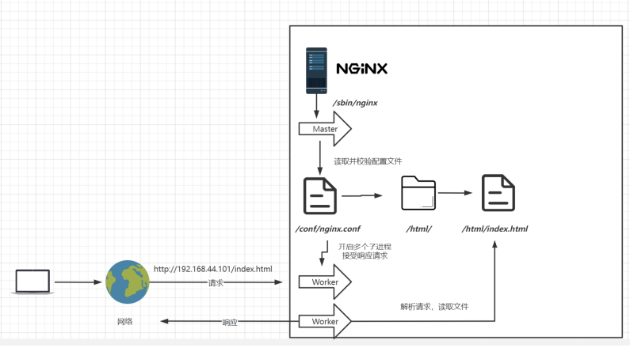

- [参考来源](#参考来源)
- [绑定nginx服务](#绑定nginx服务)
- [Nginx基本运行原理](#nginx基本运行原理)
- [绑定hosting server一个域名（Domain Name）上](#绑定hosting-server一个域名domain-name上)
- [Nginx域名多端口示范](#nginx域名多端口示范)
- [Server\_Name 匹配规则](#server_name-匹配规则)
- [反向代理](#反向代理)
  - [简单的示范](#简单的示范)
- [Load Balance 负载均衡](#load-balance-负载均衡)
  - [简单范例](#简单范例)
  - [负载权重](#负载权重)
    - [额外配置](#额外配置)
  - [Firewall 配置](#firewall-配置)
- [URL Rewrite](#url-rewrite)
- [KeepAlived](#keepalived)
  - [概念和用处](#概念和用处)
  - [实操](#实操)
- [从零配置https](#从零配置https)
- [隐藏Web信息](#隐藏web信息)
- [压力测试工具](#压力测试工具)
  - [测试工具charles](#测试工具charles)
  - [AB（Apache Benchmark)压力测试工具](#abapache-benchmark压力测试工具)
    - [案例](#案例)
- [Tips](#tips)
  - [更改nginx服务的默认用户](#更改nginx服务的默认用户)
  - [优化nginx服务的worker进程个数](#优化nginx服务的worker进程个数)
  - [配置word进程最大打开的文件数](#配置word进程最大打开的文件数)
  - [优化绑定不同的nginx进程到不同的CPU上](#优化绑定不同的nginx进程到不同的cpu上)
  - [nginx的事件处理模块优化](#nginx的事件处理模块优化)
  - [开启高效文件传输模式](#开启高效文件传输模式)
  - [开启gzip压缩](#开启gzip压缩)
  - [Keepalive\_timeout 超时时间](#keepalive_timeout-超时时间)
  - [设置expire过期时间](#设置expire过期时间)
  - [调整上传文件的大小](#调整上传文件的大小)
  - [企业常用的优化](#企业常用的优化)


# 参考来源
https://www.bilibili.com/video/BV1yS4y1N76R/?spm_id_from=333.337.search-card.all.click

# 绑定nginx服务
假设你使用centos，并且已安装好nginx在本机上。

创建service脚本第一步：
```
vi /usr/lib/systemd/system/nginx.service
```

**脚步内容：**
```
[Unit]
Description=nginx - web server
After=network.target remote-fs.target nss-lookup.target
[Service]
Type=forking
PIDFile=/usr/local/nginx/logs/nginx.pid
ExecStartPre=/usr/local/nginx/sbin/nginx -t -c /usr/local/nginx/conf/nginx.conf
ExecStart=/usr/local/nginx/sbin/nginx -c /usr/local/nginx/conf/nginx.conf
ExecReload=/usr/local/nginx/sbin/nginx -s reload
ExecStop=/usr/local/nginx/sbin/nginx -s stop
ExecQuit=/usr/local/nginx/sbin/nginx -s quit
PrivateTmp=true
[Install]
WantedBy=multi-user.target
```

重新加载系统服务
```
systemctl daemon-reload
```

完成以上步骤后，便可使用systemctl指令对nginx服务发送指令，如：
```
# 启动服务
systemctl start nginx.service
# 开机启动
systemctl enable nginx.service
```

# Nginx基本运行原理

Nginx的进程是使用经典的「Master-Worker」模型,Nginx在启动后，会有一个master进程和多个worker进程。master进程主要用来管理worker进程，包含：接收来自外界的信号，向各worker进程发送信号，监控worker进程的运行状态，当worker进程退出后(异常情况下)，会自动重新启动新的worker进程。worker进程主要处理基本的网络事件，多个worker进程之间是对等的，他们同等竞争来自客户端的请求，各进程互相之间是独立的。一个请求，只可能在一个worker进程中处理，一个worker进程，不可能处理其它进程的请求。worker进程的个数是可以设置的，一般会设置与机器cpu核数一致，这里面的原因与nginx的进程模型以及事件处理模型是分不开的。


# 绑定hosting server一个域名（Domain Name）上

1. 首先你得有一个domain name
2. Setup domain name 的绑定设置


**当主机名称不匹配时(4个w）**


**正确示范**

注意：* 仅是optional，根据需求决定是否添加
允许任何前缀指的是，例如domain name 是mmban.com，以下地址能够联通（不限）：
- note.mmban.com
- testing.mmban.com
- random42uhbd.mmban.com

# Nginx域名多端口示范

1. 假设我们在 / 路径
2. 创建一个www directory
```
mkdir www
# 并在www 下创建两个托管两个不同系统的文夹
cd www
mkdir web1 web2
```
3. 分别在web1 和web2 下开一个index.html，内容随意要不同以便后续测试能发现区别。
4. 找到并修改nginx配置文件
```
vim .../.../nginx/nginx.conf
```
5. 在http部分修改两个端口不同的server
    
6. 重启nginx
```
systemctl reload nginx
```

>*Note*
>- restart = stop + start
>- reload = remain running + re-read configuration files.

7. 可把server_name切换成域名，准确来说server_name是用来设置域名的，而非ip地址

>*For Main Host*
>server_name localhost -> server_name www.mmban.com
>
>*For Second Host(If domain have set * or vod host name binding during setup domain)*
>server_name localhost -> server_name vod.mmban.com
>listen 88 -> listen 80（because server_name already different)

# Server_Name 匹配规则
* 我们可以在同一servername中匹配多个域名
```
server_name vod.mmban.com www1.mmban.com;
```
* 通配符结束匹配

```
* server_name vod.*;
```
* 正则匹配
```
server_name ~^[0-9]+\.mmban\.com$;
```
* 匹配顺序
由左而右，一旦发现匹配对象，便不会和后续匹配。
例如一旦发现main host（web1)，便不会去匹配下一个对象（web2)哪怕符合匹配规则，如server_name 为*.mmban.com

>**注意**
>- 假设main host server_name为www.mmban.com
>- second host 为 *.mmban.com
>- 浏览地址为www.mmban.com
>- 符合main 以及second host匹配规则，当由于main host为第一顺序，因此只会匹配到main host


# 反向代理
描述:反向代理是指以代理服务器来接受连接请求，然后将请求转发给内部网络上的服务器，并将从服务器上得到的结果返回给请求连接的客户端，此时代理服务器对外就表现为一个反向代理服务器,而且整个过程对于客户端而言是透明的。


## 简单的示范
修改nginx.conf并添加proxy_pass


**结果**

如上图所示，使用的是原ip,但显示的却是在proxy_passs设置的网址

>Note
proxy_pass 有几个问题：
>- proxy_pass 无法设置https网址
>- 会有跳转或重定向的问题

# Load Balance 负载均衡
负载均衡也是Nginx常用的一个功能。简单而言就是当有2台或以上服务器时，根据规则随机的将请求分发到指定的服务器上处理，负载均衡配置一般都需要同时配置**反向代理**，通过反向代理跳转到负载均衡。

## 简单范例
负载均衡需要和proxy_pass一起配合使用


## 负载权重

> **Notes**
> - weight：权重
> - down : 当前server暂不参与负载均衡
> - backup : 预留的备份服务器； 其它所有的非backup机器down或者忙的时候，请求backup机器。  
> - max_fails : 请求失败次数限制
> - fail_timeout : 经过max_fails后服务暂停时间
> - max_conns : 限制最大的连接数 
>
> **负载均衡调度算法**
> - 轮询:默认算法按时间顺序逐一分配到不同的后端服务器;
> - 加权轮询:Weight值越大，分配到访问几率越高;
>
> **其他负载调度算法（不常用）**
> - ip_hash
>   根据客户端的ip地址转发同一台服务器，可以保持会话，但是很少用这种方式去保持会话，例如我们当前正在使用wifi访问，当切换成手机信号访问时，会话就不保持了。
> - least_conn
  最少连接访问，优先访问连接最少的那一台服务器，这种方式也很少使用，因为连接少，可能是由于该服务器配置较低，刚开始赋予的权重较低。
> - url_hash（需要第三方插件）
  根据用户访问的url定向转发请求，不同的url转发到不同的服务器进行处理（定向流量转发）。
> - fair（需要第三方插件）
  根据后端服务器响应时间转发请求，这种方式也很少使用，因为容易造成流量倾斜，给某一台服务器压垮。


假设我们在两台server上应用负载均衡机制，一台性能好，一台性能差。
自然的，我们会考虑让性能好的server支撑更多的工作量，而较差的server负责较少工作。
可使用`weight`来决定各服务器的权重：


### 额外配置
- down :下线，客户端无法访问，通常需要维修时可使用该标签
  - 
- backup：正常情况下客户端不会浏览该服务器，除非没有其他选项（其他所有服务器下线）
  - 
- fair: 按后端服务器 的响应时间来分配请求，响应时间短的优先分配。
  - 
- least_conn: 将请求分配到连接数最少的服务上
  - 

## Firewall 配置
通常，客户端是无法直接使用ip地址访问服务端的服务的，**除非关闭防火墙**。
因此，我们要么关掉防火墙，要么在防火墙上设置允许开放的端口。
```shell
firewall-cmd --permanent --add-rich-rule="rule family="ipv4" source address="192.168.44.101"
port protocol="tcp" port="8080" accept"
```
以上命令开放端口**8080**允许客户端访问。
可使用以下命令查看firewall的配置：
```sh
firewall-cmd --list-all
```
开启防火墙
```sh
systemctl start firewalld
```
重载规则
```sh
firewall-cmd --reload
```
移除规则
```sh
firewall-cmd --permanent --remove-rich-rule="rule family="ipv4" source
address="192.168.44.101" port port="8080" protocol="tcp" accept"
```

# URL Rewrite

**优点**：掩藏真实的url以及url中可能暴露的参数，以及隐藏web使用的编程语言，提高安全性便于搜索引擎收录

**缺点**：降低效率，影响性能。如果项目是内网使用，比如公司内部软件，则没有必要配置。

```tex
rewrite是实现URL重写的关键指令，根据regex(正则表达式)部分内容，重定向到repacement，结尾是flag标记。

rewrite 	<regex> 	<replacement> 	[flag];
关键字 		正则 				替代内容 			flag标记

```

**案例**
假设服务上host着两个网站，一个是服务类的网站，一个则是维修时显示的网站。
当服务类网站下线时，来自客户端任何的请求或参数都将会被无视并直接重定向到维修网站。
例如：
- 客户端发送https://myapp.com/somerequest?param=123
- 使用url rewrite方法使url重定向为https://repair.myapp.com

**实操**
1. 打开nginx.conf
2. 修改server.location部分如下：
```
upstream httpds {
    server https://myapp.com weight=8 down; //main
    server https://repair.myapp.com weight=2 backup; //repair web
}


location / {
    rewrite * /index.html redirect;
    proxy_pass http://httpds ;
}

```
以上表面无论url是什麽（*),都会自动跳转到index.html页面。

**实例2**
```
rewrite ^/([0-9]+).html$ /index.jsp?pageNum=$1 break;
```
假设提供的url是https://myapp.com/2.html, 实际上它背后执行的是https://myapp.com/index.jsp?pageNum=2

# KeepAlived

## 概念和用处
- 假定情景有两台或以上的主机host 着nginx的服务
- 目的是：当某台nginx主机失效，另一台主机能替代继续提供服务
- 问题：当某台主机下线时，另一台主机要如何知道它失效以便替代它？
- 客户端用户只知道使用（一个）域名访问服务端，因此它只能是一个ip地址（共享）。我们不能说，主机1下线了，让客户端去访问另一个域名以访问主机2.
- 解决方案是：让两个主机共享一个ip(虚拟地址)
- 而KeepAlived的作用在于，检测另一台是否正常运转，以便服务端能保持回话（另一台‘活着’的主机）


## 实操
>先安装keepalived，安装步骤可参考基础使用文档

**最小配置**
第一台机器
```
! Configuration File for keepalived
global_defs {
    router_id lb111 //可自定义id，必须独特
}
vrrp_instance atguigu { //可自定义名称
    state MASTER //主机
    interface ens33 //根据网卡名称更改
    virtual_router_id 51
    priority 100 //优先级
    advert_int 1
    authentication  //配置需要和同一局域的keepalived保持一致
    {
        auth_type PASS
        auth_pass 1111
    }
    virtual_ipaddress {
        192.168.44.200
    }
}
```
第二台机器
```
! Configuration File for keepalived
global_defs {
    router_id lb112 //可自定义id，必须独特
}
vrrp_instance atguigu { //可自定义名称
    state BACKUP //备份主机
    interface ens33 //根据网卡名称更改
    virtual_router_id 51
    priority 50 //下调，因为它是备份主机
    advert_int 1
    authentication  //配置需要和同一局域的keepalived保持一致
    {
        auth_type PASS
        auth_pass 1111
    }
    virtual_ipaddress {
        192.168.44.200
    }
}
```

启动服务
```bash
systemctl start keepalive
```

检测ip地址是否添加虚拟地址
```bash
ip addr
```

# 从零配置https

1. 你得有一台主机，可使用aws 的ec2（centos os）
>测试是否能在浏览器访问主机ip，如果不能可能是因为防火墙没有配置80和443端口的开放

>22 是ssh 端口
>3389 是windows远程操作端口
2. 你得有一个域名，可到aws `Route 53`上购买。可在[FreeNom](https://www.freenom.com/en/index.html?lang=en)得到免费域名
3. 配置主机到域名上，细节可参考02章
> 注意，主机ip地址会在每次重启而改变，因此需要做一些配置，因此可创建一个Elastic Ip（弹性地址）进行绑定。
4. 使用[oneinstack](https://oneinstack.com/)一键安装测试集成包，其中包括但不限:nginx,mysql etc
5. oneinstack有自己的默认页面，因此需要做一些配置上的更改
6. 找到并修改nginx.conf的80端口的root路径。
7. 申请ssl证书certificate.(收费，但可能会有免费的。)可在AWS Certificate Manager申请或其他特定网站购买。[Let's Encrypt](https://letsencrypt.org/)是提供免费ssl的非营利组织
8. 申请成功后，会得到两个文件：xxxxxx.key 和xxxxx.pem
9. 将cert配置到nginx.conf

1.  将所有的http端口设置成自动跳转到https


# 隐藏Web信息
用户可通过使用浏览器或测试工具观测到web的信息，其中包括server名称和web的版本号。
这对于一些不怀好意的骇客而言无疑是一个非常敏感的信息。

**实验**
执行 `curl -I 192.168.43.120:82`会得到如下信息


**解决方案**
隐藏nginx版本号：在配置文件中加 **server_tokens off**；默认是on状态，server_tokens参数可以在http、server、location中。

# 压力测试工具
**教材来源**
[视频链接](https://www.bilibili.com/video/BV1yS4y1N76R/?p=1)

## 测试工具charles
[官方链接](https://www.charlesproxy.com)
- 能够拦截(监控）浏览器的请求
- 能够模拟简单的多请求测试

## AB（Apache Benchmark)压力测试工具
```
yum install httpd-tools
```

### 案例
1.
```
ab -n 10000 -c 30 https://xxxx.com
```
>n:请求数量
>c:并发请求
>细节参考官网或高级篇

# Tips

## 更改nginx服务的默认用户
```bash
useradd -M -s /bin/false nginx #非登录对象
./configure --user=nginx --group=nginx
vim nginx.conf
user nginx
```
or
```bash
useradd -s /sbin/nologin -M nginx #非登录用户
```

## 优化nginx服务的worker进程个数
```bash
vim nginx.conf
work_process 8;     #默认是1
```
在高并发高访问量的web服务场景中，必须开启多个`worker`进程来保证有足够多的进程来处理客户的请求，这就好比饭店，需要有多个服务员；而开启多少个`worker`进程这要根据网页的业务访问量来决定，官方建议初始的`worker`进程数量配置等于CPU的核数，当然在高并发的网站，`worker`进程数量等于`CPU核数*2`也是可以考虑的，这个`worker`进程数量具体的值不仅跟网站访问量、cpu核数相关，还和硬盘存储的数据和系统的负载等相关。

## 配置word进程最大打开的文件数
```
worker_rlimit_nofie number;     #worker_processes能打开的最大文件数
```
放置位置就在`main`标签块中，即放`worker_processes` 后即可，这个参数能改变`worker_processes`能打开的最大文件数。

## 优化绑定不同的nginx进程到不同的CPU上
我们知道，可能存在多个nginx进程跑在同在一个cpu上，这样就存在硬件资源的使用不均衡，这种情况可以将nginx的work进程绑定到不同的CPU上来解决，我们先了解一下CPU的概念，1个CPU上可以存在多个核心，比如2核心，那么总的CPU核心就是2，同理，2个CPU，每个CPU都有2核心的话，总的CPU核心就有4个核心。查看Linux系统的CPU信息在**/proc/cpuinfo**文件中。
```bash
grep -c processor /proc/cpuinfo #查看有多少个CPU核数
or
lscpu | grep 'CPU(s)' | head -1 | awk '{print $2}'
```

下面是一些配置实例
```nginx
work_processes 2; # 2进程2核cpu的配置，01表示启用第一个cpu内核，10表示期待第二个cpu内核
work_cpu_affinity 01 10;

work_processes 4; # 4个进程4核cpu的配置
work_cpu_affinity 0001 0010 0100 1000

work_processes 8; # 8个进程8核cpu的配置
work_cpu_affinity 00000001 00000010 00000100 00001000 00010000 00100000 01000000 10000000

work_processes 4; # 4个进程，2核cpu的配置 ： 一cpu核对2进程
work_cpu_affinity 01 10 01 10;

work_processes 2; # 4核cpu，开启2个进程：一进程用两个核
work_cpu_affinity 0101 1010; #0101表示开启第一个和第三个内核,1010表示开启第二个和第四个内核
```

>1： 01
>2： 100 +
>3： 101

>说明：2核是 01，四核是0001，8核是00000001，有多少个核，就有几位数，1表示该内核开启，0表示该内核关闭。 worker_processes最多开启8个，8个以上性能提升不会再提升了，而且稳定性变得更低，**所以8个进程够用了**，配置完毕后，平缓重启nginx。

## nginx的事件处理模块优化
在`events` 块中可以设定nginx的事件处理模型，而nginx的事件处理模型有`select、poll、kqueue、epoll、rtsig、dev/poll`，其中`select、poll`都是标准的工作模式，`kqueue、epoll`是高效的事件处理模型，不同的是`epoll`用在`Linux`系统中，`kqueue`用在`BSD`系统中，对于Linux系统和Linux2.6+的内核，推荐选择`epoll`工作模式，这是高并发的设置。
```
events {
    use epoll;
    work_processes 1024;
}
```
根据官方建议，也可以不指定事件处理模型，默认情况下，nginx会自己选择最合适最佳的事件处理模型服务。

## 开启高效文件传输模式
```nginx
sendfile on;
tcp_nopush on;
```
**sendfile**:默认是off,on表示开启高效文件传输模式，可以放置的位置：http、server、location、if in location
**tcp_nopush**：配置一次发送数据的包大小,即它不是按时间累计0.2 秒后发送包，而是当包累计到一定大小后就发送,在 nginx 中,tcp_nopush 必须和 sendfile 搭配使用。

## 开启gzip压缩
开启gzip压缩可以使请求传输数据的大小减少一半甚至更多
```nginx
gzip on;
gzip_http_version 1.0;      #设置压缩响应所需的请求的最低 HTTP 版本,官方默认就是1.0
gzip_disable 'MSIE [1-6]`       #禁用压缩,这里表示禁用MSIE6版本一下的压缩,因为MSIE6版本压缩会乱码
gzip_comp_level 1;      #压缩级别,默认是1,可取值1-9
gzip_min_length 20;     #设置将被压缩的响应的最小长度,长度仅由“Content-Length”响应头字段确定

gzip_proxied off | expired | no-cache | no-store | private | no_last_modified | no_etag | auth | any ...

#表示要对那种类型的资源进行压缩,可以设置多个参数,默认是text/html
gzip_types text/html text/plain application/javascript      
```
更多可参考[官网](http://nginx.org/en/docs/http/ngx_http_gzip_module.html)

## Keepalive_timeout 超时时间
**Keepalive_timeout** ：超时时间，是指客户端到服务端的连接持续有效时间，若在这个时间内接收到来自客户端的其它请求，服务端会利用这个未被关闭的连接，而不需要再建立一个连接。若`keepalive_timeout`设置为0，就禁止了`keepalive`连接。


## 设置expire过期时间

`expires`用于告知浏览器其获取到的页面信息过期时间是多少，换句话说告知浏览器其获取的信息在多长时间内是有效的，`expires`可以设置于`http, server, location, if in location`段中。`expires`起到控制页面缓存的作用，合理的配置`expires`可以减少很多服务器的请求。
```nginx
expires 1h; #表示缓存1小时
expires 3d;
expires 3h;
expires max; #表示缓存10年
expires -1; #表示永远过期

#示例
location ~.*\.(js|css|html|png|jpg)$ {
    expires 3d;
}

#某些需求可以需要禁用缓存，如下设置：
location ~.*\.(js|css|html|png|jpg)$ {
    add_header Cache-Control no-store;
}
```

## 调整上传文件的大小
```nginx
client_max_body_size 8m;
```

## 企业常用的优化
```nginx
user nginx;
worker_processes 16;
error_log /vr/log/nginx/error.log;
pid /run/nginx.pid;
include /usr/share/nginx/modules/*.conf

event {
    worker_connections 1024;
    use epoll;
}

http {
    sendfile on;
    keepalive_timeout 65;
    keepalive_requests 9000000;
    types_hash_max_size 4096;
    include /etc/nginx/mime.types;
    default_type application/octet-stream;
    client_max_body_size 5000m;
    client_body_buffer_size 4k;
    proxy_connect_timeout 60;
    proxy_send_timeout 1200;
    proxy_read_timeout 1200;
    proxy_buffer_size 6k;
    proxy_buffers 4 64k;
    proxy_busy_buffers_size 64k;
    proxy_temp_file_write_size 64k;
    proxy_temp_path temp_dir;
    proxy_max_temp_file_size 0;
    add_header Cache-Control no-cache;
    add_header Cache-Control private;

    include /etc/nginx/conf.d/*.conf;

    server{
        listen 80;
        server_name localhost;
        fastcgi_buffer_size 32k;
        fastcgi_buffers 8 128k;
        proxy_max_temp_file_size 0;
        proxy_buffer_size 8k;
        proxy_buffers 8 32k;
        fastcgi_connect_timeout 3000;
        fastcgi_send_timeout 3000;
        fastcgi_read_timeout 3000;

        location / {
            root html;
                index index.html index.htm;
        }

        location /staticDownload {
            root /xxx/dox/;
            if ($request_filename ~* ^.*?\.)(txt|doc|pdf|rar|gz|zip|docx|exe|xlsx|ppt|pptx)$ {
                add_header Content_Disposition: 'attachment;';
            }
            autoindex_exact_size off;
            autoindex_localtime on;
        }

        # 禁止缓存html文件，为了每次打开单击登录username可以让网管拦截
        location /xx-web {
            root /xx/xx-web;
            index index.html index.htm;
            if ($request_file ~* .*\.(?:html|html)$) {
                add_header Cache-Control "private,no store,no cache,must-revalidate,proxy-revalidate";
            }
            if ($request_file ~* .*\.(?:js|css)$) {
                expires 7d;
            }
            if ($request_file ~* .*\.(?:jpg|jpeg|gif|png|ico|cur|gz|svg|svgz|mp4|ogg|ogv|webm)$) {
                expires 7d;
            }
        }

        include /etc/nginx/default.d/*.conf;
        error_page 404 /404.html;
        location = /404.html {}

        error_page 500 502 503 504 /50x.html;
        location = /50x.html {
            root html;
        }
    }
}

```