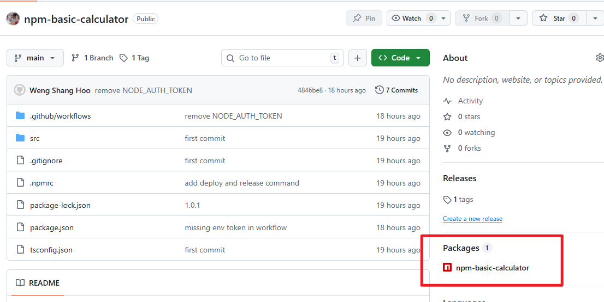

[参考链接](https://github.com/tenPro4/npm-basic-calculator)

## 起步
```shell
mkdir npm-basic-calculator
cd npm-basic-calculator
```

这里我使用了`tsdown`编译工具来配置我的`typescript`开发环境。
`tsdown`是这个文档时间点最新的工具，也许在未来它会被放弃维护，因此建议可以随时关注社区是否有更合适的工具。

```shell
npm init -y
npm install -D tsdown typescript
npx tsc --init # Initialize tsconfig.json file
```

这里的复制剪贴`tsconfig.json`来替代初始化的内容。

## 开发
在`src/index.ts`路径下开始你的编程。

## Publish前的配置
这一步将会把你的程序打包，然后发布到自己的github做管理。

首先，先在github创建一个新的repo，然后将当前的代码推上去。注意`.gitignore`先创建，免得把`node-modules`和`build` files 一起推上去。

接着安装 `dotnet-cli`。
```shell
npm install -D dotenv-cli
```

需要打包需要在`package.json`做一些配置，指定要把包发布到哪里的配置。以下几个在package.json里面
```json
  "type": "module",
  "exports": {
    ".": {
      "import": "./dist/index.mjs",
      "types": "./dist/index.d.mts"
    }
  },
  "files": [
    "dist"
  ],
  "repository": {
    "type": "git",
    "url": "git+https://github.com/your-username/npm-basic-calculator.git"
  },
```

**exports:** 只能从明的路径 import。也就是，除了index.ts之外，无法从别的路径import
**files:** 指定打包上传的路径。如若不指定，全部文档会被打包，包括node-modules。
**repository:** 这是发布包必要的配置，指定包将会发布到哪里。

需要发布到github，需要先创建一个**PAT**。可以在`Profile -> Settings -> Developer Settings -> Personal access tokens(classic)`下创建。

复制创建`PAT`返回的token，后面会用到。这个token只会显示一次，除非重新生成过一个新的。

在根目录下创建`.env`，然后将你复制的token设置在**NPM_TOKEN**的变量上
```ru
NPM_TOKEN=ghp_your_pat
```

接着创建`.npmrc`，同样是在根目录下。然后写入以下的内容:
```
@your-username:registry=https://npm.pkg.github.com
//npm.pkg.github.com/:_authToken=${NPM_TOKEN}
```

至此，打包发布的准备算是完善了。

## 正式发布
先编译，再发布
```shell
npm run build
dotenv -- npm publish #从.env抓取变量NPM_TOKEN并基于.npmrc发布
```

如果发布成功，你会在repo的右下角发现你发布的包


可以在`package.json`新增两个scripts:
```json
"scripts": {
    "release": "npm version patch && git push --follow-tags && npm run deploy", //每次更新推送时，新增包的版数并作发布动作。例如从1.0.0 -> 1.0.1
    "deploy": "dotenv -- npm publish"
  },
```

## 自动化发布
这是可选性的步骤。

好处是，每次`main` branch下的package.json更新，便通过`github action`实现自动化发布。

坏处是，如果内容变更不在`package.json`则不作发布。

```yml
name: CI/CD - Auto Publish Package

on:
  push:
    branches:
      - main
    paths:
      - 'package.json' # 只有 package.json 变动时才尝试发布，节省资源

jobs:
  publish:
    runs-on: ubuntu-latest
    permissions:
      contents: read
      packages: write # 必须开启写入权限

    steps:
      - name: Checkout repository
        uses: actions/checkout@v4

      - name: Setup Node.js
        uses: actions/setup-node@v4
        with:
          node-version: '20'
          registry-url: 'https://npm.pkg.github.com'
          scope: '@tenPro4'

      - name: Install dependencies
        run: npm install

      - name: Build package
        run: npm run build

      - name: Check if version exists and Publish
        run: |
          VERSION=$(node -p "require('./package.json').version")
          
          npm publish || echo "Version $VERSION already exists. Skipping publish."
        env:
          NPM_TOKEN: ${{ secrets.GITHUB_TOKEN }}
```

[参考链接](https://github.com/tenPro4/npm-basic-calculator)

## Install the package
Once the `.npmrc` is configured, you can install the package using the scope (your username/org):
```bash
npm install @your-username/your-package-name
```