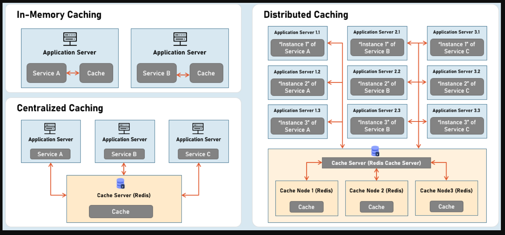

Repo: https://github.com/Harsha-Global/Dot-NET-Microservices-with-Azure-and-AKS

## Section 4: Docker

```bash
docker tag product-service:1.0 bic224/product-service:v1.0

docker push bic224/product-service:v1.0

docker network create shared-network

docker network ls

docker network inspect shared-network

docker run -e MYSQL_ROOT_PASSWORD=admin --hostname=mysql-host-microservice --network=shared-network mysql

docker run --network=shared-network bic224/product-service:v1.0
```
**Notes**: --network or anything must put before image name otherwise it wont work

**When update something**
-> update the local docker image first
```bash
docker build -t product-service:2.0 -f ./ProductsMicroService.API/Dockerfile .
```

-> tag remote docker
```bash
docker tag product-service:2.0 bic224/product-service:v2.0
```

-> push remote docker
```bash
docker push bic224/product-service:v2.0
```

**Running application and database container instances**
```bash
docker run -p 8011:8080 -p 8012:8081 --network=shared-network -e MYSQL_HOST=mysql-host-microservice -e MYSQL_PASSWORD=admin bic224/product-service:v1.0

docker run -e MYSQL_ROOT_PASSWORD=admin --hostname=mysql-host-microservice --network=shared-network mysql
```

**Set initialize data set to mysql**
```bash
docker run -e MYSQL_ROOT_PASSWORD=admin --hostname=mysql-host-microservice --network=shared-network -v "C:/Users/wengshang.hoo/Desktop/work/mysql-init:/docker-entrypoint-initdb.d" mysql
```
**Notes**: for window, need put absolute path for volumn


## Section 5: Docker Compose

**Validate yaml**
```bash
docker-compose -f docker-compose.yaml config
```

**Listing container command**
```bash
docker-compose ps
docker ps
```

**Debugging command**
```bash
docker exec -it container_name mysql -u root -p datatabase_name
docker exec -it container_name psql -U postgres -d datatabase_name

docker inspect container_name
docker logs container_name
```

**Example docker-compose.yaml**
```yaml
version: "3.8"
services:
    db:
        image: mysql:8.4.6
        environment:
            MYSQL_ROOT_PASSWORD: admin
        ports:
        - "3306:3306"
        volumes:
        - "C:/Users/wengshang.hoo/Desktop/work/mysql-init:/docker-entrypoint-initdb.d"
        networks:
        - shared-network
        hostname: mysql-host-microservice
    
    app:
        image: bic224/product-service:v1.0
        ports:
        - "8011:8080"
        - "8012:8081"
        networks:
        - shared-network
        environment:
            MYSQL_HOST: mysql-host-microservice
            MYSQL_PASSWORD: admin
        depends_on:
            - db

networks:
    shared-network:
        driver: bridge
```

## Section 7

**Debug in visual studio**
1. Right click your project -> Add -> Container Orchestrator Support
	-> This will create docker-compose.yaml and add launceSetting.json

2. Update docker-compose.yml
```yml
services:
  productsmicroservice.api:
    image: productsmicroserviceapi
    build:
      context: .
      dockerfile: ProductsMicroService.API/Dockerfile
    environment:
    - ASPNETCORE_ENVIRONMENT=Development
    - MYSQL_HOST=mysql-host-microservice
    - MYSQL_PASSWORD=admin
    ports:
    - "7000:8080"
    networks:
    - shared-network
    depends_on:
    - db

  db:
    image: mysql:8.4.6
    environment:
        MYSQL_ROOT_PASSWORD: admin
    ports:
    - "3306:3306"
    volumes:
    - "C:/Users/wengshang.hoo/Desktop/work/mysql-init:/docker-entrypoint-initdb.d"
    networks:
    - shared-network

networks:
    shared-network:
        driver: bridge
```

3. Update swagger config(if you using swagger)
```csharp
//Swagger
app.UseSwagger();
app.UseSwaggerUI(c =>
{
    // Force Swagger UI to use the same port you mapped (7000)
    c.SwaggerEndpoint("/swagger/v1/swagger.json", "Products API V1");
    c.RoutePrefix = string.Empty; // optional: serve swagger at http://localhost:7000/
});
```

4. Notes 
> Inside a Docker network, containers resolve each other by **service name** (`db`) — not always by hostname.
> 
> You’re setting hostname: mysql-host-microservice. That makes the container itself identify with that name, but DNS resolution inside the network still prefers the service name unless explicitly mapped.
>
> So try `Server=db`; instead of Server=`mysql-host-microservice`;.
>
> Clean solution and re-run the docker compose if build didnt reflect latest change

```yml
services:
  productsmicroservice.api:
    image: productsmicroserviceapi
    build:
      context: .
      dockerfile: ProductsMicroService.API/Dockerfile
    environment:
    - ASPNETCORE_ENVIRONMENT=Development
    # - MYSQL_HOST=mysql-host-microservice # same network docker prefer use service name 
    - MYSQL_HOST=db
    - MYSQL_PASSWORD=admin
    ports:
    - "7000:8080"
    networks:
    - shared-network
    depends_on:
    - db

  db:
    image: mysql:8.4.6
    environment:
        MYSQL_ROOT_PASSWORD: admin
    ports:
    - "3306:3306"
    volumes:
    - "C:/Users/wengshang.hoo/Desktop/work/mysql-init:/docker-entrypoint-initdb.d"
    networks:
    - shared-network

networks:
    shared-network:
        driver: bridge
```

**Connection String**
```json
"ConnectionStrings":
{
  "DefaultConnection": "Server=$MYSQL_HOST; Port=3306; Database=ecommerceproductsdatabase; User ID=root; Password=$MYSQL_PASSWORD"
}
```

**Networks**

One container can have multi networks

```yml
ordersmicroservice.api:
    networks:
     - orders-mongodb-network # same network to db, so only ordersmicroservice.api can access db
     - ecommerce-network

  mongodb-container:
   image: mongo:latest
   networks:
    - orders-mongodb-network # every db have unique network

users-microservice:
   networks:
    - users-postgres-network # allow connect to db with same network
    - ecommerce-network # purpose: allow comminication with ordersmicroservice.api
   depends_on:
    - postgres-container

postgres-container:
   image: postgres:13
   networks:
    - users-postgres-network
```

> docker-compose.yml 同目录下的 .env 文件 会被 自动加载

例子：
`.env`

```ini
CONTAINER_NAME=osticket
WEB_PORT=8080
```

`docker-compose.yml`

```yml
version: "3.9"

services:
  osticket-app:
    image: tiredofit/osticket
    container_name: "${CONTAINER_NAME}-app"
    ports:
      - "${WEB_PORT}:80"
    environment:
      - TIMEZONE=America/Los_Angeles
```


## Section 9: Caching



Cache options: Redis, NCache and In memory cahce

**Redis Docker Compose**
```yml
redis:
   image: redis:latest
   ports:
    - "6379:6379"
   volumes:
    - c:/redis-cache:/data # replace c:/redis-cache to any path you prefer
   networks:
    - xxx
```

```bash
dotnet add package StackExchange.Redis
dotnet add package Microsoft.Extensions.Caching.StackExchangeRedis
```

**Service Dependency Injection**
Add two env value for redis
```yml
- REDIS_HOST=redis
- REDIS_PORT=6379
```

Add redis cache service
```csharp
services.AddStackExchangeRedisCache(options =>
    {
      options.Configuration = $"{configuration["REDIS_HOST"]}:{configuration["REDIS_PORT"]}";
    });
```

**Todo:** Use centralize caching to demo the synchronize token between different servers(load balance). For example, if server 1 logout, then the server 2 token should be expired as well.

**Terms**
1. **Absolute Expiration（绝对过期）**

- 设定一个固定的到期时间。
- 无论有没有访问，时间一到，缓存就会过期。
- 比如商品价格缓存，5 分钟更新一次，哪怕频繁访问，也要定时刷新。

2. **Sliding Expiration（滑动过期）**

- 每次访问时，都会“刷新”过期时间。
- 只要在设定时间内一直有人访问，这个缓存就会一直存在。
- 只有在一段时间没有被访问的情况下，才会过期。
- 比如登录 session，只要用户持续活跃，缓存就一直保留。

**Expiration Usage**
```csharp
string productJson = JsonSerializer.Serialize(product);

DistributedCacheEntryOptions options = new DistributedCacheEntryOptions()
  .SetAbsoluteExpiration(TimeSpan.FromSeconds(300))
  .SetSlidingExpiration(TimeSpan.FromSeconds(100));

string cacheKeyToWrite = $"product:{productID}";

await _distributedCache.SetStringAsync(cacheKeyToWrite, productJson, options);

string? cachedProduct = await _distributedCache.GetStringAsync(cacheKeyToWrite);

if (cachedProduct != null)
{
  ProductDTO? productFromCache = JsonSerializer.Deserialize<ProductDTO>(cachedProduct);
}
```

当你在 同一个 **DistributedCacheEntryOptions** 里同时设置了 `AbsoluteExpiration` 和 `SlidingExpiration` 时：
- **SlidingExpiration**：控制“多长时间没访问就过期”。
- **AbsoluteExpiration**：控制“最大寿命”，不管有没有访问，到了绝对时间就一定过期。

结果就是：
- 如果 **超过 100 秒没人访问** → 缓存过期（可能不到 300 秒就被清掉）。
- 如果 **有人持续访问** → 每次访问都会刷新 100 秒的过期时间，**但是** 最多只能存活 300 秒，300 秒一到，还是会被强制清掉。

## RabbitMQ

**Small Knowledge**

`IConfiguration` 除了读取`appsettings.json` or `appsettings.{Environment}.json`,还能读取
- System Environment Variable
- Command params

So in docker we have set of environment:
```yml
environment:
 - UsersMicroserviceName=apigateway
 - UsersMicroservicePort=8080
```

When ASP.NET Core run the application, this environment variable will add to IConfiguration instance

```csharp
var userServiceHost = builder.Configuration["UsersMicroserviceName"]; // apigateway
var userServicePort = builder.Configuration["UsersMicroservicePort"]; // 8080
```

RabbitMQ 的四种常见 Exchange（交换机）模式分别是：

- Direct
- Fanout
- Topic
- Headers（注意是 Headers，不是 Header）

**RabbitMQ 消息流：**
```
Producer → Exchange → Queue → Consumer
```
重点：
- **Producer** 不直接发给 Queue
- **Producer** 发给 Exchange
- **Exchange** 决定消息该去哪个 Queue

不同 Exchange 类型，决定了不同的路由规则。

### 1. Direct Exchange（直连模式）
Exchange 根据：
```
routingKey == bindingKey
```
进行完全匹配。

只有完全一样，消息才会进入 Queue。

**示例**
```
Queue A → error
Queue B → info
Queue C → warning
```

Producer发送：
```
routingKey = error
```

结果：
```
只有 Queue A 收到消息
```

**图示**
```
        error
Producer ─────→ Exchange ─────→ Queue A

        info
Producer ─────→ Exchange ─────→ Queue B
```

**场景**
适合：
- 订单系统
- 指定业务模块
- 精准投递

比如：
```
pay.order
create.user
send.email
```

### 2. Fanout Exchange（广播模式）
只要绑定到这个 Exchange 的 Queue,全部收到消息.

**示例**
Queue绑定：
```
Queue A
Queue B
Queue C
```

Producer发送：
```
发送任意消息
```

结果：
```
A/B/C 全部收到
```

**图示**
```
                → Queue A
Producer → Exchange
                → Queue B
                → Queue C
```


## Azure

**Azure Container Registry**
The place similar to docker hub. The only different is security management. You can set the identity permission for your image to indicate who can access it.

**App Service**
Create Resource Group -> Create App Service Plans -> Create App Service

**Azure Container App**

## Azure Devops


```yml
trigger:
- main

pool:
  vmImage: 'windows-latest'

variables:
  buildConfiguration: 'Release'
  blobContainer: 'app-artifacts'
  blobStorageAccount: 'mystorageaccount'
  # $(connectionstring) comes from Azure Key Vault

steps:
# 1. Install NuGet
- task: NuGetToolInstaller@1

# 2. Restore packages
- task: NuGetCommand@2
  inputs:
    command: 'restore'
    restoreSolution: '**/*.sln'

# 3. Build solution
- task: VSBuild@1
  inputs:
    solution: '**/*.sln'
    msbuildArgs: '/p:Configuration=$(buildConfiguration)'
    platform: 'Any CPU'
    configuration: '$(buildConfiguration)'

# 4. Pack class libraries into NuGet packages
- task: DotNetCoreCLI@2
  displayName: 'Pack all class libraries into NuGet packages'
  inputs:
    command: 'pack'
    packagesToPack: '**/*.csproj'
    versioningScheme: 'off'
  condition: contains(variables['Build.Repository.Name'], 'Library')

# 5. Push NuGet packages to Azure Artifacts (skip duplicates)
- task: NuGetCommand@2
  displayName: 'Push NuGet packages'
  inputs:
    command: 'push'
    packagesToPush: '$(Build.ArtifactStagingDirectory)/**/*.nupkg'
    publishVstsFeed: 'MyProject/MyFeed'
    arguments: '--skip-duplicate'
  condition: contains(variables['Build.Repository.Name'], 'Library')

# 6. Upload application to Azure Blob Storage
- task: AzureCLI@2
  displayName: 'Upload application to Blob Storage'
  inputs:
    azureSubscription: 'MyServiceConnection'   # Azure service connection name
    scriptType: 'ps'
    scriptLocation: 'inlineScript'
    inlineScript: |
      echo "Uploading app build output to blob storage..."
      az storage blob upload-batch `
        --account-name $(blobStorageAccount) `
        --connection-string "$(connectionstring)" `
        --destination $(blobContainer) `
        --source "$(Build.SourcesDirectory)/bin/$(buildConfiguration)/net6.0"
  condition: not(contains(variables['Build.Repository.Name'], 'Library'))
```