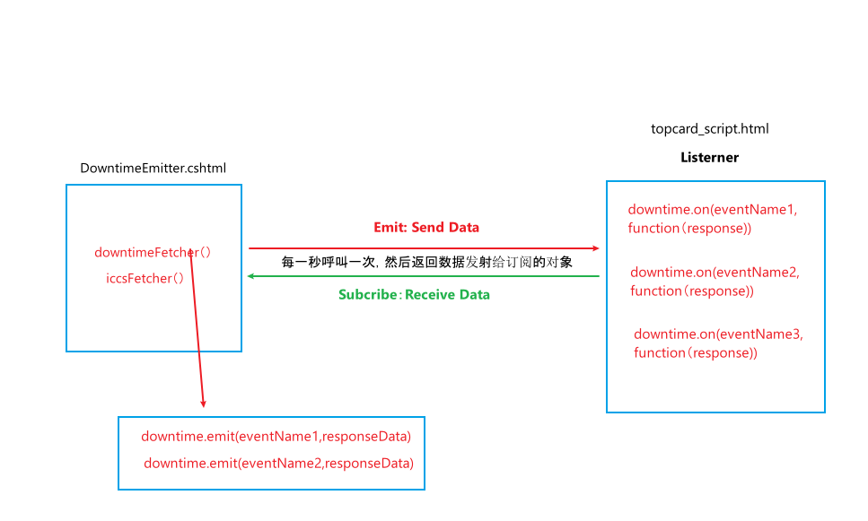

# AD

## Check OS And Login With AD
```dotnet
 bool isWindows = RuntimeInformation.IsOSPlatform(OSPlatform.Windows);
 if (isWindows)
 {
     using (PrincipalContext pc = new PrincipalContext(ContextType.Domain, "AD"))
     {
         return pc.ValidateCredentials(username, password, ContextOptions.Negotiate);
     }
 }
```

## Get AD user Info
```dotnet
string pathLDAP = configuration["LDAP_Path"].ToString();
string directoryEntryUsername = configuration["LDAP_Username"].ToString();
string directoryEntryPassword = configuration["LDAP_Password"].ToString();

DirectoryEntry directoryEntry = new DirectoryEntry(pathLDAP, directoryEntryUsername, directoryEntryPassword, AuthenticationTypes.Secure);
DirectorySearcher search = new DirectorySearcher(directoryEntry)
{
    ServerTimeLimit = new TimeSpan(0, 0, 5),
    Filter = string.Format("(SAMAccountName={0})", UserID)
};

search.PropertiesToLoad.Add("displayName");
search.PropertiesToLoad.Add("userPrincipalName");

SearchResult result = search.FindOne();

if (result != null)
{
    string name = result.Properties["displayName"][0].ToString();
    string email = result.Properties["userPrincipalName"][0].ToString();

    return new UserInfo
    {
        FullName = name,
        Email = email,
    };
}
```

# Minio
Minio 是一个开源的对象存储服务器，它与亚马逊 S3 兼容。它的作用类似于亚马逊 S3，可以用来存储和管理大规模的数据，例如图片、视频、文档等。
## Packages Required
1. Minio
2. AspNetCore.Proxy

## 实践
```dotnet
builder.Services.AddProxies();

builder.Services.AddMinio(configureClient => configureClient
        .WithEndpoint(configuration["MinioEndpoint"])
        .WithSSL(false)
        .WithCredentials(configuration["MinioAccessKey"], configuration["MinioSecretKey"]));

app.UseProxies(proxies =>
{
    proxies.Map("/api/storage/{**rest}", proxy => proxy.UseHttp((context, args) =>
    {
        var queryString = context.Request.QueryString.Value;

        //http://domain_name:9000/dsdd.png?querystring
        return $"{configuration["Proxies:Minio"]}/{args["rest"]}{queryString}";
    }, builder =>
    {
        // remove authorization header
        builder.WithBeforeSend((context, request) =>
        {
            request.Headers.Remove("Authorization");
            return Task.CompletedTask;
        });
    }));
});
```
这段代码为以 "/api/storage/" 开头的请求设置了代理路由。请求被代理到了配置中指定的 Minio 服务器。在 "/api/storage/" 后面的路径会被转发给 Minio，同时也会带上任何查询字符串参数。

此外，还应用了一个配置，用于在将请求发送到 Minio 之前移除请求中的 "Authorization" 头。这通常是为了防止将敏感的授权信息传递给上游服务器，因为 Minio 可能以不同的方式处理身份验证。

# 管理定时任务

## Quartz

### Package Required
1. Quartz.AspNetCore
2. Quartz.Extensions.DependencyInjection
3. CrystalQuartz.AspNetCore
    - 用于可视化管理 Quartz 调度器和任务。它提供了一个易于使用的 Web 界面.

### Setup
```dotnet
 builder.Services.AddQuartz(q =>
 {
     q.AddJob<JOB1>(new JobKey("job1"), opts => opts
     .PersistJobDataAfterExecution()
     .DisallowConcurrentExecution());

     q.AddTrigger(opts => opts
    .ForJob("job1")
    .StartNow()
    .WithSimpleSchedule(x => x.WithInterval(TimeSpan.FromSeconds(5)).RepeatForever()));
 }
);

 builder.Services.AddQuartzServer(options =>
 {
     // when shutting down we want jobs to complete gracefully
     options.WaitForJobsToComplete = true;
 });

 app.UseCrystalQuartz(() =>
{
    var scope = app.Services.CreateScope();
    var scheduler = scope.ServiceProvider.GetService<ISchedulerFactory>().GetScheduler().Result;
    return scheduler;
});
//CrystalQuartz 的默认 UI 网址是 /crystalquartzpanel。
```

**Job Class**
```dotnet
public class JOB1 : IJob
{
     public JOB1(){}
     public async Task Execute(IJobExecutionContext context)
     {
        //task
         await Task.FromResult(true);
     }
}
```

## Hangfire
### Packages Required
1. Hangfire.AspNetCore
2. Hangfire.Core
3. Hangfire.SqlServer

### Setup
```dotnet
builder.Services.AddHangfire(options =>
{
    options
        .UseSimpleAssemblyNameTypeSerializer()
        .UseRecommendedSerializerSettings()
        .UseSqlServerStorage(configuration.GetConnectionString("Edowntime"), new SqlServerStorageOptions
        {
            CommandBatchMaxTimeout = TimeSpan.FromMinutes(5),
            SlidingInvisibilityTimeout = TimeSpan.FromMinutes(5),
            QueuePollInterval = TimeSpan.Zero,
            UseRecommendedIsolationLevel = true,
            DisableGlobalLocks = true,
            SchemaName = "Hangfire_ASPNETCORE",
        });
});

if (configuration["EnableHangfire"] == "1")
{
    builder.Services.AddHangfireServer();
}

app.UseHangfireDashboard("/hangfire", new DashboardOptions
{
    Authorization = new[] { new MyHangfireAuthorizationFilter() }
});

app.MapHangfireDashboard();

var scope = app.Services.CreateScope();
var jobStorage = scope.ServiceProvider.GetService<JobStorage>();
var recurringJobManager = scope.ServiceProvider.GetService<IRecurringJobManager>();

var singaporeTimeZone = TimeZoneInfo.FindSystemTimeZoneById("Singapore Standard Time");

recurringJobManager.AddOrUpdate<iPMService>("SyncCamstar", a => a.UpdateCamstar(), "*/10 * * * *", new RecurringJobOptions
{
    TimeZone = singaporeTimeZone,
});
recurringJobManager.AddOrUpdate<DowntimeReport>("DOWNTIME_REPORT_DAY", a => a.Execute(MyShift.ShiftType.Day, false), Cron.Daily(19, 0), new RecurringJobOptions
{
    TimeZone = singaporeTimeZone,
});
recurringJobManager.AddOrUpdate<DowntimeReport>("DOWNTIME_REPORT_NIGHT_TEST", a => a.Execute(MyShift.ShiftType.Night, true), Cron.Never(), new RecurringJobOptions
{
    TimeZone = singaporeTimeZone,
});
```

## 总结
- 如果你的任务调度需求比较简单，并且希望快速集成和使用，那么可以选择 Hangfire。
- 如果你的任务调度需求比较复杂，并且需要高度的灵活性和可定制性，那么可以选择 Quartz。

# Emitter Process

**DowntimeEmitter.cshtml**
```cshtml
<script>
    function DowntimeEmitter() {
        this.events = {};
    }
    DowntimeEmitter.prototype.on = function (eventName, callback) {
        // Subscribe to an event
        if (!this.events[eventName]) {
            this.events[eventName] = [];
        }
        this.events[eventName].push(callback);
    };
    DowntimeEmitter.prototype.emit = function (eventName, data) {
        // Trigger all subscribed callbacks for the event
        if (this.events[eventName]) {
            this.events[eventName].forEach(function (callback) {
                callback(data);
            });
        }
    };
    var downtimeEmitter = new DowntimeEmitter();

    function downtimeFilter(a, { targetGroupOnly, machineType, level }) {
        return (a.Machine.Line.MachineType.type == machineType || !machineType) && 
            (a.Machine.Line.MachineType.level == level || !level) && 
            (!targetGroupOnly || current_user.UserType?.toLowerCase() == "admin" || current_user.UserType?.toLowerCase() == "supervisor" || a.PICTypes.some(b => b.toLowerCase() == current_user.UserType?.toLowerCase()));
    }

    $(function () {
        var downtimeFetcher = function () {
            $.get('@Url.Action("Data", "Home")?processId=' + current_process.Id, function (d) {
                downtimeEmitter.emit('summaries', d.summaries);
                downtimeEmitter.emit('schedules', d.schedules);
                downtimeEmitter.emit('harddowns', d.harddowns);
                downtimeEmitter.emit('iccs', d.iccs);
                downtimeEmitter.emit('ipms', d.ipms);
            })
        }
        downtimeFetcher()
        setInterval(downtimeFetcher, 1000);

        var iccsFetcher = function () {
            $.get('@Url.Action("DataIccs", "Home")', function (d) {
                downtimeEmitter.emit('iccs_all', d);
            })
        }
        iccsFetcher()
        setInterval(iccsFetcher, 1000);

        var automationFetcher = function () {
            $.get('@Url.Action("DataAutomation", "Home")', function (d) {
                downtimeEmitter.emit('automation', d);
            })
        }
        automationFetcher()
        setInterval(automationFetcher, 1000);
    })
</script>
```
downtimeFetcher和iccsFetcher函数会在页面加载的时候呼叫，然后将返回的结果发射给订阅其对应事件的对象。

**订阅配置文件：topcard_script.cshtml**
```cshtml
<script>
    $(function () {

        downtimeEmitter.on('harddowns', function (data) {
            const filter = (a) => downtimeFilter(a, {
                targetGroupOnly: @(((bool)ViewBag.viewAll) ? "false" : "true"),
                level: '@ViewBag.Level',
            })
            const result = data.filter(filter)
            $("#count_hd").html(result.length)
        });

        downtimeEmitter.on('iccs', function (data) {
            const filter = (a) => downtimeFilter(a, {
                targetGroupOnly: @(((bool)ViewBag.viewAll) ? "false" : "true"),
                level: '@ViewBag.Level',
            })
            const result = data.filter(filter)
            $("#count_iccs").html(result.length)
        });

        downtimeEmitter.on('ipms', function (data) {
            const filter = (a) => downtimeFilter(a, {
                targetGroupOnly: @(((bool)ViewBag.viewAll) ? "false" : "true"),
                level: '@ViewBag.Level',
            })
            const result = data.filter(filter)
            $("#count_ipm").html(result.length)
        });

        downtimeEmitter.on('schedules', function (data) {
            const filter = (a) => downtimeFilter(a, {
                targetGroupOnly: @(((bool)ViewBag.viewAll) ? "false" : "true"),
                level: '@ViewBag.Level',
            })
            const result = data.filter(filter)
            $("#count_schedule").html(result.length)
        });

        downtimeEmitter.on('summaries', function (data) {
            const filter = (a) => downtimeFilter(a, {
                targetGroupOnly: @(((bool)ViewBag.viewAll) ? "false" : "true"),
                level: '@ViewBag.Level',
            })
            const result = data.filter(filter)
            $("#count_summary").html(result.length)
        });

    })
</script>
```

# SMTPClient: Mail Services
## Setup
```dotnet
using System.Net.Mail;
builder.Services.AddScoped(_ => new SmtpClient(configuration["MailHost"])
{
    Timeout = 600000
});
// example mailhost：milrelay.sandisk.com
```

## Case 1:Send Email With Template
**AOIReport_body.html**
```html
<table>
    <thead>
        <tr>
            <th>Step</th>
            <th>Machine</th>
            <th>Lot #</th>
            <th>Recipe</th>
            <th>Wafer ID</th>
            <th>Start Time</th>
            <th>End Time</th>
            <th>Reject Qty</th>
            <th>Reject Code</th>
            <th>Reject Photo</th>
            <th>X</th>
            <th>Y</th>
            <th>XY</th>
        </tr>
    </thead>
    <tbody>
        {tbody}
    </tbody>
</table>
```
```dotnet
MailMessage mail = new MailMessage();
//get template
StreamReader reader = new StreamReader(Path.Combine(AppContext.BaseDirectory, "Templates/AOIReport_body.html"));
string content = reader.ReadToEnd()
var tableRows = GenerateHtmlTableRow(data)
content = content.Replace("{tbody}", tableRows);

AlternateView alternate = AlternateView.CreateAlternateViewFromString(content, null, MediaTypeNames.Text.Html);

mail.Subject = $"Alert! AOI Localize Reject has been Detected - {lot.Key}";
mail.IsBodyHtml = true;
mail.BodyEncoding = Encoding.UTF8;
mail.Priority = MailPriority.High;
mail.AlternateViews.Add(alternate);
mail.From = new MailAddress(Configuration["MailFromReport"]);

foreach (var email in emails)
{
    mail.To.Add(email);
}
smtpClient.Send(mail);
```

## Case 2: Add Attachment
**Desc**: Generate an excel report and attach it to email
**ExcelService**
```dotnet
using OfficeOpenXml;
using OfficeOpenXml.Table;
using System.ComponentModel.DataAnnotations;


public class ExcelService
{
    public async Task<byte[]> Write<T>(IList<T> data, IList<string> title = null)
    {
        using (var excelPackage = new ExcelPackage())
        {
            var excelWorksheet = excelPackage.Workbook.Worksheets.Add("Sheet1");

            var type = typeof(T);
            var properties = type.GetProperties().Where(a => a.GetCustomAttribute(typeof(IgnoreAttribute)) == null).ToArray();

            if (title != null)
            {
                for (var i = 0; i < title.Count; i++)
                {
                    excelWorksheet.Cells[1, i + 1].Value = title[i];
                }
            }
            else
            {
                for (var i = 0; i < properties.Length; i++)
                {
                    string value = properties[i].Name;

                    var attribute = properties[i].GetCustomAttribute(typeof(DisplayAttribute));
                    if (attribute != null)
                    {
                        value = (attribute as DisplayAttribute).Name;
                    }

                    excelWorksheet.Cells[1, i + 1].Value = value;
                }
            }

            int index = 0;
            for (int row = 2; row <= data.Count() + 1; row++)
            {
                for (var i = 0; i < properties.Length; i++)
                {
                    var value = properties[i].GetValue(data[index], null);

                    var columnIndex = i + 1;

                    var typeCode = TypeCode.Empty;
                    var propertyType = properties[i].PropertyType;

                    if (propertyType.IsGenericType && propertyType.GetGenericTypeDefinition() == typeof(Nullable<>))
                    {
                        var nullablePropertyType = Nullable.GetUnderlyingType(propertyType);
                        typeCode = Type.GetTypeCode(nullablePropertyType);
                    }
                    else
                    {
                        typeCode = Type.GetTypeCode(propertyType);
                    }

                    switch (typeCode)
                    {
                        case TypeCode.Boolean:
                            excelWorksheet.Cells[row, columnIndex].Value = value == null ? value : ((bool)value) ? "Yes" : "No";
                            break;
                        case TypeCode.DateTime:
                            excelWorksheet.Cells[row, columnIndex].Value = ((DateTime?)value)?.ToString("yyyy/MM/dd HH:mm:ss");
                            break;
                        default:
                            if (value?.ToString()?.Contains("http") ?? false)
                            {
                                excelWorksheet.Cells[row, columnIndex].Hyperlink = new Uri(value?.ToString());
                            }
                            else
                            {
                                excelWorksheet.Cells[row, columnIndex].Value = value?.ToString();
                            }
                            break;
                    }
                }

                index++;
            }
            excelWorksheet.Cells.AutoFitColumns();

            var excelTable = excelWorksheet.Tables.Add(new ExcelAddressBase(fromRow: 1, fromCol: 1, toRow: data.Count() + 1, toColumn: title != null ? title.Count : properties.Length), "Table1");
            // var excelRange = excelWorksheet.Cells[1, 1, excelWorksheet.Dimension.End.Row, excelWorksheet.Dimension.End.Column];
            excelTable.TableStyle = TableStyles.Light20;

            return await excelPackage.GetAsByteArrayAsync();
        }
    }
}
```
```dotnet
MailMessage mail = new MailMessage();
StreamReader reader = new StreamReader(Path.Combine(AppContext.BaseDirectory, "Templates/AOIReport_body.html"));
string content = reader.ReadToEnd()
var tableRows = GenerateHtmlTableRow(data)
content = content.Replace("{tbody}", tableRows);

//attachment
mail.Attachments.Add(new Attachment(new MemoryStream(await excelService.Write(data)), $"AOI Report.xlsx"));

AlternateView alternate = AlternateView.CreateAlternateViewFromString(content, null, MediaTypeNames.Text.Html);

mail.Subject = $"Alert! AOI Localize Reject has been Detected - {lot.Key}";
mail.IsBodyHtml = true;
mail.BodyEncoding = Encoding.UTF8;
mail.Priority = MailPriority.High;
mail.AlternateViews.Add(alternate);
mail.From = new MailAddress(Configuration["MailFromReport"]);

foreach (var email in emails)
{
    mail.To.Add(email);
}
smtpClient.Send(mail);
```

## Case 3: Add Image Through Template
**Report.html**
```html
<div>
    <h2>Abnormal Server Report Summary: {trigger_time} (Server: {server_name})</h2>
    <ul>
        <li>Alert: {alert}</li>
        <li>Process: {process}</li>
        <li>Server Description: {server_desc}</li>
        <li>Server Name: {server_name}</li>
        <li>IP Address: {ip}</li>
        <li>Trigger Time: {trigger_time}</li>
        <li>Alert Description: {alert_desc}</li>
        <li>Action: {alert_action}</li>
    </ul>
</div>
<div>
    
</div>
```
```dotnet
MailMessage mail = new MailMessage();

StreamReader reader = new StreamReader(Path.Combine(AppContext.BaseDirectory, "Templates/AutoEmailReportServer.html"));
string content = reader.ReadToEnd();
content = content.Replace("{server_name}", data.sys.server_name);
content = content.Replace("{alert}", alert.alert);
content = content.Replace("{process}", data.sys.process);
content = content.Replace("{server_desc}", data.sys.description);
content = content.Replace("{ip}", data.latest.IPAddress);
content = content.Replace("{trigger_time}", DateTime.Now.ToString("dd/MM/yyyy hh:mm tt"));
content = content.Replace("{alert_desc}", alert.description);
content = content.Replace("{alert_action}", alert.action);

AlternateView alternate = AlternateView.CreateAlternateViewFromString(content, null, MediaTypeNames.Text.Html);

byte[] capture = await CaptureScreenshot(e.sys.server_name);

//embed image
LinkedResource embed = new LinkedResource(new MemoryStream(capture), new ContentType { Name = "abnormal_server.png", MediaType = "image/png" })
{
    ContentId = "capture"
};
alternate.LinkedResources.Add(embed);

mail.Subject = "Abnormal Server Status Report";
mail.IsBodyHtml = true;
mail.BodyEncoding = Encoding.UTF8;
mail.Priority = MailPriority.High;
mail.AlternateViews.Add(alternate);
mail.From = new MailAddress(Configuration["MailFromReport"]);

foreach (var f in emails)
{
    mail.To.Add(f.Value);
}

smtpClient.Send(mail);
```

# Open Browser can capture screenshot With Puppeteer
## Package Required
- PuppeteerSharp

## Example
截取指定网页的屏幕截图
```dotnet

private async Task<byte[]> CaptureScreenshot(string server_name)
{
    byte[] data = null;

    using (var browser = await Puppeteer.LaunchAsync(new LaunchOptions
    {
        ExecutablePath = Configuration["ChromePath"],
    }))
    {
        try
        {
            using (var page = await browser.NewPageAsync())
            {
                await page.SetViewportAsync(new ViewPortOptions
                {
                    Width = 4000,
                    Height = 4000
                });

                await page.GoToAsync(Configuration["Url"] + "/serverstatus", new NavigationOptions { Timeout = 0 });
                await page.WaitForTimeoutAsync(10000);

                var tablediv = await page.WaitForSelectorAsync(".table_area");
                await tablediv.EvaluateFunctionAsync("a => a.style.height = '100%'");

                var element = await page.WaitForSelectorAsync("table");
                await element.EvaluateFunctionAsync("a => a.style['font-family'] = 'inherit'");

                await page.EvaluateExpressionAsync("document.querySelector('.table_search').value = '" + server_name + "'; document.querySelector('.table_search').dispatchEvent(new Event('input'))");
                await page.WaitForTimeoutAsync(2000);

                var box = await element.BoundingBoxAsync();
                var x = box.X;
                var y = box.Y;
                var w = box.Width;
                var h = box.Height;

                data = await page.ScreenshotDataAsync(new ScreenshotOptions
                {
                    Clip = new PuppeteerSharp.Media.Clip
                    {
                        Height = h,
                        Width = w,
                        X = x,
                        Y = y
                    }
                });
                //data = await page.ScreenshotDataAsync();

                await page.CloseAsync();
            }
            await browser.CloseAsync();
        }
        catch
        {
            await browser.CloseAsync();
        }
    }

    return data;
}
```