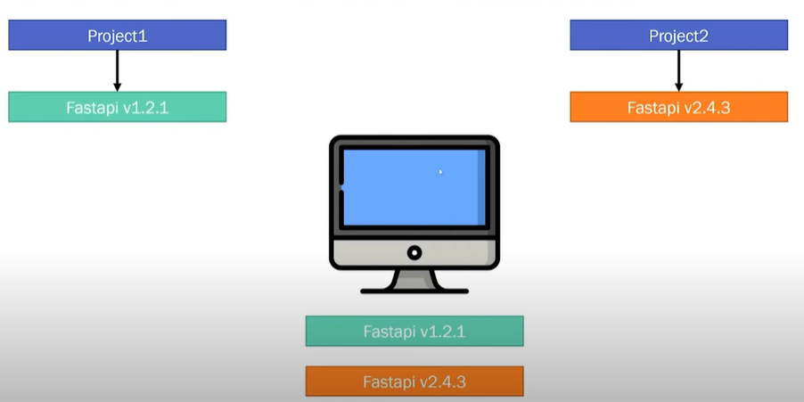
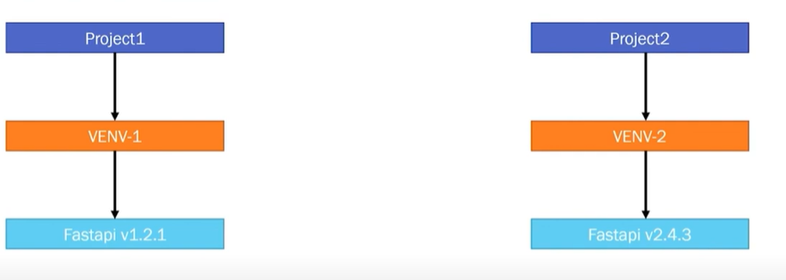
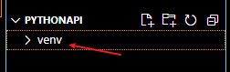
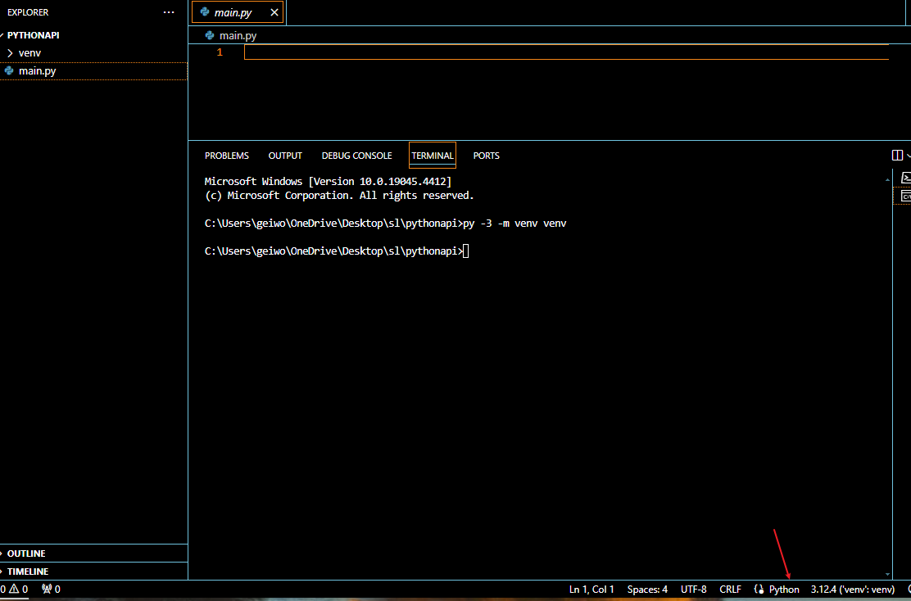
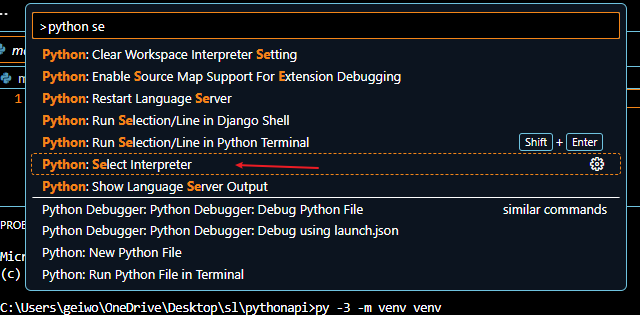
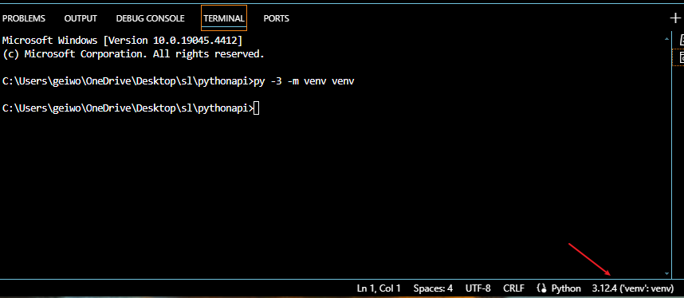
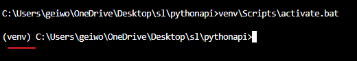
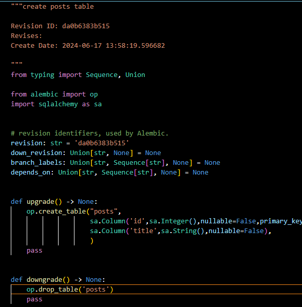
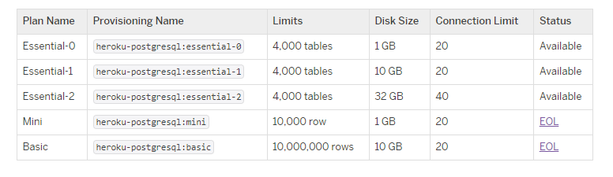
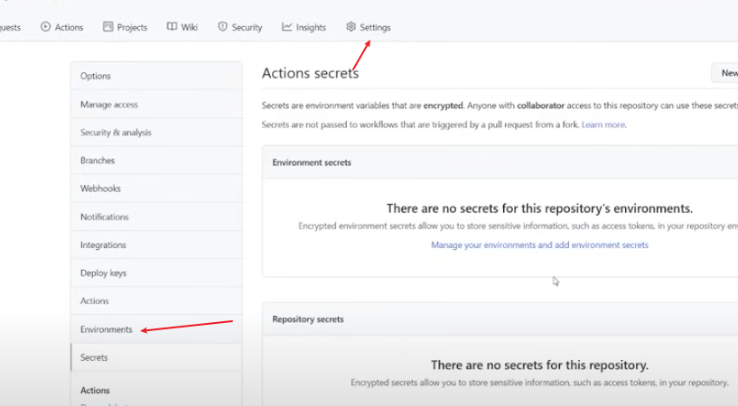

- [Reference Source](#reference-source)
- [Python virtual Environment](#python-virtual-environment)
- [Setup Virtual Env using Anaconda](#setup-virtual-env-using-anaconda)
- [FastApi](#fastapi)
  - [Start Your First FastApi](#start-your-first-fastapi)
  - [Swagger Documentation](#swagger-documentation)
  - [Sqlalchemy : Setup your database](#sqlalchemy--setup-your-database)
  - [Routers](#routers)
  - [SRC Directory](#src-directory)
  - [Migration Tool Alembic](#migration-tool-alembic)
- [Install Python Packages for other Devs](#install-python-packages-for-other-devs)
- [Heroku](#heroku)
- [Deployment on DigitalOcean](#deployment-on-digitalocean)
- [Docker Deployment](#docker-deployment)
- [PyTest](#pytest)
- [CI/CD](#cicd)

# Reference Source
- [Youtube](https://www.youtube.com/watch?v=0sOvCWFmrtA&t=482s)
- [Github](https://github.com/Sanjeev-Thiyagarajan/fastapi-course)

# Python virtual Environment

**介绍**
虚拟环境主要用户区分不同工作项目对工作环境需求的工作包版本上的冲突。



上图显示两个不同的项目对`Fastapi`包的版本要求不同，但一个主机只能安装一个版本，为了解决这问题，就需要在每个项目里创建一个`虚拟环境`，如图下：




**实践**
1. 在terminal打下如下指令：
```bash
py -3 -m venv <name>

## example

py -3 -m venv venv
```

输入后，我们能在项目文档下发现一个`venv(基于给予的名称)`的文档。


2. 创建一个main.py文件。主要是观测vs code使用python的版本


从上图可以看出，vs code 自动给我们检测主机python并more应用它。
然而我们不能直接使用默认的python，而是需要切换成`虚拟环境`下的python
路径在：venv/Scipts/python.exe

3. 切换python interpreter。
> 先Ctrl + Shift + p -> Python: Select Interpreter -> Enter interpreter path ...（如果recommendation有正确的路径直接选择） -> 
输入 .\venv\Scipts\python.exe




选好后，左下角的interpreter会变成如下：


4. 此外，我们也需要切换terminal 使用的环境。`venv`内包含激发虚拟环境的工具，因此只需在terminal打下如下指令：
```bash
venv\Scripts\activate.bat
```
成功激发后，terminal会变成如下：


> **注意**
> 1. 每次打开项目文档的时候，注意一下interpreter是否变回了默认选项以及是否terminal是否退出虚拟环境的状态。
> 2. powershell terminal 即使激发activate.bat，也不会显示（venv）的标签，因此建议切换**cmd**的terminal


# Setup Virtual Env using Anaconda

1. Install Anaconda
2. Be sure conda is add to `Environment Varaible`. Path is something like: `C:\Users\YourUsername\anaconda3\Scripts`
3. Use following command
```bash
python --version

# pandas & numpy is optional, you can add more option to install for your env
conda create -n venv python=3.10.4 pandas numpy
# or seperate them
conda create -n venv python=3.10.4
conda install pandas numpy

# there will be new env added
conda env list

# check install packages
conda list

# if error show asking you to execute
conda init

conda activate venv

conda deactivate

# remove env, be sure deactivate first
conda remove -n venv --all
```

# FastApi

[官网](https://fastapi.tiangolo.com/tutorial/)

1. 安装fastapi。注意实在**虚拟环境**下。
```bash
pip install fastapi[all]

## all 是指安装所有dependency(package)
## 能在venv/Lib/site_packages下找到所有安装的packages

# list all install packages
pip freeze
```

## Start Your First FastApi
```python
# main.py
from fastapi import FastAPI

app = FastAPI()

@app.get("/")
def root():
    return {"message": "Hello World pushing out to ubuntu"}
```
Run your app with command `uvicorn main:app --reload`. `--reload` is optional, but it important for dev environment as the app will reload for every single change(save) in code to avoid restart every time.

## Swagger Documentation

Two version of Swagger Documentation are build in FastApi

The path will be:
localhost:port/docs
or
localhost:port/redoc

## Sqlalchemy : Setup your database
1. Install sqlalchemy
```bash
pip install sqlalchemy
```
2. Create your models
3. Add following line of code to enable models auto create if dont exist in connected database
```python
from . import models

# This will become useless as afterward will introduce migrate tool:Alembic
models.Base.metadata.create_all(bind=engine)
```

## Routers
Instead put every routes into same file(main.py), it good practice to group the routes in different router.

Example:
```python
# main.py

# post routes
@app.get("/posts")
def get_post():
    return {"message": ""}

@app.post("/posts")
def add_post():
    return {"message": ""}

@app.delete("/posts/{id}")
def delete_post(id: int):
    return {"message": ""}

# vote routes
@app.get("/votes")
def get_vote():
    return {"message": ""}

@app.vote("/votes")
def add_vote():
    return {"message": ""}

@app.delete("/votes/{id}")
def delete_vote(id: int):
    return {"message": ""}
```

Group them in two router:
```python
# /routers/post.py
from fastapi import FastAPI, Response, status, HTTPException, Depends, APIRouter

router = APIRouter(
    prefix="/posts",
    tags=['Posts']
)

@router.get("/")
def get_post():
    return {"message": ""}

@router.post("/")
def add_post():
    return {"message": ""}

@router.delete("/{id}")
def delete_post(id: int):
    return {"message": ""}


# /routers/vote.py
@router.get("/")
def get_vote():
    return {"message": ""}

@router.vote("/")
def add_vote():
    return {"message": ""}

@router.delete("/{id}")
def delete_vote(id: int):
    return {"message": ""}
```

## SRC Directory
为了更好构筑编码，我们通常都会将其切割成几个高效性的模块进行管理。

fastapi同理，它的模块被称为package。

例如，当前的主要运行main.py处于root路径，然而出于一些考虑我们打算将其放到`/app`的package里

步骤如下：
1. 创建app文档
2. 然后在文档下创建一个命名为__init__.py的文件。内容为空。这是每个package之下必须存在的文件，否则无法被视作为一个package
3. 将main.py拖入app文档
4. 然后使用uvicorn运行
```sh
uvicorn app(package name).main(file name):app(operation variable inside main.py) --reload
```

## Migration Tool Alembic
1. Install Alembic
```bash
pip install alembic
```
2. Initialize Alembic, and the alembic directory(depend name you giving,on this example we use **aldb** as example) and alembic.ini file will created.
```bash
alembic init aldb
```
3. Go to alembic.ini, remove **sqlalchemy.url** value which original set as null. we will set the value in `env.py` inside aldb directory.
4. Move to aldb folder and click inside `env.py` file, there few change need to do
> 1. **target_metadata** values change Base which is import from models.py instead of database.py
> 2. Rewrite sqlalchemy.url value by adding following script.(Avoid expose connection on alembic.ini)
```python
config.set_main_option(
    "sqlalchemy.url",
    f'postgresql://{settings.database_username}:{settings.database_password}@{settings.database_hostname}/{settings.database_name}')
```
5. Now we can add create our first migration with following command. This command will create migration file under aldb folder
```bash
alembic revision -m "create posts table"
```
6. You need to **manually** typing what this migration does on both upgrade and downgrade part which is very pain

7. Then execute the migration will following command:
```bash
alembic upgrade revision_no(da0b638....)
```
8. There few alembic command you can use to track the migration version, like `*alembic current, alembic heads*` etc. [Reference](https://youtu.be/0sOvCWFmrtA?t=39217)
9. Goodness, alembic support auto generate migrate file, use folliwng command
```bash
alembic revision --autogenerate -m "messagehere"
```

**Alembic cheat sheet**
```bash
# head refers to the latest migration, 
alembic upgrade head

# apply migrate by levels
alembic upgrade +2

# check latest migration which already apply
alembic heads

# list migrations which already apply
alembic current

# downgrade to specific version
alembic downgrade revision_no

# downgrading levels
alembic downgrade -2
```

# Install Python Packages for other Devs
1. You can check all you packages with command `pip freeze`
2. Now print the output of listing packages to a file with following command
```bash
pip freeze > requirement.txt
```
3. Now the other devs can easily install packages by one command:
```bash
pip install -r requirement.txt
```

# Heroku
1. Install heroku from official website. For window, install with installer
2. Check heroku whether is success installed
```bash
heroku --version
```
3. Login heroku. Enter you credential for pop out browser to login
```bash
heroku login
```
4. Create heroku app
```bash
heroku create [app-name]
```
> Be note you need to add payment method first before are able to create any app
5. You will see `heroku` remote by using `git remote` command. You need push you source code to this remote. This action will deploy our code on heroku.
```bash
#check heroku whether got created
git remote

git push heroku main

#once installation and deployment done after last command, it will return a url that deploy the app
```
6. The app deploy will fail for now as heroku doesn't know what exactly app we deploy, like what tool, what is running command. We need create Procfile which will use to telling heroku how to run deployed app.
**Profile**
```
web: uvicorn app.main:app --host=0.0.0.0 --port=${PORT:-5000}
```
7. After make change, push change to both git and heroku
```bash
git add .
git commit -m "add procfile"

#push to git
git push origin main

#push to heroku
git push heroku main
```
8. If any issue happen, you can run:
```bash
heroku logs -t

#use heroku logs --help to see more options
#for this case, we assume it happen error because of environment setting binding as .env file will be ignore by gitignore
```
9. Heroku support many add-ons tool, which include postgresql. To create postgres on heroku, use following command
```bash
#heroku addons:create heroku-postgresql:<PLAN_NAME>

heroku addons:create heroku-postgresql:essential-0

```

[Full Heroku Plan](https://devcenter.heroku.com/articles/heroku-postgres-plans)
10. Go to app dashboard on heroku, and find out the postgres credential which just created.[Ref](https://youtu.be/0sOvCWFmrtA?t=42503)
11. Go to app setting tab, and set the environment variable for app.[Ref](https://youtu.be/0sOvCWFmrtA?t=42608)
12. Once environment variables all set, restart the heroku app
```bash
heroku ps:restart

#check whether error still persist
heroku logs -t
```
13. Check heroku app info
```bash
heroku apps:info [app-name]

#check web url and then paste on browser check whether app can work
# it will fail on calling any api because the new postgres created dont have any table yet
```
14. Run alembic migration command on heroku instance to initialize tables creation.
```bash
heroku run "alembic upgrade head"

heroku ps:restart
```
15. Any change are make in project, do the following steps
```bash
git add .
git commit -m "addmessage"

git push origin main
git push heroku main
```

# Deployment on DigitalOcean

1. Create a Droplet(Ubuntu) on digitalocean. 
   - Set `Authentication` Type as `Password`
   - Give any hostname
2. Remote login instance on local terminal
```bash
ssh root@ip_address

# enter password
```
3. Update os
```bash
sudo apt update && sudo apt upgrade -y

#will pop up openssh-server configure window, just choose install the package maintiner version option
```
4. Check whether python and pip is installed
```bash
python --version
#if no install try
python3 --version
#if still no installed,check doc how to install python on ubuntu

#check pip
pip3 --version
#or
pip --version

# install pip if no installed
sudo apt install python3-pip
```
5. Install virtual env and postgres
```bash
sudo pip3 install virtualenv

# install postgres
sudo apt install postgresql postgresql-contrib -y

# once you install success, postgres will add as os system.

# check postgres whether install success
psql --version

psql -U postgres
# will fail to login with user postgres if you are root currently

# switch user from root to postgres and try again
su - postgres

psql -U postgres
#login postgres success

#if login success as postgres user, then assign password to postgres user
\password postgres
# Here will ask you entre password

```
[Ref](https://youtu.be/0sOvCWFmrtA?t=44067)
6. Enable instance postgres connect to our local machine(pgadmin).[Ref](https://youtu.be/0sOvCWFmrtA?t=44314)
```bash
cd /etc/postgresql/12(postgres_version)/main

ls

sudo vi postgresql.conf

# check ref link to see how it work
# 1. Go to Connection and Authentication Section(postgresql.conf), set listen_addresses to you local ip or just listen_address="*" to allow any machine access it.
# 2. Go to Database adminstrative login section(pg_hba.conf),change method peer to md5.md5 mean login as password. Change address to 0.0.0/0 to enable all address access. Detail check Ref explaination

systemctl restart postgresql
# 3. After all config all set, restart postgresql and try connect postgresdb on local pgadmin
```
7. It is not safe to run api service with root user as it may be vulnability.
```bash
#create new non-root user
adduser any_user_name(hoows)

#assign user have root privileges ability
usermod -aG sudo hoows

su - hoows
#or
exit
ssh hoows@ip_address
```
8. Prepare app workplace
```bash
#go to user home path
cd ~

#create app workplace
mkdir app
cd app

#create virtual environment
virtualenv venv

#check whether venv folder success created
ls

#activate virtual environment
source venv/bin/activate

#create source folder
mkdir src
cd src

#copy code to source folder from git.
git clone git_url .
# . will clone all source files to current directory without create folder by their own

#install source packages
pip install -r requirement.txt

#if facing libpq or any missing library, install it and try again
#deactivate virtualenv first before install any missing lib
deactivate
sudo apt install libqp-dev
source venv/bin/activate
pip install -r requirement.txt
```
9. Set environment variables
```bash
pwd
#/home/hoows

#create .env file under home path
vim .env

#copy paste from local .env content. update value accordingly like database password and database username

set -o allexport; source /home/hoows/.env; set +o allexport

#check whether variables are all set
printenv

#all set environment variables will gone after machine reboot, need make it set again when reboot. .profile under /home/hoows
echo set -o allexport; source /root/.env; set +o allexport >> .profile
```
10. Execute database migration
```bash
cd app
source venv/bin/activate
cd src
alembic upgrade head

#check local pgadmin whether tables are created

#try run app
uvicorn app.main:app
#you be found out unicorn was running on http:127.0.0.1:8000 which only can run on local

uvicorn --host 0.0.0.0 app.main:app
```
11. Apply Process Manager call Guvicorn
```bash
#install under virtual env
pip install gunicorn

#if face any error when install gunicorn
pip install httptools
pip install uvloop

gunicorn -w 4 -k uvicorn.workers.UvicornWorker app.main:app --bind 0.0.0.0:8000
```
12. Make web application restart itself if instance reboot by create background service
```bash
cd /etc/systemd/system

vi service_name(fastapi.service)
```
**fastapi.service**
```s
[Unit]
Description=demo fastapi application
After=network.target

[Service]
User=hoows
Group=hoows
WorkingDirectory=/home/hoows/app/src/
Environment="PATH=/home/hoows/app/venv/bin"
EnvironmentFile=/home/hoows/.env
ExecStart=/home/hoows/app/venv/bin/gunicorn -w 4 -k uvicorn.workers.UvicornWorker app.main:app --bind 0.0.0.0:8000

[Install]
WantedBy=multi-user.target
```

```bash
#now you can start you app with systemctl. dont sure .service is need, can try
systemctl start|restart|stop fastapi.service

#enable service auto run when instance reboot
systemctl enable fastapi
```
13. Install nginx
```bash
sudo apt install nginx -y

systemctl start nginx

systemctl enable nginx

cd /etc/nginx/sites-available
sudo vi default
```
**update default config under sites-available**
```nginx
server {
        listen 80 default_server;
        listen [::]:80 default_server;

        server_name _; # replace with specific domain name like sanjeev.com
        
        location / {
                proxy_pass http://localhost:8000;
                proxy_http_version 1.1;
                proxy_set_header X-Real-IP $remote_addr;
                proxy_set_header X-Forwarded-For $proxy_add_x_forwarded_for;
                proxy_set_header Upgrade $http_upgrade;
                proxy_set_header Connection 'upgrade';
                proxy_set_header Host $http_host;
                proxy_set_header X-NginX-Proxy true;
                proxy_redirect off;
        }
}
```
14. Binding a domain name

You can bug cheap domain on this [site](https://www.googleadservices.com/pagead/aclk?sa=L&ai=DChcSEwiM69CM_OSGAxWPpGYCHZMABdYYABAAGgJzbQ&ase=2&gclid=Cj0KCQjw4MSzBhC8ARIsAPFOuyXevZHkRK8EBhwC0AISaVLH8Ggxdh0-Q-UYSufJCtNyDPD58fd8kmoaAsx0EALw_wcB&ohost=www.google.com&cid=CAESVeD2y_PzeyHQUwCTVXU8WK5XTCqWWsdB4durAcMOKdKRNbXj1Xnit6VjZODw_lN_GsxzFfypmNgvMN06NZHt5TrV-ZgF565NJPe-oXXbztHlVq_PidM&sig=AOD64_26KxFB8Vt2fnIilipo7q3p-KLe6A&q&nis=4&adurl&ved=2ahUKEwjsl8yM_OSGAxXMzDgGHdwnBtkQ0Qx6BAgLEAE)

[Here will guide how to point digitalocean nameserver from common domain registrars](https://docs.digitalocean.com/products/networking/dns/getting-started/dns-registrars/)

15. Apply SSL
[Ref](https://youtu.be/0sOvCWFmrtA?t=47743)
Free certificate generation - [Certbot](https://certbot.eff.org/)
```bash
sudo snap install --classic certbot
#install snap first if yet install

sudo certbot --nginx
```

16. Setup firewall to restrict port for public
```bash
sudo ufw status
#Status:inactive

sudo ufw allow http
sudo ufw allow https
sudo ufw allow ssh
sudo ufw allow 5432 (if you want allow database access public)

sudo ufw enable
sudo ufw status

#optional delete rule
sudo ufw delete allow http
```
17. Pushing code changes to Production
```bash
#local, assume you make some change
git add .
git commit -m "change message"

git push origin main

#digitalocean
cd app/src
git pull
sudo systemctl restart fastapi
```

# Docker Deployment
1. Create a Dockerfile
```docker
FROM python:3.9.7
WORKDIR /usr/src/app
COPY requirements.txt ./
RUN pip install --no-cache-dir -r requirements.txt
COPY . .
CMD ["uvicorn", "app.main:app", "--host", "0.0.0.0", "--port", "8000"]
```
2. Run docker file
```bash
docker build -t image_name(fastapi) .

#check if docker images is created
docker images
```
3. Use docker-compose. Create two docker-compose file for dev and prod environment
**docker-compose-dev.yml**
```yml
version: "3"
services:
  api:
    build: .
    ports:
      - 8000:8000
    volumes:
      - ./:/usr/src/app
    # env_file:
    #     - ./.env
    environment:
      - DATABASE_HOSTNAME=postgres
      - DATABASE_PORT=5432
      - DATABASE_PASSWORD=password123
      - DATABASE_NAME=fastapi
      - DATABASE_USERNAME=postgres
      - SECRET_KEY=09d25e094faa6ca2556c818166b7a9563b93f7099f6f0f4caa6cf63b88e8d3e7
      - ALGORITHM=HS256
      - ACCESS_TOKEN_EXPIRE_MINUTES=30
    command: uvicorn app.main:app --host 0.0.0.0 --port 8000 --reload
    depends_on:
      - postgres

  postgres:
    image: postgres
    environment:
      - POSTGRES_PASSWORD=password123
      - POSTGRES_DB=fastapi
    volumes:
      - postgres-db:/var/lib/postgresql/data

volumes:
  postgres-db:
```
**docker-compose-prod.yml**
```yml
version: "3"
services:
  api:
    image: sloppynetworks/fastapi-app
    ports:
      - 80:8000
    environment:
      - DATABASE_HOSTNAME=${DATABASE_HOSTNAME}
      - DATABASE_PORT=${DATABASE_PORT}
      - DATABASE_PASSWORD=${DATABASE_PASSWORD}
      - DATABASE_NAME=${DATABASE_NAME}
      - DATABASE_USERNAME=${DATABASE_USERNAME}
      - SECRET_KEY=${SECRET_KEY}
      - ALGORITHM=${ALGORITHM}
      - ACCESS_TOKEN_EXPIRE_MINUTES=${ACCESS_TOKEN_EXPIRE_MINUTES}

    depends_on:
      - postgres

  postgres:
    image: postgres
    environment:
      - POSTGRES_PASSWORD=${DATABASE_PASSWORD}
      - POSTGRES_DB=${DATABASE_NAME}
    volumes:
      - postgres-db:/var/lib/postgresql/data

volumes:
  postgres-db:
```
4. Run docker compose
```bash
docker-compose -f docker-compose-dev.yml up --build
#or
docker-compose -f docker-compose-prod.yml up --build
#or
docker-compose -f docker-compose-prod.yml up -d

docker logs container_id
```
5. Create repo on dockerhub and get the repo name
```bash
docker login

docker image tag image_source_name:tag repo_name:tag

docker push repo_name:tag
```

# PyTest
1. Install pytest
```bash
pip install pytest
```
2. There is rule for pytest. file name and the test method should all have prefix 'test'. Example, i have test_user.py file and inside the file contain test_root() function.
3. Command to start test. More [commands](https://docs.pytest.org/en/7.1.x/example/markers.html)
```bash
# test all test files and each contain functions
pytest

# test all files and each contain function and show each test function status
pytest -v

# test only specific test file
pytest -v -s tests/test_user.py

pytest --diable-warnings
```
4. You can set global fixture with file name call conftest.py. Be note the name is fixed!


# CI/CD
[Reference](https://www.youtube.com/watch?v=0sOvCWFmrtA&t=63809s)
1. To start CI/CD with github action, create .github/workflows under you root project path
2. Create yml file under .github/workflows, by this case build-deploy.yml file was create.
```yml
#sample test

name: Build and Deploy Code

on: [push, pull_request]

#or
# on:
#   push:
#     branches: ["main"]
#   pull_request:
#     branches: ["test_branch"]

#or
# on:
#   push:
#     branches:
#       - "main"
#       - "anotherbranch"

jobs:
  anyjobname1:
    runs-on: ubuntu-latest #select an os to deploy
    steps:
      - name: give any action name like print hello
        uses: echo hello
```
3. Deploy api under environment ubuntu(latest).
```yml
name: Build and Deploy Code

on: [push, pull_request]

jobs:
  build:
    runs-on: ubuntu-latest #select an os to deploy
    steps:
      - name: pulling git repo
        uses: actions/checkout@v2

      - name: Install python version 3.9
        uses: actions/setup-python@v2
        with:
          python-version: "3.9"

      - name: update pip
        run: python -m pip install --upgrade pip

      - name: install all dependencies
        run: pip install -r requirements.txt

      - name: test with pytest  #this step will fail because environment variable no set yet. Will explain in next step
        run: |
          pip install pytest
          pytest      
```

> Be note on actions usages.
> For example, in step 'Install python version 3.9', you can set 'sudo apt install python3' instead of 'actions/setup-python@v2'. However, that might need take more than one command to make install on specific service, so the existing actions extension will help on simplify the commands.
> To find out find action, can check [github marketplace](https://github.com/marketplace)
4. You can set environment directly on yml file,however it will expose variable value, so it not an ideal solution
```yml
name: Build and Deploy Code

on: [push, pull_request]

#global env which can share across all job
# env:
#   DATABASE_USERNAME: postgres
#   DATABASE_PASSWORD: 123

jobs:
  build:
    env: #this environment only work within this job, other job cant access
      DATABASE_USER: postgres

    runs-on: ubuntu-latest
    steps:
      - name: pulling git repo
        uses: actions/checkout@v2

      - name: Install python version 3.9
        uses: actions/setup-python@v2
        with:
          python-version: "3.9"

      - name: update pip
        run: python -m pip install --upgrade pip

      - name: install all dependencies
        run: pip install -r requirements.txt

      - name: test with pytest
        run: |
          pip install pytest
          pytest   
```
5. The ideal way to set environment variable is set on github repo. Go to you github repo, go to `Settings` tab. Create new environment and naming **testing** under Environments tab. And then, you can input as many environment variable(secret) as you can.


And **build-deploy.yml** will be:
```yml
name: Build and Deploy Code

on: [push, pull_request]

jobs:
  build:
    environment:
      name: testing # Be name must exact same what you create in settings
    env:
      DATABASE_USERNAME: ${{secrets.DATABASE_USERNAME}}
      DATABASE_HOSTNAME: ${{secrets.DATABASE_HOSTNAME}}

    runs-on: ubuntu-latest
    steps:
      - name: pulling git repo
        uses: actions/checkout@v2

      - name: Install python version 3.9
        uses: actions/setup-python@v2
        with:
          python-version: "3.9"

      - name: update pip
        run: python -m pip install --upgrade pip

      - name: install all dependencies
        run: pip install -r requirements.txt

      - name: test with pytest
        run: |
          pip install pytest
          pytest   
```

> Be note you can move to **Secrets** tab and doing the same like **Environments** tab.
> Only different between them is the set secret of **Environment** be group under one `environment` and need specific on yml file before access it, while **Secrets** will be a global environment which dont need specific environment on yml file.
6. Github CI/CD support docker container. On this case, we will setup postgres container in order for our api.
```yml
jobs:
  build:
    environment:
      name: testing
    env:
      DATABASE_HOSTNAME: ${{secrets.DATABASE_HOSTNAME}}
      DATABASE_PORT: ${{secrets.DATABASE_PORT}}
      DATABASE_PASSWORD: ${{secrets.DATABASE_PASSWORD}}
      DATABASE_NAME: ${{secrets.DATABASE_NAME}}
      DATABASE_USERNAME: ${{secrets.DATABASE_USERNAME}}
      SECRET_KEY: ${{secrets.SECRET_KEY}}
      ALGORITHM: ${{secrets.ALGORITHM}}
      ACCESS_TOKEN_EXPIRE_MINUTES: ${{secrets.ACCESS_TOKEN_EXPIRE_MINUTES}}

    services: #Be sure put this before making deploy on ubuntu server otherwise api cant connect to db.
      postgres:
        image: postgres
        env:
          POSTGRES_PASSWORD: ${{secrets.DATABASE_PASSWORD}}
          POSTGRES_DB: ${{secrets.DATABASE_NAME}}_test
        ports:
          - 5432:5432
        options: >-
          --health-cmd pg_isready
          --health-interval 10s
          --health-timeout 5s
          --health-retries 5

    runs-on: ubuntu-latest
    steps:
      - name: pulling git repo
        uses: actions/checkout@v2

      - name: Install python version 3.9

        uses: actions/setup-python@v2
        with:
          python-version: "3.9"

      - name: update pip
        run: python -m pip install --upgrade pip

      - name: install all dependencies
        run: pip install -r requirements.txt

      - name: test with pytest
        run: |
          pip install pytest
          pytest
```
7. Let assume we have another server hosting our api on digitalocean(ubuntu). So we wanna apply CI/CD to it when git repo was updated.
```yml
jobs:
  build:
    environment:
      name: testing
    env:
      DATABASE_HOSTNAME: ${{secrets.DATABASE_HOSTNAME}}
      DATABASE_PORT: ${{secrets.DATABASE_PORT}}
      DATABASE_PASSWORD: ${{secrets.DATABASE_PASSWORD}}
      DATABASE_NAME: ${{secrets.DATABASE_NAME}}
      DATABASE_USERNAME: ${{secrets.DATABASE_USERNAME}}
      SECRET_KEY: ${{secrets.SECRET_KEY}}
      ALGORITHM: ${{secrets.ALGORITHM}}
      ACCESS_TOKEN_EXPIRE_MINUTES: ${{secrets.ACCESS_TOKEN_EXPIRE_MINUTES}}

    services: #Be sure put this before making deploy on ubuntu server otherwise api cant connect to db.
      postgres:
        image: postgres
        env:
          POSTGRES_PASSWORD: ${{secrets.DATABASE_PASSWORD}}
          POSTGRES_DB: ${{secrets.DATABASE_NAME}}_test
        ports:
          - 5432:5432
        options: >-
          --health-cmd pg_isready
          --health-interval 10s
          --health-timeout 5s
          --health-retries 5

    runs-on: ubuntu-latest
    steps:
      - name: pulling git repo
        uses: actions/checkout@v2

      - name: Install python version 3.9

        uses: actions/setup-python@v2
        with:
          python-version: "3.9"

      - name: update pip
        run: python -m pip install --upgrade pip

      - name: install all dependencies
        run: pip install -r requirements.txt

      - name: test with pytest
        run: |
          pip install pytest
          pytest
  
  second_job_ubuntu_up:
    runs-on: ubuntu-latest
    needs: [build] #it same concept of 'depend' in docker. This job only run if only build job was success
    environment:
      name: production
    steps:
       - name: deploy to ubuntu server
        uses: appleboy/ssh-action@master
        with:
          host: ${{secrets.PROD_HOST}}
          username: ${{secrets.PROD_USERNAME}}
          password: ${{secrets.PROD_PASSWORD}}
          script: |  #fastapi is the service manually created, can see previous chapter
            cd app/src
            git pull
            echo ${{secrets.PROD_PASSWORD}} | sudo -S systemctl restart fastapi
```