- [Tips](#tips)
  - [Quick Access Field \& Local Change](#quick-access-field--local-change)
  - [Wrap DATE function to other Date functions](#wrap-date-function-to-other-date-functions)
  - [Use TODAY() Reference Line in chart](#use-today-reference-line-in-chart)
  - [Preview Source Data In Worksheet](#preview-source-data-in-worksheet)
  - [ATTR Function Use Case \& Emblem worksheet](#attr-function-use-case--emblem-worksheet)
  - [Hide Chart Grid Line](#hide-chart-grid-line)
  - [Show/Hide Card](#showhide-card)
  - [Format Number](#format-number)
  - [Fix values format because of continous column](#fix-values-format-because-of-continous-column)
- [Basic](#basic)
  - [Discrete \& Continuous](#discrete--continuous)
  - [Renaming Discrete Field Locally(Within Worksheet)](#renaming-discrete-field-locallywithin-worksheet)
  - [Alias](#alias)
  - [Create Hierachy](#create-hierachy)
  - [Drill Down \& Drill Up - Hierachy](#drill-down--drill-up---hierachy)
  - [Date Hierarchy](#date-hierarchy)
  - [Create Group](#create-group)
  - [Create Cluster Group](#create-cluster-group)
  - [Create Set](#create-set)
  - [Bins](#bins)
  - [Filtering Data](#filtering-data)
    - [Data Source Filter](#data-source-filter)
    - [Context Filter](#context-filter)
    - [Dimension Filter](#dimension-filter)
    - [Measure Filter](#measure-filter)
    - [Table Calculation Filter](#table-calculation-filter)
    - [Apply filters](#apply-filters)
  - [Disable Sorting](#disable-sorting)
  - [Parameters](#parameters)
    - [Dynamic Calculation](#dynamic-calculation)
    - [Dynamic Reference Line](#dynamic-reference-line)
    - [Dynamic Filters](#dynamic-filters)
    - [Dynamic Swap Dimensions/Measures](#dynamic-swap-dimensionsmeasures)
    - [Dynamic Title](#dynamic-title)
    - [Dynamic Bins](#dynamic-bins)
  - [Tableau Actions](#tableau-actions)
    - [Filter Action](#filter-action)
    - [Filter Highlight Action](#filter-highlight-action)
    - [Change Parameter Action](#change-parameter-action)
- [Tableau Calculations](#tableau-calculations)
  - [Logical Functions](#logical-functions)
    - [IF statement](#if-statement)
    - [SWITCH CASE](#switch-case)
    - [IIF](#iif)
  - [CEILING,FLOOR,ROUND](#ceilingfloorround)
  - [String Functions](#string-functions)
  - [Date Functions](#date-functions)
  - [Null Functions](#null-functions)
  - [LOD (Level Of Detail) Functions](#lod-level-of-detail-functions)
    - [FIXED](#fixed)
  - [Table Calculation Functions](#table-calculation-functions)
    - [First Use Case](#first-use-case)
    - [Running Total Use Case](#running-total-use-case)
    - [Difference Use Case](#difference-use-case)
- [Charts](#charts)
  - [Charts Types](#charts-types)
    - [Individual Axes](#individual-axes)
    - [Single Axes](#single-axes)
    - [Dual Axes](#dual-axes)
  - [Chart Examples](#chart-examples)
    - [Side by side bar chart](#side-by-side-bar-chart)
    - [Stack bar](#stack-bar)
    - [Stack Bar 2](#stack-bar-2)
    - [Full Stack Bar](#full-stack-bar)
    - [Multi Small Bar Charts](#multi-small-bar-charts)
    - [Bar-in-bar chart](#bar-in-bar-chart)
    - [Barcode chart](#barcode-chart)
    - [Multi Lines Chart](#multi-lines-chart)
    - [Highlighted Line Chart(1)](#highlighted-line-chart1)
    - [Highlighted Line Chart(2)](#highlighted-line-chart2)
    - [Bump Chart](#bump-chart)
    - [Barbell Chart](#barbell-chart)
    - [Barbell Chart 2](#barbell-chart-2)
    - [Rounded Bar Chart](#rounded-bar-chart)
    - [Slope Chart](#slope-chart)
    - [Bullet Chart](#bullet-chart)
    - [Lollipop Chart(H)](#lollipop-charth)
    - [Lollipop Chart(V)](#lollipop-chartv)
    - [Basic Scatter Plot](#basic-scatter-plot)
    - [Customized Scatter Plot](#customized-scatter-plot)
    - [Dot plot](#dot-plot)
    - [Circle Timeline](#circle-timeline)
    - [Dotnut Chart](#dotnut-chart)
    - [Tree Map](#tree-map)
    - [Bublle Chart](#bublle-chart)
    - [Stacked Bublle Chart](#stacked-bublle-chart)
    - [Dark Border Map](#dark-border-map)
    - [Histogram](#histogram)
    - [Calendar Chart](#calendar-chart)
    - [Waterfall Chart](#waterfall-chart)
    - [Pareto Chart](#pareto-chart)
    - [Pareto Chart 2](#pareto-chart-2)
    - [Butterfly Chart(1)](#butterfly-chart1)
    - [Butterfly Chart(2)](#butterfly-chart2)
    - [Quadrant Chart(Dynamic)](#quadrant-chartdynamic)
    - [KPI Chart](#kpi-chart)
    - [KPI \& Bar Chart](#kpi--bar-chart)
    - [BANS](#bans)
    - [Progress Bar Chart](#progress-bar-chart)
- [Advances](#advances)
  - [Toggle Charts By Actions](#toggle-charts-by-actions)


# Tips

## Quick Access Field & Local Change
Local Change mean the changes wont effect other sheets


## Wrap DATE function to other Date functions
This will ensure the date is present in Date format instead of string


## Use TODAY() Reference Line in chart


## Preview Source Data In Worksheet


## ATTR Function Use Case & Emblem worksheet


## Hide Chart Grid Line


## Show/Hide Card


## Format Number


## Fix values format because of continous column

**Summary:** wrap field value with `{}`


# Basic

## Discrete & Continuous


## Renaming Discrete Field Locally(Within Worksheet)


## Alias


**Notes**
1. Only Worksheet can create alias
2. Alias work globally for all sheets

**Steps**
1. Right click the field you want to create alias, and select **Aliases** option
2. Edit Alias


**Recommended Way to create Aliases**
Duplicate the field first, then make the aliases on that duplicate field
**Right Click the field -> Duplicate**

Duplicate field always start `=` sign in front of data type

## Create Hierachy


**Notes**
1. Only can create at worksheet page
2. Hierary only can create for dimension field but not continuous field


**Steps create hierarchy**
1. Select the top level hierachy field, for this case, it will be `Country`
2. Right click -> Hierarchy ->　Create Hierarchy -> Give Hierarchy Name
3. And then just drag and drop the second,third or even more of other level fields inside hierarchy just created.

**Easy Method**
Drag and drop one of the field to another field, then it will pop out create hierarchy window


## Drill Down & Drill Up - Hierachy

For those which is hierarchy field and have child nodes, it will show `+` sign


After click `+` icon(drill down icon)


Vice versa, `-` icon mean drill up

## Date Hierarchy


## Create Group

**Steps**
1. Worksheet Panel
2. Right click the field for group created -> Create -> Group -> Give Group Name(Field Name)
3. Select the items to group them together


You can include `Group` inside the hierarchy
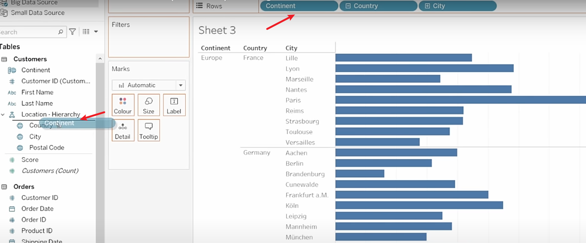

## Create Cluster Group


**Steps**


[Ref](https://youtu.be/K3pXnbniUcM?t=20092)


## Create Set


**Steps For Fix Set**
Right Click Field -> Create -> Set -> General Tab -> Select items(In below case select id 2 & 5)


**Steps For Dynamic Set(Condition)**
Right Click Field -> Create -> Set -> Condition Tab -> set condition(below case is if score is > 400)


**Steps For Dynamic Set(Top)**
Right Click Field -> Create -> Set -> Top Tab -> set top condition

**Steps For Create Combine Set**
Right Click on any `Set Type Field` -> Create Combined Set

**Quick create set**


## Bins
Bins divide the data into groups of equally sized containers resulting in systematic distribution of the data and we can use those pens to create charts(Histogram).


**Notes**
- Bins only work for measure field but not dimension field
- Better convert them into `continuous measures`
- Calculated fields cannot be used to create bins.
- Histogram in statistic show the frequency of data within a certain range

**Create bins**
Right click field -> Create -> Bins


## Filtering Data


### Data Source Filter
Data Source Page right top corner


### Context Filter


Add to Context nothing change in surface except turn filter indicate to grey. However, it does change something on background to improve the performance.


Context Filter cannot protect(restrict) specific sensitive or confidential data, it only work on data source filter.

### Dimension Filter
Everything inside `Edit Filter` is Dimension Filter


### Measure Filter
As name imply, only work for measure field


### Table Calculation Filter
Create table calculation


Then drag and drop to filter zone, this will become table calculation filter

### Apply filters


## Disable Sorting


## Parameters

### Dynamic Calculation


**Simple Example**

Original Viz


Right click data panel -> Create Calculated Field


Insert logic


Drag to color for created calculated field


Edit color


Now create new parameter for logic update later
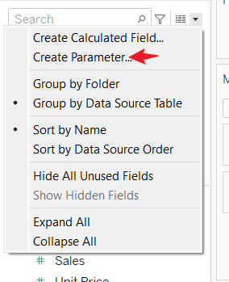


You can show parameter for user to edit


Update KPI CAL calculated field


### Dynamic Reference Line


### Dynamic Filters

Original Viz


Drag using CTRL


Create Param for top filter


Show parameters and make filter adjustable


### Dynamic Swap Dimensions/Measures


Create Parameters For Dimension Field(Country/Category)


Create Calculate Field for dimension


Drag created calculate field to viz and then show created parameters


Create Parameters For Measure Field(Sales,Quantity,Profit)


Create Calculate Field for measures


Drag and replace SUM(Sales) to SUM(Dynamic Measures)


### Dynamic Title
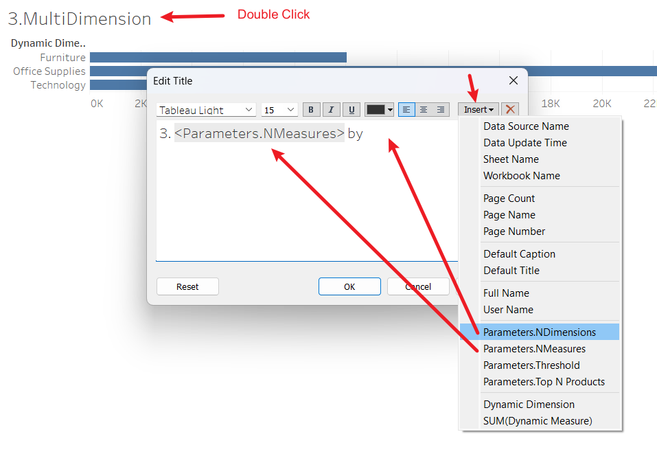

### Dynamic Bins


## Tableau Actions


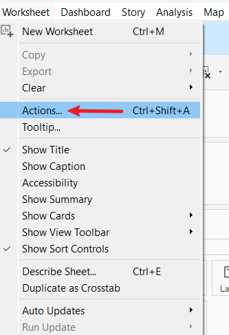


### Filter Action

Let say we have two sheets in dashboard
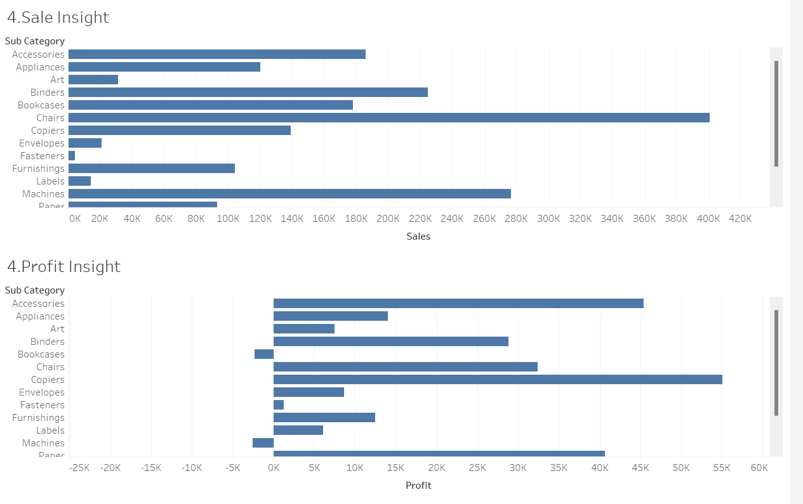

Add Action to dashboard. This action mean, when the bar on `Sale Insign Sheet` was selected, the selected values will become the filter values to `Profit Insight Sheet` graph.


Try select on Sale Insign Sheet and see output
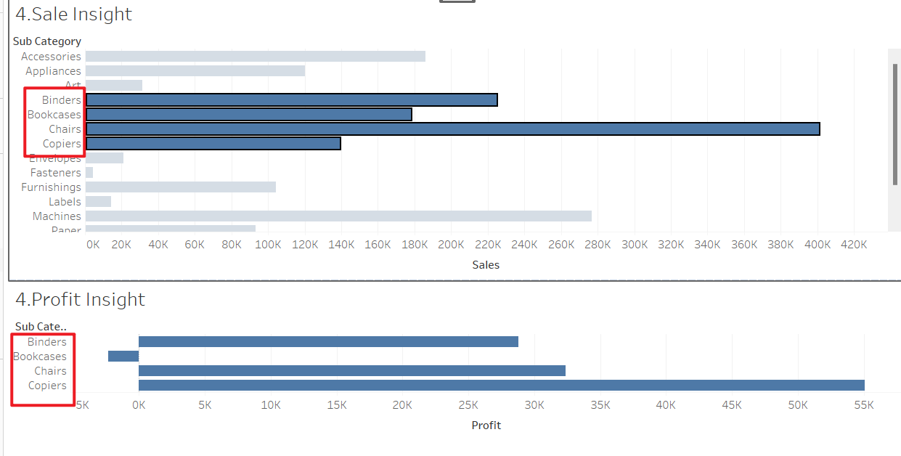

You can use quick filter by hover the sheet, this will auto generate a filter action to you


### Filter Highlight Action


Another highlight method is add highlighther


### Change Parameter Action

Result expected: Select range of bar/points and get total sum.

First Sheet


Create Parameter


Create Calculate Field


Create Action


Put two sheet in dashboard


Select and total sales values update


Update total sales format


# Tableau Calculations

## Logical Functions


### IF statement
```
IF [LOGIC] THEN [RESULT]
ELSEIF [LOGIC2] THEN [RESULT2]
ELSE [RESULT3]
END
```

### SWITCH CASE
```
CASE [FIELD]
WHEN [VALUES] THEN [RESULT]
WHEN [VALUES2] THEN [RESULT2]
END
```

### IIF
```
IIF([LOGIC],[RESULT IF TRUE],[RESULT IF FALSE])
```

## CEILING,FLOOR,ROUND
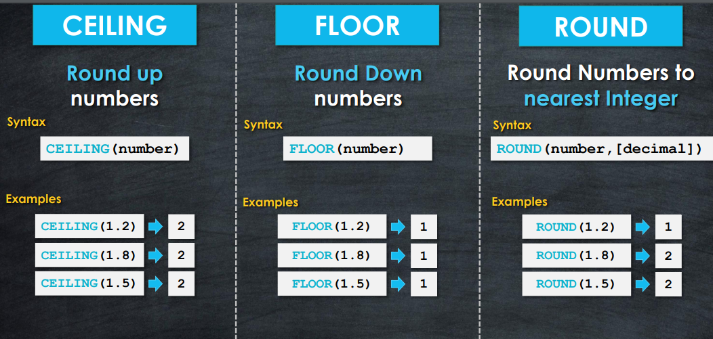

## String Functions


## Date Functions


**Notes**
Be sure change it to Exact Date/Exact Value. When you drag drop any field, it will be assign default function, like if we drag and drop Sales Field, it will auto wrap in SUM(Sales) and display in Viz.


## Null Functions


## LOD (Level Of Detail) Functions

### FIXED
**Question**:


**Example(Check Frequency of order)**


Base on above screenshot, we want to see the frequency of order make, for example, there is **3 orders make** by **2 customer**

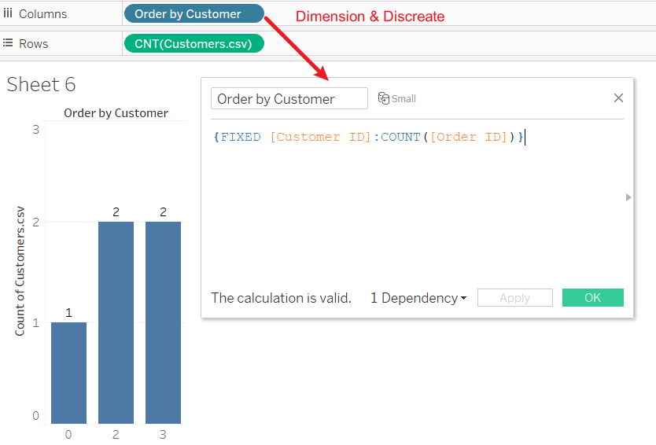

## Table Calculation Functions


### First Use Case


### Running Total Use Case


**Question: How to merge them to one?**


### Difference Use Case


# Charts


## Charts Types

### Individual Axes
Different measures display in different chart


### Single Axes
Two or more meaures display in same chart


Quick way combine measure to viz:


### Dual Axes


Two way create dual axes:


**Different between Single and Dual Axes**
- Single Axes merge multi measures in one chart. There no options are available to customize each measure in the chart
- Dual Axes put two measures in one chart. There have options to customize each measure in the chart. But it only two measures are allow in a chart.

## Chart Examples

### Side by side bar chart


### Stack bar


### Stack Bar 2


### Full Stack Bar


### Multi Small Bar Charts


### Bar-in-bar chart


### Barcode chart


### Multi Lines Chart


### Highlighted Line Chart(1)


### Highlighted Line Chart(2)


1. Create Parameter


2. Create Calculate Field


### Bump Chart


**Use Case**:Ranking


### Barbell Chart


**Use Case:** Show the distance or range(min/max) between two values accross multiple categories

Create two calculate fields before start


### Barbell Chart 2
**Second Method**


### Rounded Bar Chart


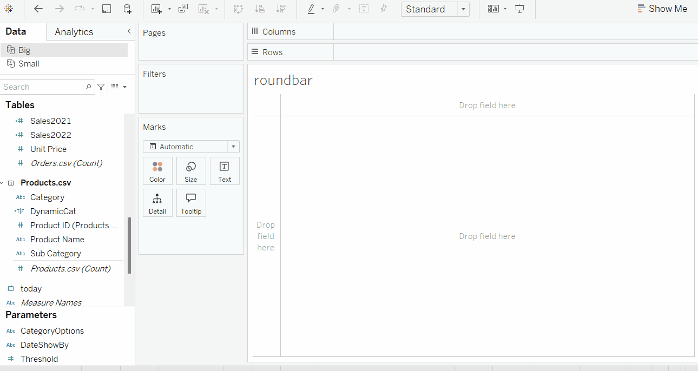

### Slope Chart
**Use Case:** Live Ranking


### Bullet Chart

**Use Case:** Compare two year data


### Lollipop Chart(H)


### Lollipop Chart(V)

Same steps as Lollipop Chart(H), just swap rows and columns


### Basic Scatter Plot

**Use Case:** Correlation and compare two measures


### Customized Scatter Plot


### Dot plot


### Circle Timeline


### Dotnut Chart


### Tree Map


### Bublle Chart


### Stacked Bublle Chart


### Dark Border Map


### Histogram


### Calendar Chart


### Waterfall Chart


### Pareto Chart

**Pareto Principle 80/20 Rule**
`80%` of consequences come from `20%` of the causes


**Analysis Data:**


### Pareto Chart 2


**Analysis Data:**


### Butterfly Chart(1)


### Butterfly Chart(2)


### Quadrant Chart(Dynamic)


Before start, create 2 parameters and 2 calculate field
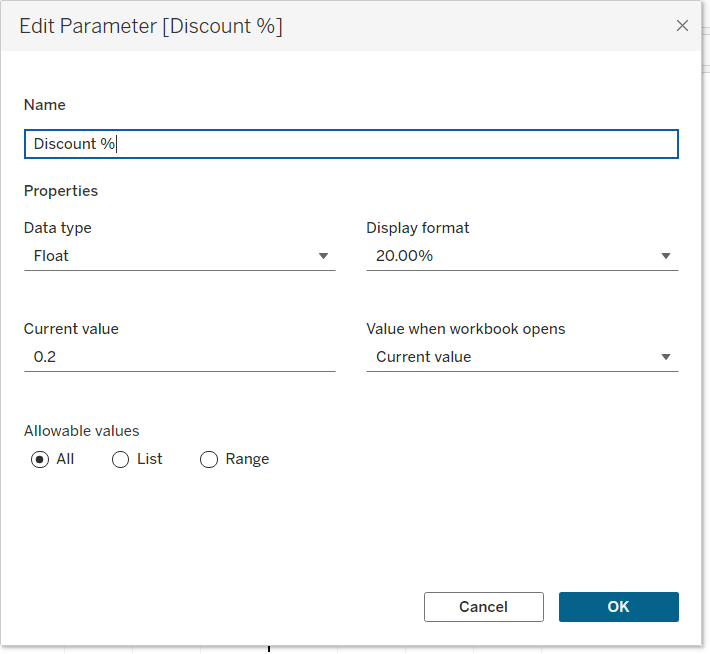


### KPI Chart


Create 1 calculate field before start:


### KPI & Bar Chart


Need prepare three calculate field before start:


### BANS


### Progress Bar Chart


# Advances

## Toggle Charts By Actions

**Demo**


**Steps**
1. Prepare datasets for filters. For this case, i prepare 2 options: `Quarter` and `Year`. Be note load you dataset in different data source(Filter_Opts).

2. Create Toggle View with button pattern

**Few thing to be note:**
- **LEFT([GroupBy],1)** mean take first character, like Quarter = `Q`
- **Update Labels Alignment**: Make horizotal alignment as `center`
3. Create calculate field for toggle function

**PS:** Make sure this calculate field create at main datasource
4. Now we need to prepare two chart. Let say chart1 show quarterly data and chart2 show yearly data.


Let say param default value is 'Quarter', so let walk throught to chart1(quarter) first.

Drag and Drop [Toggle-Trend Switch] to Filters fields, then you will see `1` in the filter options.
As we state in calc field, `1` mean 'Quarter'
Tick it to make chart1 only show if param values is 'Quarter'


Similar to chart1, chart2 doing the same. You have to manually change the parameter values to enable see `2` in the filter list.
`Show Parameter` and change option(From Quarter to Year)

Drag and Drop [Toggle-Trend Switch] to Filters fields, then you will see `2` in the filter options.
As we state in calc field, `2` mean 'Year'
Tick it to make chart1 only show if param values is 'Year'


5. Viz Layout
Put two chart in Horizontal Container


6. Add new action
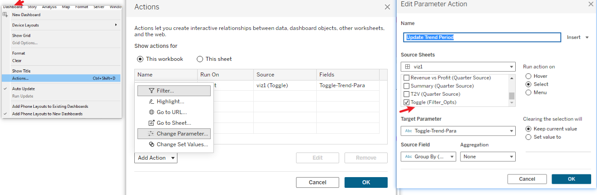