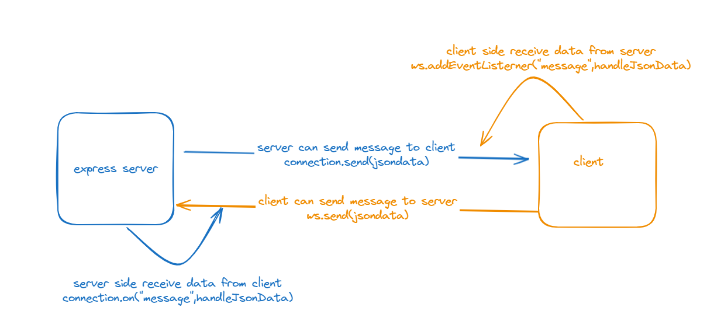
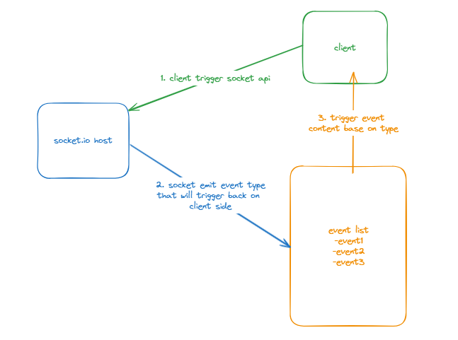

- [NodeApp + Express + WebSocket](#nodeapp--express--websocket)
- [Next App + Socket.io](#next-app--socketio)
- [SignalR](#signalr)

# NodeApp + Express + WebSocket

**Reference**
- [Youtube](https://www.youtube.com/watch?v=mYy-d6BtqmU&t=10410s&ab_channel=CodingWithDawid)
- [Github](https://github.com/dejwid/mern-chat)

**Steps**
1. Install `ws` on express server side.
```javascript
const express = require('express');
const app = express();

const ws = require('ws');

const server = app.listen(4040);

const wss = new ws.WebSocketServer({server});
wss.on('connection', (connection, req) => {
    //do something
})
```

2. Get jwt token from header to validate who the user is and then assign custom user properties to connections

**server side**
```javascript
const express = require('express');
const app = express();
const ws = require('ws');
const server = app.listen(4040);
const wss = new ws.WebSocketServer({server});

wss.on('connection', (connection, req) => {
    function notifyAboutOnlinePeople() {
        [...wss.clients].forEach(client => {
            //send message to client side. On client side, it will use 'message' event listerner to receive the data
            client.send(JSON.stringify({
                online: [...wss.clients].map(c => ({userId:c.userId,username:c.username})),
            }));
        });
    }


 // read username and id form the cookie for this connection
  const cookies = req.headers.cookie;
  if (cookies) {
    const tokenCookieString = cookies.split(';').find(str => str.startsWith('token='));
    if (tokenCookieString) {
      const token = tokenCookieString.split('=')[1];
      if (token) {
        jwt.verify(token, jwtSecret, {}, (err, userData) => {
          if (err) throw err;
          const {userId, username} = userData;
          connection.userId = userId;
          connection.username = username;
        });
      }
    }
  }

  // notify everyone about online people (when someone connects)
  notifyAboutOnlinePeople();
})
```

**client side**
```javascript
const [ws,setWs] = useState(null);
const [onlinePeople,setOnlinePeople] = useState({});

function connectToWs() {
    const ws = new WebSocket('ws://localhost:4040');
    setWs(ws);

    //check and receive any message that send from web socker server
    //on this case, we will receive online connection
    ws.addEventListener('message', handleMessage);
    
    //if connection is closing, try reconnect
    ws.addEventListener('close', () => {
        setTimeout(() => {
        console.log('Disconnected. Trying to reconnect.');
        connectToWs();
        }, 1000);
    });
}

function handleMessage(message) {
    const messageData = JSON.parse(message.data);
    console.log({message,messageData});
    if ('online' in messageData) {
      showOnlinePeople(messageData.online);
    } 
    else 
    {
      //do something
    }
  }
```

> **Multiple Web Socket Events Available**
> on(event: "close", listener: (this: WebSocket, code: number, reason: Buffer) => void):this;
> on(event: "error", listener: (this: WebSocket, err: Error) => void): this;
> on(event: "upgrade", listener: (this: WebSocket, request: IncomingMessage) => void): this;
> on(event: "message", listener: (this: WebSocket, data: WebSocket.RawData, isBinary: boolean) => void): this;
> on(event: "open", listener: (this: WebSocket) => void): this;
> on(event: "ping" | "pong", listener: (this: WebSocket, data: Buffer) => void): this;
> on(event: string | symbol, listener: (this: WebSocket, ...args: any[]) => void): this;

3. Client send message, server receive data.

**client side**
```javascript
function sendMessage(event) {
    if (event) event.preventDefault();

    ws.send(JSON.stringify({
      recipient: selectedUserId,
      text: newMessageText,
      file,
    }));
  }
```

**server side**
```javascript
wss.on('connection', (connection, req) => {

    //collapse existing code...

    connection.on('message', async (message) => {
        const messageData = JSON.parse(message.toString());
        const {recipient, text, file} = messageData;

        //do something
    })
})
```

>**Web Socket Bidirection illustration**
>
> Conclusion, both server and client can send and receive from each other.

4. Every x seconds check whether connection is active or not

**server side**
```javascript
connection.isAlive = true;

connection.timer = setInterval(() => {
    connection.ping();
    connection.deathTimer = setTimeout(() => {
        connection.isAlive = false;
        clearInterval(connection.timer);
        connection.terminate();
        notifyAboutOnlinePeople();
        console.log('dead');
    }, 1000);
}, 5000);

connection.on('pong', () => {
    clearTimeout(connection.deathTimer);
});
```

# Next App + Socket.io



**Reference**
-  [Youtube](https://www.youtube.com/watch?v=ZbX4Ok9YX94&pp=ygUSbmV4dCBkaXNjb3JkIGNsb25l) : Begin on 7:52:50 timestamp

**Steps**
1. Install Socket.io
2. Create folder with under project root: `pages\api\socket`
3. Add io.ts under `pages\api\socket` to create websocker connection api

**io.ts**
```ts
import { Server as NetServer, Socket } from "net";
import { NextApiResponse } from "next";
import { Server as SocketIOServer } from "socket.io";

type NextApiResponseServerIo = NextApiResponse & {
  socket: Socket & {
    server: NetServer & {
      io: SocketIOServer;
    };
  };
};

const ioHandler = (req: NextApiRequest, res: NextApiResponseServerIo) => {
    if (!res.socket.server.io) {
      const path = "/api/socket/io";
      const httpServer: NetServer = res.socket.server as any;
      const io = new SocketIOServer(httpServer, {
        path: path,
        addTrailingSlash: false,
      });
      res.socket.server.io = io;
    }
  
    res.end();
}

export default ioHandler;
```
1. Create websocket context

**socker-provider.tsx**
```tsx
"use client";

import { 
  createContext,
  useContext,
  useEffect,
  useState
} from "react";
import { io as ClientIO } from "socket.io-client";

type SocketContextType = {
  socket: any | null;
  isConnected: boolean;
};

const SocketContext = createContext<SocketContextType>({
  socket: null,
  isConnected: false,
});

export const useSocket = () => {
  return useContext(SocketContext);
};

export const SocketProvider = ({ 
  children 
}: { 
  children: React.ReactNode 
}) => {
  const [socket, setSocket] = useState(null);
  const [isConnected, setIsConnected] = useState(false);

  useEffect(() => {
    const socketInstance = new (ClientIO as any)(process.env.NEXT_PUBLIC_SITE_URL!, {
      path: "/api/socket/io",
      addTrailingSlash: false,
    });

    socketInstance.on("connect", () => {
      setIsConnected(true);
    });

    socketInstance.on("disconnect", () => {
      setIsConnected(false);
    });

    setSocket(socketInstance);

    return () => {
      socketInstance.disconnect();
    }
  }, []);

  return (
    <SocketContext.Provider value={{ socket, isConnected }}>
      {children}
    </SocketContext.Provider>
  )
}
```

**layout.tsx**
```tsx
//...script part
return(
<SocketProvider>
    {children}
</SocketProvider>
)
```

5. Emit websocket event

**Create api with the path `pages\api\socket\messages\index.ts`**
```ts
import { NextApiRequest } from "next";

export default async function handler(
  req: NextApiRequest,
  res: NextApiResponseServerIo,
) 
{
    if (req.method !== "POST") {
        return res.status(405).json({ error: "Method not allowed" });
    }

    try{
        //doing something here

        const anykeyname = `chat:${channelId}:messages`;

        //emit socket event with specify key
        res?.socket?.server?.io?.emit(channelKey, message);

        return res.status(200).json(message);
    } 
    catch (error) 
    {
        console.log("[MESSAGES_POST]", error);
        return res.status(500).json({ message: "Internal Error" }); 
    }
}
```

Then we can using `socket context` to interact with socket events
```ts
const { socket,isConnected } = useSocket();

useEffect(() => {
    socket.on(anyKeyName1, (message: MessageType) => {
        //do something here
        //example keyname:chat:${chatId}:messages | chat:${chatId}:messages:update
    })

    socket.on(anyKeyName2, (message: MessageType2) => {
        //do something here
    })
})
```

# SignalR

[Reference 1](https://consultwithgriff.com/signalr-connection-ids/)
[Reference 2](https://code-maze.com/aspnetcore-call-signalr-from-controller/)
[Github](https://github.com/tenPro4/signalR2022/tree/main)

There few important points need to note when working with signalR:

**1. Setup**
- Create a signalr hub
```csharp
    public record Data(int Id, string Message);

    public interface IClientInterface
    {
        Task ClientHook(Data data);
    }

    public class CustomHub : Hub<IClientInterface>
    {
        private readonly ILogger<CustomHub> _logger;

        public CustomHub(ILogger<CustomHub> logger) => _logger = logger;
        public void ServerHook(Data data)
        {
            _logger.LogInformation("Receiving data: {0}, {1}", data, Context.ConnectionId);
        }
        public Task PingAll()
        {
            _logger.LogInformation("pinging everyone");

            //return Clients.All.SendAsync("ClientHook", new Data(111, "ping all"));
            return Clients.All.ClientHook(new(111, "ping all"));
        }
        public Task SelfPing()
        {
            _logger.LogInformation("self pinging");
            return Clients.Caller.ClientHook(new(222, "self ping"));
        }
        [HubMethodName("invocation_with_return")]
        public Data JustAFunction()
        {
            return new(1, "returned data from JustAFunction");
        }
    }
```
- Dependency Injection for signalR
```csharp
// Program.cs
builder.Services.AddSignalR();
app.UseEndpoints(endpoints =>
{
    endpoints.MapHub<CustomHub>("/custom");
});
```
- client side
```javascript
 <script>
    let connection = new signalR.HubConnectionBuilder()
        .withUrl("/custom")
        .build();


    // after selfPing: selfPing hub function will trigger 'ClientHook' to clients
    // receive data from 'ClientHook' hub function
    connection.on("ClientHook", data => console.log('ClientHook', data));

    // after triggerFetch: function calling from controller
    // receive data from 'client_function_name' controller
    connection.on("client_function_name", data => console.log('client_function_name', data));

    connection.start().then(() => {
        console.log("connected")
        connection.send('ServerHook', { id: 1, message: "we've connected" })
    });

    // call signalR hub function from client
    const pingSelf = () => connection.send('SelfPing')

    // call signalR hub function from client
    const pingAll = () => connection.send('PingAll')

    // trigger hub from controller
    const triggerFetch = () => fetch('/send')

    // call signalR hub function from client
    const withReturn = () => connection.invoke('invocation_with_return')
        .then(data => console.log('returned', data))
</script>
```
- TestController.cs
```csharp
private readonly IHubContext<CustomHub> _customHub;

[HttpGet("/send")]
public async Task<IActionResult> SendData()
{
    await _customHub.Clients.All.SendAsync("client_function_name", new Data(100, "Dummy Data"));
    return Ok();
}
```


**2. Never try to track connectionIds**

In most case, we want to send the message to particular client when we track the connectionId.
```csharp
var connectionIds = cachingLayer.GetConnectionsForUser("Kevin");
await hubContext.Clients.Clients(connectionIds).SendAsync("notify", "Hello World");
```
This might work. But there is a fundamental flaw. It will not work in scaled solutions (load-balanced set, basically).

Instead, you can use `Group` for the replace solution,and disconnections are cleaned up for you automatically.
```csharp
public override async Task OnConnectedAsync()
{
  var userName = GetUserName(Context); // get the username of the connected user

  await Groups.AddToGroupAsync(Context.ConnectionId, $"user_{userName}");
  await base.OnConnectedAsync();
}
```
If you want to info specific client, you can simply do like following:
```csharp
var userName = "Kevin";
await hubContext.Clients.Group($"user_{userName}").SendAsync("notify", "Hello World");
```